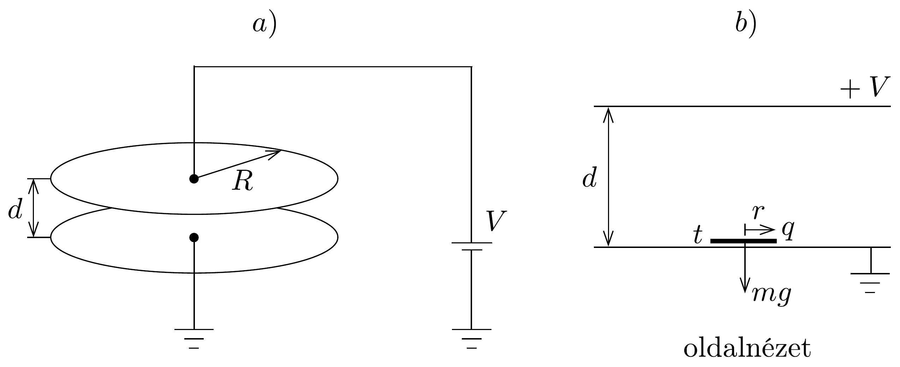
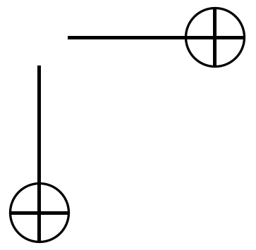

## Feladat 1

„Pingpongellenállás”

Egy síkkondenzátor két kör alakú, párhuzamos lemezből áll, mindkettő sugara $R$, a közöttük lévő távolság $d$, ahol $d \ll R$ (267.a) ábra). A felső lemez egy állandó feszültségforráshoz csatlakozik, amelynek potenciálja $V$, míg az alsó lemez földelt. Az alsó lemez közepére egy vékony, kicsiny, $m$ tömegú korongot helyezünk, melynek sugara $r(\ll R, d)$, vastagsága $t(\ll r)$, (267.b) ábra).

Tételezzük fel, hogy a lemezek közötti térrészben vákuum van, amit az $\varepsilon_{0}$ dielektromos állandó jellemez, továbbá a lemezek és a korong tökéletes vezetőanyagból készültek, illetve mindenféle elektrosztatikus éleffektust elhanyagolhatunk. Az egész áramkör induktivitásától és a relativisztikus hatásoktól szintén eltekinthetünk. A tükörtöltés-hatásokat is elhanyagolhatjuk.
a) Határozzuk meg az egymástól $d$ távolságra lévő lemezek között ható $F_{\mathrm{p}}$ elektrosztatikus erót, mielőtt a korongot a kettő közé helyeztük, amint ezt az 267.a) ábra mutatja!
b) A 267,b) ábrán lévő kicsiny korong $q$ töltése a következő módon adható meg a felső lemez feszültségének függvényében: $q=\chi V$. Határozzuk meg a $\chi$ paramétert $r, d$ és $\varepsilon_{0}$ függvényében!
c) A síkkondenzátor lemezei a $\boldsymbol{g}$ homogén gravitációs térre merőlegesen helyezkednek el. A kezdetben nyugalomban lévő korong megemeléséhez egy bizonyos $V_{\mathrm{k}}$ küszöbérték fölé kell növelnünk az alkalmazott feszültséget. Fejezzük ki $V_{\mathrm{k}}-\mathrm{t} m$, $g, d$ és $\chi$ segítségével!

d) Ha $V>V_{\mathrm{k}}$, a korong fel-le fog mozogni a lemezek között. (Tételezzük fel, hogy a korong mindenféle billegés nélkül, kizárólag függőlegesen mozog.) A korong és a lemezek közötti ütközések részben rugalmatlanok, amit az $\eta$ ütközési számmal jellemezhetünk: $\eta \equiv \frac{v_{\text {után }}}{v_{\text {előtt }}}$, ahol $v_{\text {előtt }}$ és $v_{\text {után }}$ rendre a korong sebessége közvetlenül az ütközés előtt és után. A lemezek végig rögzítettek, nem mozdulnak el. Hosszú idő után a korong „állandósult” mozgást fog végezni, a korong viselkedése ismétlődő mozgáshoz tart, melyben a korong $v_{\mathrm{s}}$ sebességét közvetlenül az alsó lemezzel történő ütközés után a következő módon fejezhetjük ki a $V$ feszültséggel:
\[
v_{\mathrm{s}}=\sqrt{\alpha V^{2}+\beta} .
\]

Fejezzük ki az $\alpha$ és $\beta$ együtthatókat $m, g, \chi, d$ és $\eta$ felhasználásával! Tételezzük fel, hogy az ütközésekkor a korong teljes felülete egyenletesen és egyszerre érinti a lemezeket, és a teljes töltéscsere minden ütközéskor pillanatszerúen történik.
e) Az állandósult állapot elérése után a kondenzátor lemezein keresztülfolyó áram $I$ idóátlagát így közelíthetjük: $I=\gamma V^{2}$, ha teljesül a $q V \gg m g d$ feltétel. Fejezzük ki a $\gamma$ együtthatót $m, \chi, d$ és $\eta$ segítségével!
f) Ha az alkalmazott $V$ feszültséget (rendkívül lassan) csökkentjük, akkor elérünk egy olyan $V_{\mathrm{c}}$ kritikus feszültséget, amely alatt az áramkörben hirtelen megszúnik az áram. Határozzuk meg $V_{\mathrm{c}}$ értékét és a hozzá tartozó $I_{\mathrm{c}}$ áramot $m, g, \chi, d$ és $\eta$ segítségével! Készítsünk vázlatos grafikont (melyben összehasonlítjuk $V_{\mathrm{c}}$ értékét a $c$ ) alkérdésben tárgyalt $V_{\mathrm{k}}$ felemelkedési küszöbértékkel) az áram-feszültség karakterisztikáról, vagyis az $I-V$ függvényről, miközben $V$ először nulláról nagyjából $3 V_{\mathrm{k}}$-ra növekszik, majd újra nullára csökken!
