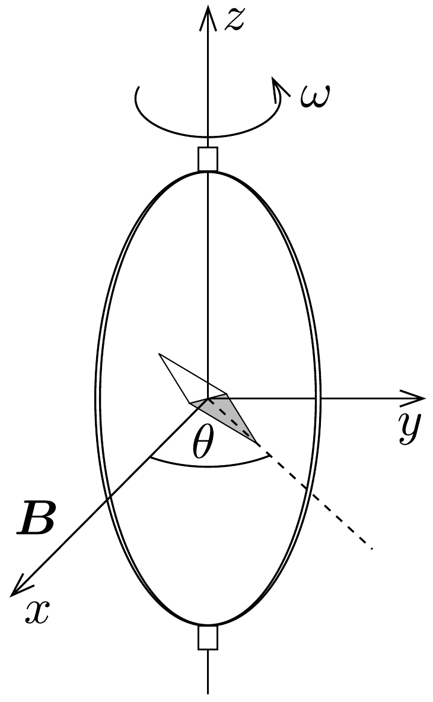
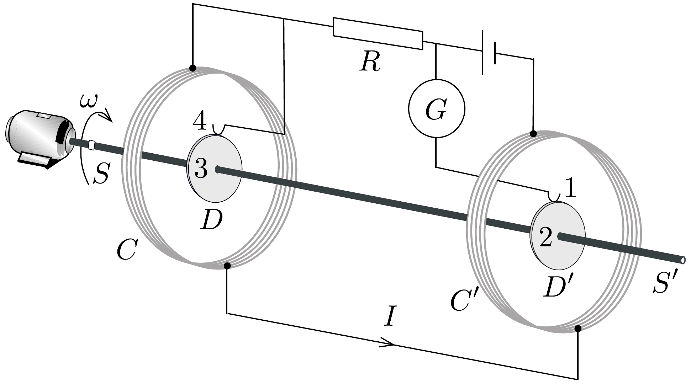
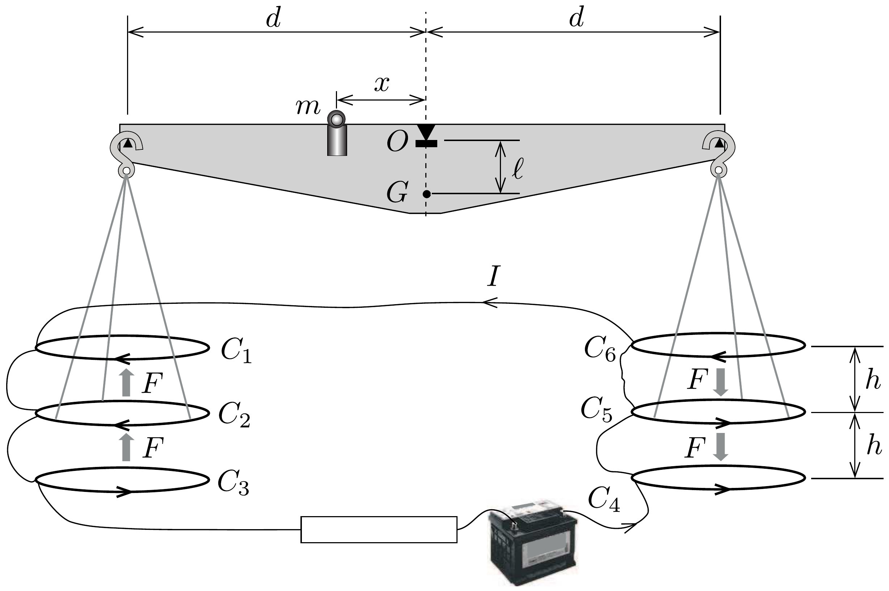

## Feladat 2

Elektromos mennyiségek abszolút mérése
A XIX. században a technológiai és tudományos fejlődés szükségessé tette, hogy az elektromos mennyiségeknek általánosan elfogadott etalonja legyen. Úgy gondolták, hogy az új abszolút egységek csak a távolság, a tömeg és az idő etalonjaira épülhetnek, melyeket a francia forradalom után hoztak létre. 1861-től 1912-ig intenzív kísérleti munka folyt ezeknek az egységeknek a megalapozására. Itt három tanulmányt mutatunk be.

\section*{Az ohm meghatározása (Kelvin)}

Egy $N$ menetes, a sugarú, $R$ ellenállású, kör alakú zárt tekercs állandó $\omega$ szögsebességgel forog a függőleges átméróje körül $\boldsymbol{B}=B_{0} \boldsymbol{e}_{\boldsymbol{x}}$ vízszintes mágneses térben.
a) Határozzuk meg a tekercsben indukálódó $\mathcal{E}$ elektromotoros erót, és a tekercs forgatásához szükséges $\langle P\rangle$ átlagos teljesítményt! A tekercs önindukcióját hanyagoljuk el.

Útmutatás: Egy $X(t)$ periodikus mennyiség $\langle X\rangle$ átlagértéke
\[
\langle X\rangle=\frac{1}{T} \int_{0}^{T} X(t) d t
\]
ahol $T$ a periódusidő.
b) A tekercs középpontjába egy kicsiny mágnestút helyezünk a 275. ábrán látható módon. A mágnestú lassan szabadon elfordulhat a $z$ tengely körüli vízszintes síkban, de a tekercs gyors forgását már nem tudja követni. Az állandósult állapot elérése után a mágnestú kis $\theta$ szöget zár be a $\boldsymbol{B}$ vektorral. Fejezzük ki a tekercs $R$ ellenállását ennek a szögnek és a rendszer többi paraméterének függvényében!

Lord Kelvin ezt a módszert használta az 1860-as években az ohm abszolút egységének rögzítéséhez. A forgó tekercs kiküszöbölésére Lorenz egy alternatív
módszert javasolt, melyet Lord Rayleigh és Eleanor Sidgwick használt, és amit a következő részben megvizsgálunk.

\section*{Az ohm meghatározása (Rayleigh, Sidgwick)}

A kísérleti elrendezés a 276. ábrán látható. Az elrendezés két egyforma, $b$ sugarú fémkorongból áll ( $D$ és $D^{\prime}$ ), melyek a közös $S S^{\prime}$ fémtengelyre vannak erósítve. A tengelyt egy motor $\omega$ szögsebességgel forgatja. A szögsebességet $R$ méréséhez változtatni lehet. A korongokat két egyforma, $a$ sugarú, $N$ menetes tekercs veszi körül ( $C$ és $C^{\prime}$ ). A tekercsek úgy vannak sorba kötve, hogy az $I$ áram a két tekercsen ellentétes irányban folyik keresztül. Az egész berendezés az $R$ ellenállás mérésére szolgál.

c) Tegyük fel, hogy a $C$ és $C^{\prime}$ tekercseken átfolyó $I$ áram homogén mágneses teret hoz létre a $D$ és $D^{\prime}$ korongok körül, melynek $B$ nagysága megegyezik a tekercsek középpontjában kialakuló tér nagyságával. Számítsuk ki a korongok peremén lévő 1-es és 4-es pont között keletkezó $\mathcal{E}$ indukált elektromotoros erőt! Kihasználhatjuk, hogy a tekercsek közötti távolság sokkal nagyobb a tekercsek sugaránál, és $a \gg b$.

A korongokat az 1-es és a 4-es pontban érintkező kefék kapcsolják a hálózatba. A $G$ galvanométer jelzi az 1-2-3-4 áramkörben folyó áramot.

Megjegyzés: Szükség lehet a következő integrálokra:
\[
\begin{gathered}
\int_{0}^{2 \pi} \sin x \mathrm{~d} x=\int_{0}^{2 \pi} \cos x \mathrm{~d} x=\int_{0}^{2 \pi} \sin x \cos x \mathrm{~d} x=0 \\
\int_{0}^{2 \pi} \sin ^{2} x \mathrm{~d} x=\int_{0}^{2 \pi} \cos ^{2} x \mathrm{~d} x=\pi
\end{gathered}
\]
később
\[
\int x^{n} \mathrm{~d} x=\frac{1}{n+1} x^{n+1}
\]
d) Az $R$ ellenállást akkor mérjük, amikor $G$ nullát mutat. Fejezzük ki $R$ értékét a rendszer fizikai paramétereivel!

Az amper meghatározása
Ha két vezetőn áram folyik át, és megmérjük a közöttük fellépő erót, akkor ez az áram abszolút meghatározását teszi lehetővé. A Lord Kelvin által 1882ben javasolt „árammérleg" ezt az elvet használja. Az árammérleg hat egyforma, $a$ sugarú, egymenetes, sorba kapcsolt tekercset tartalmaz $\left(C_{1} \ldots C_{6}\right)$. A rögzített $C_{1}$, $C_{3}, C_{4}$ és $C_{6}$ tekercsek a 277. ábrán látható módon két, egymástól $2 h$ távolságra lévó vízszintes síkban fekszenek. A $C_{2}$ és $C_{5}$ tekercsek $d$ hosszúságú mérlegkarokra vannak akasztva, és a mérleg egyensúlyi helyzetében egyforma messze vannak a két síktól.

Az $I$ áram úgy folyik át a tekercseken, hogy a $C_{2}$ tekercsre felfelé, a $C_{5}$ tekercsre lefelé mutató mágneses eró hat. Az $O$ forgástengelytől $x$ távolságra elhelyezett $m$ tömeg szolgál arra, hogy a fent leírt egyensúlyi állapotot helyreállítsa abban az esetben, amikor a tekercseken áram folyik át.
e) Fejezzük ki a $C_{2}$ tekercsre ható, a $C_{1}$ tekerccsel való mágneses kölcsönhatásból származó $F$ erőt! Az egyszerúség kedvéért tételezzük fel, hogy az egységnyi hosszra ható erő megegyezik a két végtelen hosszú párhuzamos vezető között egységnyi hosszon fellépő erővel.
f) Az $I$ áramot a mérleg egyensúlyi helyzetében mérjük. Fejezzük ki $I$ értékét a rendszer fizikai paramétereinek függvényében! A berendezés méretei olyanok, hogy a bal oldalon és a jobb oldalon lévő tekercsek közötti kölcsönhatás elhanyagolható. Legyen $M$ a mérleg tömege ( $m$ és a ráakasztott részek nélkül), $G$ a
tömegközéppontja, az $O G$ távolság pedig $\ell$.
g) A mérleg egyensúlyi állapota stabil, ha a $C_{2}$ tekercs magassága kicsiny $\delta z$, a $C_{5}$ tekercsé pedig $-\delta z$ értékkel megváltozik. Határozzuk meg azt a $\delta z_{\text {max }}$ maximális értéket, ahol a mérleg az elengedés után még az egyensúlyi helyzet irányába kezd el mozogni! Feltételezzük, hogy a tekercsek középpontjai közelítőleg egy vonalban maradnak. Használjuk a következő közelítéseket: $\frac{1}{1 \pm \beta} \approx 1 \mp \beta+\beta^{2}$ vagy $\frac{1}{1 \pm \beta^{2}} \approx 1 \mp \beta^{2}$, ha $\beta \ll 1$, és $\sin \theta \approx \operatorname{tg} \theta$, ha $\theta$ kicsi.
