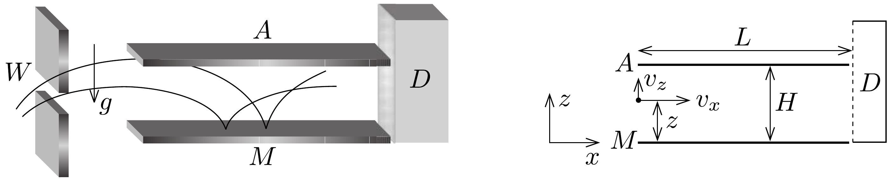
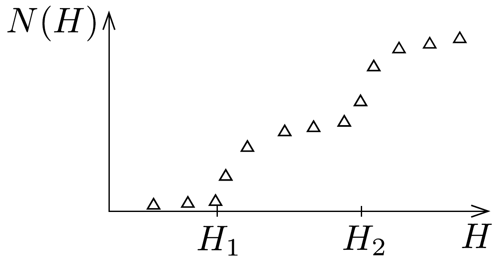

## Feladat 3

Neutronok gravitációs mezőben
A megszokott klasszikus világban a földön rugalmasan pattogó labda a vég nélküli mozgás ideális példája. A labda csapdában van, nem mehet a földfelszín alá és a felső holtpont fölé. Kötött állapotban marad, mindig visszafordul és fölpattan. Csak a közegellenállás és az ütközés rugalmatlansága állíthatja meg, amitől viszont a következőkben eltekintünk.

Fizikusok egy csoportja a grenoble-i Laue-Langevin Intézetben 2002-ben megjelentetett egy cikket ${ }^{21}$ a földi gravitációs mezőben végzett neutronejtési kísérletről. A kísérletben a jobbra mozgó neutronok szabadon estek egy vízszintes, neutrontükörként viselkedő kristályfelületre, ahonnan rugalmasan visszapattantak a kezdeti magasságukig, és ez ismétlődött ...

A kísérlet vázlatát a 278. ábra mutatja. A rendszer egy $W$ bemenőnyílásból, egy $M$ neutrontükörből ( $z=0$ magasságban), egy $L$ hosszúságú $A$ neutronelnyelő falból ( $z=H$ magasságban) és egy $D$ neutrondetektorból áll. A neutronsugár állandó $v_{x}$ vízszintes sebességgel repül az $A$ és $M$ közötti üregben $W$-től $D$-ig. Mindegyik neutron, amely eléri az $A$ felületet, elnyelődik, azaz eltúnik a kísérletből. Azok, amelyek elérik az $M$ felületet, rugalmasan visszaverődnek. A $D$ detektor azon neutronok $N(H)$ számát méri, amelyek egységnyi idő alatt elérik a detektort.

Az üregbe belépő neutronok sebességének $v_{z}$ függőleges komponense mind pozitív, mind negatív irányban széles tartományban változik. Az üregbe belépő neutronok a tükör és az elnyelő felület között repülnek.

\footnotetext{
${ }^{21}$ V. V. Nesvizhevsky et al., „Quantum states of neutrons in the Earth's gravitational field." Nature, 415 (2002) 297., Phys Rev. D 67, 102002 (2003).
- a) Határozzuk meg klasszikusan a $z$ magasságban belépő neutronok $v_{z}(z)$ függőleges sebességének azt a tartományát, amelyben a neutron eléri a detektort! Tegyük fel, hogy $L$ sokkal hosszabb, mint a feladatban bármely más hosszúság.
- b) Számoljuk ki klasszikusan az üreg $L_{\mathrm{c}}$ minimális hosszát, amely biztosítja, hogy az előző pontban szereplő sebességtartományon kívüli neutronok minden $z$ esetén elnyelődjenek $A$-ban! Legyen $v_{x}=10 \mathrm{~m} / \mathrm{s}$ és $H=50 \mu \mathrm{~m}$.
- c) Az $N(H)$ átmenő neutronfluxust mérjük $D$-ben. Azt várjuk, hogy ez a mennyiség monoton növekszik $H$-val. Határozzuk meg klasszikusan a detektort időegységenként eléró összes neutron $N_{\mathrm{c}}(H)$ számát, feltéve, hogy a belépő neutronnyalábban minden $v_{z}$ sebesség és minden $z$ magasság egyformán valószínú! A választ az üregbe egységnyi idő alatt, egységnyi $v_{z}$ függőleges sebességtartományban és egységnyi $z$ magasságtartományban belépő neutronok számát megadó $\varrho$ állandóval fejezzük ki.

d) A grenoble-i csoport által kapott eredmények nem egyeztek a fenti klasszikus jóslattal, helyette $N(H)$ kísérleti értékei hirtelen ugrásokat mutattak, amikor $H$ bizonyos kritikus értékeket $\left(H_{1}, H_{2}, \ldots\right)$ átlépett. Ezt mutatja vázlatosan a 279. ábra. Más szavakkal, a kísérlet azt mutatta, hogy a neutron függőleges

pattogó mozgása kvantált. Hasonlóan ahhoz, ahogy Bohr és Sommerfeld a hidrogénatom energiaszintjeit megkapta, itt is úgy fogalmazhatunk, hogy „az $S$ hatás a $h$ Planck-állandó egész számszorosa". Ebben a feladatban $S$-et az
\[
S=\int p_{z}(z) \mathrm{d} z=n h, \quad n=1,2,3, \ldots
\]
összefüggés határozza meg (Bohr-Sommerfeld kvantumfeltétel), ahol $p_{z}$ az impulzus függőleges komponense, és az integrált a pattogás teljes periódusára kell elvégezni. Csak olyan neutronok haladhatnak az üregben, melyek a feltételt kielégítő $S$-sel rendelkeznek.

Számoljuk ki azokat a $H_{n}$ holtpontmagasságokat és $E_{n}$ energiaszinteket (ahol $E_{n}$ a függőleges mozgáshoz tartozó mechanikai energia), amelyeket a Bohr-Sommerfeld-kvantálás megenged! Adjuk meg $H_{1}$ számszerú értékét μm-ben és $E_{1}$ értékét eV-ban!
- $e$ ) A kvantálással a hosszú üregen keresztülrepülő neutronok belépéskor egyenletes eloszlása megváltozik, és ezért detektáltak lépcsőszerú eloszlást (ld. a[279, áb-

rát). A továbbiakban az egyszerúség kedvéért egy $H<H_{2}$ magasságú, hosszú üreget vizsgálunk. Klasszikusan minden, az $a$ ) kérdésben meghatározott energiatartományban lévó neutron keresztülmehet az üregen, de a kvantummechanika szerint csak azok, melyek energiája $E_{1}$. Az energiára és időre vonatkozó Heisenberg-féle határozatlansági reláció szerint ez az energiaérték meghatároz egy minimális repülési időt.

Becsüljük meg a minimális $t_{\mathrm{q}}$ repülési időt és az üregnek ehhez tartozó minimális $L_{\mathrm{q}}$ hosszát, amely ahhoz szükséges, hogy meg tudjuk figyelni a neutronok $D$-ben mért számában az első éles növekedést! Legyen $v_{x}=10 \mathrm{~m} / \mathrm{s}$.

Adatok:
\[
\begin{array}{ll}
\text { Planck-állandó } & h=6,63 \cdot 10^{-34} \mathrm{Js}, \\
\text { fénysebesség vákuumban } & c=3,00 \cdot 10^{8} \mathrm{~m} / \mathrm{s}, \\
\text { elemi töltés } & e=1,60 \cdot 10^{-19} \mathrm{C}, \\
\text { neutron tömege } & M=1,67 \cdot 10^{-27} \mathrm{~kg}, \\
\text { nehézségi gyorsulás } & g=9,81 \mathrm{~m} / \mathrm{s}^{2} .
\end{array}
\]

Ha szükséges:
\[
\int(1-x)^{1 / 2} \mathrm{~d} x=-\frac{2(1-x)^{3 / 2}}{3} .
\]
