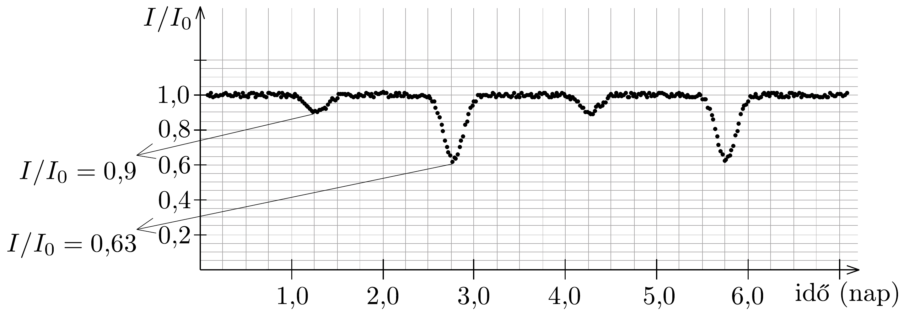
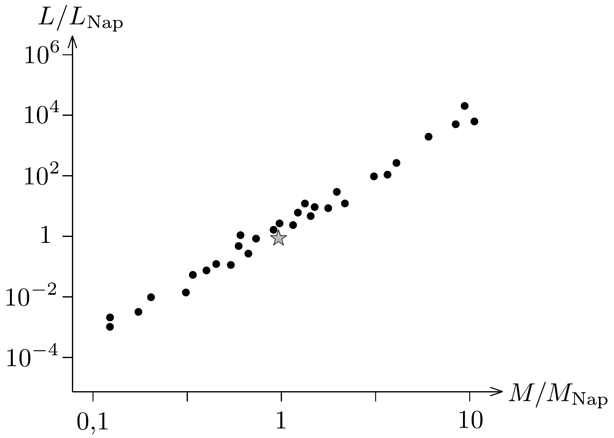

## Feladat 1

Kettőscsillagok
A kettőscsillag-rendszerek két csillagból állnak, melyek közös tömegközéppontjuk körül keringenek. Galaxisunkban a csillagoknak csaknem a fele kettőscsillagrendszert alkot. A Földről nem könnyü megállapítani a legtöbb ilyen csillagrendszer kettós természetét, mert a két csillag közötti távolság sokkal kisebb, mint a tólünk mérhető távolság, így a távcsövekkel csak egyetlen fénylő pontot látunk. Ezért inkább fotometriát (fényességmérést) és spektroszkópiát (színképelemzést) használunk, ilyen módon észlelhetjük az adott csillag intenzitásának vagy színképének a változásait, melyek segítségével eldönthetjük, hogy az adott rendszer kettős vagy sem.

\section*{Kettőscsillagok fényességmérése}

Ha pontosan a két csillag mozgásának síkjában vagyunk, akkor az egyik csillag időről időre elhalad a másik előtt, és ezért az egész rendszer fényének intenzitása időben változni fog a mi megfigyelési helyünkön. Az ilyen kettős rendszereket ekliptikus kettós rendszereknek nevezzük.
1.1. Tegyük fel, hogy a két csillag mindegyike körpályán mozog a közös tömegközéppontjuk körül állandó $\omega$ szögsebességgel, és mi pontosan a kettős rendszer mozgásának síkjában vagyunk. Ugyancsak tegyük fel, hogy a két csillag felületi hőmérséklete $T_{1}$ és $T_{2}\left(T_{1}>T_{2}\right)$, valamint sugaraik $R_{1}$ és $R_{2}\left(R_{1}>R_{2}\right)$.

A kettőscsillag rendszerből érkező fény Földön mérhető relatív intenzitását az idő függvényében a 288. ábra mutatja. A függőleges tengely skálázása az $I_{0}=4,8 \cdot 10^{-9} \mathrm{~W} / \mathrm{m}^{2}$ értékhez viszonyított. A gondosan elvégzett mérések sze-
rint a csillagokból érkező fény intenzitásminimumai a mindkét csillagból jövő fény maximális $I_{0}$ intenzitásának 90, illetve 63 százalékával egyenlők.
1.1.1. Olvassuk le a mozgás periódusidejét! A választ másodperc egységben két értékes jegy pontossággal adjuk meg. Mekkora a rendszer szögsebessége?
1.1.2. Jó közelítéssel igaz, hogy egy csillagról érkezó sugárzás olyan abszolút feketetest-sugárzásnak felel meg, mint ami egy akkora sugarú lapos korongról érkezne, mint a csillag sugara. Ezért a csillagról érkező intenzitás $A T^{4}$-nel arányos, ahol $A$ a korong területe és $T$ a csillag felszínének hőmérséklete.

A 288, ábrán található grafikon segítségével határozzuk meg a $T_{1} / T_{2}$ és $R_{1} / R_{2}$ arányokat!

Kettős rendszerek színképelemzése
Ebben a részben a kettőscsillag-rendszer kísérleti színkép adatai alapján kiszámítjuk a kettőscsillag néhány csillagászati jellemzőjét.

Az atomok sugárzást nyelnek el vagy bocsátanak ki bizonyos jellegzetes hullámhosszakon. Következésképpen egy csillag észlelhető színképe elnyelési (abszorpciós) vonalakat tartalmaz a csillag felszíni légkörében található atomoknak megfelelően.

A nátrium jellegzetes sárga színképvonalának ( $\mathrm{D}_{1}$ vonal) hullámhossza $\lambda_{0}=$ $5895,9 \AA$. Vizsgáljuk meg az előző részben szereplő kettős rendszer esetén az atomi nátriumnak ezt a hullámhosszát. A kettőscsillagról érkezó fény színképe Dopplereltolódást szenved, mert a csillagok hozzánk képest mozognak. A két csillag sebessége különböző. Ennek megfelelően a két csillag elnyelési hullámhossza különböző mértékben tolódik el. Igen pontos hullámhosszmérésekre van szükségünk ahhoz, hogy a Doppler-eltolódást észlelhessük, mert a csillagok sebessége sokkal kisebb a fénysebességnél. A kettős rendszer tömegközéppontjának hozzánk képesti sebessége ebben a feladatban sokkal kisebb, mint az egyes csillagok pályamenti sebessége. Ezért az összes Doppler-eltolódást kizárólag a csillagok pályamenti sebességével hozhatjuk kapcsolatba. A táblázat az általunk vizsgált kettős rendszer csillagjainak mért elnyelési színképét mutatja a nátrium $\mathrm{D}_{1}$ vonalának esetében.

\begin{tabular}[t]{|l|l|l|}
\hline $t$ (nap) & $\lambda_{1}(\AA)$ & $\lambda_{2}(\AA)$ \\
\hline 0,3 & 5897,5 & 5893,1 \\
\hline 0,6 & 5897,7 & 5892,8 \\
\hline 0,9 & 5897,2 & 5893,7 \\
\hline 1,2 & 5896,2 & 5896,2 \\
\hline 1,5 & 5895,1 & 5897,3 \\
\hline 1,8 & 5894,3 & 5898,7 \\
\hline 2,1 & 5894,1 & 5899,0 \\
\hline 2,4 & 5894,6 & 5898,1 \\
\hline
\end{tabular}

\begin{tabular}[t]{|l|l|l|}
\hline $t$ (nap) & $\lambda_{1}(\mathrm{~A})$ & $\lambda_{2}(\mathrm{~A})$ \\
\hline 2,7 & 5895,6 & 5896,4 \\
\hline 3,0 & 5896,7 & 5894,5 \\
\hline 3,3 & 5897,3 & 5893,1 \\
\hline 3,6 & 5897,7 & 5892,8 \\
\hline 3,9 & 5897,2 & 5893,7 \\
\hline 4,2 & 5896,2 & 5896,2 \\
\hline 4,5 & 5895,0 & 5897,4 \\
\hline 4,8 & 5894,3 & 5898,7 \\
\hline
\end{tabular}
1.2. Használjuk a fenti táblázatot (nem szükséges grafikont készíteni az adatokból).
1.2.1. Jelölje az egyes csillagok pályamenti sebességét $v_{1}$ és $v_{2}$. Határozzuk meg $v_{1}$ és $v_{2}$ értékét! A fény sebessége: $c=3,0 \cdot 10^{8} \mathrm{~m} / \mathrm{s}$. Hanyagoljuk el a relativisztikus hatásokat.
1.2.2. Határozzuk meg a csillagok $M_{1} / M_{2}$ tömegarányát!
1.2.3. Jelölje $r_{1}$ és $r_{2}$ az egyes csillagok távolságát a tömegközéppontjuktól. Határozzuk meg $r_{1}$ és $r_{2}$ értékét!
1.2.4. Jelölje $r$ a csillagok közötti távolságot. Határozzuk meg $r$ értékét!
1.3. A csillagok között ható egyetlen eró a gravitációs erő.
1.3.1. Határozzuk meg az egyes csillagok tömegét egy értékes jegy pontossággal! Az univerzális gravitációs állandó $G=6,7 \cdot 10^{-11} \mathrm{~m}^{3} /\left(\mathrm{kg} \cdot \mathrm{s}^{2}\right)$.

A csillagok általános jellemzői
1.4. A legtöbb csillagban ugyanolyan módon történik az energiatermelés. Ezért lehetséges egy empirikus (megfigyelésen alapuló) összefüggést felállítani a csillagok $M$ tömege és az úgynevezett $L$ luminozitása (a csillag által kisugárzott összes teljesítmény) között. Ezt az összefüggést ilyen alakban is megadhatjuk: $L / L_{\text {Nap }}=$ $=\left(M / M_{\mathrm{Nap}}\right)^{\alpha}$, ahol $M_{\mathrm{Nap}}=2,0 \cdot 10^{30} \mathrm{~kg}$ a Nap tömege és $L_{\mathrm{Nap}}=3,9 \cdot 10^{26} \mathrm{~W}$ a Nap luminozitása. A 289, ábra ezt az összefüggést mutatja log-log diagram alakjában. A csillaggal jelölt csillag a Napot mutatja.

1.4.1. Határozzuk meg $\alpha$ értékét egy értékes jegy pontossággal!
1.4.2. Jelölje $L_{1}$ és $L_{2}$ a kettős rendszer csillagainak luminozitását az előzőekben tanulmányozott kettőscsillag esetén. Határozzuk meg $L_{1}$ és $L_{2}$ értékét!
1.4.3. Adjuk meg fényév egységekben, hogy mekkora $d$ távolságra van tőlünk a kettőscsillag! A távolság meghatározásakor hasznájuk a 288. ábrán található adatokat. Egy fényév az a távolság, amit a fény egy év alatt tesz meg.
1.4.4. Mekkora a két csillag közötti maximális $\theta$ látószög a földi észlelési pontból nézve?
1.4.5. Legalább mekkora legyen egy optikai távcső $D$ apertúramérete (nyílásmérete), hogy megfeleló felbontóképességet biztosítson a két csillag külön-külön észleléséhez?
