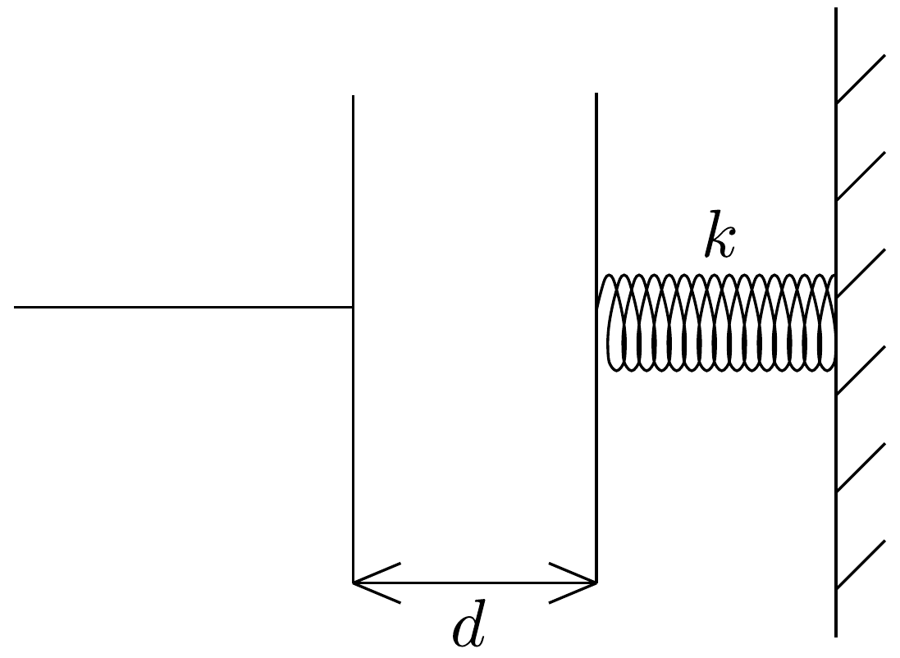
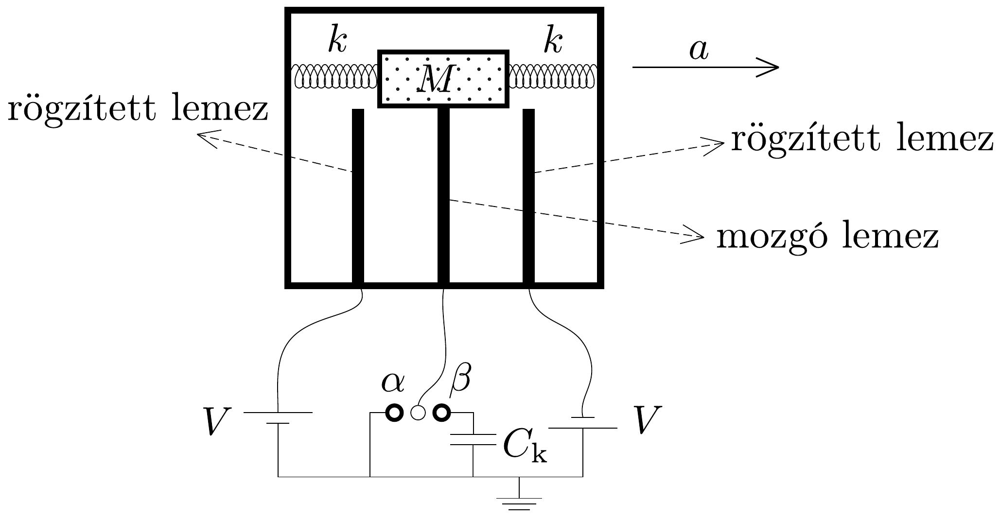

## Feladat 2

Légzsák
Ebben a feladatban azoknak a gyorsulásmérőknek az egyszerúsített modelljével foglalkozunk, amelyek ütközéskor az autók légzsákját hozzák múködésbe. Egy olyan elektromechanikai rendszert szeretnénk építeni, amelyben a gyorsulás egy meghatározott értékénél valamelyik elektromos mennyiség (például a feszültség az áramkör egy adott pontján) elér egy küszöbértéket, és ennek hatására a légzsák múködésbe lép.

Ebben a feladatban hanyagoljuk el a gravitációt.
2.1. Tekintsünk egy kondenzátort, amely két párhuzamos lemezből áll. A kondenzátor mindkét lemeze $A$ területü, a lemezek közötti távolság $d$, ami sokkal kisebb, mint a lemezek méretei. Az egyik lemezt egy $k$ rugóállandójú rugó egy falhoz kapcsolja, a másik lemez rögzített (290, ábra). Ha a lemezek közötti távolság $d$, akkor a rugó nincsen sem megnyújtva, sem összenyomva. Tegyük fel, hogy a lemezek között a levegő permittivitása megegyezik a vákuuméval $\left(\varepsilon_{0}\right)$. A kondenzátor kapacitása a lemezek ekkora távolságánál: $C_{0}=\varepsilon_{0} A / d$. A lemezekre $+Q$ és $-Q$ töltést juttatunk, és hagyjuk, hogy a rendszer mechanikailag egyensúlyba kerüljön.

2.1.1. Számítsuk ki a lemezek által egymásra kifejtett $F_{\mathrm{e}}$ elektromos erót!
2.1.2. A rugóhoz rögzített lemez elmozdulását jelölje $x$. Határozzuk meg $x$ értékét!
2.1.3. Mekkora ebben az állapotban a kondenzátor lemezei közötti $V$ potenciálkülönbség $Q, A, d, k$ függvényében kifejezve?
2.1.4. Legyen $C$ a kondenzátor kapacitása. Határozzuk meg a $C / C_{0}$ hányadost $Q, A, d$ és $k$ függvényében!
2.1.5. Mekkora a rendszerben tárolt teljes $U$ energia $Q, A, d$ és $k$ függvényében kifejezve?

A 291. ábra egy $M$ tömegú testet mutat, amelyet egy elhanyagolható tömegú vezetőlemezhez és két egyforma, $k$ rugóállandójú rugóhoz rögzítettünk. A vezetőlemez előre-hátra tud mozogni két rögzített vezetőlemez között. A lemezek egyformák, területük $A$. A három lemez így két kondenzátort képez. A rögzített lemezek a 291. ábrán látható módon $V$ és $-V$ feszültségre vannak kapcsolva, a középső lemez pedig egy kétállású kapcsolón keresztül le van földelve. A középső lemezre kötött vezeték nem akadályozza a lemez mozgását, és a lemezek mindvégig párhuzamosak. Ha az egész rendszer nem gyorsul, akkor mindkét rögzített lemez $d$ távolságra van a mozgó lemeztől (ez a távolság sokkal kisebb, mint a lemezek méretei). A mozgó lemez vastagsága elhanyagolható.

A kapcsoló az $\alpha$ és $\beta$ állapotokban lehet. Tegyük fel, hogy a rendszer az autóval együtt gyorsul, és gyorsulása állandó. Tegyük föl azt is, hogy az állandó gyorsulás mellett a rugó nem rezeg, és az összetett kondenzátorrendszer minden eleme egyensúlyi állapotban van, azaz az egyes elemek egymáshoz (és így az autóhoz képest is) nyugalomban vannak.

A gyorsulás hatására a mozgó lemez $x$ távolsággal elmozdul eredeti helyéről, a két rögzített lemez közötti felezőponttól.
2.2. Tekintsük először azt az esetet, amikor a kapcsoló az $\alpha$ állásban van, azaz a mozgó lemez le van földelve.
2.2.1. Határozzuk meg ebben az esetben mindkét kondenzátor töltését $x$ függvényében!
2.2.2. Határozzuk meg a mozgó lemezre ható eredő $F_{\mathrm{e}}$ elektromos erőt $x$ függvényében!
2.2.3. Tegyük fel, hogy $d \gg x$ és az $x^{2}$ rendú tagok elhanyagolhatók a $d^{2}$ rendú tagok mellett. Egyszerúsítsük a 2.2.2. részben kapott formulát!
2.2.4. Írjuk fel a mozgó lemezre ható teljes erốt (az elektromos és rugóerők eredójét) $-k_{\text {eff }} x$ alakban, és határozzuk meg a $k_{\text {eff }}-$ et megadó kifejezést!
2.2.5. Fejezzük ki az $a$ állandó gyorsulást $x$ függvényében!
2.3. Most tekintsük azt az esetet, amikor a kapcsoló a $\beta$ állásban van, azaz a mozgó lemez egy kondenzátoron keresztül van leföldelve. A kondenzátor kapacitása $C_{\mathrm{k}}$, és kezdetben nincs rajta töltés. A mozgó lemez $x$ távolságra tér ki a középponti helyzetéből.
2.3.1. Határozzuk meg a $C_{\mathrm{k}}$ kondenzátoron esó $V_{\mathrm{k}}$ elektromos feszültséget $x$ függvényében!
2.3.2. Megint feltételezzük, hogy $d \gg x$, és az $x^{2}$ nagyságrendú tagok elhanyagolhatók a $d^{2}$ nagyságrendú tagok mellett. Egyszerúsítsük a 2.3.1. kérdésre kapott kifejezést!
2.4. Szeretnénk a feladatban szereplő paramétereket úgy beállítani, hogy normál fékezésnél a légzsák még ne jöjjön múködésbe, de az autó ütközésekor elég gyorsan kinyíljon, és megvédje a vezető fejét a kormánnyal vagy a szélvédővel való ütközéstől. Ahogy a 2.2.4. részben láttuk, a mozgó lemezre ható elektromos és rugóeró eredóje egy $k_{\text {eff }}$ effektív rugóállandójú rugóval vehető figyelembe. Az egész összetett kondenzátorrendszer olyan, mint egy $M$ tömegből és egy $k_{\text {eff }}$ rugóállandójú rugóból álló egyszerú rendszer, amely állandó $a$ gyorsulással gyorsul (ami ebben a feladatban megegyezik az autó gyorsulásával).

Megjegyzés: Ebben a részben az a feltevés, hogy a tömeg és a rugó egyensúlyban van az állandó gyorsulás hatására, és így nem mozog az autóhoz viszonyítva, már nem érvényes.

Hanyagoljuk el a súrlódást, és használjuk a következő numerikus értékeket: $d=1,0 \mathrm{~cm}, A=2,5 \cdot 10^{-2} \mathrm{~m}^{2}, k=4,2 \cdot 10^{3} \mathrm{~N} / \mathrm{m}, \varepsilon_{0}=8,85 \cdot 10^{-12} \mathrm{C}^{2} /\left(\mathrm{Nm}^{2}\right)$, $V=12 \mathrm{~V}, M=0,15 \mathrm{~kg}$.
2.4.1. Ezeket az adatokat használva határozzuk meg a 2.2.3. részben kapott elektromos erő és a rugóerő hányadosát, és mutassuk meg, hogy az elektromos erő elhanyagolható a rugóerő mellett!

Abban az esetben, amikor a kapcsoló a $\beta$ állásban van, nem számítjuk ki az elektromos erőt, de az előzőhöz nagyon hasonlóan ekkor is meg lehetne mutatni, hogy az elektromos erók elhanyagolhatók a rugóerők mellett.
2.4.2. Mekkora a mozgó lemez maximális elmozdulása, ha az állandó sebességgel haladó autó hirtelen konstans $a$ gyorsulással fékezni kezd? Adjunk paraméteres választ.

Tegyük fel, hogy a kapcsoló a $\beta$ állásban van, és a rendszer úgy van megtervezve, hogy ha a kondenzátoron esó feszültség eléri a $V_{\mathrm{k}}=0,15 \mathrm{~V}$ értéket, a légzsák aktiválódik. Azt szeretnénk, hogy a légzsák ne lépjen múködésbe, ha az autó normálisan fékez, azaz gyorsulása kisebb a nehézségi gyorsulásnál $\left(g=9,8 \mathrm{~m} / \mathrm{s}^{2}\right)$, de azonnal lépjen múködésbe, ha a gyorsulás ennél nagyobb.
2.4.3. Mekkora legyen ehhez $C_{\mathrm{k}}$ értéke?

Meg szeretnénk határozni, hogy a légzsák elég gyorsan múködésbe lép-e, és meg tudja-e védeni a vezető fejét a kormánnyal vagy a szélvédővel való ütközéstől. Tegyük fel, hogy egy ütközés hatására az autó $g$ lassulással lassul, de a vezető feje továbbra is állandó sebességgel mozog.
2.4.4. Becsüljük meg a vezető feje és a kormány közötti távolságot, és a becslés alapján határozzuk meg azt a $t_{1}$ időt, amely addig telik el, hogy a vezető feje a kormánynak ütközik!
2.4.5. Határozzuk meg a légzsák aktiválódásáig eltelő $t_{2}$ időt, és hasonlítsuk össze $t_{1}$-gyel! Időben múködésbe lépett a légzsák? Tételezzük fel, hogy a légzsák az aktiválás hatására azonnal kinyílik.
