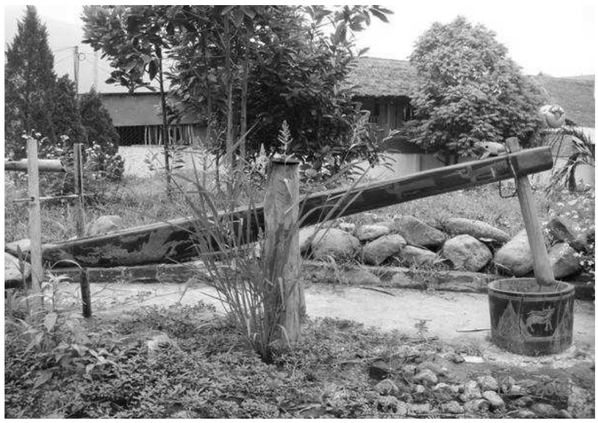
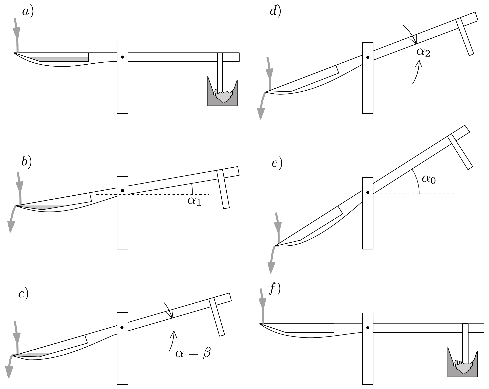
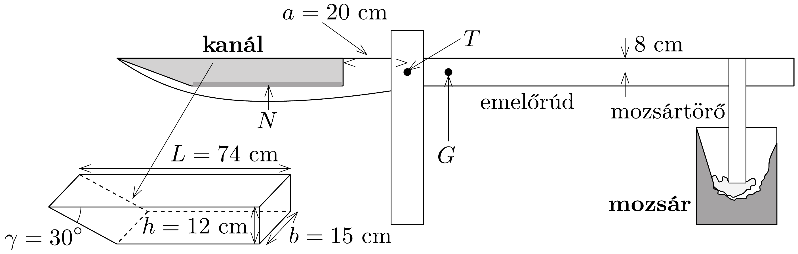

## Feladat 1

Vízzel hajtott, rizshántoló mozsár

Bevezetés
Vietnamban a legtöbb embernek a rizs a fő tápláléka. A fehér rizst úgy készítik a hántolatlan rizsből, hogy hántolják, vagyis egy réteget eltávolítanak a rizsszemek felületéről. Észak-Vietnam hegyvidékei vízben gazdagok, és az ott élő emberek vízzel hajtott, rizshántoló mozsarakat használnak ehhez a munkához. A 294. ábra egy ilyen mozsarat mutat, a 295. ábrán pedig a múködése látható.

Tervezés
A 294, ábrán látható rizshántoló mozsár a következő részekből áll:
A mozsár, lényegében egy fatartály a rizs számára.
Az emelő, ami egy fatörzs, egyik vége vastagabb, a másik vékonyabb. Az emelő vízszintes tengely körül tud elfordulni. A mozsártörőt merólegesen rögzítik az emelő vékonyabb végére. A mozsártörőt olyan hosszúra készítik, hogy akkor érje el a mozsárban a rizst, amikor az emeló vízszintes. Az emelő vastagabb végét úgy alakítják ki, hogy egy üreget vágnak ki belőle, így egy kanalat vájnak ki a farúd végén. A kanál alakja nagyon fontos a mozsár múködésében.

A múködés szakaszai
A mozsár múködése kétféle lehet.
Rendes, munkavégzó körfolyamat
Ilyenkor a mozsár a 295. ábrán bemutatott múködési ciklust végzi.
A rizshántoló funkció abból a munkából származik, amit a mozsártörő a rizsnek közvetít a 295 ábra $f$ ) lépésében. Ha valamilyen okból a mozsártörő nem éri el a rizsszemeket, azt mondjuk, hogy a mozsár nem végez munkát.

Rendellenes, mozdulatlan állapot
A múködési ciklus $c$ ) lépésében, amikor az $\alpha$ dőlési szög növekszik, a kanálban lévő víz mennyisége csökken. Egy bizonyos időpillanatban a víz mennyisége éppen elegendő ahhoz, hogy egyensúlyban tartsa a szerkezet rúdját. Jelöljük a dőlési szöget ebben a pillanatban $\beta$-val. Ha az emelőrudat a $\beta$ szögben tartjuk, és a kezdeti szögsebesség nulla, akkor az emelőrúd örökre ebben a helyzetben marad. Ez a mozdulatlan állapot felemelt emelőrúddal. Ennek a helyzetnek a stabilitása a kanálba folyó $\Phi$ vízmennyiségtől (vízhozamtól) függ. Ha $\Phi$ meghalad egy bizonyos $\Phi_{2}$ értéket, akkor a mozdulatlan állapot stabil, és a mozsár nem kerülhet a munkavégző funkcióba. Más szavakkal: $\Phi_{2}$-nél nagyobb vízhozam esetén a mozsár nem múködik.

A rizshántoló mozsár működési ciklusa
a) Kezdetben nincs víz a kanálban, a mozsártörő a mozsárban nyugszik. Lassan csordogálva víz folyik a kanálba, eközben az emelő rúdja mégis vízszintes helyzetü marad.
b) Egy bizonyos pillanatban a víz mennyisége eléri azt a határt, ami az emelőrúd felemeléséhez kell. A megdőlés hatására a víz megindul a kanál távolabbi
oldala felé, ezzel még gyorsabban dönti az emelőrudat. A víz az $\alpha=\alpha_{1}$ szöghelyzet elérésekor kezd kifolyni.
c) Amint az $\alpha$ szög növekszik, a víz tovább folyik ki. Egy bizonyos $\alpha=\beta$ dőlési szögnél a teljes forgatónyomaték nulla.
d) $\alpha$ folyamatosan növekszik, a víz kifolyása addig folytatódik, amíg a kanál teljesen ki nem ürül.
e) $\alpha$ továbbra is növekszik a rendszer tehetetlensége miatt. A kanál alakja miatt hiába folyik víz a kanálba, az azonnal kifolyik onnan. Az emelőrúd tehetetlenségi mozgása addig folytatódik, amíg $\alpha$ eléri a maximális $\alpha_{0}$ értékét.
f) Mivel nincs víz a kanálban, az emelőrúd súlya visszahúzza a rendszert az eredeti vízszintes helyzetbe. A mozsártörő belecsapódik a (rizst tartalmazó) mozsárba, és ezután egy új ciklus kezdődik el.

\section*{A feladat}

A berendezés legfontosabb geometriai adatait a 296. ábra mutatja. A paraméterei a következők: az emelőrúd tömege (a mozsártörővel együtt, ha a kanálban nincs víz): $M=30 \mathrm{~kg}$. Az emelőrúd tömegközéppontja $G$. Az emelőrúd a $T$ tengely körül forog (melynek vetülete az ábrán a $T$ pont). Az emelőnek a $T$ tengelyre vonatkoztatott tehetetlenségi nyomatéka: $\Theta=12 \mathrm{~kg} \cdot \mathrm{~m}^{2}$. Amennyiben a kanálban víz van, ennek a víznek a tömegét jelölje $m$, tömegközéppontja pedig legyen $N$. Az emelőrúd vízszinteshez viszonyított dőlésszöge $\alpha$.

Hanyagoljuk el a tengely körüli forgáskor fellépő súrlódást, valamint a kanálba esó́ víz által kifejtett erốt. Továbbá közelítésként tekintsük a kanálban lévő víz felszínét mindig vízszintesnek.

\subsection*{1.1. A mozsár felépítése}

Kezdetben a kanál üres, és az emelőrúd vízszintes. Ezután fokozatosan egyre több víz folyik a kanálba, mígnem az emelőrúd elkezd forogni. Ebben a pillanatban a kanálban lévő víz mennyisége: $m=1,0 \mathrm{~kg}$.
1.1.1. Határozzuk meg az emelőrúd $G$ tömegközéppontjának a $T$ forgástengelytől mért távolságát! Ha a kanál üres, $G T$ vízszintes.
1.1.2. Amikor az emelőrúd eléri a vízszinteshez viszonyított $\alpha_{1}$ szögü helyzetet, a víz elkezd kifolyni a kanálból, míg az emelőrúd $\alpha_{2}$ szögű helyzeténél a kanál teljesen kiürül. Határozzuk meg az $\alpha_{1}$ és az $\alpha_{2}$ szöget!
1.1.3. Legyen $\mu(\alpha)$ a ( $T$ tengelyre vonatkoztatott) teljes forgatónyomaték, amely az emelőrúd, valamint a kanálban lévő víz súlyából származik. A $\mu(\alpha)$ forgatónyomaték $\alpha=\beta$ esetén zérussá válik. Határozzuk meg a $\beta$ szöget, valamint ebben a helyzetben a kanálban lévő víz $m_{1}$ tömegét!

\subsection*{1.2. Rendes, munkavégző körfolyamat}

Tegyük föl, hogy a kanálba csorgó víz $\Phi$ hozama időben állandó, és kicsiny. Így az emelőrúd mozgása közben a kanálba folyó víz mennyisége elhanyagolható. Ebben a feladatban hanyagoljuk el a munkavégzési ciklus során a szerkezet tehetetlenségi nyomatékának változását.
1.2.1. Ábrázoljuk egy teljes munkavégzési ciklusra a $\mu(\alpha)$ függvényt, azaz rajzoljuk fel a $\mu$ forgatónyomatékot az $\alpha$ szög függvényében! Adjuk meg számszerüen $\mu(\alpha)$ értékét az $\alpha_{1}, \alpha_{2}$ és $\alpha=0$ szög esetén!
1.2.2. Az 1.2.1. pontban kapott grafikon elemzésével adjuk meg a $\mu(\alpha)$ forgatónyomaték által végzett $W_{\text {teljes }}$ teljes munka, valamint a mozsártörő becsapódásakor a rizsnek átadott $W_{\text {ütés }}$ energia geometriai értelmezését!
1.2.3. A $\mu$ forgatónyomatékot $\alpha$ függvényében ábrázoló grafikon alapján becsüljük meg az $\alpha_{0}$ szög és a $W_{\text {ütés }}$ becsapódási energia értékét! (A kanálba be- és kifolyó víz kinetikus energiája elhanyagolhatónak tekinthető.) A számolás egyszerúsítése érdekében, ha szükséges, görbe vonalakat törtvonalakkal helyettesíthetjük a grafikonon.

\subsection*{1.3. A mozdulatlan állapot}

Folyjon víz a kanálba állandó $\Phi$ vízhozammal, azonban most nem hanyagolhatjuk el a kanálba befolyó víz mennyiségét az emelőrúd mozgása közben.

\subsection*{1.3.1. feladat}

Tegyük fel, hogy a kanálból mindig túlfolyik a víz.
1.3.1.1. Vázoljuk fel egy grafikonon a $\mu$ forgatónyomatékot az $\alpha$ szög függvényében az $\alpha=\beta$ eset közelében! Állapítsuk meg az $\alpha=\beta$ egyensúlyi helyzet stabilitását!
1.3.1.2. Határozzuk meg a forgatónyomaték $\mu(\alpha)$ matematikai kifejezését mint $\Delta \alpha$ függvényét, ahol $\alpha=\beta+\Delta \alpha$, és $\Delta \alpha$ kicsi!
1.3.1.3. Írjuk fel az emelőrúd mozgásegyenletét, ha nulla kezdősebességgel indul el az $\alpha=\beta+\Delta \alpha$ helyzetből ( $\Delta \alpha$ kicsi)! Mutassuk meg, hogy a mozgás nagy pontossággal harmonikus rezgés! Számítsuk ki a $\tau$ periódusidőt!
1.3.2. Adott $\Phi$ esetén a kanál minden időpillanatban túlfolyik, de csak akkor, ha az emelőrúd mozgása elegendően lassú. A harmonikus rezgőmozgás amplitúdójára létezik egy felső korlát, ami $\Phi$-től függ. Határozzuk meg $\Phi$-nek a minimális $\Phi_{1}$ értékét (kg/s egységben) akkor, ha az emelőrúd 1°-os amplitúdóval harmonikus rezgőmozgást végez!
1.3.3. Tegyük fel, hogy $\Phi$ elegendően nagy ahhoz, hogy az emelőrúd szabad mozgása közben, amikor a dőlési szög $\alpha_{2}$-ről $\alpha_{1}$-re csökken, a kanálban lévő víz mindig túlfolyjon. Azonban, ha $\Phi$ túlságosan nagy, a mozsár nem tud múködni. Feltételezve, hogy az emelő mozgása harmonikus oszcillátornak tekinthető, becsüljük meg azt a minimális $\Phi_{2}$ vízhozamot, amelynél a rizshántoló mozsár nem múködik.
