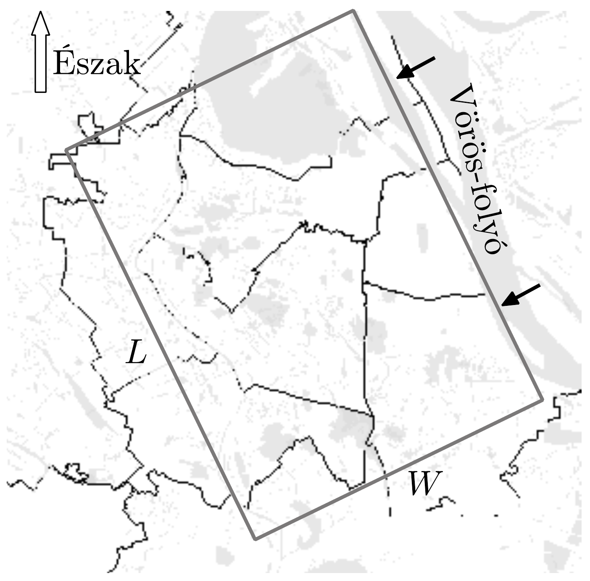

## Feladat 3

A levegố hốmérsékletének magasság szerinti változása, a légköri stabilitás és a légszennyeződés
A levegő függőleges mozgása sok légköri folyamatért (például a felhők és egyéb kiválások kialakulásáért és a légszennyeződés szétterjedéséért) felelős. Ha a légkör stabil, akkor a függőleges mozgás nem valósulhat meg; a levegőben lévő szennyeződések összegyülnek a kibocsátás helye közelében, nem terjednek szét, nem hígulnak fel. Instabil légkör esetén azonban a levegő függőleges mozgása elősegíti a légszennyeződések függőleges szétterjedését. Emiatt a szennyezők koncentrációja nemcsak a kibocsátó források erősségétől, hanem a légkör stabilitásától is függ.

A levegő stabilitását a meteorológiában használatos elemi „levegőcsomag” (air parcel) fogalmának a használatával fogjuk meghatározni, összehasonlítva az adiabatikus állapotváltozás közben emelkedő vagy süllyedő elemi levegőcsomag hőmérsékletét a környező levegő hőmérsékletével. Látni fogjuk, hogy sok esetben a légszennyeződést tartalmazó, a felszínről felfelé emelkedő elemi levegőcsomag nyugalmi állapotba jut bizonyos magasságban, amit keveredési magasságnak nevezünk. Minél nagyobb a keveredési magasság, annál alacsonyabb a légszennyezés koncentrációja. Meg fogjuk határozni a keveredési magasságot és a szén-monoxid koncentrációt, amit egy reggeli csúcsforgalmi helyzetben Hanoi belvárosában a motorbiciklik bocsátanak ki egy olyan esetben, amikor 119 m magasság felett hőmérséklet-inverzió (amikor a levegő hőmérséklete felfelé növekszik) következtében a függőleges keveredés nem folytatódhat.

A levegőt tekintsük kétatomos ideális gáznak, melynek moláris tömege: $\mu=$ $=29 \mathrm{~g} / \mathrm{mol}$.

A következő adatokat használhatjuk:
Az egyetemes gázállandó: $R=8,31 \mathrm{~J} /(\mathrm{mol} \cdot \mathrm{K})$.
A légköri nyomás a földfelszínen: $p_{0}=101,3 \mathrm{kPa}$.
Az állandónak tekinthető gravitációs gyorsulás: $g=9,81 \mathrm{~m} / \mathrm{s}^{2}$.
A levegő mólhője állandó nyomáson: $c_{p}=\frac{7}{2} R$.
A levegő mólhője állandó térfogaton: $c_{V}=\frac{5}{2} R$.
Matematikai útmutatás:
- a) \[
\int \frac{\mathrm{d} x}{A+B x}=\frac{1}{B} \int \frac{\mathrm{~d}(A+B x)}{A+B x}=\frac{1}{B} \ln (A+B x) .
\]
- b) A $\frac{\mathrm{d} x}{\mathrm{~d} t}+A x=B$ differenciálegyenlet (ahol $A$ és $B$ állandók) megoldása
\[
x(t)=x_{1}(t)+\frac{B}{A},
\]
ahol $x_{1}(t)$ a $\frac{\mathrm{d} x}{\mathrm{~d} t}+A x=0$ differenciálegyenlet megoldása.

c)
\[
\lim _{x \rightarrow \infty}\left(1+\frac{1}{x}\right)^{x}=e
\]
3.1. A levegố hốmérsékletének magasság szerinti változása
3.1.1. Tegyük fel, hogy a légkör hőmérséklete mindenhol azonos, értéke $T_{0}$. Határozzuk meg, hogyan függ a légkör $p$ nyomása a $z$ magasságtól!
3.1.2. Tegyük fel, hogy a légkör hőmérséklete a következő összefüggés szerint változik a magassággal:
\[
T(z)=T(0)-\Lambda z,
\]
ahol $\Lambda$ egy állandó, amit a légkör hőmérséklet-csökkenési sebességének nevezünk (a függőleges hőmérsékletgradiens: $-\Lambda$ ).
3.1.2.1. Határozzuk meg ebben az esetben is, hogyan függ a légkör $p$ nyomása a $z$ magasságtól!
3.1.2.2. Szabad áramlás (konvekció) következik be, ha a levegő súrúsége növekszik a magassággal. Milyen $\Lambda$ értékek esetén valósul meg szabad áramlás?
3.2. Elemi levegôcsomag hốmérsékletének változása függőleges mozgás közben

Tekintsünk egy elemi levegőcsomagot, ami fel-le mozog a légkörben. Az elemi levegőcsomag számottevő kiterjedésú levegőtömeg, néhány méter nagyságú, amit független termodinamikai egységként kell kezelnünk, azonban mégis olyan kicsiny, hogy a hőmérsékletét azonosnak, homogénnek tekinthetjük. Egy elemi levegőcsomag függőleges mozgását (kvázi)adiabatikus folyamatként tárgyalhatjuk, azaz a környezó levegővel való hőcserét elhanyagolhatjuk. Ha a levegőcsomag emelkedik a légkörben, akkor kitágul és lehúl. Következésképpen, ha lefelé mozog, akkor a növekvő külső nyomás összenyomja a levegőt a csomagon belül, és hőmérséklete emelkedni fog.

Ha a levegőcsomag mérete nem nagy, akkor feltehetjük, hogy a levegőcsomag határán és belsejében a nyomás mindenhol ugyanakkora, és megegyezik a $p(z)$ légköri nyomásértékkel, ahol $z$ a csomag középpontjának magassága. A csomag hőmérséklete is a csomag minden pontjában ugyanakkorának tekinthető. Ez a hőmérséklet - amit $T_{\text {csomag }}(z)$-vel jelölünk - általában különbözik a környező levegő $T(z)$ hőmérsékletétől. A 3.2.1., valamint a 3.2.2. pontokban a $T(z)$ függvényt adottnak tekinthetjük, melynek konkrét formája nem ismert.
3.2.1. A csomag $T_{\text {csomag }}$ hőmérsékletének változását a magasság szerint a következő módon adhatjuk meg: $\frac{\mathrm{d} T_{\text {csomag }}}{\mathrm{d} z}=-G$. Vezessünk le egy formulát $G$ kifejezésre!
3.2.2. Tekintsük azt a különleges légköri állapotot, amikor bármely $z$ magasságban a légkör $T$ hőmérséklete megegyezik az elemi levegőcsomag $T_{\text {csomag }}$ hőmérsékletével: $T(z)=T_{\text {csomag }}(z)$. Használjuk ilyenkor a $\Gamma$ jelölést $G$ helyett, vagyis
\[
\Gamma=-\frac{\mathrm{d} T_{\text {csomag }}}{\mathrm{d} z}, \quad \text { ha } \quad T(z)=T_{\text {csomag }}(z) .
\]
$\Gamma$ neve száraz adiabatikus csökkenési sebesség.
3.2.2.1. Határozzunk meg egy formulát $\Gamma$ kifejezésre!
3.2.2.2. Számítsuk ki $\Gamma$ számszerú értékét!
3.2.2.3. Adjuk meg ebben az esetben a $T(z)$ légköri hőmérséklet kifejezését a magasság függvényében!
3.2.3. Tegyük fel, hogy a légkör hőmérséklete a következő összefüggés szerint változik a magassággal: $T(z)=T(0)-\Lambda z$, ahol $\Lambda$ egy állandó. Határozzuk meg az elemi levegő csomag $T_{\text {csomag }}(z)$ hőmérsékletének függését a $z$ magasságtól!

Adjuk meg a $T_{\text {csomag }}(z)$ kifejezés közelítóértékét, ha $|\Lambda \cdot z| \ll T(0)$ és $T(0) \approx$ $T_{\text {csomag }}(0)$.
3.3. A légköri stabilitás

Ebben a részben feltesszük, hogy $T$ lineárisan változik a magassággal.
3.3.1. Tekintsünk egy elemi levegőcsomagot, amely kezdetben egyensúlyban van a környezó levegővel $z_{0}$ magasságban, azaz hőmérséklete ugyanolyan $T\left(z_{0}\right)$ értékú, mint a környező levegő. Ha a levegőcsomag lassan felfelé vagy lefelé mozog, a következő három eset egyikének teljesülnie kell:
- A levegőcsomag visszajut az eredeti $z_{0}$ magasságba, a levegőcsomag egyensúlya stabil (biztos). A légkört ekkor stabilnak tekinthetjük.
- A levegőcsomag folytatja mozgását a megkezdett irányba, a levegőcsomag egyensúlya instabil (bizonytalan). A légkör ilyenkor instabil.
- A levegőcsomag megmarad az új helyzetében, a levegőcsomag egyensúlya közömbös (indifferens). A légkört semlegesnek nevezzük.

Milyen feltételnek kell $\Lambda$ értékére teljesülnie, hogy a légkör stabil, instabil, illetve semleges legyen?
3.3.2. A levegőcsomag talajon mérhetó $T_{\text {csomag }}(0)$ hőmérséklete legyen magasabb, mint a környező levegő $T(0)$ hőmérséklete. Ilyenkor a felhajtóerő emelni kezdi a levegőcsomagot. Vezessünk le egy olyan kifejezést, ami megmondja, hogy a levegőcsomag mekkora maximális magasságba emelkedik stabil légkör esetén! A kifejezésben a hőmérsékleteken kívül csak $\Lambda$ és $\Gamma$ szerepeljen.
3.4. A keveredési magasság
3.4.1. Az alábbi táblázat egy meteorológiai léggömb hőmérsékletadatait tartalmazza, amelyeket Hanoiban mértek egy novemberi napon reggel 7:00 órakor. A hőmérséklet magasságtól való függését jó közelítéssel a $T(z)=T(0)-\Lambda z$ formulával lehet leírni, ahol a $\Lambda$ hőmérséklet-csökkenési sebesség a $0<z<96 \mathrm{~m}$, a $96 \mathrm{~m}<z<119 \mathrm{~m}$, valamint a $119 \mathrm{~m}<z<215 \mathrm{~m}$ szakaszokon más és más konstans.

\begin{tabular}[t]{|l|l|}
\hline Magasság (m) & Hőmérséklet (°C) \\
\hline 5 & 21,5 \\
\hline 60 & 20,6 \\
\hline 64 & 20,5 \\
\hline 69 & 20,5 \\
\hline 75 & 20,4 \\
\hline 81 & 20,3 \\
\hline 90 & 20,2 \\
\hline 96 & 20,1 \\
\hline 102 & 20,1 \\
\hline 109 & 20,1 \\
\hline 113 & 20,1 \\
\hline 119 & 20,1 \\
\hline 128 & 20,2 \\
\hline
\end{tabular}

\begin{tabular}[t]{|l|l|}
\hline Magasság (m) & Hőmérséklet (°C) \\
\hline 136 & 20,3 \\
\hline 145 & 20,4 \\
\hline 153 & 20,5 \\
\hline 159 & 20,6 \\
\hline 168 & 20,8 \\
\hline 178 & 21,0 \\
\hline 189 & 21,5 \\
\hline 202 & 21,8 \\
\hline 215 & 22,0 \\
\hline 225 & 22,1 \\
\hline 234 & 22,2 \\
\hline 246 & 22,3 \\
\hline 257 & 22,3 \\
\hline
\end{tabular}

Tegyük fel, hogy egy $T_{\text {csomag }}(0)=22{ }^{\circ} \mathrm{C}$ hőmérsékletú levegőcsomag emelkedni kezd a föld felszínéről. A táblázat adatainak felhasználásával és a fenti lineáris közelítés használatával számítsuk ki a levegőcsomag hőmérsékletét a 96 m-es és a 119 m-es magasságok között!
3.4.2. Határozzuk meg a levegőcsomag által elérhető maximális $H$ magasságot, és a levegőcsomag $T_{\text {csomag }}(H)$ hőmérsékletét!

A $H$ magasságot keveredési magasságnak nevezzük. A föld felszínéről érkező légszennyeződések ebben a rétegben keveredhetnek a légköri levegővel (például szelek, örvények stb. útján), és így a levegőcsomagban a szennyeződések felhígulhatnak.
3.5. Szén-monoxid-szennyezés becslése egy reggeli motorbiciklis csúcsforgalmi órában Hanoiban

Hanoi belvárosát egy téglalappal közelíthetjük, melynek $L$ és $W$ oldalát a 299. ábra mutatja, egyik oldalán a Vörös-folyó dél-nyugati partjával.

A becslések szerint a reggeli csúcsforgalomban 7-től 8 óráig $8 \cdot 10^{5}$ motorbicikli van az utakon, melyek mindegyike átlagosan 5 km utat tesz meg, és közben kilométerenként 12 g szén-dioxidot bocsát ki. A CO szennyeződés mennyiségét időben egyenletes kibocsátásúnak tekinthetjük, a csúcsforgalom alatt állandó $M$ mértékünek. Ugyanakkor a tiszta észak-keleti szél $u$ sebességgel fúj a Vörös-folyóra merőlegesen (azaz merőlegesen a téglalap $L$ oldalára), és ugyanezzel a sebességgel hagyja el a várost, miközben magával viszi a CO-val szennyezett levegő egy részét.

Használjuk a következő durva, közelítő modellt:
- - A CO gyorsan szétoszlik a keveredési réteg teljes térfogatában Hanoi belvá-

rosa felett, így a $t$ időpillanatban a $C(t)$ CO-koncentráció állandónak tekinthető az $L, W$ és $H$ méretekkel jellemezhető téglatest alakú doboz belsejében.
- - A dobozba befújó szél tiszta, feltehetjük, hogy nem tartalmaz szennyezést, továbbá azt is feltételezhetjük, hogy nem távozik szennyeződés a doboz széllel párhuzamos oldalain át.
- - 7 óra előtt a levegő CO-koncentrációja elhanyagolható.

3.5.1. Határozzuk meg azt a differenciálegyenletet, ami megadja a $C(t) \mathrm{CO}-$ koncentráció értékét az idő függvényében!
3.5.2. Írjuk le a $C(t)$ CO-koncentrációra kapott egyenlet megoldását, azaz adjuk meg a $C(t)$ függvényt!
3.5.3. Számítsuk ki a CO-koncentráció 8 órára vonatkozó számszerú értékét!

Adatok: $L=15 \mathrm{~km}, W=8 \mathrm{~km}, u=1 \mathrm{~m} / \mathrm{s}$.
