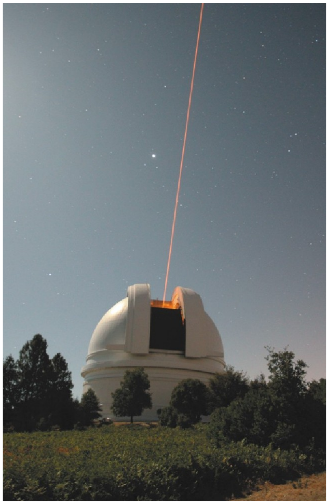
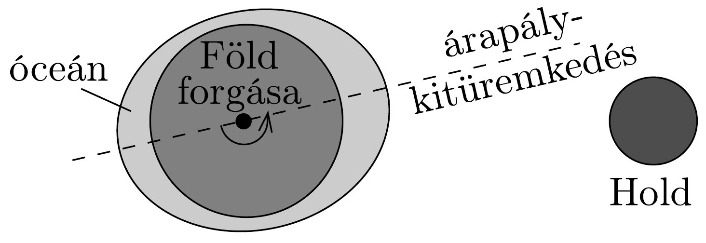
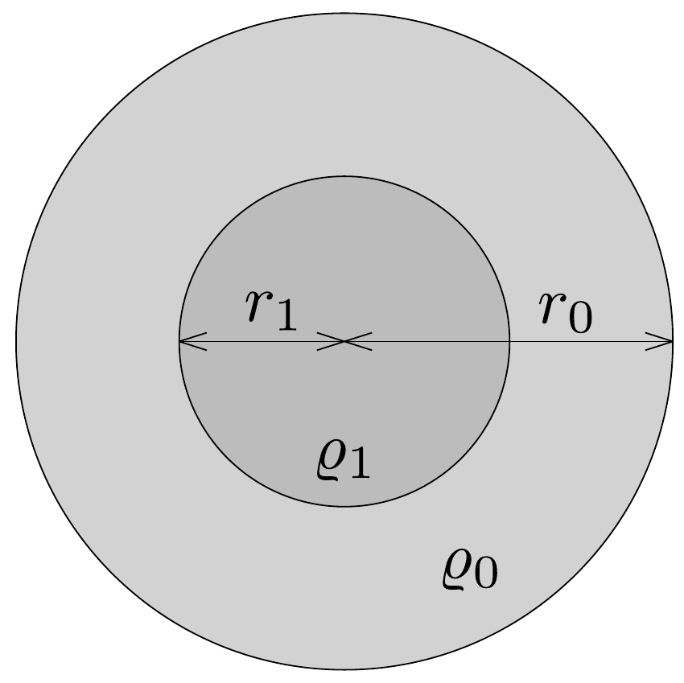
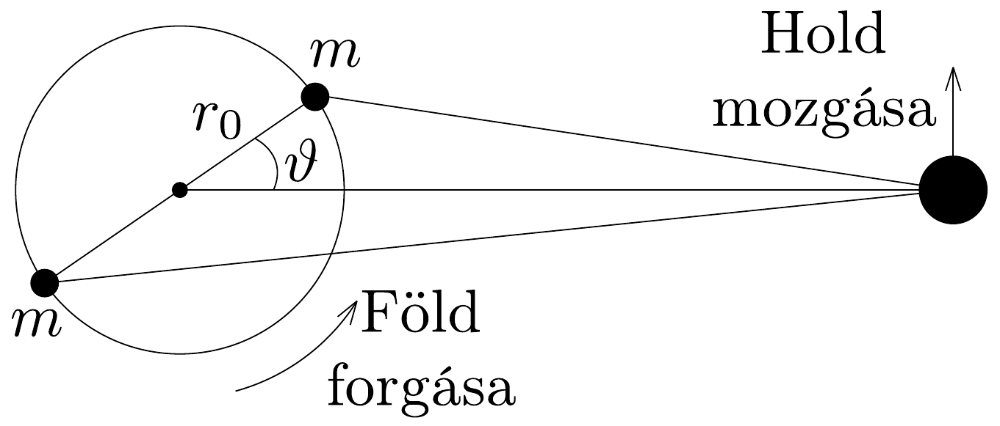

## Feladat 1

A Föld-Hold rendszer fejlődése
A tudósok nagy pontossággal meg tudják határozni a Föld-Hold távolságot. Ezt úgy végzik el, hogy úrhajósok által 1969-ben a Holdra helyezett speciális tükörre lótt lézersugár visszaverődési idejét mérik (307. ábra).

Ilyen módszerrel közvetlenül megmutatható, hogy a Hold lassan távolodik a Földtől, azaz a Föld-Hold távolság időben lassan növekszik. Ennek oka az, hogy az árapály jelenség során a Föld forgatónyomatékkal hat a Holdra, és így (pálya-) impulzusmomentumát (perdületét) megváltoztatja. A nem méretarányos 308, ábrán látható módon a Hold gravitációs hatása következtében a Föld vízfelszínén árapály deformációk, kitüremkedések jönnek létre. A Föld forgása miatt a kitüremkedések tengelye nem esik pontosan egybe a Föld-Hold egyenessel. Ez a kis eltérés olyan forgatónyomatékot eredményez, mely a Föld forgásának impulzusmomentumát csökkenti, a Hold pályamenti impulzusmomentumát pedig növeli. Ebben a feladatban ennek a jelenségnek a legfontosabb paramétereit vizsgáljuk meg.

\subsection*{1.1. Impulzusmomentum-megmaradás}

Legyen $L_{1}$ a Föld-Hold rendszer jelenlegi impulzusmomentuma. Éljünk a következő közelítő feltevésekkel:

(i) $L_{1}$ csupán a Földnek a tengely körüli forgásából adódó impulzusmomentumának és a Holdnak a Föld körüli keringéséből adódó (pálya-)impulzusmomentumának összege.
(ii) A Hold pályája köralakú, és a Hold pontszerűnek tekinthető.
(iii) A Föld forgástengelye és a Hold keringésének tengelye párhuzamos.
(iv) A számolás egyszerúsítése érdekében úgy tekintjük, hogy a mozgás a Föld középpontja körül megy végbe, nem pedig a rendszer tömegközéppontja körül. Ebben a feladatban mindenütt minden tehetetlenségi nyomatékot, impulzusmomentumot illetve forgatónyomatékot a Föld tengelyére vonatkoztatunk.
(v) A Nap hatását elhanyagoljuk.
1.1.1. Adjuk meg a Föld-Hold rendszer jelenlegi teljes impulzusmomentumát! A választ a következő mennyiségekkel fejezzük ki: a Föld tehetetlenségi nyomatéka: $\Theta_{\mathrm{F}}$; a Föld forgásának jelenlegi szögsebessége: $\omega_{\mathrm{F} 1}$; a Hold jelenlegi tehetetlenségi nyomatéka a Föld tengelyére vonatkoztatva: $\Theta_{\mathrm{H} 1}$; a Hold keringésének jelenlegi szögsebessége: $\omega_{\mathrm{H} 1}$.

Ez az impulzusmomentum-átadási folyamat addig tart, amíg a Föld forgásának periódusideje egyenlővé nem válik a Hold Föld körüli keringésének idejével. Ekkor a Hold által az óceánok felszínén okozott árapály kitüremkedések tengelye egybe fog esni a Föld-Hold egyenessel, és a két égitest közti forgatónyomaték nullává válik.
1.1.2. Adjuk meg a Föld-Hold rendszer teljes $L_{2}$ impulzusmomentumát ebben a végső helyzetben! Ugyanazokkal az egyszerúsító feltevésekkel dolgozzunk, mint az 1.1.1. feladatban. A végeredményt a következő mennyiségekkel fejezükd ki: a Föld tehetetlenségi nyomatéka: $\Theta_{\mathrm{F}}$; a Föld forgásának és a Hold keringésének végső szögsebessége: $\omega_{2}$; a Hold végső tehetetlenségi nyomatéka: $\Theta_{\mathrm{H} 2}$.
1.1.3. A végső, teljes impulzusmomentumban a Föld forgásának járulékát elhanyagolva írjuk fel az impulzusmomentum-megmaradás egyenletét erre a problémára!
1.2. Végsố pályasugár és végső szögsebesség a Föld-Hold rendszerben

Tegyük fel, hogy a Holdat a gravitációs eró minden esetben a Föld körüli körpályán tartja. A végső, teljes impulzusmomentumban a Föld forgásának járulékát hanyagoljuk el.

1.2.1. A végső helyzetben írjuk fel a Föld körül keringő Holdra a körmozgás alapegyenletét a következő mennyiségek felhasználásával: $M_{\mathrm{F}}, \omega_{2}, G$ és $D_{2}$, ahol $D_{2}$ a végső távolság a Föld és a Hold között, $M_{\mathrm{F}}$ a Föld tömege, $G$ pedig a gravitációs állandó!
1.2.2. Adjuk meg a Hold végső pályasugarát, $D_{2}$-t a következő mennyiségekkel: a rendszer teljes impulzusmomentuma: $L_{1}$; a Föld, illetve a Hold tömege: $M_{\mathrm{F}}$, illetve $M_{\mathrm{H}}$; a gravitációs állandó $G$ !
1.2.3. Adjuk meg a Föld-Hold rendszer végső $\omega_{2}$ szögsebességét megadó formulát az $L_{1}, M_{\mathrm{F}}, M_{\mathrm{H}}$ és $G$ mennyiségek segítségével!

Most $D_{2}$ és $\omega_{2}$ számszerú értékét határozzuk meg. Ehhez szükség van a Föld tehetetlenségi nyomatékára.
1.2.4. Tételezzük fel, hogy a Föld súrúsége belül, a középponttól $r_{1}$ sugárig $\varrho_{1}$, míg az $r_{1}$ sugártól a felszínig, $r_{0}$-ig $\varrho_{0}$ (309. ábra). Adjuk meg a Föld $\Theta_{\mathrm{F}}$ tehetetlenségi nyomatékának kifejezését!

Az alábbi feladatokban a kért számadatokat két értékes jegy pontossággal határozzuk meg.
1.2.5. Határozzuk meg a Föld $\Theta_{\mathrm{F}}$ tehetetlenségi nyomatékának számértékét, felhasználva, hogy $\varrho_{1}=1,3 \cdot 10^{4} \mathrm{~kg} \mathrm{~m}^{-3}, r_{1}=3,5 \cdot 10^{6} \mathrm{~m}, \varrho_{0}=4,0 \cdot 10^{3} \mathrm{~kg} \mathrm{~m}^{-3}$ és $r_{0}=6,4 \cdot 10^{6} \mathrm{~m}$ !

A Föld és a Hold tömege rendre $M_{\mathrm{F}}=6,0 \cdot 10^{24} \mathrm{~kg}$, illetve $M_{\mathrm{H}}=7,3 \cdot 10^{22} \mathrm{~kg}$. A két égitest jelenlegi távolsága $D_{1}=3,8 \cdot 10^{8} \mathrm{~m}$. A Föld forgásának jelenlegi szögsebessége $\omega_{\mathrm{F} 1}=7,3 \cdot 10^{-5} \mathrm{~s}^{-1}$. A Hold Föld körüli keringésének jelenlegi szögsebessége $\omega_{\mathrm{H} 1}=2,7 \cdot 10^{-6} \mathrm{~s}^{-1}$, a gravitációs állandó értéke pedig $G=6,7$. $10^{-11} \mathrm{~m}^{3} \mathrm{~kg}^{-1} \mathrm{~s}^{-2}$.
1.2.6. Határozzuk meg a rendszer $L_{1}$ teljes impulzusmomentumának számértékét!
1.2.7. Határozzuk meg a végső, $D_{2}$ pályasugár értékét méterben, valamint a jelenlegi, $D_{1}$ pályasugár mértékében!
1.2.8. Határozzuk meg a végső, $\omega_{2}$ szögsebesség értékét 1/s-ban, valamint adjuk meg a végső helyzetben egy nap hosszát a jelenlegi nap hosszának egységében!

Ellenőrizzük, hogy a végső, teljes impulzusmomentumban a Föld forgásából adódó járulék valóban elhanyagolható-e! Ehhez azt kell megmutatni, hogy a Föld és a Hold végső impulzusmomentumának aránya kis szám.
1.2.9. Határozzuk meg a végső helyzetben a Föld és a Hold impulzusmomentumának arányát!

\subsection*{1.3. Mennyivel távolodik a Hold évenként?}

Ebben a részben azt határozzuk meg, hogy mennyivel távolodik a Hold a Földtől évenként. Ehhez először ki kell számolni, hogy jelenleg mekkora forgatónyomatékot fejt ki a Föld a Holdra. Tegyük fel, hogy az árapály deformációból származó kitüremkedések két $m$ tömegú tömegponttal közelíthetőek, melyek a Föld felszínén helyezkednek el (310. ábra). Legyen továbbá $\vartheta$ a Föld-Hold egyenesnek a kitüremkedések tengelyével bezárt szöge.

1.3.1. Adjuk meg a Holdhoz közelebbi tömegpont által a Holdra kifejtett $F_{\mathrm{c}}$ gravitációs erő nagyságát!
1.3.2. Adjuk meg a Holdtól távolabbi tömegpont által a Holdra kifejtett $F_{\mathrm{f}}$ gravitációs erő nagyságát!

Ezután meghatározhatjuk a tömegpontok forgatónyomatékát.
1.3.3. Határozzuk meg a közelebbi tömegpont Holdra ható $\tau_{\mathrm{c}}$ forgatónyomatékának nagyságát!
1.3.4. Határozzuk meg a távolabbi tömegpont Holdra ható $\tau_{\mathrm{f}}$ forgatónyomatékának nagyságát!
1.3.5. Határozzuk meg a két tömegpont $\tau$ eredő forgatónyomatékának nagyságát! Mivel $r_{0} \ll D_{1}$, az eredményt $r_{0} / D_{1}$ elsón nem eltúnő hatványáig sorbafejtve adjuk meg. Felhasználhatjuk, hogy $(1+x)^{a} \approx 1+a x$, ha $x \ll 1$.
1.3.6. Adjuk meg a $\tau$ forgatónyomaték számértékét, felhasználva, $\operatorname{hogy} \vartheta=3^{\circ}$, és $m=3,6 \cdot 10^{16} \mathrm{~kg}$. (Megjegyzendő, hogy ennek a tömegnek a nagyságrendje $10^{-8}$-szorosa a Föld tömegének.)

Felhasználva, hogy a forgatónyomaték az impulzusmomentum időbeli változási sebessége, meghatározzuk a Föld-Hold távolság éves növekedésének jelenlegi értékét. Ehhez fejezzük ki a Hold impulzusmomentumát kizárólag az $M_{\mathrm{H}}, M_{\mathrm{F}}$, $D_{1}$ és $G$ mennyiségekkel.
1.3.7. Határozzuk meg a Föld-Hold távolság évenkénti növekedésének jelenlegi értékét!

Végül megbecsüljük, hogy mennyivel nő egy év alatt egy nap hossza.
1.3.8. Adjuk meg, hogy egy év alatt mennyivel csökken $\omega_{\mathrm{F} 1}$, és jelenleg menynyivel nő egy nap hossza egy év alatt!
1.4. Hová lesz az energia?

Az impulzusmomentummal szemben, ami megmarad, a rendszer teljes mechanikai energiája (forgási és gravitációs) nem állandó. Az utolsó részben ezt a kérdést vizsgáljuk.
1.4.1. Adjuk meg a Föld-Hold rendszer teljes $E$ mechanikai energiáját az égitestek jelenlegi helyzetében! Az eredményt kizárólag az $\Theta_{\mathrm{F}}, \omega_{\mathrm{F} 1}, M_{\mathrm{H}}, M_{\mathrm{F}}, D_{1}$ és $G$ mennyiségekkel fejezzük ki!
1.4.2. Fejezzük ki az $E$ energia $\Delta E$ megváltozását a $D_{1}$ és $\omega_{\mathrm{F} 1}$ mennyiségek megváltozásával! Határozzuk meg $\Delta E$ számszerú értékét egy évre vonatkoztatva, felhasználva a $D_{1}$ és $\omega_{\mathrm{F} 1}$ mennyiségek megváltozásának 1.3.7. és 1.3.8. pontban kiszámolt értékét!

Most ellenőrizzük, hogy az így kapott energiaveszteség összeegyeztethető azzal a hővel, amit a Hold árapály hatása hoz létre a Földön. Tegyük fel, hogy a dagály átlagosan 0,5 m-rel emel meg egy $h=0,5 \mathrm{~m}$ mély vízréteget, a Föld teljes felszínén. (Az egyszerúség kedvéert tegyük fel, hogy a Föld teljes felszíne vízzel van borítva.) Ez az emelkedés (dagály) minden nap kétszer következik be. Tegyük fel továbbá, hogy a víz viszkozitásának következtéban ennek a gravitációs energiának 10\%-a disszipálódik hő formájában az apály alkalmával. A víz súrúsége $\varrho_{\text {víz }}=10^{3} \mathrm{~kg} \mathrm{~m}^{-3}$, és a Föld felszínén a gravitációs gyorsulás $g=9,8 \mathrm{~m} \mathrm{~s}^{-2}$.
1.4.3. Mekkora a szóban forgó felületi vízréteg tömege?
1.4.4. Határozzuk meg, hogy mennyi energia disszipálódik egy év alatt! Milyen viszonyban áll ez a Föld-Hold rendszer mechanikai energiájának jelenlegi évenkénti csökkenésével?
