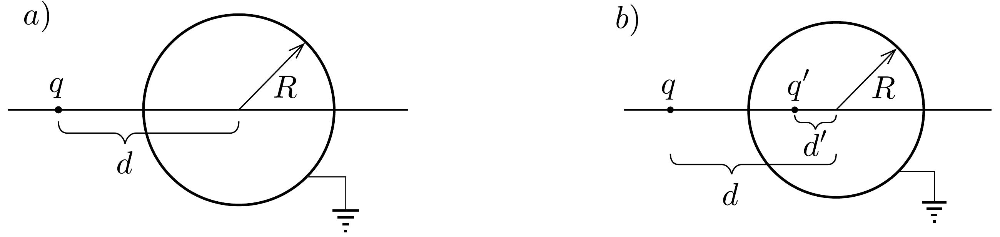
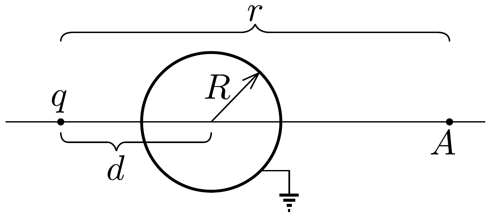
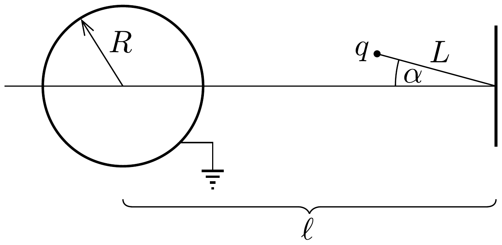

## Feladat 1

Tükörtöltés egy fémtárgyban

Bevezetés - Tükörtöltés módszere
Helyezzünk el egy $q$ ponttöltést egy $R$ sugarú, földelt fémgömb közelében (lásd a 317, a) ábrát). A ponttöltés hatására a gömbön felületi töltéseloszlás jön létre. A felületi töltéseloszlás által keltett elektromos tér és a potenciál kiszámítása rendkívül nehéz feladat. Azonban az úgynevezett tükörtöltés módszerrel a számítások lényegesen leegyszerúsíthetők. A módszer lényege az, hogy a gömbön lévő töltéseloszlás által keltett elektromos mező és potenciál leírható egyetlen, a gömb belsejében lévő $q^{\prime}$ ponttöltés terével és potenciáljával (ezt a tényt nem kell bizonyítani).

Megjegyzés: Ennek a $q^{\prime}$ tükörtöltésnek az elektromos tere csak a gömbön kívül (beleértve a felületét is) feleltethető meg a felületi töltéseloszlás által keltett elektromos térnek és potenciálnak.

\subsection*{1.1. Tükörtöltés}

Az elrendezés szimmetriájából következik, hogy a $q^{\prime}$ ponttöltésnek a $q$ ponttöltést és a gömb középpontját összekötő egyenesen kell lennie (lásd a 317.b) ábrát).
1.1.1. Mekkora a potenciál értéke a gömbön?
1.1.2. Fejezzük ki a tükörtöltés $q^{\prime}$ értékét, valamint a gömb középpontjától számított $d^{\prime}$ távolságát $q, d$ és $R$ segítségével!
1.1.3. Határozzuk meg a $q$ töltésre ható eró nagyságát! Ez az eró taszító vagy vonzó?
1.2. Elektrosztatikus tér leárnyékolása

Tekintsünk egy $q$ ponttöltést egy $R$ sugarú, földelt fémgömb közelében, a gömb középpontjától $d$ távolságra. Azt vizsgáljuk, hogyan befolyásolja a földelt fémgömb

jelenléte az $A$ pontban az elektromos teret. Az $A$ pont a gömb túlsó oldalán helyezkedik el (lásd a 318. ábrát). Az $A$ pont a $q$ ponttöltést és a gömb középpontját összekötő egyenesen található; a $q$ ponttöltéstől mért távolsága $r$.

1.2.1. Határozzuk meg az $A$ pontban az elektromos térerősségvektort!
1.2.2. Határozzuk meg az elektromos térerősség formuláját nagyon nagy távolság $(r \gg d)$ esetén, felhasználva, hogy $(1+a)^{-2} \approx 1-2 a$, ha $a \ll 1$ !
1.2.3. A $d$ távolságra nézve milyen feltételnek kell teljesülni ahhoz, hogy a földelt fémgömb teljesen leárnyékolja a $q$ töltés terét, vagyis az $A$ pontban az elektromos térerősség pontosan nulla legyen?

\subsection*{1.3. Rezgések a földelt fémgömb elektromos terében}

Egy $L$ hosszúságú fonál segítségével a földelt fémgömb közelében „felfüggesztünk" egy $q$ ponttöltést, melynek tömege $m$. A fonál másik végét egy falhoz rögzítjük. A fal elektrosztatikus hatásait hanyagoljuk el. A ponttöltés matematikai ingaként viselkedik (lásd a 319. ábrát). A fonál falhoz rögzített vége $\ell$ távolságra van a gömb középpontjától. Tegyük fel, hogy a gravitáció elhanyagolható.

1.3.1. Adjuk meg a $q$ ponttöltésre ható elektromos erő nagyságát egy adott $\alpha$ szög esetén, és jelezzük ennek az erőnek az irányát egy jól áttekinthető ábrán!
1.3.2. Határozzuk meg ennek az erőnek a fonálra merőleges összetevőjét a következő tagok függvényében: $\ell, L, R, q$ és $\alpha$ !
1.3.3. Adjuk meg az inga kis rezgéseinek frekvenciáját!

\subsection*{1.4. A rendszer elektrosztatikus energiája}

Elektromos töltéseloszlások esetén a rendszer elektrosztatikus energiája fontos adat. A mi esetünkben (lásd a 317a) ábrát), elektrosztatikus kölcsönhatás
jön létre a külső $q$ töltés és a gömbön kialakuló töltések között, valamint létezik elektrosztatikus kölcsönhatás magán a gömbön lévő töltések között is. A $q$ töltés, valamint a gömb $R$ sugara, továbbá a $d$ távolság segítségével határozzuk meg a következő elektrosztatikus energiákat:
1.4.1. a $q$ töltés és a gömbön lévó töltések közötti kölcsönhatás elektrosztatikus energiáját;
1.4.2. a gömbön lévő töltések közötti kölcsönhatás elektrosztatikus energiáját;
1.4.3. a rendszer teljes kölcsönhatási elektrosztatikus energiáját.

Útmutatás: Ez a feladat többféleképpen is megoldható.
- (1) Az egyik módszer esetén a következő integrált használhatjuk:
\[
\int_{d}^{\infty} \frac{x \mathrm{~d} x}{\left(x^{2}-R^{2}\right)^{2}}=\frac{1}{2} \frac{1}{d^{2}-R^{2}}
\]
- (2) Egy másik módszer esetén felhasználhatjuk azt a tényt, hogy $N$ ponttöltésből álló rendszer teljes elektrosztatikus energiája az összes töltéspárra vonatkozó energiák összege:
\[
W=\frac{1}{2} \sum_{i=1}^{N} \sum_{\substack{j=1 \\ i \neq j}}^{N} \frac{1}{4 \pi \varepsilon_{0}} \frac{q_{i} q_{j}}{\left|\boldsymbol{r}_{i}-\boldsymbol{r}_{j}\right|}
\]
ahol a töltéseket $q_{i}$ jelöli és ezek az $\boldsymbol{r}_{i},(i=1, \ldots, N)$ pontokban helyezkednek el.
