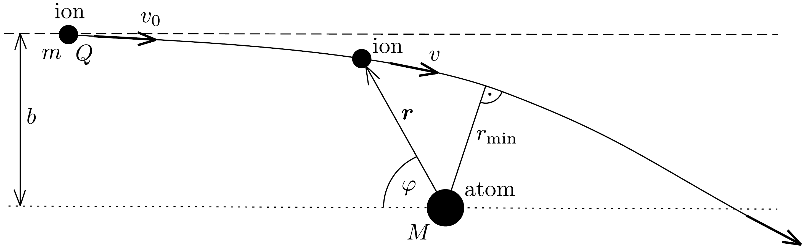
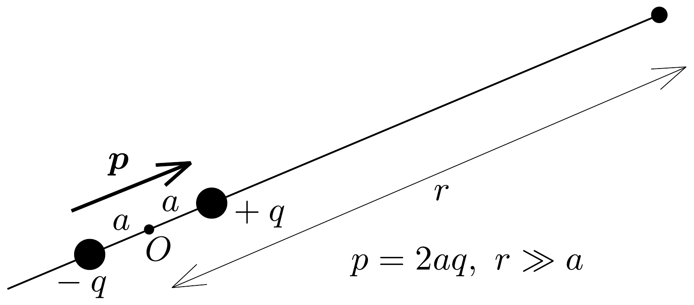

## Feladat 3

Ion szóródása semleges atomon (100 éves a Rutherfordféle atommodell)

Egy $m$ tömegú, $Q$ töltésú iont indítunk nagyon távolról, nemrelativisztikus $v_{0}$ kezdeti sebességgel egy $M \gg m$ tömegú, semleges atom felé, melynek elektromos polarizálhatósága $\alpha$. Az ütközési paraméter nagysága $b$ (lásd a 331. ábrát).

A közeledő ion $\boldsymbol{E}$ elektrosztatikus tere folyamatosan polarizálja az atomot, melynek következtében az atom
\[
\boldsymbol{p}=\alpha \boldsymbol{E}
\]
elektromos dipólmomentumra tesz szert. A feladat megoldása során minden sugárzási veszteséget hagyjunk figyelmen kívül.
3.1. Számítsuk ki az $\boldsymbol{E}_{p}$ elektromos térerősséget egy, az $O$ origóban elhelyezkedő, $\boldsymbol{p}$ dipólmomentumú ideális elektromos dipólustól $r$ távolságra a dipólus tengelye mentén (lásd a 332. ábrát)!
3.2. Vezessük le a polarizált atom által az ionra ható $\boldsymbol{F}$ erő kifejezését! Mutassuk meg, hogy ez az erő - az ion töltésének előjelétől függetlenül - vonzó jellegü.
3.3. Határozzuk meg az ion és az atom kölcsönhatásából származó elektromos potenciális energiát $\alpha, Q$ és $r$ függvényében!
3.4. Határozzuk meg az ion és az atom közötti legkisebb $r_{\text {min }}$ távolságot!
3.5. Ha a $b$ ütközési paraméter kisebb egy kritikus $b_{0}$ értéknél, az ion spirális pályán az atomba zuhan. Ebben az esetben az ion semlegesítődik, az atom töltése

332. ábra.
pedig megnő. Ez a folyamat „töltéskicserélődési” (angolul charge exchange) kölcsönhatás néven ismert. Mekkora az ion-atom ütközés $A=b_{0}^{2} \pi$ módon számolható hatáskeresztmetszete egy ilyen töltéskicserélődéses folyamat esetén?
