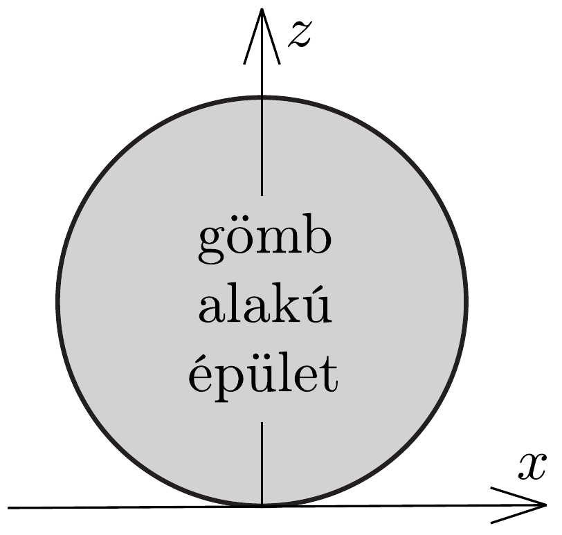
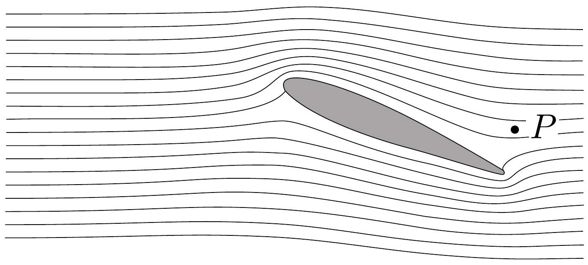
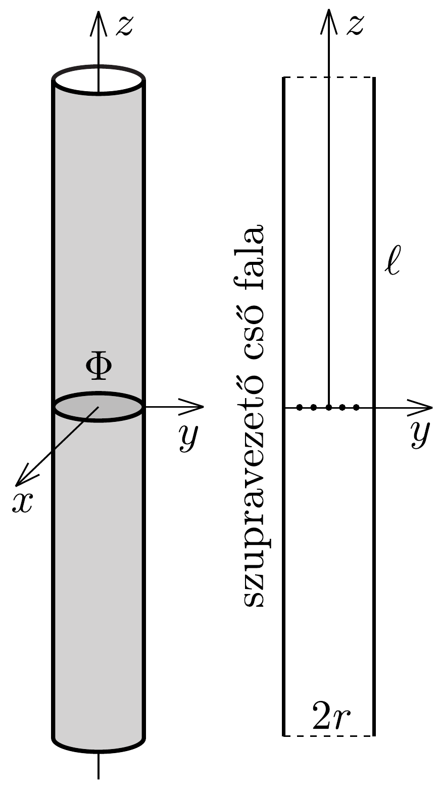

## Feladat 1

Ragadd meg a lényeget!

A rész. Hajítás
Egy $v_{0}$ kezdősebességgel elhajított golyó homogén gravitációs térben mozog az $x-z$ síkban, ahol az $x$ tengely vízszintes, a $z$ tengely pedig függőleges, a $\boldsymbol{g}$ nehézségi gyorsulással ellentétes irányú. A közegellenállást hanyagoljuk el.
1.A.1. A golyót rögzített $v_{0}$ nagyságú kezdősebességgel az origóból különböző irányokban elindítva azok a célpontok találhatók el, melyek a $z \leq z_{0}-k x^{2}$ egyenlőtlenséggel adott tartományban helyezkednek el (ezt a tényt bizonyítás nélkül felhasználhatjuk). Határozzuk meg a $z_{0}$ és $k$ konstansok értékét!
1.A.2. Ebben a részben a kilövési pont szabadon választható a $z=0$ talajszinten, és a kilövés szöge is alkalmasan választható. Célunk: a lehető legkisebb $v_{0}$ kezdősebességgel szeretnénk eltalálni egy $R$ sugarú, gömb alakú épület legfelső pontját (lásd a 336, ábrát). (A célpont elérése előtt a golyó nem pattanhat az épületen.) Vázoljuk fel a golyó optimális pályájának alakját ${ }^{25}$ !

1.A.3. Mekkora minimális $v_{\text {min }}$ kilövési sebesség szükséges az $R$ sugarú, gömb alakú épület legfelső pontjának eltalálásához?

B rész. Légáramlás egy szárny körül
Ebben a részben hasznosak lehetnek a következó információk: Folyadék vagy gáz csőben történő áramlása esetén egy áramvonal mentén $p+\rho g h+\frac{1}{2} \varrho v^{2}=$ konst., feltéve, hogy a $v$ sebesség sokkal kisebb a hangsebességnél. Itt $\varrho$ a súrúség, $h$ a magasság, $g$ a nehézségi gyorsulás és $p$ a nyomás. Az áramvonalakat a részecskék

\footnotetext{
${ }^{25}$ Gömb alakú épület a párizsi La Villette parkban található La Géode.

pályájaként definiálhatjuk, amennyiben az áramlás stacionárius. Az $\frac{1}{2} \varrho v^{2}$ tagot dinamikus nyomásnak nevezzük.

A 337. ábrán egy repülógépszárny keresztmetszete látható a szárny körül áramló levegő áramvonalaival együtt, a szárnyhoz rögzített vonatkoztatási rendszerben. Tegyük fel, hogy
a) az áramlás tisztán kétdimenziós (azaz a levegő sebességvektorai a 337 ábra síkjában fekszenek);
b) az áramvonalkép független a repülőgép sebességétől;
c) szél nincs;
d) a dinamikus nyomás jóval kisebb, mint a $p_{0}=1,0 \cdot 10^{5}$ Pa légköri nyomás.

Használjunk vonalzót az ábrán végezhető mérésekhez.

1.B.1. Ha a repülógép sebessége a földhöz viszonyítva $v_{0}=100 \mathrm{~m} / \mathrm{s}$, mekkora a levegő $v_{P}$ sebessége a 337. ábrán jelzett $P$ pontban a földhöz képest?
1.B.2. Nagy relatív páratartalom esetén, ha a repülógép sebessége a földhöz képest túllép egy kritikus $v_{\text {krit. }}$ értéket, a szárny mögött páracseppek sávja keletkezik. A cseppek egy jellemző $Q$ pontban jelennek meg. Jelöljük be a 337 ábrán a $Q$ pontot! Indokoljuk meg (lehetőleg képletekkel, a lehető legkevesebb szöveggel), hogy mi alapján határoztuk meg ez a pontot!
1.B.3. Becsüljük meg a $v_{\text {krit. }}$ kritikus sebesség értékét a következő adatok felhasználásával: a levegő relatív páratartalma $r=90 \%$, a levegő állandó nyomáson mért fajhője $c_{p}=1,00 \cdot 10^{3} \mathrm{~J} /(\mathrm{kg} \mathrm{K})$, a telített vízgőz nyomása a meg nem zavart levegó $T_{\mathrm{a}}=293 \mathrm{~K}$ hőmérsékletén $p_{\mathrm{sa}}=2,31 \mathrm{kPa}, T_{\mathrm{b}}=294 \mathrm{~K}$ hőmérsékleten pedig $p_{\mathrm{sb}}=2,46 \mathrm{kPa}$. Az alkalmazott közelítésektől függően szükség lehet a levegő állandó térfogaton mért $c_{V}=0,717 \cdot 10^{3} \mathrm{~J} /(\mathrm{kgK})$ fajhőjére is. A relatív páratartalom a gőznyomás és a telítési gőznyomás hányadosa egy adott hőmérsékleten. A telítési gőznyomás az a gőznyomás, ahol a gőz egyensúlyban van a folyadékával.

C rész. Mágneses csövek
Tekintsünk egy szupravezetó anyagból készült hengeres csövet. A cső hossza $\ell$, belső sugara $r ; \ell \gg r$. Legyen a cső középpontja az origó, tengelye pedig a $z$ tengely.

A cső középső keresztmetszetén $\left(z=0, x^{2}+y^{2}<r^{2}\right) \Phi$ mágneses fluxus halad át. A szupravezető minden mágneses teret kizár magából (a szupravezető anyagban nincs mágneses tér.)
1.C.1. Vázoljuk fel azt az öt mágneses indukcióvonalat, amelyek átmennek a 338. ábrán bejelölt pontokon!

1.C.2. Határozzuk meg a cső közepén ébredő $z$ irányú $T$ húzóerőt, amivel a csó $z>0$ és $z<0$ részei hatnak egymásra!
1.C.3. Most tekintsünk még egy ugyanilyen csövet, amely párhuzamos az elsővel! A második csőben ellentétes irányú a mágneses mező és a cső középpontja az $y=\ell, x=z=0$ pontban helyezkedik el, azaz a csövek egy képzeletbeli négyzet szemközti oldalait alkotják (339. ábra). Határozzuk meg a csövek között ható $F$ mágneses erőt!
