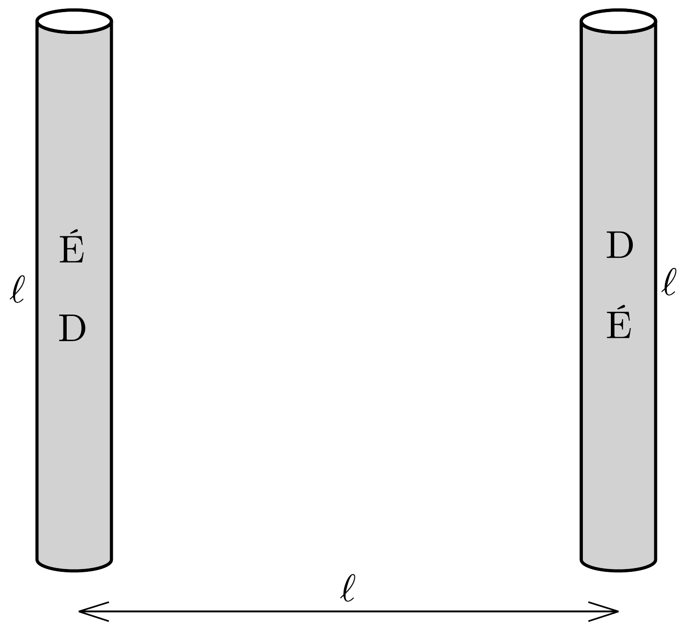
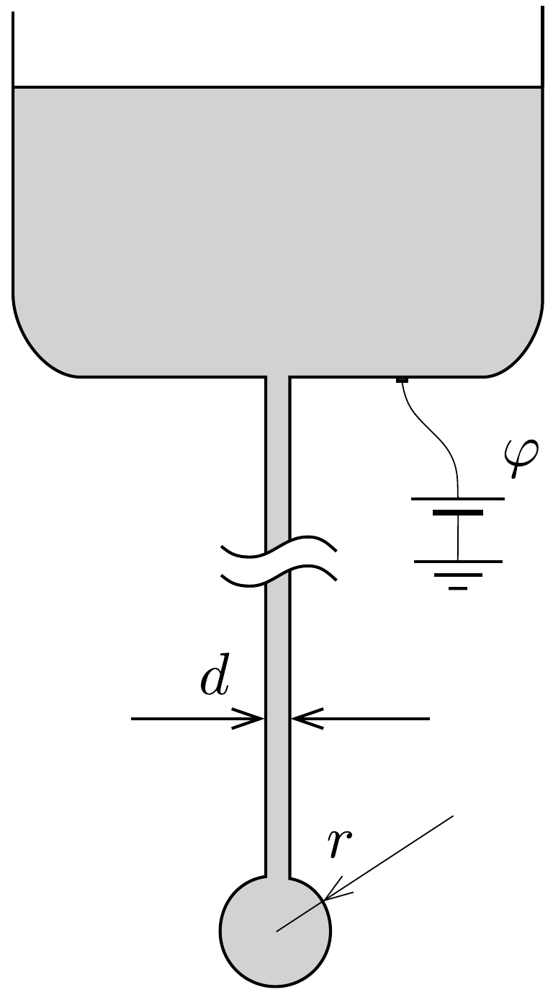
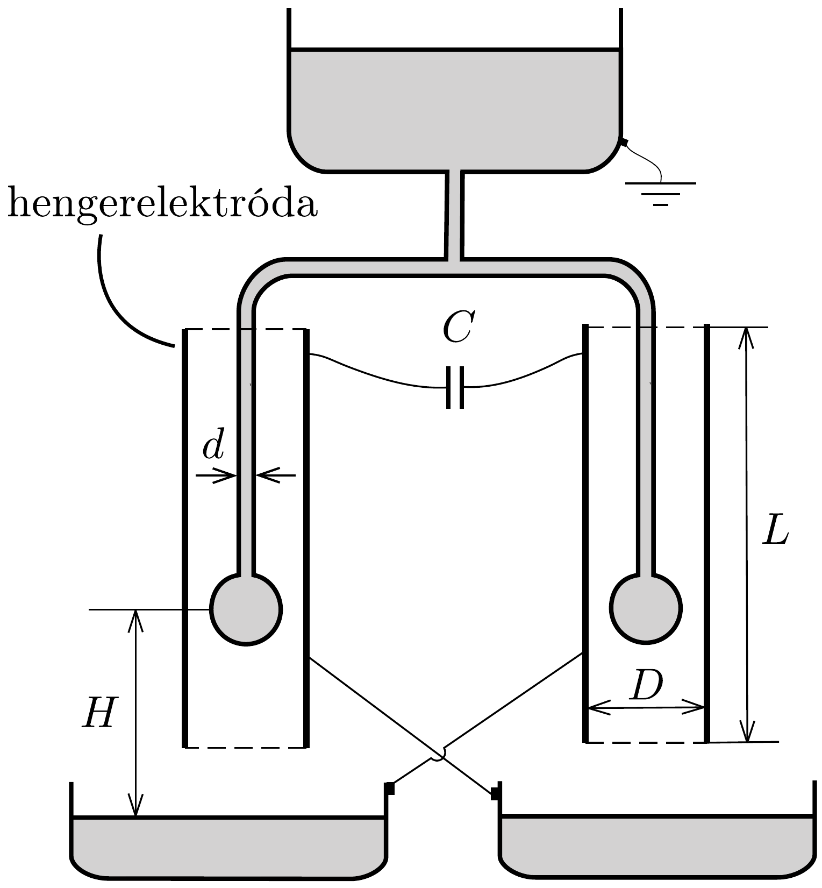

## Feladat 2

Kelvin csepegtetös gépe

A következő ismeretek hasznosak lehetnek: a folyadék felületét kevésbé kedvelik a részecskék, mint az anyag belsejét. Emiatt a határfelülethez $U=\sigma S$ felületi energia rendelhető, ahol $S$ a határfelület területe és $\sigma$ a folyadék felületi feszültsége. Továbbá a folyadékfelszín két darabkája $F=\sigma \ell$ eróvel vonzza egymást, ahol $\ell$ a darabkákat elválasztó egyenes határvonal hossza.

Egy víztartályhoz csatlakozó, $d$ belső átmérőjú, hosszú fémcsó függőlegesen lefelé áll; a cső alsó kimeneti nyílásából lassan víz csöpög ki (340. ábra). A vizet elektromosan vezetőnek tekinthetjük; a víz felületi feszültsége $\sigma$, sürúsége $\varrho$. A kimeneti nyílásról lelógó, gömbnek tekinthető vízcsepp sugara $r$. Mindvégig feltehetjük, hogy $d \ll r$. A vízcsepp nagyon lassan növekszik egészen addig, amíg a $g$ nehézségi gyorsulás hatására le nem esik.

A rész. Egyetlen csô
2.A.1. Adjuk meg a vízcsepp $r_{\text {max }}$ sugarát abban a pillanatban, amikor leszakad a cső kimeneti nyílásáról!

2.A.2. A nagyon távoli környezethez képest a cső elektromos potenciálja $\varphi$. Határozzuk meg a csepp $Q$ töltését, amikor a csepp sugara $r$ !
2.A.3. Ebben az alkérdésben a $\varphi$ potenciál lassan növekszik, azonban tegyük fel, hogy a csepp $r$ sugara állandó marad. A vízcsepp instabillá válik, és két darabra szakad szét, ha a vízcsepp belsejében a nyomás kisebbé válik, mint a külső légnyomás. Határozzuk meg azt a $\varphi_{\text {max }}$ potenciált, amikor a szétszakadás bekövetkezik!

B rész. Két cső
A két csőből álló berendezést „Kelvin csepegtetős gépének” nevezik, melyben
a két cső megegyezik az $A$ részben leírtakkal. A két cső a 341. ábrán látható T-elágazással kapcsolódik a víztartályhoz. Mindkét cső kimeneti nyílása egy-egy

fémhenger-elektróda középpontjába esik. A hengerpalástok magassága $L$, átmérójük $D, L \gg D \gg r$; mindkét cső esetén az időegységenként lecseppenő cseppek száma $n$. A cseppek $H$ magasságból a kimeneti nyílások alatt elhelyezkedő, elektromosan vezető edényekbe esnek. Az edények az ábrán látható módon az átellenes hengerelektródákkal vannak elektromosan összekötve. A hengerelektródák közé $C$ kapacitású kondenzátor van kapcsolva. A rendszer össztöltése kezdetben nulla. Az első leeső csepp mikroszkopikus töltéssel rendelkezik, amely felborítja a két oldal közötti egyensúlyt és kis töltésszétválást okoz a kondenzátoron. Vegyük figyelembe, hogy a tartály földelt.
2.B.1. Fejezzük ki a lecseppenő cseppek $Q_{0}$ töltésének nagyságát akkor, amikor a kondenzátor töltése $q$ ! A megoldást fejezzük ki a 2.A.1. részben meghatározott $r_{\text {max }}$ paraméter segítségével. Tekintsünk el a 2. A. 3. részben leírt effektustól!
2.B.2. Határozzuk meg a $q$ töltést $t$ idő függvényében! Tekintsük a $q(t)$ függvényt folytonosnak, és tételezzük fel, hogy $q(0)=q_{0}$.
2.B.3. A csepegtetó múködését a 2.A.3. részben leírt jelenség akadályozhatja. Az elérhető $U_{\max }$ határfeszültséget a csepp és az alatta lévő edény elektrosztatikus taszító hatása határozza meg. Határozzuk meg $U_{\max }$ értékét!
