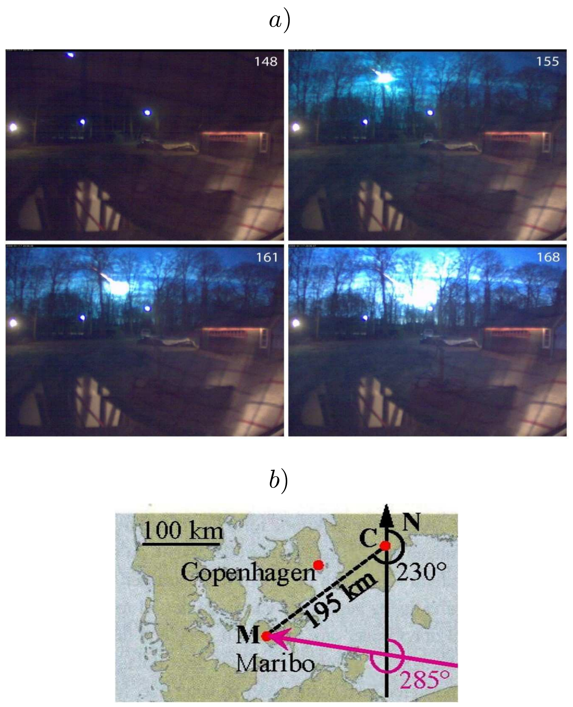
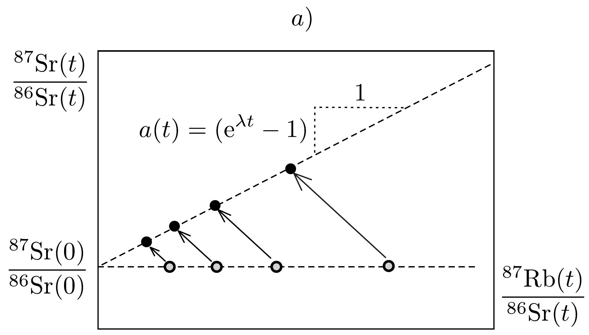
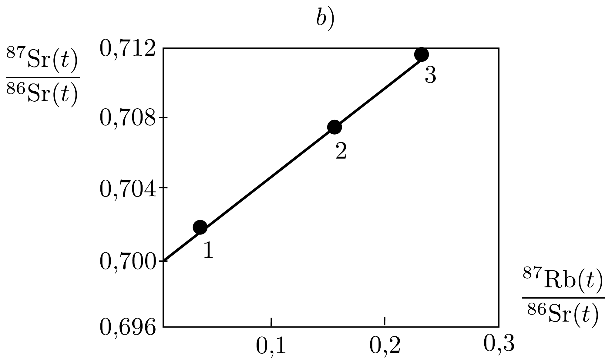

## Feladat 1

A Maribo-meteorit \\ Bevezetés

A meteoroid egy kisbolygóból vagy üstökösből kiszakadó, kis méretú test (mérete kisebb 1 méternél). A talajba csapódott meteoroidot meteoritnak nevezzük.

2009. január 17-én este a Balti-tenger közelében sok ember látta egy meteoroid izzó csóváját (túzlabdáját), ahogy áthalad a Föld légkörén. Svédországban egy biztonsági kamera videófelvételt készített az eseményről, amit a 346. a) ábra mutat. A fényképek és szemtanúk beszámolói alapján szúkíteni lehetett a becsapódás helyét, és hat héttel később a dél-dániai Maribo város szomszédságában megtalálták a 0,025 kg tömegú meteoritot, amit azóta Maribonak neveznek. A Maribon
végzett mérések és égi pályájának vizsgálata érdekes eredményt mutat. A meteoroid kivételesen nagy sebességgel hatolt be a légkörbe. A kora $4,567 \cdot 10^{9}$ év, ami azt mutatja, hogy röviddel a Naprendszer születése után keletkezett. A Maribometeorit esetleg az Encke-üstökös része volt.

\section*{A Maribo sebessége}

A 346.b) ábra azt mutatja, hogy a túzgolyó közel nyugati irányban, az északi iránnyal 285°-os szöget bezárva repült a becsapódás helye (M) felé, ahol később megtalálták. A meteoritot a biztonsági kamerától (C) 195 km-re, az északi irányhoz (N) képest 230°-os szögben találták meg. Az alábbi táblázat a 346a) ábra két fényképét jellemző adatokat tartalmazza. Az azimutszög a horizont síkjában az északi iránytól az órajárással egyezően bezárt szög a kamera felől. A magassági szög a horizont síkjával bezárt szög.

\begin{tabular}[t]{|l|l|l|l|}
\hline kép & idó (s) & azimutszög & magassági szög \\
\hline 155 & 1,46 & $215^{\circ}$ & 19,2° \\
\hline 161 & 2,28 & $221^{\circ}$ & 14,7° \\
\hline \multicolumn{2}{|l|}{Földet érés Maribon} & $230^{\circ}$ & 0,0° \\
\hline
\end{tabular}
1.1. A fentiek, valamint a táblázat adatainak a felhasználásával határozzuk meg a Maribo-meteoroid átlagsebességét a 155. és a 161. képkocka között eltelt időtartamra! A Föld felszínének görbülete és a meteoroidra ható gravitációs erő elhanyagolható.

\section*{Megolvad-e az atmoszférában?}

A meteoroid levegőben való mozgása miatt a felső légkörben fellépő súrlódást bonyolult formula írja le. A közegellenállási erő függ a meteoroid levegőhöz viszonyított sebességétől, valamint a légkör hőmérsékletétől és súrúségétől. Elfogadható közelítést ad a légkör felső részében a közegellenállási eróre az $F=k \varrho_{\text {atm }} A v^{2}$ kifejezés, ahol $k$ egy állandó (közegellenállási együttható), $\varrho_{\text {atm }}$ a légkör súrúsége, $A$ a meteoroid sebességre meróleges keresztmetszete, és $v$ a sebessége.

A következő egyszerúsítő feltevések felhasználásával vizsgáljuk a meteoroidot: amikor behatol a légkörbe a test, gömb alakú, tömege $m_{\mathrm{M}}=30 \mathrm{~kg}$, sugara $R_{\mathrm{M}}=0,13 \mathrm{~m}$, hómérséklete $T_{0}=200 \mathrm{~K}$, és a sebessége $v_{\mathrm{M}}=2,91 \cdot 10^{4} \mathrm{~m} / \mathrm{s}$. A légkör sürúsége állandó (a Föld felszíne felett 40 km magasságban), $\varrho_{\mathrm{atm}}=$ $4,1 \cdot 10^{-3} \mathrm{~kg} / \mathrm{m}^{3}$, és a közegellenállási együttható $k=0,60$.
1.2.1. Becsüljük meg, hogy a meteoroid légkörbe való behatolását követően mennyi idő múlva változik a sebessége $10 \%$-nyit, azaz csökken $v_{\mathrm{M}}$-ről $0,90 v_{\mathrm{M}}$-re! A gravitációs erő meteoroidra való hatását elhanyagolhatjuk, és feltehetjük, hogy a meteoroid alakja és tömege nem változik.
1.2.2. Számoljuk ki, hányszor nagyobb a légkörbe hatoló meteoroid $E_{\text {kin }}$ mozgási energiája a teljes megolvasztásához szükséges $E_{\mathrm{olv}}$ energiánál! A meteoroid fajhő́je $c_{\mathrm{kö}}=1,2 \cdot 10^{3} \mathrm{~J} /(\mathrm{kg} \mathrm{K})$, olvadáshő́je $L_{\mathrm{kö}}=2,6 \cdot 10^{5} \mathrm{~J} / \mathrm{K}$, olvadáspontja $T_{\text {kő }}=1,7 \cdot 10^{3} \mathrm{~K}$.

\section*{A Maribo melegedése a légkörön való áthatolás alatt}

Amikor a Maribo-meteoroidkó szuperszonikus sebességgel elérte a légkört, akkor egy túzgömbnek látszott, mert a körülötte lévő levegő felizzott. Ennek következtében a Maribo csak a legkülső, felszíni rétegén keresztül vett fel hốt. Tekintsük a Maribot egy homogén gömbnek, amelynek sürúsége $\varrho_{\mathrm{ko}}=3,3 \cdot 10^{3} \mathrm{~kg} / \mathrm{m}^{3}$, fajhője a már megadott $c_{\mathrm{kó}}$ és hóvezetési tényezője $k_{\mathrm{ko}}=2,0 \mathrm{~W} /(\mathrm{K} \mathrm{m})$. Továbbá, a légkörbe lépéskor a meteoroid hőmérséklete $T_{0}=200 \mathrm{~K}$ volt. A súrlódás miatt a meteoroid felszíni hőmérséklete a légkörben való esés alatt állandó $T_{\mathrm{s}}=1000 \mathrm{~K}$. Ennek következtében a meteoroid belseje is fokozatosan felmelegszik.

Miután a légkörben már $t$ ideig esett, a Maribo felszínén egy $x$ vastagságú réteg hőmérséklete válik $T_{0}$-nál jóval melegebbé. Ez a vastagság dimenzióanalízis segítségével megbecsülhető. Feltételezhető, hogy a vastagság nagyságrendje egyszerúen a termodinamikai paraméterek ismeretlen hatványainak szorzata, azaz $x \approx t^{\alpha} \varrho_{\text {kǒo }}^{\beta} c_{\text {kǒ }}^{\gamma} k_{\text {kǒ. }}^{\delta}$.
1.3.1. Dimenzióanalízis segítségével határozzuk meg az $\alpha, \beta, \gamma$ és $\delta$ kitevők értékét!
1.3.2. Ez alapján számoljuk ki, hogy mekkora az $x$ vastagság $t=0,5 \mathrm{~s}$ idővel a légkörbe történő belépés után, valamint határozzuk meg az $x / R_{\mathrm{M}}$ arányt!

\section*{A meteorit kora}

A radioaktív izotópok kémiai tulajdonságai különbözhetnek, és így egy adott meteroitban az ásványok kristályosodása során egyes kristályszemcsékben bizonyos radioaktív izotópok koncentrációja magasabb, másokban alacsonyabb. Ez a különbség lehetóvé teszi a meteorit korának meghatározását a radioaktív ásványtartalmának elemzésével.

Konkrét példaként vizsgáljuk a ${ }^{87} \mathrm{Rb}$ izotóp ( 37 -es rendszámú elem) bomlását, amelynek felezési ideje $T_{1 / 2}=4,9 \cdot 10^{10}$ év, és végterméke a ${ }^{87} \mathrm{Sr}$ stabil izotóp (38-as rendszámú elem). Ennek mennyiségét viszonyítjuk a meglevő, ugyancsak stabil ${ }^{86} \mathrm{Sr}$ izotópéhoz. Az ásványok kristályosodásakor a ${ }^{87} \mathrm{Sr} /{ }^{86} \mathrm{Sr}$ arány minden ásványszemcsében azonos volt, míg a ${ }^{87} \mathrm{Rb} /{ }^{86} \mathrm{Sr}$ arány különbözött. Az idő múlásával azonban a ${ }^{87} \mathrm{Rb}$ izotóp mennyisége csökkent, és ennek következtében a ${ }^{87} \mathrm{Sr}$ izotóp mennyisége nőtt. Így az ásványszemcsékben mostanra a ${ }^{87} \mathrm{Sr} /{ }^{86} \mathrm{Sr}$ arány különbözővé vált. A 347. ábra vízszintes tengelyein a kristályosodás időpontjában fennállt ${ }^{87} \mathrm{Rb} /{ }^{86} \mathrm{Sr}$ arány van feltüntetve. Az $a$ ) ábrán a különböző ásványszemcsékben fennálló ${ }^{87} \mathrm{Sr} /{ }^{86} \mathrm{Sr}$ arányt a kristályosodás $t=0$ időpontjában az üres körök, a jelenlegit a teli körök jelzik.
1.4.1. Írjuk le a ${ }_{37}^{87} \mathrm{Rb}$ izotóp ${ }_{38}^{87} \mathrm{Sr}$-ra való bomlásának egyenletét!
1.4.2. Mutassuk meg, hogy ugyanazon meteorit különböző ásványi szemcséiből származó minták esetén egyenest kapunk, ha a jelenlegi ${ }^{87} \mathrm{Sr} /{ }^{86} \mathrm{Sr}$ arányt a jelenlegi ${ }^{87} \mathrm{Rb} /{ }^{86} \mathrm{Sr}$ arány függvényében ábrázoljuk! Ezt az egyenest egyidejúségi vonalnak nevezzük (347.a) ábra). Mutassuk meg továbbá, hogy az egyidejúségi vonal meredeksége $a(t)=\left(e^{\lambda t}-1\right)$, ahol $t$ a kristályosodás óta eltelt idő, $\lambda$ pedig a bomlási állandó, amely fordítottan arányos a $T_{1 / 2}$ felezési idővel!

1.4.3. Határozzuk meg a meteorit $\tau_{\mathrm{M}}$ életkorát a 347b) ábrán látható egyidejúségi vonal alapján!

Az Encke-üstökös, ahonnan a Maribo-meteorit származhat
A Nap körül keringő Encke-üstökös Naptól mért legnagyobb és legkisebb távolsága:
\[
a_{\min }=4,95 \cdot 10^{10} \mathrm{~m} \quad \text { és } \quad a_{\max }=6,16 \cdot 10^{11} \mathrm{~m} .
\]
1.5. Számítsuk ki az Encke-üstökös $t_{\text {Encke }}$ keringési idejét!

Aszteroidabecsapódás hatása a Földre
65 millió évvel ezelőtt egy óriási aszteroida csapódott a Földbe. Az aszteorida súrúsége $\varrho_{\text {aszt. }}=3,0 \cdot 10^{3} \mathrm{~kg} / \mathrm{m}^{3}$, sugara $R_{\text {aszt. }}=5,0 \mathrm{~km}$ és becsapódási sebessége $v_{\text {aszt. }}=2,5 \cdot 10^{4} \mathrm{~m} / \mathrm{s}$ volt. Ez a becsapódás a földi élet nagy részének kihalását eredményezte, és létrehozta a hatalmas Chicxulub krátert. Képzeljük el, mi történne, ha ma ütközne tökéletesen rugalmatlanul egy ugyanilyen aszteroida a Földnek. Tudjuk, hogy a Föld tehetetlenségi nyomatéka 0,83-szor akkora, mint
egy ugyanolyan tömegú és sugarú homogén gömbé. Az $M$ tömegü, $R$ sugarú homogén gömb tehetetlenségi nyomatéka $\frac{2}{5} M R^{2}$. Az ütközéskor a Föld pályájának változásától tekintsünk el.
1.6.1. Tegyük fel, hogy az aszteroida az északi póluson csapódik be. Határozzuk meg a Föld forgástengelyének maximális lehetséges szögeltérülését a becsapódás után!
1.6.2. Tegyük fel, hogy az aszteroida az Egyenlítőre csapódik be radiális (függőleges) irányból. Határozzuk meg a Föld forgási periódusának $\Delta \tau_{\text {függ }}$. megváltozását az ütközés után!
1.6.3. Tegyük fel, hogy az aszteroida az Egyenlítőre csapódik be a felszínt érintó (vízszintes) irányból, az Egyenlítő síkjában. Határozzuk meg Föld forgási periódusának $\Delta \tau_{\text {érintő }}$ megváltozását az ütközés után!

Maximális becsapódási sebesség
Tekintsünk egy olyan égitestet, amely gravitációsan kötött a Naprendszerhez és $v_{\text {becs. }}$ sebességgel becsapódik a Föld felszínére. Kezdetben elhanyagolhatjuk a Földnek a testre gyakorolt gravitációs hatását. Tekintsünk el továbbá a légköri súrlódástól, a többi égitest hatásától és a Föld forgásától.
1.7. Határozzuk meg a $v_{\text {becs. }}$ becsapódási sebesség legnagyobb lehetséges $v_{\text {becs }}^{\max }$. értékét!
