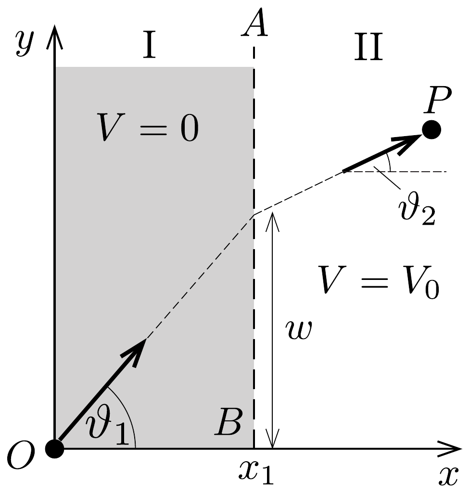
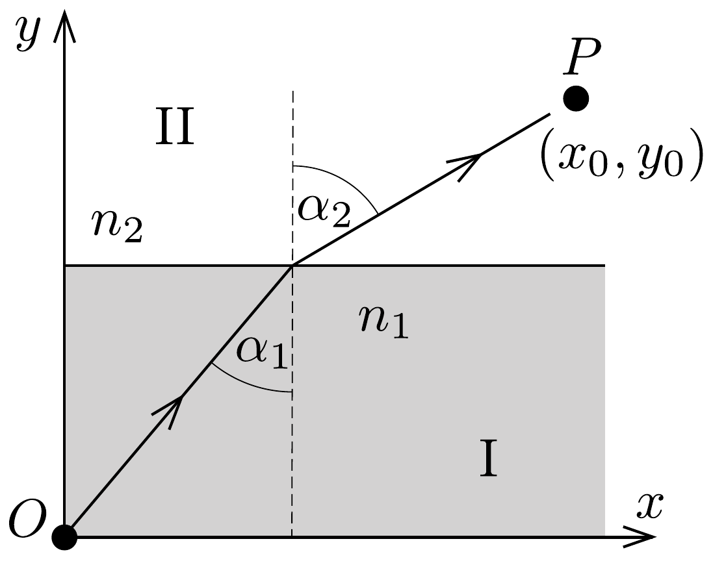
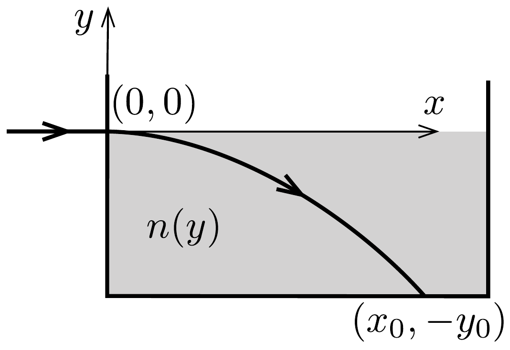
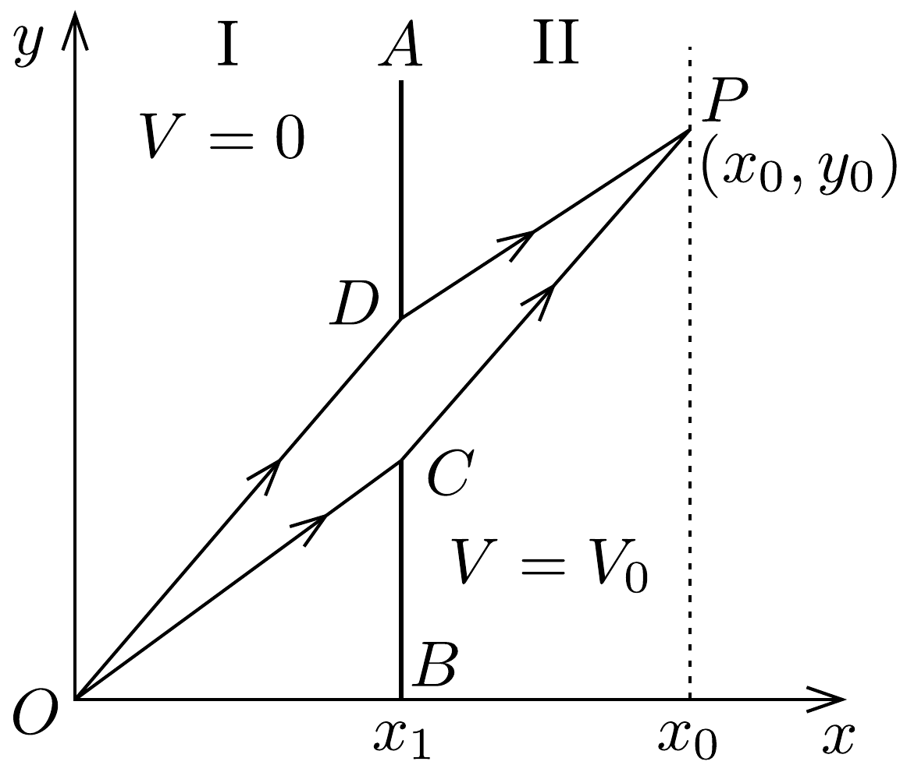
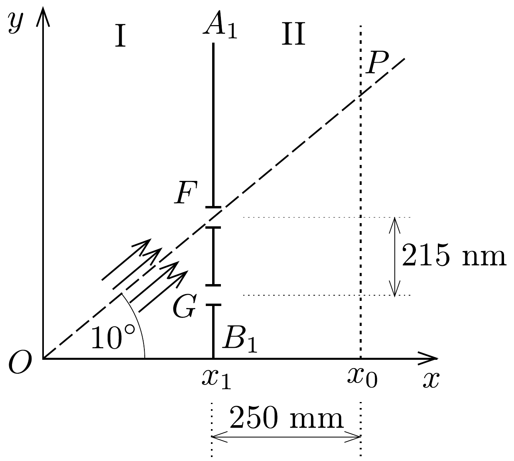

## Feladat 2

A szélsőértékelv
\section*{A rész. Szélsőértékelv a mechanikában}

Tekintsünk egy vízszintes, súrlódásmentes $x-y$ síkot (362. ábra). A síkot az $x=x_{1}$ egyenlettel megadott $A B$ egyenes két, I és II jelú tartományra osztja. Egy $m$ tömegú, pontszerú test helyzeti energiája az I-es tartományban $V=0$, míg a II-es tartományban $V=V_{0}$. A részecskét az $O$ origóból $v_{1}$ sebességgel indítjuk el egy, az $x$ tengellyel $\vartheta_{1}$ szöget bezáró egyenes mentén. A II-es tartományban lévő $P$ pontot $v_{2}$ sebességgel éri el egy, az $x$ tengellyel $\vartheta_{2}$ szöget bezáró egyenes mentén. A gravitációt és a relativisztikus hatásokat a feladat minden részében elhanyagolhatjuk.

2.A.1. Fejezzük ki $v_{2}$-t az $m, v_{1}$ és $V_{0}$ mennyiségek segítségével!
2.A.2. Adjuk meg $v_{2}$-t $v_{1}, \vartheta_{1}$ és $\vartheta_{2}$ segítségével!

Definiálunk egy (hatásnak nevezett) $A=m \int v(s) \mathrm{d} s$ mennyiséget, ahol $\mathrm{d} s$ a $v(s)$ sebességgel mozgó, $m$ tömegú részecske „infinitezimálisan kicsi” elmozdulása a pályája mentén. Az integrálást a pályagörbe mentén kell elvégezni.

Példaként, ha egy részecske állandó $v$ sebességgel mozog egy $R$ sugarú körpályán, akkor az $A$ hatás egy fordulat alatt $2 \pi m R v$ lesz.

Ha a részecske $E$ energiája állandó, akkor megmutatható, hogy két rögzített végpont között az összes lehetséges pálya közül a részecske ténylegesen azon a pályán fog mozogni, amelyen kiszámítva az $A$ hatásnak szélsőértéke (minimuma vagy maximuma) van. Történeti okokból ezt a szélsőértékelvet a legkisebb hatás elvének nevezik.
2.A.3. A legkisebb hatás elvéből következik, hogy ha egy részecske olyan tartományban mozog, ahol a helyzeti energia állandó, a pályája a két rögzített pont közötti egyenes szakasz lesz. Legyenek a 362 ábrán látható $O$ és $P$ rögzített pontok koordinátái $(0,0)$, illetve $\left(x_{0}, y_{0}\right)$, továbbá annak a határpontnak a koordinátái, ahol a részecske az I-es tartományból átmegy a II-esbe, legyenek $\left(x_{1}, w\right)$. Fontos, hogy $x_{1}$ értéke rögzített, és a hatás csak a $w$ koordináta függvénye. Ad-
juk meg az $A(w)$ hatásfüggvény alakját! A legkisebb hatás elve alapján keressünk kapcsolatot a $v_{1} / v_{2}$ hányados és a fenti koordináták között!

\section*{B rész. Szélsőértékelv az optikában}

Egy fénysugár az $n_{1}$ törésmutatójú I-es közegből az $n_{2}$ törésmutatójú II-es közegbe lép át. A két közeget egy $x$ tengellyel párhuzamos egyenes választja el. A fénysugár az $y$ tengellyel az I-es közegben $\alpha_{1}$, a II-es közegben $\alpha_{2}$ szöget zár be (363. ábra). A fénysugár útját egy másik szélsóértékelv, a legkisebb idő elvét megfogalmazó Fermat-elv segítségével kapjuk meg.

2.B.1. Az elv azt mondja ki, hogy két rögzített pont között a fénysugár olyan pályán halad, amelyen a két pont közötti út megtételéhez szükséges időnek szélsőértéke van. Vezessük le a $\sin \alpha_{1}$ és $\sin \alpha_{2}$ közötti összefüggést a Fermat-elv alapján!

A 364. ábrán (vázlatosan) egy olyan lézersugár menete látható, amely vízszintesen lép be egy cukoroldatba. Az oldatban a cukorkoncentráció - és ennek következtében a törésmutató is - csökken a magassággal.

2.B.2. Tegyük fel, hogy a törésmutató csak az $y$ koordinátától függ: $n=$ $n(y)$. A 2.B.1. részben kapott összefüggés segítségével fejezzük ki a fénysugár pályájának $\mathrm{d} y / \mathrm{d} x$ meredekségét az $n_{0}$ és $n(y)$ törésmutatók függvényében, ahol $n_{0}$ a törésmutató értéke az $y=0$ helyen!
2.B.3. A lézersugár a $(0,0)$ origóban vízszintesen lép be a cukoroldatba az edény aljához viszonyítva $y_{0}$ magasságban, ahogy az a 364. ábrán látszik. Legyen $n(y)=n_{0}-k y$, ahol $n_{0}$ és $k$ pozitív állandók. Fejezzük ki $x$-et $y$ és a lézersugár pályáját meghatározó többi mennyiség függvényében!

Felhasználhatjuk, hogy:
\[
\begin{aligned}
& \int \frac{1}{\cos \vartheta} \mathrm{~d} \vartheta=\ln \left(\frac{1}{\cos \vartheta}+\operatorname{tg} \vartheta\right)+\text { állandó, } \quad \text { vagy } \\
& \int \frac{\mathrm{d} x}{\sqrt{x^{2}-1}}=\ln \left(x+\sqrt{x^{2}-1}\right)+\text { állandó. }
\end{aligned}
\]
2.B.4. Határozzuk meg azt az $x_{0}$ értéket, ahol a fénysugár eléri az edény alját! Legyen: $y_{0}=10,0 \mathrm{~cm}, n_{0}=1,50, k=0,050 \mathrm{~cm}^{-1}$.

C rész. A szélsőértékelv és az anyag hullámtermészete
Most a legkisebb hatás elve és a mozgó részecske hullámtermészetének kapcsolatát fogjuk tanulmányozni. Ehhez azt feltételezzük, hogy az $O$-ból $P$-be haladó részecske minden lehetséges pályát befut, és mi azt a pályát keressük meg, amelyen az interferáló de Broglie-hullámok erósítik egymást.
2.C.1. A részecske egy infinitezimálisan kicsiny $\Delta s$ távolsággal elmozdul a pályáján. Fejezzük ki a de Broglie-hullám $\Delta \varphi$ fázisváltozását a hatás $\Delta A$ megváltozásával és a Planck-állandóval!
2.C.2. Tekintsük újra az $A$ részben szerepló feladatot, ahol a részecske $O$-ból $P$-be mozog (365. ábra). Tegyünk egy átlátszatlan lemezt a két tartomány közötti $A B$ határvonalra. Ezen egy kicsiny, $d$ szélességú $C D$ nyílás van, melyre teljesül, hogy $d \ll\left(x_{0}-x_{1}\right)$ és $d \ll x_{1}$.

Vegyük fel az $O C P$ és $O D P$ szélső pályákat úgy, hogy $O C P$ az $A$ részben tárgyalt klasszikus pályán legyen. Határozzuk meg első rendben a két pálya közötti $\Delta \varphi_{C D}$ fáziskülönbséget!

\section*{D rész. Anyaghullámok interferenciája}

Tekintsünk egy elektronágyút az $O$-ban, amely egy párhuzamosított elektronnyalábot bocsát ki a keskeny $F$ rés irányába (366. ábra - nem méretarányos). A rés az $x=x_{1}$ helyen lévő $A_{1} B_{1}$ átlátszatlan elválasztófalon úgy helyezkedik el, hogy az ernyón lévó $P$ pont, valamint $O$ és $F$ egy egyenesen legyen. A sebesség az I-es tartományban $v_{1}=2,0000 \cdot 10^{7} \mathrm{~m} / \mathrm{s}$, és $\vartheta=10,0000^{\circ}$. A II-es tartományban olyan a potenciál, hogy a sebesség $v_{2}=1,0000 \cdot 10^{7} \mathrm{~m} / \mathrm{s}$. Az $x_{0}-x_{1}$ távolság 250,00 mm. (Az elektronok közötti kölcsönhatást hanyagoljuk el.)

2.D.1. Számítsuk ki az elektronágyú $U_{1}$ gyorsítófeszültségét, ha $O$-ban az elektronokat nyugalmi helyzetből gyorsítjuk fel!
2.D.2. Az $A_{1} B_{1}$ elválasztófalon az $F$ rés alatt, attól 215,00 nm távolságra egy másik, $G$ jelú, keskeny rést is létrehozunk. Az $F$ és $G$ réseken át a $P$ pontba érkező de Broglie-hullámok fáziskülönbsége $2 \pi \beta$. Számítsuk ki $\beta$ értékét!
2.D.3. Mekkora az a $P$-től mért legkisebb $\Delta y$ távolság, ahol nem várható elektron becsapódása az ernyőn?

Hasznos lehet a $\sin (\vartheta+\Delta \vartheta) \approx \sin \vartheta+\Delta \vartheta \cos \vartheta$ közelítés.
2.D.4. A sugár négyzetes keresztmetszetú, mérete $500 \mathrm{~nm} \times 500 \mathrm{~nm}$, és a mérési összeállítás hossza 2 m. Mekkora az a minimális $I_{\text {min }}$ fluxussúrúség (elektrondarabszám/egységnyi merőleges felület/egységnyi idő), amely esetében egy adott időpillanatban átlagosan legalább egy elektron található a mérési összeállításban?
