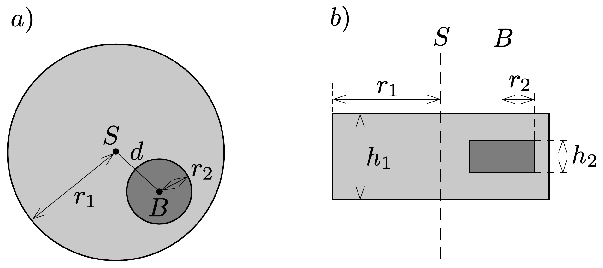
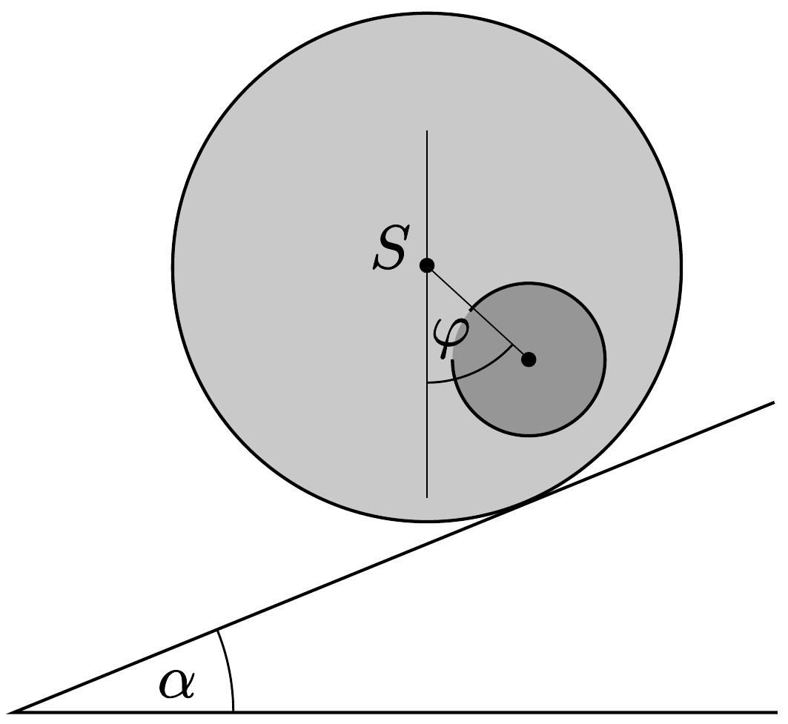
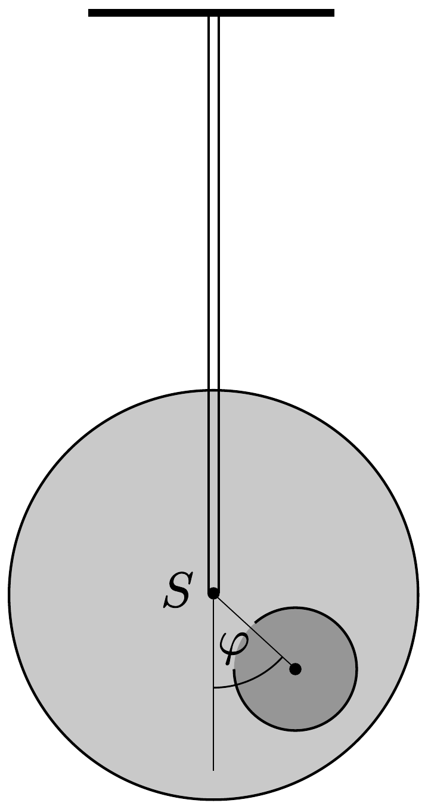
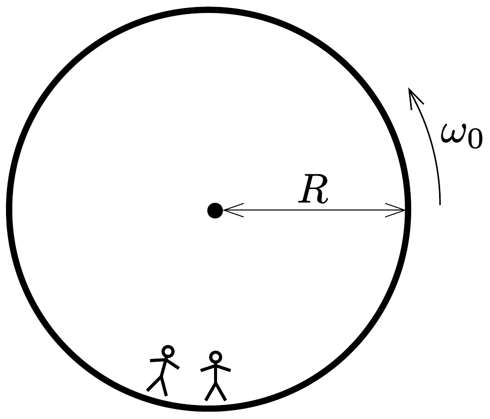
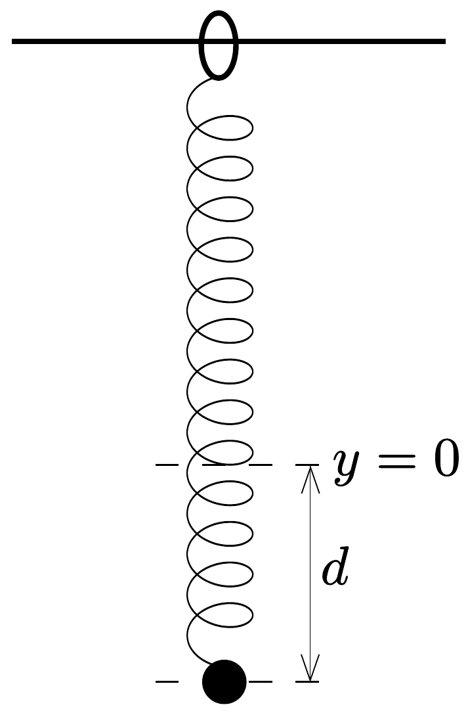

## Feladat 1

Két mechanikai probléma

A rész. Elrejtett korong
Tekintsünk egy tömör, fából készült, $r_{1}$ sugarú és $h_{1}$ vastagságú hengert. A fahenger belsejében valahol a fa anyaga helyett egy $r_{2}$ sugarú és $h_{2}$ vastagságú fémkorong található. A fémkorong úgy helyezkedik el, hogy $B$ szimmetriatengelye párhuzamos a fahenger $S$ tengelyével, és ugyanakkora távolságra van a fahenger alsó és felsó alaplapjától. Jelöljük $S$ és $B$ távolságát $d$-vel. A fa súrúsége $\varrho_{1}$, a fém súrúsége pedig $\varrho_{2}>\varrho_{1}$. A fahenger és a fémkorong össztömege $M$.

Ebben a részben a fahengert a földre helyezzük, így jobbra és balra szabadon tud gördülni. Az elrendezés oldal- és felülnézetben a 373. ábrán látható.

Ebben a feladatban a fémkorong méretét és helyét kell meghatározni.
A következőkben, ha a választ az ismert mennyiségekkel kell kifejeznünk, mindig az alábbiakat tekinthetjük ismertnek:
\[
r_{1}, \quad h_{1}, \quad \varrho_{1}, \quad \varrho_{2} \text { és } M .
\]

A cél $r_{2}, h_{2}$ és $d$ meghatározása indirekt méréseken keresztül.
Jelöljük $b$-vel a teljes rendszer $C$ tömegközéppontjának és a fahenger $S$ szimmetriatengelyének távolságát. Ennek a távolságnak a meghatározásához a következő kísérletet tervezzük: a fahengert vízszintes alapra helyezzük úgy, hogy stabil egyensúlyban legyen. Az alapot lassan megdöntjük $\alpha$ szöggel (374. ábra). A tapadási súrlódás miatt a fahenger csúszás nélkül gördülhet. A henger egy kicsit lejjebb gördül a lejtőn, de végül valamekkora $\varphi$ szögelfordulás után a stabil egyensúlyi helyzetben megáll. A $\varphi$ szöget megmérhetjük.

1.A.1. Fejezzük ki $b$-t a (16-1)-ben megadott mennyiségek, a $\varphi$ szög és az $\alpha$ hajlásszög függvényében!

Mostantól kezdve $b$ értékét ismertnek tekinthetjük.
A továbbiakban szeretnénk megmérni a rendszer $\Theta_{S}$ tehetetlenségi nyomatékát az $S$ szimmetriatengelyre vonatkoztatva. Ehhez egy mereven rögzített rúddal felfüggesztjük a fahengert a szimmetriatengelyénél. Ezután az egyensúlyi helyzetéből kicsiny $\varphi$ szöggel kitérítjük, majd elengedjük (375. ábra). Azt találjuk, hogy $\varphi$ periodikusan változik $T$ periódusidővel.

1.A.2. Határozzuk meg $\varphi$ mozgásegyenletét! Fejezzük ki a hengernek az $S$ szimmetriatengelyére vonatkoztatott $\Theta_{S}$ tehetetlenségi nyomatékát $T, b$ és a (16-1)-ben felsorolt, ismert mennyiségek segítségével! Feltételezhetjük, hogy az egyensúlyi helyzettől való kitérés kicsi, így $\varphi$ a mozgás során mindvégig igen kicsiny marad.

Az 1.A.1. és 1.A.2. részfeladatok mérései alapján szeretnénk meghatározni a fahengerben található fémkorong geometriáját és elhelyezkedését.
1.A.3. Fejezzük ki a $d$ távolságot $b$ és a (16-1)-ben szereplő mennyiségek segítségével. A formulában az $r_{2}$ és $h_{2}$ mennyiségeket is használhatjuk, hiszen ezeket az 1.A.5. pontban meg fogjuk határozni.
1.A. 4 Fejezzük ki az $\Theta_{S}$ tehetetlenségi nyomatékot $b$ és a (16-1)-ben szereplő, ismert mennyiségek segítségével. A formulában az $r_{2}$ és $h_{2}$ mennyiségeket is használhatjuk, hiszen ezeket az 1.A.5. pontban meg fogjuk határozni.
1.A. 5 A fenti eredményeket felhasználva fejezzük ki $h_{2}$ és $r_{2}$ értékét $b, T$ és a (16-1)-ben szereplő, ismert mennyiségek segítségével. A $h_{2}$ mennyiséget kifejezhetjük $r_{2}$-vel is.

B rész. Forgó ưrállomás
Alice egy úrállomáson lakó úrhajós. Az úrállomás egy óriási, $R$ sugarú kerék, amely a tengelye körül forog, így biztosítva a mesterséges gravitációt az asztronauták számára. Az úrhajósok a kerék peremének belsó oldalán élnek (376 .ábra). Az úrállomás gravitációs vonzása és a padló görbültsége elhanyagolható.

1.B.1. Mekkora $\omega_{0}$ szögsebességgel forog az úrállomás, ha az úrhajósok ugyanakkora $g_{\mathrm{F}}$ gravitációs gyorsulást éreznek, mint a Föld felszínén?

Alice és úrhajós barátja, Bob vitatkoznak. Bob nem hiszi el, hogy valóban egy úrállomáson élnek, szerinte ténylegesen a Földön tartózkodnak. Alice fizikai módszerrel szeretné bizonyítani Bobnak, hogy egy forgó úrállomáson élnek. Ezért egy $m$ tömegú testet rögzít egy $k$ rugóállandójú rugó végére, majd rezgésbe hozza. A test csak függőleges irányban rezeghet, vízszintesen nem tud mozogni.
1.B.2. Feltételezve, hogy a Földön a gravitációs gyorsulás állandó $g_{\mathrm{F}}$, mekkorának mérné a rezgés $\omega_{\mathrm{F}}$ körfrekvenciáját egy Földön lévő személy?
1.B.3. Mekkora $\omega$ körfrekvenciát mér Alice az ürállomáson?

Alice meg van győződve arról, hogy a kísérlete bizonyíték arra, hogy egy forgó úrállomáson élnek. Bob szkeptikus marad. Szerinte ha a gravitációs tér Föld felszíne feletti változását is figyelembe vesszük, annak hasonló hatása van. A továbbiakban azt vizsgáljuk, igaza van-e Bobnak.
1.B.4. Fejezzük ki a $g_{\mathrm{F}}(h)$ gravitációs gyorsulást kicsiny $h$ magasságban a Föld felszíne fölött, és számítsuk ki a rezgő test $\widetilde{\omega_{\mathrm{F}}}$ körfrekvenciáját (elég a lineáris közelítés)! A Föld sugarát jelölje $R_{\mathrm{F}}$. A Föld forgását figyelmen kívül hagyhatjuk.

Alice azt találja, hogy ezen az űrállomáson a rezgő test valóban a Bob által jósolt frekvenciával rezeg.
1.B.5. Mekkora az úrállomás $R$ sugara, ha a rezgés $\omega$ körfrekvenciája megegyezik a Földön mérhető $\widetilde{\omega_{\mathrm{F}}}$ körfrekvenciával? A választ $R_{\mathrm{F}}$ segítségével adjuk meg.

Bob makacsságán feldühödve Alice egy új kísérlettel áll elő saját igazának bizonyítására. Ezért felmászik az űrállomás padlója fölé $H$ magasságba egy toronyra, és elejt egy testet. Ez a kísérlet értelmezhető a forgó vonatkoztatási rendszerben éppúgy, mint inerciarendszerben.

Egy egyenletesen forgó vonatkoztatási rendszerben az úrhajós egy fiktív $\boldsymbol{F}_{\mathrm{C}}$ erốt tapasztal, amit Coriolis-erő́nek nevezünk. Az állandó $\omega_{0}$ szögsebességgel forgó rendszerben $\boldsymbol{v}$ sebességgel mozgó, $m$ tömegü testre ható $\boldsymbol{F}_{\mathrm{C}}$ Coriolis-erót a következő összefüggés adja meg:
\[
\boldsymbol{F}_{\mathrm{C}}=2 m \boldsymbol{v} \times \boldsymbol{\omega}_{0} .
\]
Használható a skaláris mennyiségekre vonatkozó
\[
F_{C}=2 m v \omega_{0} \sin \varphi
\]
alak, ahol $\varphi$ a sebességvektor és a forgástengely közötti szög. Az erő merőleges mind a $\boldsymbol{v}$ sebességvektorra, mind pedig a forgástengelyre. Az erő előjele a jobbkézszabály alapján határozható meg, de ez az előjel a következőkben szabadon választható.
1.B.6. Számítsuk ki a test $v_{x}$ vízszintes sebességét és a vízszintes $d_{x}$ elmozdulását (a torony aljához képest, a toronyra meróleges irányban) a padlóra érés pillanatában! Feltehetjük, hogy a torony $H$ magassága kicsiny, így az ưrhajósok által mért gyorsulás az esés alatt állandó. Feltételezhető továbbá, hogy $d_{x} \ll H$.

Hogy jobb eredményt kapjon, Alice úgy dönt, hogy a kísérletet egy, a korábbinál sokkal magasabb toronyról is elvégzi. Meglepetésére a test a torony aljánál éri el a padlót, azaz $d_{x}=0$.
1.B.7. Határozzuk meg a torony magasságának alsó korlátját, amelyre $d_{x}=0$ lehetséges!

Alice szeretne még egy utolsó kísérletet tenni Bob meggyőzésére. A rugós rendszerét szeretné használni a Coriolis-erő hatásának szemléltetésére. Ezért megváltoztatja az eredeti elrendezést: a rugót egy olyan gyúrúhöz rögzíti, amely szabadon és súrlódásmentesen csúszhat az $x$ irányban egy vízszintes rúdon. A rugó maga az $y$ irányban rezeg. A rúd párhuzamos a talajjal és merőleges az űrállomás forgástengelyére. Az $x-y$ sík tehát merőleges a forgástengelyre, az $y$ irány pedig egyenesen az úrállomás forgástengelye felé mutat.

377. ábra.
1.B.8. Alice a testet az $x=0, y=0$ egyensúlyi állapotából $d$ távolsággal kitéríti lefelé, majd elengedi (lásd a 377. ábrát).
(i) Fejezzük ki az $x(t)$ és $y(t)$ mennyiségeket! Feltehetjük, hogy $\omega_{0} d$ kicsi, és elhanyagolhatjuk az $y$ irányú Coriolis-erőt.
(ii) Vázoljuk fel az $(x(t), y(t))$ pályát, és jelöljük minden fontos tulajdonságát, mint pl. az amplitúdóját!

Alice és Bob folytatja vitáját ...
