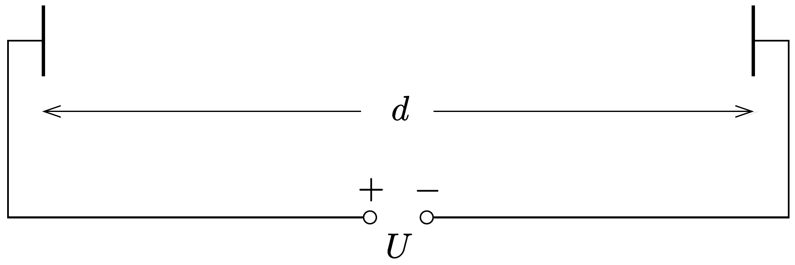
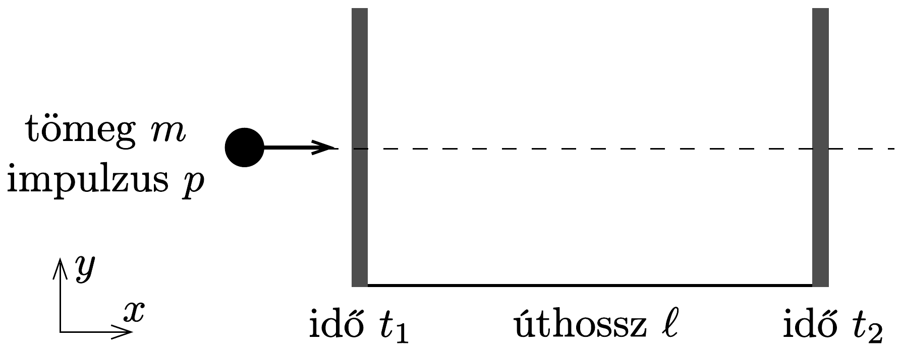
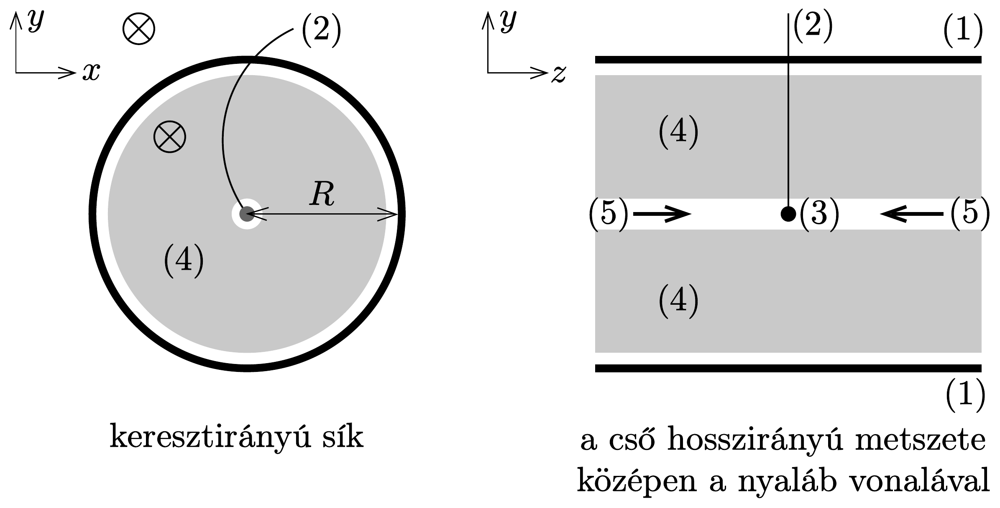

## Feladat 3

A Nagy Hadronütköztetö

Ez a feladat a CERN-ben múködő részecskegyorsító, a Nagy Hadronütköztető (Large Hadron Collider, LHC) fizikájával foglalkozik. A CERN a világ legnagyobb részecskefizikai laboratóriuma. Célja, hogy betekintést nyújtson a természet alapvető törvényeibe.

Az LHC-ben két részecskenyalábot gyorsítanak fel nagy energiára úgy, hogy azokat erős mágneses térrel gyorsítógyűrúben vezetik, és utána egymással ütköztetik óket. A protonok nem egyenletesen, hanem úgynevezett csomagokba rende-
ződve oszlanak el a gyorsító kerülete mentén. Az ütközés során keletkezett részecskéket hatalmas méretú detektorokkal figyelik meg. Az LHC néhány paramétere az alábbi táblázatban található.

\begin{tabular}[t]{|l|l|}
\hline LHC gyürü & \\
\hline Gyúrú kerülete & 26659 m \\
\hline Részecskecsomagok száma egy protonnyalábban & 2808 \\
\hline Protonok száma egy részecskecsomagban & $1,15 \cdot 10^{11}$ \\
\hline Protonnyalábok & \\
\hline Protonok energiája & 7,00 TeV \\
\hline Tömegközépponti energia & $14,0 \mathrm{TeV}$ \\
\hline
\end{tabular}

A részecskefizikusok az SI mértékegysékegnél alkalmasabb egységeket használnak az energia, az impulzus és a tömeg kifejezésére. Az energiát elektronvoltban (eV) mérik. Definíció szerint 1 eV energiát nyer az az $e$ elemi töltéssel rendelkező részecske, amelyik 1 volt potenciálkülönbségen haladt át ( $1 \mathrm{eV}=$ $1,602 \cdot 10^{-19} \mathrm{~kg} \mathrm{~m}^{2} \mathrm{~s}^{-2}$ ). Az impulzust $\mathrm{eV} / c$, a tömeget $\mathrm{eV} / c^{2}$ egységekben adják meg, ahol $c$ a vákuumbeli fénysebesség. Mivel 1 eV nagyon kicsi energiamennyiség, a részecskefizikusok gyakran a $\mathrm{MeV}\left(1 \mathrm{MeV}=10^{6} \mathrm{eV}\right)$, a $\mathrm{GeV}\left(1 \mathrm{GeV}=10^{9} \mathrm{eV}\right)$ vagy a $\mathrm{TeV}\left(1 \mathrm{TeV}=10^{12} \mathrm{eV}\right)$ egységeket használják.

A feladat első része a protonok vagy az elektronok gyorsításával, a második rész pedig az ütközéskor keletkezett részecskék azonosításával foglalkozik.

A rész. Az LHC gyorsító
Gyorsítás
Tegyük fel, hogy a protonokat $U$ feszültséggel gyorsítjuk fel a fénysebességhez nagyon közeli sebességre. Hanyagoljuk el a sugárzásból és más részecskékkel való ütközésből eredő energiaveszteségeket.
3.A.1. Adjuk meg a protonok $v$ végsebességének pontos kifejezését az $U$ gyorsítófeszültség és fizikai állandók függvényében!

Egy tervezett, jövőbeli kísérletben az LHC-bő érkező protonokat 60,0 GeV energiájú elektronokkal ütköztetik.
3.A.2. Egy nagy energiájú és kicsi tömegú részecskére a $v$ végsebesség és a $c$ fénysebesség közötti $\Delta=(c-v) / c$ relatív eltérés nagyon kicsi. Adjunk „első közelítést" $\Delta$-ra, és számítsuk ki $\Delta$ értékét 60,0 GeV energiájú elektronokra az $U$ gyorsítófeszültség és fizikai állandók segítségével!

Most visszatérünk az LHC-beli protonokra. Tegyük fel, hogy a nyalábot vezető cső̌ kör alakú.
3.A.3. Vezessük le a protonnyaláb kör alakú pályán tartásához szükséges homogén mágneses indukció $B$ nagyságát megadó összefüggést! A kifejezés csak a protonok $E$ energiáját, az $L$ kerületet, fizikai állandókat és számokat tartalmazhat. Megfeleló közelítések használata megengedett, ha azok hatása az utolsó
értékes jegy pontosságánál kisebb. Számítsuk ki a $B$ mágneses indukciót, elhanyagolva a protonok közötti kölcsönhatásokat, ha a proton energiája $E=7,00 \mathrm{TeV}$ !

\section*{Kisugárzott teljesítmény}

Egy gyorsuló, töltött részecske elektromágneses hullám formájában energiát sugároz. Az állandó szögsebességgel keringő, töltött részecske által kisugárzott $P_{\mathrm{s}}$ teljesítmény csak az $a$ gyorsulásától, a $q$ töltésétől, a $c$ fénysebességtől és a vákuum $\varepsilon_{0}$ permittivitásától függ.
3.A.4. Dimenzióanalízissel adjuk meg a $P_{\mathrm{s}}$ kisugárzott teljesítmény kifejezését!

A kisugárzott teljesítmény pontos kifejezésében még egy $1 /(6 \pi)$-s szorzótényező is szerepel, továbbá a relativisztikus levezetés egy $\gamma^{4}$-es szorzótényezőt is tartalmaz, ahol $\gamma=\left(1-v^{2} / c^{2}\right)^{-1 / 2}$.
3.A.5. Számítsuk ki az LHC $P_{\mathrm{t}}$ teljes kisugárzott teljesítményét, ha a proton energiája $E=7,00 \mathrm{TeV}$ ! Alkalmas közelítések használata megengedett.

\section*{Lineáris gyorsító}

A CERN-ben nyugvó protonokat gyorsítanak fel $d=30,0 \mathrm{~m}$ hosszúságú, lineáris gyorsítóval $U=500 \mathrm{MV}$ potenciálkülönbségen keresztül. Tegyük fel, hogy az elektromos mező homogén. A lineáris gyorsító két lemezből áll, ahogyan azt (vázlatosan) a 382. ábra mutatja.

3.A.6. Határozzuk meg azt a $T$ időt, ami alatt a protonok áthaladnak ezen az elektromos mezőn!

\section*{B rész. Részecskeazonosítás}

\section*{Repülési idő}

A kölcsönhatási folyamatok értelmezéséhez fontos az ütközésekben keletkező, nagy energájú részecskék azonosítása. Létezik egy egyszerú módszer, amivel azt az időt $(t)$ mérik, ami ahhoz szükséges, hogy egy ismert impulzusú részecske $\ell$ utat tegyen meg egy ún. repülési idő (RI) detektorban. A detektorban azonosított néhány, tipikus részecskét és a tömegüket a következő táblázat tartalmazza.

\begin{tabular}[t]{|l|l|}
\hline Részecske & Tömeg $\left(\mathrm{MeV} / \mathrm{c}^{2}\right)$ \\
\hline Deuteron & 1876 \\
\hline Proton & 938 \\
\hline Töltött kaon & 494 \\
\hline Töltött pion & 140 \\
\hline Elektron & 0,511 \\
\hline
\end{tabular}
3.B.1. Fejezzük ki a részecske $m$ tömegét a $p$ impulzus, az $\ell$ repülési úthossz és a $t$ repülési idő függvényében! Feltételezhetjük, hogy a részecske az $e$ elemi töltéssel rendelkezik, és az RI detektorban a $c$ fénysebességhez nagyon közeli sebességgel egyenes pályán, a két érzékelési síkra merólegesen halad (383. ábra).

3.B.2. Számítsuk ki azon RI-detektor legkisebb $\ell$ hosszát, amelyben a töltött kaon a töltött piontól biztosan megkülönböztethető, ha mindkét részecske impulzusát $1,00 \frac{\mathrm{GeV}}{c}$-nek mérik! A jó elkülönítéshez az kell, hogy a repülési idők különbsége háromszor akkora legyen, mint a detektor időfelbontása. Egy RI detektor tipikus felbontása 150 ps $\left(1 \mathrm{ps}=10^{-12} \mathrm{~s}\right)$.

A következőkben egy tipikus LHC-detektorban létrejövő részecskéket olyan kétlépcsős detektorban azonosítjuk, amely egy nyomkövető detektorból és egy RI-detektorból áll. A 384. ábra mutatja az elrendezést a protonnyalábok keresztés hosszanti irányában ((1) - RI-cső; (2) - pálya; (3) - ütközési pont; (4) - nyomkövetési cső; (5) - protonnyalábok; ⊗ - mágneses tér). Mindkét detektor egyegy cső, amelyek körülveszik a kölcsönhatási területet, bennük a csövek közepén haladó nyalábbal. A nyomkövető detektor méri a protonnyalábbal párhuzamos irányú mágneses téren áthaladó töltött részecske pályáját. A pálya $r$ sugarával meghatározható a részecske keresztirányú $p_{\mathrm{T}}$ impulzusa. Mivel az ütközés ideje ismert, az RI-detektorhoz csak egy csó szükséges ahhoz, hogy mérjék a repülési időt az ütközési pont és az RI-cső között. Ez az RI-cső szorosan a nyomkövető kamra külsején helyezkedik el. Ebben a feladatban feltehetjük, hogy az ütközésben keletkezett összes részecske a protonnyalábokra merőlegesen halad. Ez azt jelenti, hogy a keletkező részecskék nem rendelkeznek a protonnyalábok irányába mutató impulzussal.

3.B.3. Fejezzük ki a részecske tömegét a $B$ mágneses indukcióval, az RI-cső $R$ sugarával és fizikai állandókkal, valamint a mért mennyiségekkel: az $r$ pályasugárral és a $t$ repülési idővel!

Négy részecskét detektáltunk, és szeretnénk ezeket azonosítani. A nyomkövető detektorban a mágneses indukció $B=0,500 \mathrm{~T}$. Az RI-csó $R$ sugara 3,70 m. A mérési eredmények a következők ( $1 \mathrm{~ns}=10^{-9} \mathrm{~s}$ ):

\begin{tabular}[t]{|l|l|l|}
\hline Részecske & $r$ pályasugár $(\mathrm{m})$ & $t$ repülési idő (ns) \\
\hline A & 5,10 & 20 \\
\hline B & 2,94 & 14 \\
\hline C & 6,06 & 18 \\
\hline D & 2,31 & 25 \\
\hline
\end{tabular}
3.B.4. Azonosítsuk a négy részecskét a tömegük kiszámításával!
