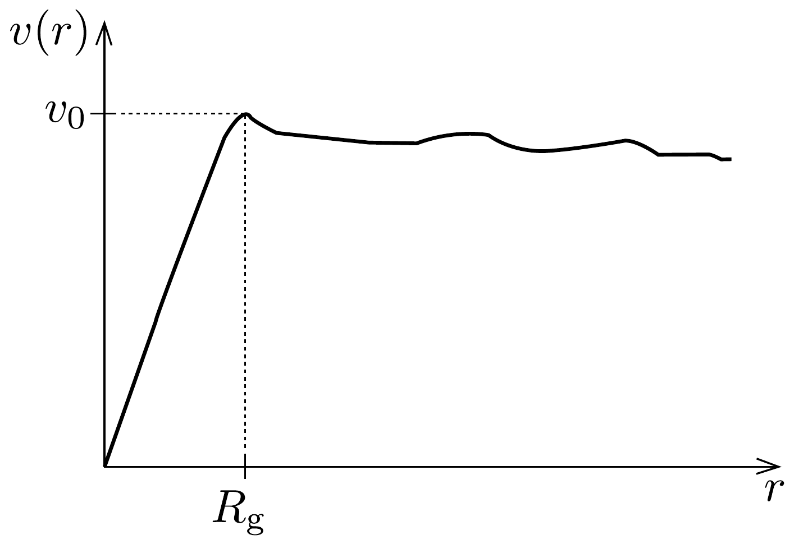

## Feladat 1

Sötétanyag
Először Fritz Zwicky következtetett a sötétanyag létére a mintegy ezer galaxisból álló Coma-galaxishalmaz dinamikájára vonatkozó megfigyelései alapján. Zwicky a viriáltétel segítségével becsülte meg a galaxishalmaz tömegét. Egy egyszerú nap-bolygó rendszerben, ahol a bolygó körpályán kering a nap körül, a viriáltétel közvetlen kapcsolatot teremt a bolygó mozgási és gravitációs potenciális energiája között. Azonban általában egy, valamilyen kölcsönhatással kötött sokrészecskerendszer esetén a viriáltétel a teljes mozgási energia időátlaga és a teljes potenciális energia időátlaga között teremt kapcsolatot.

Zwicky 1993-ban a Coma-galaxishalmaz szélénél lévő galaxisok sebességének megfigyelése alapján arra a következtetésre jutott, hogy a galaxishalmaz teljes tömege nagyobb, mint a (galaxisok formájában) megfigyelhető tömege. A látható galaxisok gravitációs vonzása ugyanis túl kevés volt a megfigyelt galaxissebességek létrehozásához. Tehát valamilyen rejtett tömeg jelenléte okozza a nagy sebességet. Ez a rejtett tömeg a sötétanyag tömege. A következőkben feltételezzük, hogy a galaxisok tömegét a látható tömegük és a velük együtt mozgó sötétanyag tömegének összege adja, és a sötétanyag a látható anyaggal csak a gravitáción keresztül lép kölcsönhatásba.

\section*{A rész. Galaxishalmaz}

Tekintsünk egy $R$ sugarú, gömb alakú galaxishalmazt, amely nagy $N$ számú galaxisból és sötétanyagból áll, melyek homogén módon töltik ki a gömböt. A halmaz teljes tömege (galaxisok és sötétanyag együtt) legyen $M$. Jelölje $m$ egy galaxis átlagos teljes tömegét (látható és sötétanyagból származót együtt).
1.A.1. Feltételezve, hogy a galaxishalmaz anyaga folytonos eloszlású, adjuk meg a galaxishalmaz teljes gravitációs potenciális energiáját $M$ és $R$ segítségével!

Az Univerzum általános tágulása miatt a távoli objektumok távolodnak a Földtől és a távolódás sebessége a Földtől mért távolságuktól függ. A galaxishalmaz $i$-edik galaxisában $(i=1, \ldots, N)$ lévő, IA típusú szupernova egyik Lymanfrekvenciáját (bizonyos átmenethez tartozó frekvencia a hidrogén emissziós spektrumában) a Földről megfigyelve $f_{i}$-nek látjuk, míg ugyanez a Lyman-frekvencia földi laboratóriumban mérve $f_{0}$.
1.A.2. Határozzuk meg a teljes galaxishalmaz Földtől való $V_{\mathrm{cr}}$ átlagos távolodási sebességét az $f_{i}, f_{0}$ és $N$ paraméterekkel kifejezve! A galaxisok sebessége sokkal kisebb a $c$ fénysebességnél.
1.A.3. Feltehetjük, hogy a galaxisoknak a galaxishalmaz tömegközéppontjához viszonyított relatív sebessége izotróp (irányfüggetlen). Határozzuk meg a ga-
laxishalmaz tömegközéppontjához viszonyítva a galaxisok sebességének $v_{\text {rms }}$ négyzetes középértékét (négyzetek átlagának négyzetgyökét) az $N, f_{i}$ és $f_{0}$ mennyiségekkel kifejezve! Ennek felhasználásával adjuk meg egy galaxis átlagos mozgási energiáját a halmaz tömegközéppontjához viszonyítva $v_{\text {rms }}$ és $m$ mennyiségekkel!

A galaxishalmaz teljes tömegének meghatározásához a viriáltételt használjuk. A tétel szerint egy konzervatív eró által kötött részecskerendszerben
\[
\langle K\rangle_{t}=-\gamma\langle U\rangle_{t},
\]
ahol $\langle K\rangle_{t}$ a teljes mozgási energia, $\langle U\rangle_{t}$ pedig a teljes potenciális energia időátlaga és $\gamma$ egy állandó. A tétel abból a feltevésből vezethető le, hogy a kölcsönhatással kötött rendszerben minden részecske helyvektora és impulzusa véges, ezért a
\[
\Gamma=\sum_{i} \boldsymbol{p}_{i} \cdot \boldsymbol{r}_{i}
\]
módon definiált mennyiség is véges.
1.A.4. Felahsználva, hogy a $\mathrm{d} \Gamma / \mathrm{d} t$ mennyiség hosszú időre vett időátlaga zérus, azaz $\langle\mathrm{d} \Gamma / \mathrm{d} t\rangle_{t}=0$, határozzuk meg a fenti viriáltételben szereplő $\gamma$ állandó értékét gravitációs kölcsönhatás esetén!

Útmutatás: Megpróbálhatjuk úgy megoldani a feladatot, hogy a $\Gamma$-ban szereplő összegzésnél csak kis számú galaxist veszünk figyelembe.
1.A.5. Az előző eredmények felhasználásával határozzuk meg a galaxishalmaz teljes sötétanyagtömegét az $N, R, v_{\text {rms }}$ és $m_{\mathrm{g}}$ mennyiségekkel kifejezve, ahol $m_{\mathrm{g}}$ a galaxis átlagos látható tömege! A sötétanyag sebességének négyzetes középértéke megyegyezik a galaxisokéval.

B rész. Sötétanyag a galaxisban
A sötétanyag jelen van a galaxisunkon belül és körülötte is. Tekintsünk egy gömb alakú galaxist, és legyen a galaxis látható peremének sugara $R_{\mathrm{g}}$. (A látható perem sugara az a legnagyobb sugár, ahol még sok csillag látható. Megjegyezzük, hogy az $R_{\mathrm{g}}$ sugáron kívül is található néhány csillag.) Tegyük fel, hogy a galaxis csillagjai pontszerú részecskék, melyek átlagos tömege $m_{\mathrm{s}}$. Feltételezzük továbbá, hogy a galaxison belül a csillagok körpályán keringenek, homogén módon helyezkednek el, valamint az egységnyi térfogatra eső számuk $n$.
1.B.1. Feltételezve, hogy a galaxis csak csillagokból áll, határozzuk meg a galaxis középpontjától $r$ távolságban keringő csillagok $v(r)$ sebességét és ábrázoljuk vázlatosan $v(r)$-t $r<R_{\mathrm{g}}$ és $r \geq R_{\mathrm{g}}$ esetén!

A sötétanyag jelenlétére a galaxisban megfigyelt $v(r)$ függvény alakjából lehet következtetni. Ezt a függvényt a galaxis forgási görbéjének nevezzük. A 392, ábra egy tipikus, megfigyelésből származó görbét mutat. Egyszerúsítésképp feltételezzük, hogy $v(r)$ lineáris függvény $r \leq R_{\mathrm{g}}$ esetén, és konstans $v_{0}$ értékú $r \geq R_{\mathrm{g}}$ esetén.
1.B.2. Határozzuk meg a galaxis $R_{\mathrm{g}}$ sugáron belüli részének teljes $m_{R}$ tömegét $v_{0}$ és $R_{\mathrm{g}}$ mennyiségekkel kifejezve!

Az 1.B.1. feladatra kapott függvény és a 392 ábra közötti eltérés mutatja a sötétanyag jelenlétét.
1.B.3. Határozzuk meg a sötétanyag súrúségét mint $r, R_{\mathrm{g}}, v_{0}, n$ és $m_{\mathrm{s}}$ függvényét $r<R_{\mathrm{g}}$ és $r \geq R_{\mathrm{g}}$ esetén!

C rész. Csillagközi gáz és sötétanyag
Most tekintsünk egy fiatal galaxist, amelynek tömegét fóként csillagközi gáz és sötétanyag adja (tehát a csillagok tömege elhanyagolható). A csillagközi gáz azonos, $m_{\mathrm{p}}$ tömegú részecskékből áll. A gáz $n(r)$ részecskeszám-súrúsége, valamint $T(r)$ hőmérséklete függ a galaxis középpontjától mért $r$ távolságtól. Bár sok fizikai folyamat megy végbe a csillagközi gázban, feltehetjük, hogy a gáz hidrosztatikai egyensúlyban van, azaz saját nyomása egyensúlyt tart a galaxis gravitációs vonzásával.
1.C.1. Határozzuk meg a csillagközi gázban a $\mathrm{d} p / \mathrm{d} r$ nyomásgradienst az $m^{\prime}(r), r$ és $n(r)$ mennyiségekkel kifejezve! $m^{\prime}(r)$ a gáz és a sötétanyag együttes tömege a galaxis középpontja körüli $r$ sugarú gömbön belül.
1.C.2. Feltételezve, hogy a csillagközi gáz ideális gáz, fejezzük ki az $m^{\prime}(r)$ függvényt az $n(r), T(r)$ függvényekkel és $r$ szerinti deriváltjaikkal!

Most az egyszerúség kedvéért tételezzük fel, hogy a csillagközi gáz hőmérséklete $T_{0}=$ állandó, és a részecskeszám-súrúséget az
\[
n(r)=\frac{\alpha}{r(\beta+r)^{2}}
\]
formula adja meg, ahol $\alpha$ és $\beta$ konstansok.
1.C.3. Határozzuk meg a sötétanyag súrúségét $r$ függvényében a galaxison belül!
