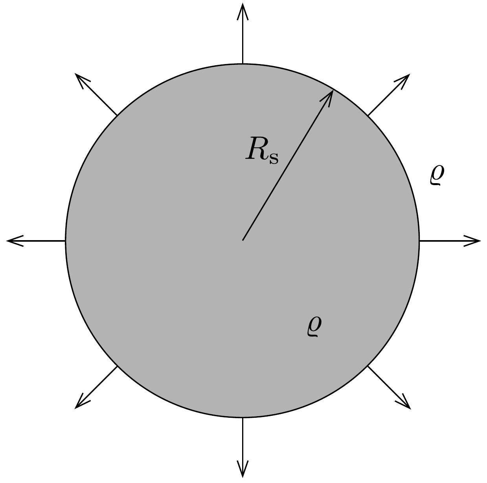

## Feladat 3

A kozmikus infláció
A Földről megfigyelt galaxisok relatív mozgása miatt az egyes galaxisok látható fény spektrumának hullmhossza az eredeti hullámhossztól eltérő. Ez az elektromágneses Doppler-jelenség. Egy galaxishalmaz esetén a hullámhosszeltolódások véletlenszerú eloszlását várjuk: valamelyik pozitív (vöröseltolódás), valamelyik negatív (kékeltolódás). Azonban a megfigyelések szerint a közeli galaxisok csoportját leszámítva minden esetben az eltolódás a vörös irányába történik. Ennek igaznak kell lennie akkor is, ha a megfigyelést az Univerzum más pontján végezzük. Ebből
az következik, hogy az Univerzum tágul. Másrészt az Univerzum lokális szabálytalanságától 100 Mpc-nél (megaparszek) nagyobb távolsági skálákon eltekinthetünk $(1 \mathrm{pc}=3,26$ fényév). Nagyobb skálákra átlagolva a galaxisok csomósodó eloszlása egyre inkább izotróp (irányfüggetlen) és homogén (helyfüggetlen) lesz. Ezért feltételezhetjük, hogy az Univerzum anyaga egyenletes $\varrho$ tömegsürúséggel rendelkezik és tágul.

\section*{A rész. Az Univerzum tágulása}

Az Univerzum egyszerú modelljének tekintsünk egy táguló, egyenletes súrúségú gömböt, ami egy sokkal nagyobb sugarú, az előzővel azonos súrúségú gömbbe van helyezve. Egy adott időpontban a gömb sugara legyen $R_{\mathrm{s}}$ (398. ábra). A gömb tágulását a sugár $R(t)$ időfüggésével adhatjuk meg az $a(t)$ skálafaktorral kifejezve, azaz $R(t)=a(t) R_{\mathrm{s}}$.

Ha a Newton-féle gravitációs törvényt felhasználjuk az univerzummodellünkben szereplő gömb felületén egy tömegelem sebességének vizsgálatához, megkaphatjuk az első Friedmann-egyenletet:
\[
\left(\frac{\dot{a}}{a}\right)^{2}=A_{1} \varrho(t)-\frac{k c^{2}}{R_{\mathrm{s}}^{2} a(t)^{2}},
\]
ahol $k$ dimenzió nélküli állandó.
3.A.1. Határozzuk meg a (17-1) egyenletben található $A_{1}$ állandót!

Az eddigi tárgyalás nemrelativisztikus volt. Azonban kiterjeszthetó relativisztikus rendszerre is, ha a $\varrho(t) c^{2}$-et a teljesenergia-súrúséggel azonosítjuk (ami nem tartalmazza a gravitációs potenciális energiát). Ebben a relativisztikus modellben felhasználva a termodinamika elsó főtételét adiabatikus rendszerre, megkapható a második Friedmann-egyenlet:
\[
\dot{\varrho}+A_{2}\left(\varrho+\frac{p}{c^{2}}\right) \frac{\dot{a}}{a}=0,
\]
ahol $c$ a fénysebesség és $p$ pedig a gömbben lévő nyomás.
3.A.2. Határozzuk meg a (17-2) egyenletben található $A_{2}$ állandót!

A (17-1) és (17-2) egyenletek megoldásához fel kell tételezni valamilyen $p=$ $=p(\varrho)$ összefüggést. Legyen ez a $p(t) / c^{2}=w \varrho(t)$, ahol $w$ egy állandó. A $H=\dot{a} / a$ kifejezés a Hubble-paraméter. A paraméterek jelenlegi értékeit rendszerint a 0 alsó index jelöli, tehát $t_{0}, \varrho_{0}, H_{0}, a_{0}$, stb. Az egyszerúség kedvéért legyen $a_{0}=1$.

Úgy gondoljuk, hogy az Univerzum egy nagy robbanásban, az Ốsrobbanásban (Big Bang) keletkezett, ami relativisztikus részecskék sugárzásával járt együtt. Az Univerzum a tágulása során lehúl, és a részecskék nemrelativisztikussá válnak benne. Ugyanakkor a legújabb megfigyelések arra utalnak, hogy jelenleg az Univerzumban az állandó kozmológiai energiasúrúség dominál. Foton esetén a foton hullámhossza a skálafaktorral arányosan növekszik, ahogy az Univerzum tágul.
3.A.3. A következő három esetben határozzuk meg $w$ értékét: $(i)$ az Univerzumban csak sugárzás található (azaz csak fotonok), (ii) az Univerzumot csak nemrelativisztikus anyag tölti ki, (iii) az Univerzumban állandó az energiasúrúség!
3.A.4. A $k=0$ értékre határozzuk meg $a(t)$-t a 3.A.3. feladatban említett összes, (i)-(iii) esetre! Az (i) és (ii) esetben az $a(t=0)=0$ kezdeti feltételt, míg a (iii) esetben az $a_{0}=1$ feltételt használjuk.

A (17-1) egyenletben lévő $k$ állandó az Univerzum térbeli geometriájának osztályozására utal. Az értéke lehet $k=+1$ pozitív görbületú (zárt) univerzumra, $k=0$ sík (végtelen) univerzumra és $k=-1$ negatív görbületú (nyitott, végtelen) univerzumra. Legyen $\Omega=\varrho / \varrho_{\mathrm{c}}$, ahol $\varrho_{\mathrm{c}}=H^{2} / A_{1}$ a kritikus energiasúrúség. Megjegyezzük, hogy $A_{1}$-et a 3.A.1. feladatból kaptuk meg.
3.A.5. Fejezzük ki a (17-1) egyenletben lévő $k$-t $\Omega, H, a$ és $R_{0}$ függvényében!
3.A.6. Milyen tartományba eshet $\Omega$, ha $k=+1, k=0$ és $k=-1$ ?

B rész. Az inflációs fázis bevezetésének motivációja és annak általános feltételei

A mikrohullámú kozmikus háttérsugárzás (CMB - cosmic microwave background) megfigyelése azt sugallja, hogy jelenleg az Univerzum nagyjából sík. Azonban ha ez igaz, akkor kezdetben az Univerzumnak tökéletesen síknak kellett lennie, ellenkezó esetben bármilyen síktól való eltérés előbb-utóbb idővel megnövekedne, ami a jelenlegi sík tulajdonságot elrontaná.
3.B.1. Határozzuk meg az $(\Omega(t)-1)$ időfüggését olyan univerzumra, amelyben a sugárzás vagy a nemrelativisztikus anyag dominál (lásd a 3.A.3. feladatot)!

Ahhoz, hogy a fenti problémán felülkerekedjünk, az Univerzumnak a korai fejlődési időszakában egy állandó energiasúrúség által dominált perióduson kellene átmennie. Ez egy exponenciális táguláshoz vezet, amit inflációs periódusnak (felfúvódó fázisnak) nevezünk.
3.B.2. Erre az állandó energiasúrúség által dominált periódusra határozzuk meg az $(\Omega(t)-1)$ időfüggését! Tegyük fel, hogy $(\Omega(t)-1) \ll 1$.
3.B.3. Mutassuk meg, hogy az infláció feltétele számos feltételt von maga után: negatív nyomást, gyorsuló tágulást $(\ddot{a}>0)$ és Hubble-sugár csökkenést $\left(\mathrm{d}(a H)^{-1} / \mathrm{d} t<0\right)!$
3.B.4. Mutassuk meg, hogy a Hubble-sugár csökkenésére vonatkozó feltétel kifejezhetó az $\varepsilon=-\dot{H} / H^{2}$ paraméterrel mint $\varepsilon<1$ !

Az infláció addig tart, amíg $\varepsilon<1$, és akkor ér véget, amikor $\varepsilon=1$. Definiáljuk az $N$ „e-szerezési” számot úgy, hogy $\mathrm{d} N=\mathrm{d}(\ln a)=H \mathrm{~d} t$ és $N=0$ az infláció végén.

C rész. Homogén eloszlású anyag által létrehozott infláció
Az inflációs periódust létrehozó fizikai rendszerre példa egy olyan univerzum, amiben a homogén eloszlású anyag dominál. Az ilyen anyagot inflatonnak nevezik és egy $\phi(t)$ függvénnyel jellemezhető.

Az anyag dinamikai egyenlete a
\[
\ddot{\phi}+3 H \dot{\phi}=-V^{\prime}
\]
kifejezéssel adható meg, ahol $V=V(\phi)$ a potenciálfüggvény és $V^{\prime}=\partial V / \partial \phi$. A Hubble-paraméter kielégíti a
\[
H^{2}=\frac{1}{3 M_{\mathrm{pl}}^{2}}\left(\frac{1}{2} \dot{\phi}^{2}+V\right)
\]
egyenletet, ahol $M_{\mathrm{pl}}$ egy állandó, amit redukált Planck-tömegnek neveznek. Inflációs periódus akkor alakul ki, amikor elegendő ideig a $V$ potenciális energia dominál a $\dot{\phi}^{2} / 2$ kinetikus energia mellett, azaz a (17-3) egyenletben lévő, $\ddot{\phi}$-ot tartalmazó tag elhanyagolható. Ezt nevezik „slow-roll” (lassan haladó/gördülő) közelítésnek.

Az $\varepsilon$ és az $\eta_{V}=\delta+\varepsilon$ mennyiségeket, ahol $\delta=-\ddot{\phi} /(H \dot{\phi})$, „slow-roll” paramétereknek nevezik.
3.C.1. Közelítőleg adjuk meg az $\varepsilon, \eta_{V}$ paraméterek és a $\mathrm{d} N / \mathrm{d} \phi$ kifejezéseit a $V(\phi)$ potenciállal, valamint a potenciál elsó és második deriváltjaival ( $V^{\prime}$ és $V^{\prime \prime}$ )!

D rész. Infláció egyszerũ potenciállal
Minden inflációs modell jóslatait össze kell hasonlítani a CMB-ből megfigyelhető megszorításokkal, amelyek a következők: $n_{\mathrm{s}}=0,968 \pm 0,006$ és $r<0,12$, ahol $r=16 \varepsilon$ és $n_{\mathrm{s}}=1+2 \eta_{V}-6 \varepsilon$ az anyag által dominált inflációs modellben a $\phi=\phi_{\text {kezdeti }}$ helyen kiértékelve. Tegyük fel, hogy az anyaghoz tartozó potenciál az egyszerú $V(\phi)=\Lambda^{4}\left(\frac{\phi}{M_{\mathrm{pl}}}\right)^{n}$, ahol $n$ bármilyen egész szám és $\Lambda$ állandó.
3.D.1. Számítsuk ki $\phi_{\text {vég }}$-et az inflációs szakasz végén!
3.D.2. Fejezzük ki az $r$ és $n_{\mathrm{s}}$ mennyiségeket az $N$ e-szerezési szám és az $n$ egész függvényében! Becsüljük meg $n$ értékét úgy, hogy az $r$ és az $n_{\mathrm{s}}$ mennyiségek a legjobban közelítsék meg a megfigyelt értékeket! A számoláshoz használjuk az $N=60$ értéket.
