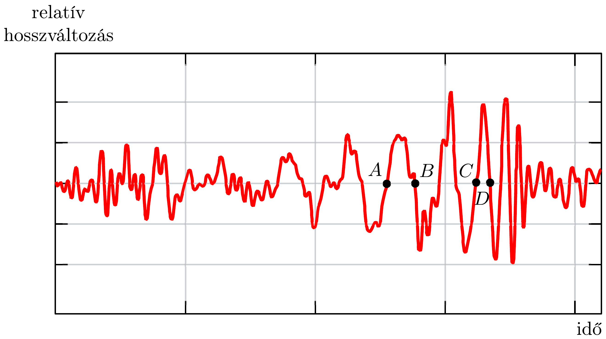

## Feladat 1

LIGO-GW150914

A Földön keresztülhaladó gravitációs hullámokat (gravitational wave, GW) először a LIGO obszervatóriumban észlelték 2015-ben. A GW150904-nek elnevezett eseményt két egymás körül közelítőleg körpályán keringó fekete lyuk által keltett gravitációs hullámok váltották ki. Ebben a feladatban ennek a feketelyukrendszernek néhány fizikai paraméterét kell megbecsülni az észlelt jelek alapján.

A rész. Newtoni (konzervatív) pályák
1.A.1. Tekintsünk egy, két csillagból álló rendszert, ahol a csillagok tömege $M_{1}, M_{2}$, pozíciójuk pedig a tömegközépponti rendszerben $\boldsymbol{r}_{1}, \boldsymbol{r}_{2}$, tehát
\[
M_{1} \boldsymbol{r}_{1}+M_{2} \boldsymbol{r}_{2}=0 .
\]

A két csillag el van szigetelve a világegyetem többi részétől, és nemrelativisztikus sebességgel mozog. A Newton-törvények segítségével az $M_{1}$ tömeg gyorsulásvektora kifejezhető a
\[
\frac{\mathrm{d}^{2} \boldsymbol{r}_{1}}{\mathrm{~d} t^{2}}=-\alpha \frac{\boldsymbol{r}_{1}}{r_{1}^{n}},
\]
alakban, ahol $r_{1}=\left|\boldsymbol{r}_{1}\right|, r_{2}=\left|\boldsymbol{r}_{2}\right|$. Határozzuk meg az $n \in \mathbb{N}$ és az $\alpha=$ $=\alpha\left(G, M_{1}, M_{2}\right)$ mennyiségeket, ahol $G \simeq 6,67 \times 10^{-11} \mathrm{Nm}^{2} \mathrm{~kg}^{-2}$ a gravitációs állandó!
1.A.2. Körpályák esetén a két tömegpontból álló rendszer teljes energiája
\[
E=A(\mu, \Omega, L)-G \frac{M \mu}{L},
\]
alakú, ahol
\[
\mu \equiv \frac{M_{1} M_{2}}{M_{1}+M_{2}}, \quad M \equiv M_{1}+M_{2}
\]
rendre a rendszer redukát tömege és teljes tömege, $\Omega$ mindkét tömegpont szögsebessége, $L$ pedig a tömegpontok egymástól mért távolsága, $L=r_{1}+r_{2}$. Határozzuk meg az $A(\mu, \Omega, L)$ együttható konkrét alakját!
1.A.3. A (18-3) egyenlet az $E=\beta G \frac{M \mu}{L}$ egyszerúbb alakban is felírható. Határozzuk meg a $\beta$ számot!

B rész. A relativisztikus disszipáció figyelembevétele
A gravitáció pontos leírását Einstein adta meg 1915-ben az Általános Relativitáselméletben, ami szerint a gravitációs hatás fénysebességgel terjed. A gravitációs

kölcsönhatás közvetítői a gravitációs hullámok. A gravitációs hullámokat gyorsuló tömegek bocsátják ki, miközben a kibocsátó rendszer energiája csökken.

Tekintsünk egy, két tömegpontból álló rendszert, ami el van szigetelve a világegyetem többi részétől. Einstein megmutatta, hogy elegendően kis sebességek esetén a kibocsátott gravitációs hullámokra teljesül, hogy: 1) frekvenciájuk a tömegpontok keringési frekvenciájának kétszerese; 2) a rendszer gravitációs luminozitását, azaz a gravitációs hullámok formájában kibocsátott $\mathcal{P}$ teljesítményt az Einstein-féle kvadrupól formulával leírható tag dominálja:
\[
\mathcal{P}=\frac{G}{5 c^{5}} \sum_{i=1}^{3} \sum_{j=1}^{3}\left(\frac{\mathrm{~d}^{3} Q_{i j}}{\mathrm{~d} t^{3}}\right)\left(\frac{\mathrm{d}^{3} Q_{i j}}{\mathrm{~d} t^{3}}\right),
\]
ahol $c$ a fénysebesség, $c \simeq 3 \times 10^{8} \mathrm{~m} / \mathrm{s}$. Két, egymás körül az $x-y$ síkban keringő tömegpontból álló rendszer esetén a $Q_{i j}$ elemeket a következő formulák adják meg $(i, j$ a sor-, oszlopindexek):
\[
\begin{array}{ll}
Q_{11}=\sum_{A=1}^{2} \frac{M_{A}}{3}\left(2 x_{A}^{2}-y_{A}^{2}\right), & Q_{22}=\sum_{A=1}^{2} \frac{M_{A}}{3}\left(2 y_{A}^{2}-x_{A}^{2}\right), \\
Q_{33}=-\sum_{A=1}^{2} \frac{M_{A}}{3}\left(x_{A}^{2}+y_{A}^{2}\right), & Q_{12}=Q_{21}=\sum_{A=1}^{2} M_{A} x_{A} y_{A},
\end{array}
\]
és $Q_{i j}=0$ minden más esetben. Ezekben $\left(x_{A}, y_{A}\right)$ az $A$ tömegpont pozíciója a tömegközépponti koordináta-rendszerben.
1.B.1. Az 1.A.2. részfeladatban szereplő körpályák esetében a $Q_{i j}$ elemek a következő alakban adhatók meg a $t$ idő függvényében:
\[
Q_{i i}=\frac{\mu L^{2}}{2}\left(a_{i}+b_{i} \cos k t\right), \quad Q_{i j} \stackrel{i \neq j}{=} \frac{\mu L^{2}}{2} c_{i j} \sin k t .
\]

Határozzuk meg $k$-t $\Omega$ függvényében, valamint adjuk meg az $a_{i}, b_{i}, c_{i j}$ állandók számértékét!
1.B.2. Számoljuk ki a vizsgált rendszer által gravitációs hullámok formájában kibocsátott $\mathcal{P}$ teljesítményt, és az eredményt írjuk fel a
\[
\mathcal{P}=\xi \frac{G}{c^{5}} \mu^{2} L^{4} \Omega^{6},
\]
alakban! Mennyi a $\xi$ együttható értéke? (Ha nem sikerül meghatározni $\xi$-t, akkor a következőkben használjuk a $\xi=6,4$ értéket.)
1.B.3. Gravitációs hullámok kibocsátásának hiányában a két tömegpont végtelen hosszú időn keresztül állandó körpályán kering egymás körül. Azonban a gravitációs hullámok kibocsátásával a rendszer energiája csökken, és ennek következtében lassan csökken a körpályák sugara is.

Mutassuk meg, hogy a keringési szögsebesség $\frac{\mathrm{d} \Omega}{\mathrm{d} t}$ változási sebessége az
\[
\left(\frac{\mathrm{d} \Omega}{\mathrm{~d} t}\right)^{3}=(3 \xi)^{3} \frac{\Omega^{11}}{c^{15}}\left(G M_{\mathrm{c}}\right)^{5},
\]
egyenlettel írható le, ahol $M_{\mathrm{c}}$ az úgynevezett chirp tömeg! Adjuk meg $M_{\mathrm{c}}-\mathrm{t} M$ és $\mu$ függvényeként! Ez a tömeg határozza meg a keringési frekvenciának a pályasugár csökkenésével járó növekedését. (A „chirp", magyarul „csiripelés” elnevezést a magas, növekvő frekvenciájú jel madárfiókák csiripeléshez való hasonlósága indokolja.)
1.B.4. Az előzőek alapján adjuk meg a kapcsolatot az $\Omega$ keringési szögsebesség és a gravitációs hullámok $f_{\mathrm{GW}}$ frekvenciája között! Ismert, hogy ha egy sima $F(t)$ függvényre $a \neq 1$ esetén teljesül, hogy
\[
\frac{\mathrm{d} F(t)}{\mathrm{d} t}=\chi F(t)^{a} \quad \Rightarrow \quad F(t)^{1-a}=\chi(1-a)\left(t-t_{0}\right),
\]
ahol $\chi$ konstans, és $t_{0}$ egy másik (integrálási) állandó. Ezt használva mutassuk meg, hogy a (18-4) formulából a gravitációs hullámok frekvenciájára a
\[
f_{\mathrm{GW}}^{-8 / 3}=8 \pi^{8 / 3} \xi\left(\frac{G M_{\mathrm{c}}}{c^{3}}\right)^{(2 / 3)+p}\left(t_{0}-t\right)^{2-p}
\]
formula adódik, és határozzuk meg a $p$ állandót!
2015. szeptember 14-én a LIGO, ami két 4 km hosszú, L-alakban elhelyezkedő karból áll, észlelte a GW150914 jelet. A karok relatív hossza a 405. ábrán látható módon változott meg. Az $A, B, C, D$ pontok rendre a $t=0,000 ; 0,009 ; 0,034$; 0,040 másodperchez tartoznak. A detektor karjai egyenesen arányosan reagálnak az áthaladó gravitációs hullámra, így az észlelt jel alakja hasonló a gravitációs hullám formájához. A hullámokat két, egymás körül közelítőleg kör alakú pályán keringő fekete lyuk keltette; a gravitációs sugárzás miatti energiacsökkenés a pályák sugarának csökkenéséhez és végül a két fekete lyuk ütközéséhez vezetett. A 405. ábrán az ütközés pillanata nagyjából a jel $D$ pont utáni csúcsánál van.
1.B.5. Az ábra alapján határozzuk meg az $f_{\mathrm{GW}}(t)$ frekvenciát a
\[
t_{\overline{\mathrm{AB}}}=\frac{t_{\mathrm{B}}+t_{\mathrm{A}}}{2} \quad \text { és } \quad t_{\overline{\mathrm{CD}}}=\frac{t_{\mathrm{D}}+t_{\mathrm{C}}}{2}
\]
időpillanatokban! Feltételezve, hogy a (18-5) formula alkalmazható egészen az ütközés pillanatáig (ami szigorúan véve nem igaz), és feltételezve, hogy a két fekete lyuk tömege azonos, becsüljük meg a rendszer $M_{\mathrm{c}}$ chirp tömegét és teljes tömegét naptömeg, azaz $M_{\odot} \simeq 2 \times 10^{30} \mathrm{~kg}$ egységben!
1.B.6. Becsüljük meg a két fekete lyuk minimális távolságát a $t_{\overline{\mathrm{CD}}}$ időpillanatban! Ennek alapján adjunk egy $R_{\text {max }}$ felső korlátot az objektumok sugarára! Vessük össze a kapott eredményt a Nap $R_{\odot} \simeq 7 \times 10^{5} \mathrm{~km}$ sugarával, azaz adjuk

meg az $R_{\odot} / R_{\text {max }}$ arányt! Ezután határozzuk meg a vizsgált pillanatban az objektumok $v_{\mathrm{col}}$ keringési sebességét is, és hasonlítsuk össze a fénysebességgel, azaz adjuk meg $v_{\text {col }} / c$-t!

Végső következtetésként levonhatjuk, hogy a rendszert alkotó testek valóban nagyon gyorsan mozgó, nagyon kompakt objektumok.
