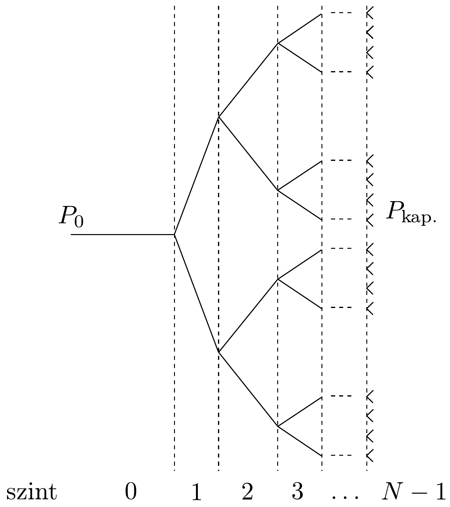
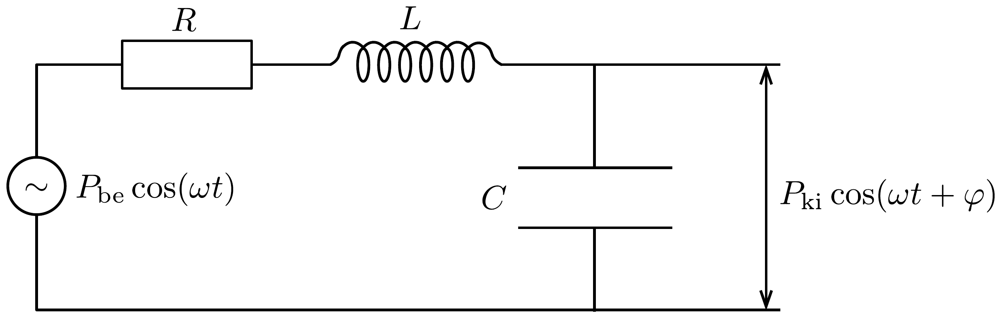
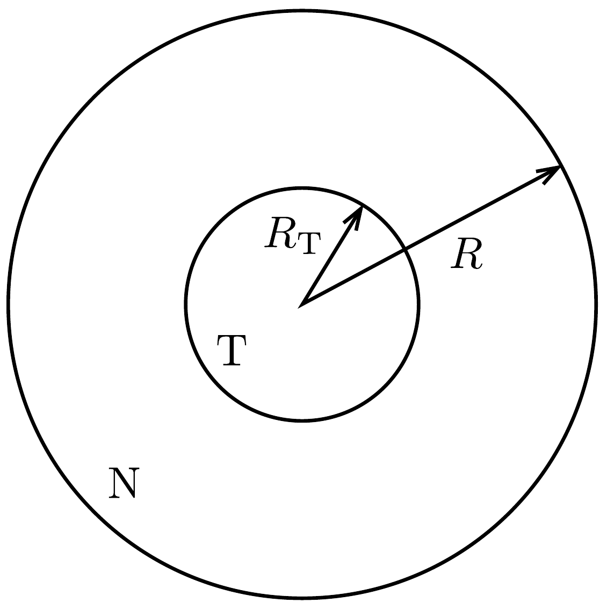

## Feladat 3

Élő rendszerek fizikája

Adat: a normál légköri nyomás: $P_{0}=1,013 \cdot 10^{5} \mathrm{~Pa}=760 \mathrm{mmHg}$.
A rész. A vér áramlásának fizikája
Ebben a részben az erekben történő véráramlás két egyszerúsített modelljét fogjuk vizsgálni.

A vérerek közelítőleg hengeresek. Az összenyomhatatlan folyadékok lamináris (nem turbulens), stacionárius áramlásánál egy merev falú, hengeres csőben a cső két végén lévó nyomás különbsége a következő kifejezéssel adható meg:
\[
\Delta P=\frac{8 \ell \eta}{\pi r^{4}} Q,
\]
ahol $\ell$ és $r$ a hengeres cső hossza és sugara, $\eta$ a folyadék viszkozitása és $Q$ a hozam, azaz a csó́ keresztmetszetén időegység alatt átáramló folyadék térfogata. Ez a kifejezés gyakran helyesen megadja a nyomáskülönbség nagyságrendjét, annak ellenére, hogy nem vesszük figyelembe a vér lüktető áramlását, az erek összenyomhatóságát és szabálytalan alakját, valamint a tényt, hogy a vér nem egy egyszerú folyadék, hanem sejtek és a vérplazma keveréke. Ráadásul ez a kifejezés ugyanolyan alakú, mint az Ohm-törvény, ahol a hozamot az elektromos áramerősség helyettesíti, a nyomáskülönbséget az elektromos feszültség, az $R=\frac{8 \ell \eta}{\pi r^{4}}$ tényezőt pedig az ellenállás.

Tekintsük példaképpen a kis ütőrek (arterioles) 408. ábrán látható szimmetrikus hálózatát - ezek szállítják a vért egy szövet hajszálérrendszeréhez (kapillárisaihoz). Ebben a hálózatban minden egyes bifurkációban az ér szétágazik két egyforma érre. Azonban a magasabb szintú erek vékonyabbak és rövidebbek: tételezzük fel, hogy két egymásutáni, $i$-edik és $(i+1)$-edik szint ereinek sugara és hossza az alábbi kapcsolatban van: $r_{i+1}=r_{i} / 2^{1 / 3}$ és $\ell_{i+1}=\ell_{i} / 2^{1 / 3}$.
3.A.1. Írjunk fel egy kifejezést az $i$-edik szinten lévő ér $Q_{i}$ hozamára a szintek $N$ számának, az $\eta$ viszkozitásnak, az első ér $r_{0}$ sugárnak és $\ell_{0}$ hosszának, valamint $\Delta P=P_{0}-P_{\text {kap }}$.-nak (azaz a 0. szintú érnél lévő $P_{0}$ és a hajszálérrendszernél lévő $P_{\text {kap. }}$ nyomások különbségének) a függvényében!
3.A.2. Számítsuk ki numerikusan a 0. szinten lévő kis ütőér $Q_{0}$ hozamát, ha ennek sugara $6,0 \cdot 10^{-5} \mathrm{~m}$ és hossza $2,0 \cdot 10^{-3} \mathrm{~m}$. Vegyük úgy, hogy a kis ütőérhálózat beömlőnyílásánál 55 mmHg a nyomás, a hálózatnak $N=6$ szintje van, és a kapillárisrendszer nyomása 30 mmHg . A vér viszkozitása $\eta=3,5 \cdot 10^{-3} \mathrm{~kg} \mathrm{~m}^{-1} \mathrm{~s}^{-1}$. Az eredményt ml/óra egységekben fejezzük ki.

Az erek mint egy RLC-áramkör
A merev falú, hengeres ér közelítés sok okból elégtelennek bizonyul. Különösen fontos figyelembe venni az áramlás időbeli változását és az erek átmérőjének

változását, amit a vér változó nyomása okoz a szív által végzett pumpálás egyegy periódusa alatt. Ezen kívül megfigyelték, hogy a nagy erekben a vér nyomása jelentősen változik egy ciklus során, míg a kisebb erekben a nyomásingadozás amplitúdója sokkal kisebb és az áramlás közel időfüggetlen.

Ha a nyomás megnő egy rugalmas érben, akkor megnő az átmérőóe, ami miatt több folyadékot tárolhat, majd továbbíthat, amikor a nyomás csökken. Így az ér rugalmas viselkedése úgy vehető figyelembe, hogy egy kondenzátort is hozzáadunk az eredeti leíráshoz. Ezen kívül, amikor az áramlás időfüggő, a folyadék $\varrho=$ $=1,05 \cdot 10^{3} \mathrm{~kg} \mathrm{~m}^{-3}$ súrúségével arányos lendületét is figyelembe kell venni. Ez a lendület egy induktív ellenállással vehető figyelembe a modellben. A 409. ábra mutatja egyetlen ér helyettesítő (ekvivalens) áramkörét. Az ekvivalens kapacitás és induktivitás:
\[
C=\frac{3 \ell \pi r^{3}}{2 E h} \quad \text { és } \quad L=\frac{9 \ell \varrho}{4 \pi r^{2}},
\]
ahol $h$ az ér falának vastagsága, és $E$ az ütőér Young-modulusa (amely meghatározza az ér méretváltozását erő hatására). A Young-modulus nyomás mértékegységú, nagysága pedig $E=0,06 \mathrm{MPa}$ a kis ütőrek esetében.
3.A.3. Határozzuk meg stacionárius esetben a $P_{\mathrm{ki}}$ nyomásamplitúdót az ér kiömlőnyílásánál a beömlőnyílásnál lévő $P_{\text {be }}$ nyomásamplitúdó, az $R$ ekvivalens ellenállás, az $L$ ekvivalens induktivitás és a $C$ ekvivalens kapacitás függvényében egy $\omega$ körfrekvenciájú áramlásnál! Írjunk fel $\eta, \varrho, E, h, r$ és $\ell$ között egy olyan feltételt, amely biztosítja, hogy kis frekvencián a kiömlőnyilásnál lévő nyomásamplitudó kisebb, mint $P_{\text {be }}$ !

3.A.4. A 3.A.2. feladatban szereplő érhálózatra becsüljük meg az ütőerek $h$ falvastagának maximális értékét úgy, hogy a 3.A.3. feladatban szereplő feltétel teljesüljön! (Tegyük fel, hogy $h$ szintfüggetlen.)

B rész. Daganatnövekedés
A daganat (tumor) növekedése nagyon összetett folyamat, amelyben a biológiai folyamatok, mint a sejtosztódás és a természetes szelekció, összefonódnak a fizikával. Ebben a feladatban a daganatnövekedés egy egyszerúsített modelljét vizsgáljuk, amelyben a szilárd daganatokban tapasztalható nyomásnövekedéssel foglalkozunk.

Tekintsünk a normál sejtek egy csoportját, melyek egy nyújthatatlan hártyával körbevett szövetet alkotnak. A hártya a szövetet mindig állandó, $R$ sugarú gömb formában tartja (410. ábra, N a normál sejtet, T a tumort jelöli).

Kezdetben a szövetben nincsen maradékfeszültség, azaz a nyomás minden pontban megegyezik a külső légnyomással.

A $t=0$ pillanatban a daganat (tumor) elkezd nőni ennek a gömbnek a középpontjában, és ahogy növekszik, a szövet belsejében megnő a nyomás. Tegyük fel,
hogy mindkét szövet (normál és tumor) összenyomható, és $\varrho_{\mathrm{N}}$ illetve $\varrho_{\mathrm{T}}$ sürüségük lineárisan növekszik a nyomással:
\[
\varrho_{\mathrm{N}}=\varrho_{0}\left(1+\frac{p}{K_{\mathrm{N}}}\right), \quad \varrho_{\mathrm{T}}=\varrho_{0}\left(1+\frac{p}{K_{\mathrm{T}}}\right),
\]
ahol $\varrho_{0}$ a szövet nyugalmi súrúsége, $p$ a nyomáskülönbség a légköri nyomáshoz képest, és $K_{\mathrm{N}}, K_{\mathrm{T}}$ a normál szövet, illetve a tumorszövet kompressziómodulusa. Általában a daganatok merevebbek, és így nagyobb a kompressziómodulusuk.
3.B.1. A normál sejtek tömege nem változik miközben a daganat növekszik. Határozzuk meg a daganat térfogatának és a teljes szövettérfogatnak a $v=V_{\mathrm{T}} / V$ hányadosát a daganat tömegének és a normál szövet tömegének $\mu=M_{\mathrm{T}} / M_{\mathrm{N}}$ hányadosa és a kompressziómodulusok $\kappa=K_{\mathrm{N}} / K_{\mathrm{T}}$ hányadosának függvényében!

A hyperthermiát néha együtt használják a kemoterápiával és radioterápiával a rákgyógyításban. A hyperthermiában a ráksejteket szelektíven felmelegítik a 37 °C-os normál testhőmérsékletről 43 °C fölé, amivel elpusztítják őket. A kutatók jelenleg olyan szénnanocsövecskéket fejlesztenek ki, melyeket az óket bevonó speciális fehérje a tumorsejtekhez képes kapcsolni. Ha a szövetet közeli infravörös sugárzással besugározzák, akkor a nanocsövek sokkal nagyobb mértékben abszorbeálják a sugárzást, mint a környező szövet, és így szelektíven felmelegíthetők - velük együtt pedig a daganatsejtek is, amelyekhez kapcsolódnak.

Tegyük fel, hogy a daganat, a normál sejtek és a környező szövet egyforma, $k$ hővezetési tényezővel rendelkezik, azaz ennek a feladatnak a geometriája szerint az az energia, amely időegységenként és felületegységenként áthalad egy $r$ sugarú gömbfelületen egyenlő a hőmérséklet $r$ szerinti deriváltjának $k$-szorosával. A nanocsövecskék egyenletesen vannak elosztva a daganat térfogatában és térfogategységenként $\mathcal{P}$ teljesítménnyel képesek hốt felszabadítani. Tegyük fel, hogy a tumortól nagyon távol a hőmérséklet megegyezik a normál emberi testhőmérséklettel.
3.B.2. Határozzuk meg állandósult állapotban a hőmérsékletet a daganat középpontjában $\mathcal{P}, k$, az emberi testhőmérséklet és a daganat $R_{\mathrm{T}}$ sugarának függvényében!
3.B.3. Határozzuk meg a $\mathcal{P}_{\text {min }}$ minimális térfogategységre esó teljesítményt, amely ahhoz kell, hogy egy 5,0 cm sugarú daganat minden sejtjét 43,0 °C-nál magasabb hőmérsékletre melegítse! A szövet hóvezetési tényezője $k=0,60 \mathrm{~W}$ $\mathrm{K}^{-1} \mathrm{~m}^{-1}$.

Tegyük fel, hogy egy daganatot egy, a 3.A.1. feladatban szereplő, elágazó szerkezetú érhálózat lát el vérrel. A növekedő daganatban, amikor a $p$ nyomás nagyobbá válik a legvékonyabb erekben lévő $P_{\text {kap }}$. nyomásnál, az ér sugara egy kicsiny $\delta r$ értékkel lecsökken. Ha ez a nyomás elér egy kritikus $p_{\mathrm{c}}$ értéket (amelyhez $\delta r_{\mathrm{c}}$ sugárcsökkenés tartozik), a legvékonyabb erek összeomlanak, ami komolyan veszélyezteti a daganat vérellátását. A nyomás- és sugárváltozás kapcsolatát a következő fenomenológikus összefüggés adja meg:
\[
\frac{p}{P_{\text {kap. }}}-1=\left(\frac{p_{\mathrm{c}}}{P_{\text {kap. }}}-1\right)\left(2-\frac{\delta r}{\delta r_{\mathrm{c}}}\right) \frac{\delta r}{\delta r_{\mathrm{c}}} .
\]

Tegyük fel, hogy csak a legvékonyabb erek ( $(N-1)$-edik szint) sugara változik meg, amikor a daganat megnöveli a nyomását.
3.B.4. Fejezzük ki a lineáris tartományban (azaz amikor $p-P_{\text {kap. }}$ nagyon kicsi) a hozam $\frac{\delta Q_{N-1}}{Q_{N-1}}$ relatív csökkenését ezekben az erekben, a daganatot jellemző $v=V_{\mathrm{T}} / V$ térfogathányados, valamint $K_{\mathrm{N}}, N, p_{\mathrm{c}}, \delta r_{\mathrm{c}}, r_{N-1}, P_{\text {kap }}$. függvényében!
