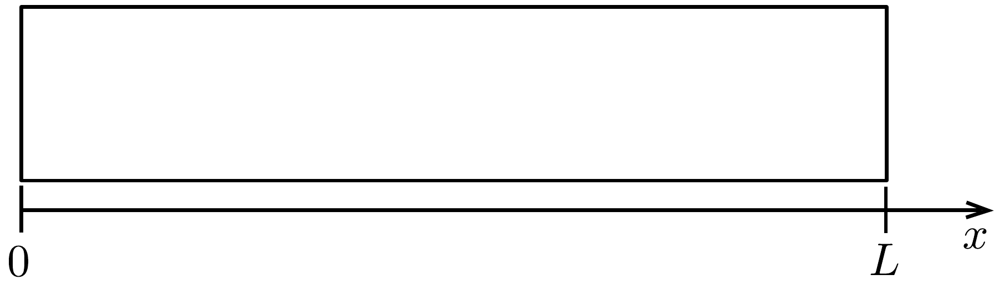
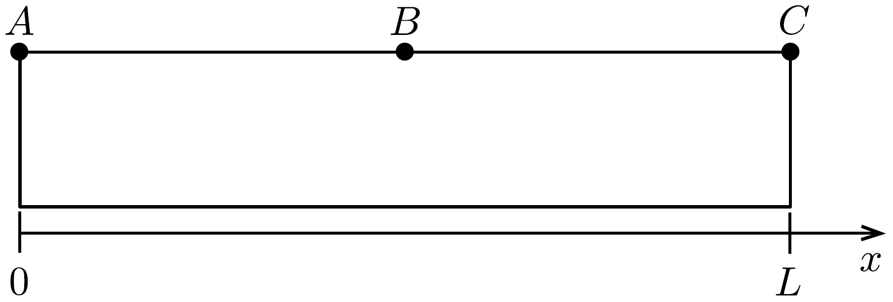
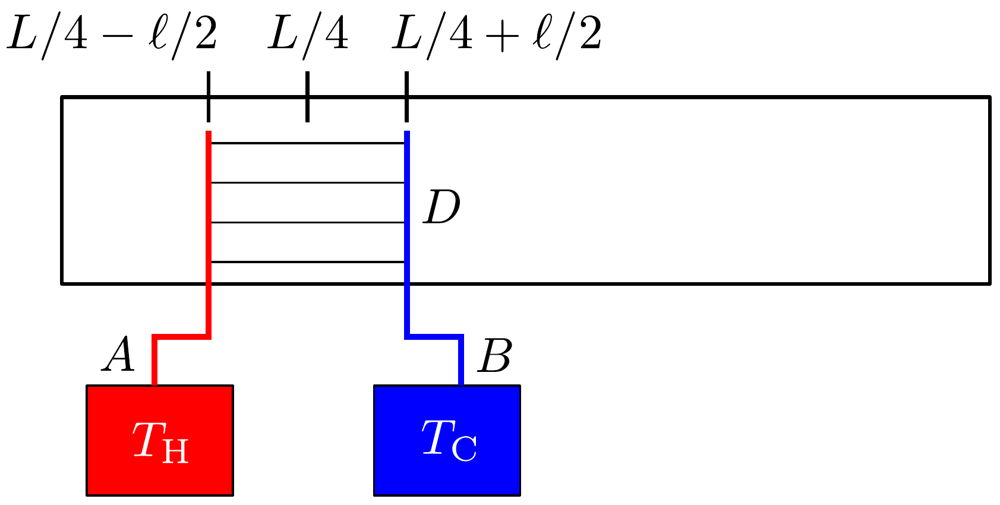

## Feladat 3

Termoakusztikus gép
A termoakusztikus gép egy olyan eszköz, amely hőenergiát alakít át akusztikus energiává, azaz hanghullámokká - tehát egyfajta mechanikai munkává. Mint sok más hőerógép, ezt is lehet ellentétes irányban, hútőgépként használni, amikor a hang segítségével pumpálunk hốt a hidegebb hótartályból a melegebb hốtartályba. A nagy múködési frekvencia lecsökkenti a hóvezetést és szükségtelenné teszi egy zárt munkahenger használatát. Más hőerőgépektől eltérően a termoakusztikus gépben nincsenek mozgó alkatrészek a munkvégző közegen kívül.

A termoakusztikus gépek hatásfoka általában alacsonyabb, mint más gépeké, viszont az előállítási és üzemeltetési költségei alacsonyabbak. Ez lehetőséget ad megújuló energetikai alkalmazásokhoz, mint például Nap-hőerőmúvek vagy
hulladékhő felhasználása. A vizsgálatunk az akusztikus energia előállítására fog fókuszálni az eszközön belül, figyelmen kívül hagyva a külső energiát kinyerő vagy átalakító eszközöket.

A rész. Hanghullámok egy zárt csőben
Tekintsünk egy hőszigetelő, $L$ hosszúságú és $S$ keresztmetszetú csövet, amelynek a tengelye az $x$ irányban fekszik. A cső két vége az $x=0$ és $x=L$ helyen van (418. ábra). A cső egy ideális gázzal van feltöltve, és mindkét vége le van zárva. Egyensúlyban a gáz hőmérséklete $T_{0}$, nyomása $p_{0}$ és súrúsége $\varrho_{0}$. Tegyük fel, hogy a viszkozitás elhanyagolható és a gáz csak az $x$ irányban mozog. A gáz tulajdonságai a merőleges $y$ és $z$ irányokban nem változnak.

3.A.1. Ha egy állóhullám alakul ki, a gáz elemei az $x$ irányban $\omega$ körfrekvenciájú rezgést végeznek. A rezgés amplitúdója függ az egyes elemek $x$ egyensúlyi helyzetétől a csőben. A gáz egyes elemeinek hosszirányú elmozdulását az $x$ egyensúlyi helyzettől a következő összefüggés adja meg:
\[
u(x, t)=a \sin (k x) \cos (\omega t)=u_{1}(x) \cos (\omega t)
\]
(vegyük észre, hogy itt $u$ a gáz egy elemének elmozdulását írja le), ahol $a \ll L$ egy pozitív állandó, $k=2 \pi / \lambda$ a hullámszám és $\lambda$ a hullámhossz. Mekkora a $\lambda_{\max }$ lehetséges maximális hullámhossz ebben a rendszerben?

A feladat során végig feltételezzük a $\lambda=\lambda_{\text {max }}$ módust.
Most vegyünk egy vékony gáztérfogatot (egy gázréteget), amely nyugalomban $x$ és $x+\Delta x(\Delta x \ll L)$ között helyezkedik el. A 3.A.1. feladatban leírtak szerint ez a réteg oszcillál az $x$ tengely mentén, és a térfogata és más termodinamikai paraméterei is változnak.

A következőkben mindenhol feltételezzük, hogy a termodinamikai mennyiségek megváltozása sokkal kisebb, mint az egyes mennyiségek egyensúlyi értéke.
3.A.2. A réteg $V(x, t)$ térfogata a $V_{0}=S \Delta x$ egyensúlyi érték körül oszcillál, amit az alábbi kifejezés ír le:
\[
V(x, t)=V_{0}+V_{1}(x) \cos (\omega t) .
\]

Keressünk egy kifejezést $V_{1}(x)$ értékére $V_{0}, a, k$ és $x$ függvényében!
3.A.3. Tegyük fel, hogy a gáz nyomása a hanghullám hatására közelítőleg a következő formában írható fel:
\[
p(x, t)=p_{0}-p_{1}(x) \cos (\omega t) .
\]

A gázrétegre ható erők figyelembevételével számítsuk ki elsőrendben a nyomásoszcilláció $p_{1}(x)$ amplitúdóját az $x$ helyzet, a $\varrho_{0}$ egyensúlyi súrúség, az elmozdulás $a$ amplitúdója, valamint a hullám $k$ és $\omega$ paramétereinek függvényében!

Hangfrekvenciáknál a gáz hővezetése elhanyagolható, így a gáz kitágulását és összenyomódását tisztán adiabatikusnak tekinthetjük, amely kielégíti a $p V^{\kappa}=$ = konst. egyenletet, ahol $\kappa$ az adiabatikus kitevő.
3.A.4. A fenti összefüggést és az eddigi feladatok eredményét felhasználva határozzuk meg elsőrendben a hanghullámok $c=\omega / k$ sebességét a csőben! A választ $p_{0}, \varrho_{0}$ és a $\kappa$ adiabatikus konstans függvényében adjuk meg.
3.A.5. A hanghullám következtében a gáz hőmérsékletének változása az adiabatikus kitágulás és összenyomás hatására a következő összefüggéssel adható meg:
\[
T(x, t)=T_{0}-T_{1}(x) \cos (\omega t) .
\]

Számítsuk ki a hőmérséklet-oszcilláció $T_{1}(x)$ amplitúdóját $T_{0}, \gamma, a, k$ és $x$ függvényében!
3.A.6. Ebben az egy feladatban tegyük fel, hogy a cső és a gáz között egy gyenge termikus kölcsönhatás van. Ennek hatására a hang állóhullám lényegében változatlan marad, de a gáz egy kevés hốt cserélhet a csővel. A viszkozitás által okozott melegedés elhanyagolható.

A 419. ábra mindegyik pontjánál ( $A, C$ a cső végeinél, $B$ a közepén) adjuk meg, hogy a cső hőmérséklete az egyes pontoknál hosszú idő alatt nő, csökken, vagy változatlan marad!

\section*{B rész. Hanghullám-erősítés külső hőkontaktussal}

Egy köteg vékony, jól elrendezett, merev lemezt helyezünk a csőbe. A köteg lemezei párhuzamosak a cső tengelyével, és így nem akadályozzák a gáz mozgását a csóben. Az elrendezés a 420. ábrán látható, ahol $D$ a lemezköteget, $A$ meleg, $B$ pedig a hideg hőtartályt jelöli. A lemezköteg középpontja az $x_{0}=L / 4$ helyen van, a köteg tengellyel párhuzamos hossza $\ell \ll L$, és a köteg kitölti a cső teljes keresztmetszetét. A lemezköteg jobb és bal vége között állandó $\tau$ hőmérsékletkülönbség van. A lemezköteg bal széle az $x_{\mathrm{H}}=x_{0}-\ell / 2$ helyen egy külső hốtartály segítségével $T_{\mathrm{H}}=T_{0}+\tau / 2$ hőmérsékleten, a jobb széle az $x_{\mathrm{C}}=x_{0}+\ell / 2$ helyen pedig $T_{\mathrm{C}}=T_{0}-\tau / 2$ hómérsékleten van tartva.

A lemezekben van egy csekély hosszirányú hővezetés, amely a lemezköteg két vége között állandó hőmérséklet-gradienst hoz létre, így $T_{\text {lemez }}(x)=T_{0}-\frac{x-x_{0}}{\ell} \tau$.

Ahhoz, hogy megvizsgáljuk a lemezköteg és a csőben lévő állóhullámú gáz közötti hőkapcsolatot, vegyük figyelembe a következó feltevéseket:
- - Ahogy az előző részben is, a termodinamikai mennyiségek megváltozása most is sokkal kisebb, mint az egyes mennyiségek egyensúlyi értéke.
- - A rendszer az alap állóhullámmódusban múködik a lehető legnagyobb hullámhosszal. A lemezköteg ezt csak egész kicsit módosítja.
- - A lemezköteg sokkal kisebb, mint a hullámhossz: $\ell \ll \lambda_{\text {max }}$, és elég messze lehet helyezni a kitérés és a nyomás csomópontjaitól is, és így az $u(x, t) \approx$ $u\left(x_{0}, t\right)$ kitérés és a $p(x, t) \approx p\left(x_{0}, t\right)$ nyomás állandónak tekinthető a lemezköteg teljes hosszában.
- - Elhanyagolhatunk minden széleffektust, ami a gáz lemezek végénél történő ki- és belépésből származik.
- - A hőmérséklet-különbség a lemezköteg két vége között, azaz a meleg és hideg hőtartály között kicsi az abszolút hőmérséklethez viszonyítva: $\tau \ll T_{0}$.
- - A hővezetés a lemezkötegen át, a gázon át és a csőben egyaránt elhanyagolható. Az egyetlen jelentős hőtranszfert a gáz mozgásából származó hőáramlás, valamint a gáz és a lemezköteg közti hóvezetés okozza.

3.B.1. Tekintsük azt a gázréteget a lemezköteg tartományában, amely eredetileg az $x_{0}=L / 4$ helyen van. Ahogy ez a réteg mozog a lemezkötegben, a lemezköteg hozzá közeli részének a lokális hőmérséklete így változik:
\[
T_{\mathrm{env}}(t)=T_{0}-T_{\mathrm{st}} \cos (\omega t) .
\]

Fejezzük ki $T_{\mathrm{st}}-\mathrm{t} a, \tau$ és $\ell$ függvényében!
3.B.2. Mekkora kritikus $\tau_{\mathrm{c}}$ hőmérséklet-különbség felett fog a gáz hốt szállítani a meleg hótartályból a hidegbe? Fejezzük ki $\tau_{\mathrm{c}}-\mathrm{t} T_{0}, \kappa, k$ és $\ell$ függvényében.
3.B.3. Vezessünk le egy általános közelító kifejezést egy kis gázrétegbe belépő $\frac{\mathrm{d} Q}{\mathrm{~d} t}$ hőáramra a térfogat és nyomás változási sebességének lineáris függvényeként! Választ a $\frac{\mathrm{d} V}{\mathrm{~d} t}$ térfogatváltozási sebességgel, a $\frac{\mathrm{d} p}{\mathrm{~d} t}$ nyomásváltozási sebességgel, a gázréteg $p_{0}, V_{0}$ egyensúlyi nyomásával és térfogatával, valamint $\kappa$ adiabatikus kitevővel fejezzük ki. (Használhatjuk az állandó térfogaton mért molhő $C_{V}=$ $=\frac{R}{\kappa-1}$ kifejezését is, ahol $R$ a gázállandó.)

A lemezköteg és a gázréteg közötti korlátozott hőáram miatt fáziskülönbség alakul ki a gázrétegben a nyomás- és térfogatoszcilláció között. Azt fogjuk megnézni, hogy lesz ebből munkavégzés.

Legyen a lemezkötegből a gázrétegbe mutató hőáram arányos a gázréteg és a lemezköteg vele szomszédos része közötti hőmérséklet-különbséggel, amit közelítőleg így írhatunk le: $\frac{\mathrm{d} Q}{\mathrm{~d} t}=-\beta V_{0}\left(T_{\mathrm{st}}-T_{1}\right) \cos (\omega t)$. Itt $T_{1}$ és $T_{\mathrm{st}}$ a gázréteg és a vele szomszédos lemezköteg hőmérséklet-oszcillációjának amplitúdója a 3.A.5. és 3.B.1. feladatokból, valamint $\beta>0$ egy állandó. Tegyük fel, hogy a gép múködési frekvenciáján a gáz hőmérséklet-változása ezen hő́áram következtében jelentéktelen $T_{1}$-hez és $T_{\text {st }}$-hez viszonyítva.
3.B.4. Annak érdekében, hogy kiszámítsuk a munkát, figyelembe vesszük a mozgó gázréteg térfogatváltozását a lemezköteggel való termikus kapcsolat következtében. Írjuk fel a gázréteg nyomását és térfogatát a lemezköteg hatása alatt így:
\[
\begin{gathered}
p=p_{0}+p_{a} \sin (\omega t)-p_{b} \cos (\omega t), \\
V=V_{0}+V_{a} \sin (\omega t)+V_{b} \cos (\omega t) .
\end{gathered}
\]

Adott $p_{a}$ és $p_{b}$ esetében fejezzük ki a $V_{a}$ és $V_{b}$ együtthatókat $p_{a}, p_{b}, p_{0}, V_{0}, \kappa$, $\tau, \tau_{\mathrm{c}}, \beta, \omega, a$ és $\ell$ függvényében!
3.B.5. Vezessünk le egy közelítő kifejezést az egységnyi térfogatra jutó $w$ akusztikus munkára, amit a gázréteg végez egy ciklus alatt! Integráljuk ezt a lemezköteg teljes térfogatára, hogy megkapjuk a gáz által egy ciklus alatt végzett teljes $W_{\text {tot }}$ munkát! Fejezzük ki $W_{\text {tot }}$-ot $\kappa, \tau, \tau_{\mathrm{c}}, \beta, \omega, a, k$ és $S$ függvényében.
3.B.6. Vezessünk le egy közelítő kifejezést arra a $Q_{\text {tot }}$ hőre, ami az $x=x_{0}$ sík bal oldaláról jobbra szállítódik egy ciklus alatt! A választ $\tau, \tau_{\mathrm{c}}, \beta, \omega, a, S, \ell$ függvényében adjuk meg.

Útmutatás: használhatjuk a $j=q \frac{\mathrm{~d} u}{\mathrm{~d} t}$ kifejezést a hővezetés által létrehozott hőáramra, ahol $q$ a gázréteg egységnyi térfogatára vonatkoztatott hőmennyiség.
3.B.7. Fejezzük ki a termoakusztikus gép $\eta$ hatásfokát! A hatásfok definíció szerint a generált akusztikus munka és a meleg hótartályból felvett hő hányadosa. Az eredményt fejezzük ki a meleg és hideg hőtartály közötti $\tau$ hőmérséklet-
különbség, a $\tau_{\mathrm{c}}$ kritikus hómérséklet-különbség és a $\eta_{\mathrm{c}}=1-T_{\mathrm{C}} / T_{\mathrm{H}}$ Carnothatásfok függvényében.
