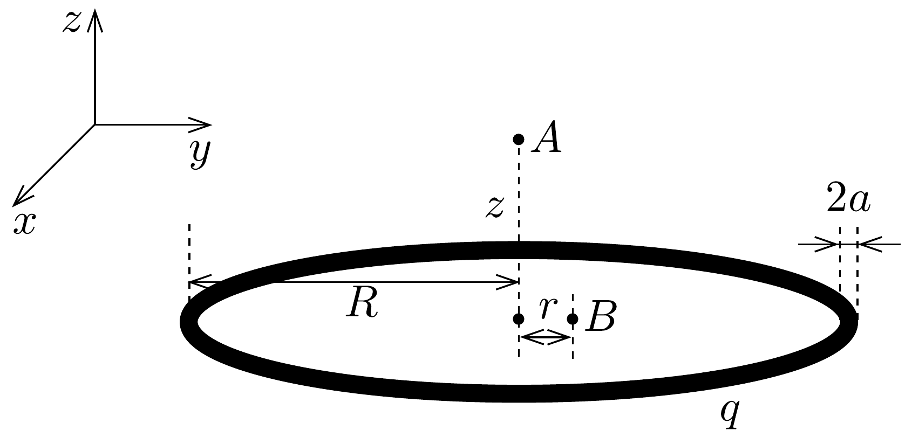
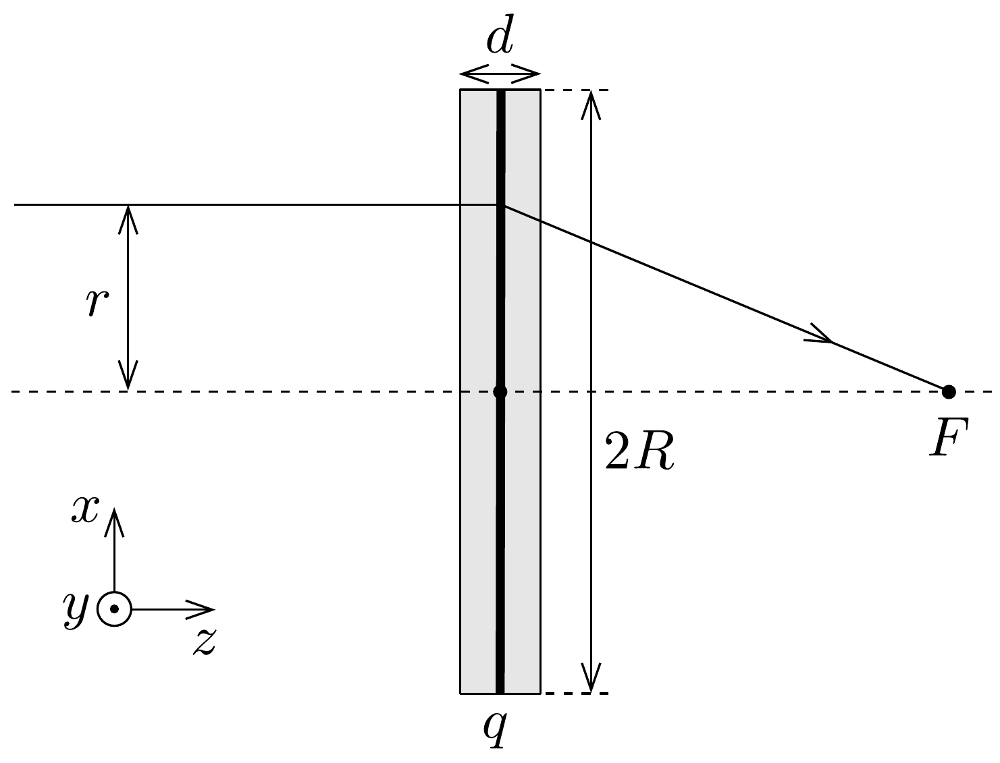
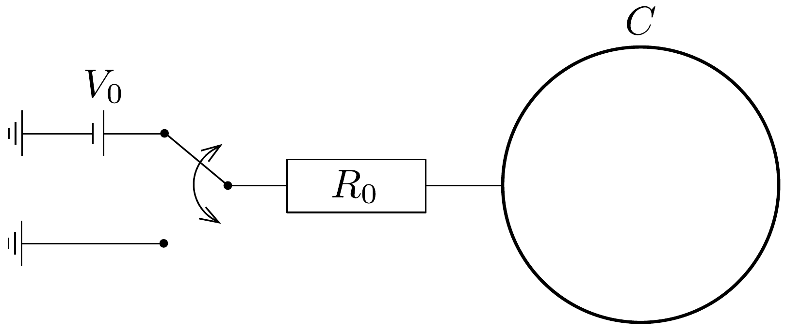

## Feladat 2

Elektrosztatikus lencsék
Tekintsünk egy $q$ össztöltésú, egyenletesen feltöltött, $R$ sugarú fémgyürüt. A gyúrú egy tórusz, melynek vastagsága $2 a \ll R$. Ez a vastagság a feladat $A, B$, $C$ és $E$ részében elhanyagolható. Ahogyan az a 427. ábrán is látható, az $x y$ sík megegyezik a gyúrú síkjával, a $z$ tengely pedig merőleges arra. A feladat $A$ és $B$ részében szükség lehet a következő függvény Taylor-sorfejtésére:
\[
(1+x)^{\varepsilon} \approx 1+\varepsilon x+\frac{1}{2} \varepsilon(\varepsilon-1) x^{2}, \quad \text { ha }|x| \ll 1 .
\]

A rész. Elektrosztatikus potenciál a gyűrú tengelyén
2.A.1. Számoljuk ki a $\Phi(z)$ elektrosztatikus potenciált a gyúrú tengelyén annak középpontjától $z$ távolságra (lásd az $A$ pontot a 427. ábrán)!
2.A.2. Sźmoljuk ki a $\Phi(z)$ elektrosztatikus potenciál $z$-ben legkisebb, 0-tól különböző hatványkitevőjú járulékát, ha $z \ll R$ !

2.A.3. Egy ( $m$ tömegú és $-e$ töltésú) elektront a 427. ábrán látható $A$ pontba helyezünk el $(z \ll R)$. Mekkora eró hat az elektronra? Az erő kifejezése alapján adjuk meg a $q$ töltés előjelét, ha rezgőmozgás jön létre. Az elektron mozgása nem befolyásolja a gyűrú töltéseloszlását.
2.A.5. Mekkora a harmonikus rezgőmozgás $\omega$ körfrekvenciája?

B rész. Elektrosztatikus potenciál a gyürú síkjában
Ebben a feladatrészben a $\Phi(r)$ potenciált vizsgáljuk a gyürú síkjában ( $z=$ $=0$ ) $r \ll R$ pontok esetében (lásd a $B$ pontot a 427. ábrán). Az elektrosztatikus potenciál $r$-ben legkisebb, 0-tól különböző hatványkitevőjú járulékát tekintve az alábbi alakban adható meg: $\Phi(r) \approx q\left(\alpha+\beta r^{2}\right)$.
2.B.1. Határozzuk meg $\beta$ kifejezését! A számolás során használjuk a korábban megadott függvény Taylor-sorfejtését.
2.B.2. Egy elektront a 427, ábrán látható $B$ pontba helyezünk el $(r \ll R)$. Mekkora eró hat az elektronra? Az erő kifejezése alapján adjuk meg a $q$ töltés előjelét, ha a létrejövő mozgás harmonikus rezgés. Az elektron mozgása nem befolyásolja a gyúrú töltéseloszlását.

C rész. Idealizált elektrosztatikus lencse fókusztávolsága, pillanatszerũ töltődés

Egy, az elektronok fókuszálására alkalmas elektrosztatikus lencsét szeretnének építeni. A következő konstrukciós javaslattal állnak elő. A gyúrút a $z$ tengelyre merőlegesen helyezték el (lásd a 428. ábrát). Van egy forrásuk, ami az igényeknek megfelelően csomagokban bocsátja ki a nemrelativisztikus elektronokat. A kilépő elektronok kinetikus energiája $E=m v^{2} / 2$, és pontosan ellenőrzött pillanatokban hagyják el a forrást. A rendszert úgy programozták be, hogy a gyűrú az idő nagy részében semleges, de ha az elektronok közelebb vannak a gyürú síkjához mint $d / 2(d \ll R)$ (lásd a szürkített, ún. „aktív régiót” a 428. ábrán), akkor a gyürú töltése $q$. Ebben a $C$ részben feltételezzük, hogy a feltöltődés és a kisülés pillanatszerú, továbbá az elektromos tér azonnal „kitölti a teret”. A mágneses terek hatása elhanyagolható, és feltesszük, hogy az elektronok sebességének $z$ irányú komponense állandó. Az elektron mozgása nem befolyásolja a gyúrú töltéseloszlását.

2.C.1. Határozzuk meg a lencse $f$ fókusztávolságát! Tegyük fel, hogy $f \gg d$. Az eredményt a 2.B.1. kérdésben megadott $\beta$ és más ismert változók függvényében adjuk meg. Tételezzük fel, hogy mielőtt az elektronok elérik az „aktív régiót”, azok a $z$ tengellyel párhuzamosan mozognak és $r \ll R$. A $q$ előjelét úgy kell megválasztani, hogy a lencse fókuszáljon.

A kísérletben az elektronforrást a $z$ tengelyen a gyűrú középpontjától $b>f$ távolságra helyezik el. Vegyük figyelembe, hogy mielőtt az elektronok elérik az „aktív régiót”, már nem párhuzamosan mozognak a $z$ tengellyel, mivel a pontforrásból a $z$ tengelyhez képest kis $\gamma \ll 1$ (rad) szög alatt kerülnek kibocsátásra. Az elektronok a gyúrú közepétől $c$ távolságra lévő pontba fókuszálódnak.
2.C.2. Határozzuk meg $c$ értékét! A választ a 2.B.1. kérdésben megadott $\beta$ és más ismert változók függvényében adjuk meg.
2.C.3. Kielégíti-e az alábbi,
\[
\frac{1}{b}+\frac{1}{c}=\frac{1}{f}
\]
leképezési törvényt a feladatban számolt elektrosztatikus lencse? Mutassuk ezt meg az $1 / b+1 / c$ direkt számolásával.

D rész. A gyürü mint kondenzátor
Eddig egy idealizált modellt vizsgáltuk, ahol feltételeztük, hogy a gyűrú pillanatszerúen töltődik fel, illetve sül ki. A valóságban ez nem pillanatszerú, mert a gyürú egy kondenzátor, melynek véges $C$ kapacitása van. Ebben a részben ennek a kondezátornak a tulajdonságait vizsgáljuk. Szükség lehet a következő integrálokra:
\[
\int \frac{\mathrm{d} x}{\sin x}=-\ln \left|\frac{\cos x+1}{\sin x}\right|+\text { konst. }
\]
és
\[
\int \frac{\mathrm{d} x}{\sqrt{1+x^{2}}}=\ln \left|x+\sqrt{1+x^{2}}\right|+\text { konst. }
\]
2.D.1. Számoljuk ki a gyúrú $C$ kapacitását! Használjuk fel, hogy a gyúrú vastagsága $2 a$, de emlékezzünk rá, hogy $a \ll R$.

Amikor az elektron eléri az „aktív régiót”, akkor a gyúrút egy $V_{0}$ feszültségü telepre kapcsoljuk (lásd a 429. ábrát). Amikor az elektron elhagyja az „aktív régiót", akkor a gyúrút leföldeljük. A kontaktusok ellenállása $R_{0}$, míg a gyúrú saját ellenállása elhanyagolható.

2.D.2. Határozzuk meg a gyúrú töltését az idő függvényében, majd rajzoljuk fel vázlatosan a $q(t)$ függvényt! Válasszuk a $t=0$ időpillanatnak azt, mikor az elektronok a gyűrú síkjában vannak. Mekkora a gyúrú $q_{0}$ össztöltése, amikor $q(t)$ abszolút értékéke a legnagyobb? A gyúrú kapacitása $C$ (azaz nem kell használni a 2.D.1. részben meghatározott formulát).

Megjegyzés: A telep 429, ábrára berajzolt polaritása csak tájékoztató jellegú. Az előjelet helyesen kell meghatározni ahhoz, hogy a lencse fókuszáljon.

E rész. Egy valósághübb lencse fókusztávolsága: nem pillanatszerü töltődés

A feladat ezen részében egy realisztikusabban modellezett lencse hatását vizsgáljuk. Hanyagoljuk el a gyűrú $2 a$ vastagságát és ismételten tételezzük fel, hogy az elektronok a $z$ tengellyel párhuzamosan mozognak mielőtt elérik az „aktív régiót”. A gyúrú feltöltődése és kisülése ellenben most már nem pillanatszerú.
2.E.1. Határozzuk meg a lencse $f$ fókusztávolságát! Tegyük fel, hogy $f / v \gg$ $\gg R_{0} C$, de $d / v$ és $R_{0} C$ azonos nagyságrendúek. A válaszban az ismert mennyiségeken túl használjuk a $B$ részben bevezetett $\beta$ konstanst.
2.E.2. Azt láthatjuk, hogy az $f$ fókusztávolságra kapott kifejezés hasonló alakú, mint a $C$ rész eredménye, ha $q$ értékét $q_{\text {eff }}$-re cseréljük. Adjuk meg $q_{\text {eff }}$ kifejezését a feladatban használt változók segítségével!
