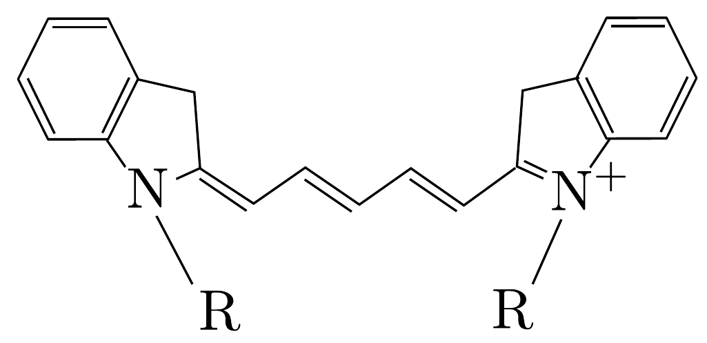
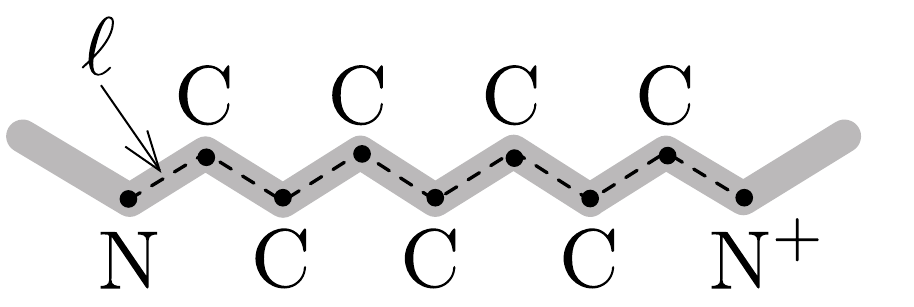
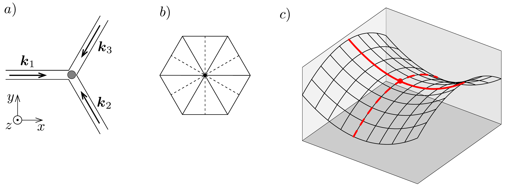

## Feladat 3

Részecskék és hullámok
A részecske-hullám dualitás, amely azt állítja, hogy minden részecske leírható hullámként és fordítva, a kvantummechanika egyik központi gondolata. Ebben
a feladatban erre a képre és néhány egyéb alapfeltevésre támaszkodva fogunk válogatott kvantumjelenségeket vizsgálni, amelyekben a mikrovilág részecskéinek két fajtája, a fermionok és a bozonok játszanak szerepet.

A rész. Dobozba zárt kvantumrészecske
Tekintsük egy $m$ tömegú részecske mozgását egy olyan egydimenziós potenciálgödörben, amelyben a $V(x)$ potenciális energiát a következő kifejezés adja meg:
\[
V(x)= \begin{cases}0, & \text { ha } 0 \leq x \leq L ; \\ \infty, & \text { ha } x<0 \text { vagy } x>L .\end{cases}
\]

Míg egy klasszikus részecske kinetikus energiája egy ilyen potenciálban mozogva bármekkora lehet, egy kvantumrészecske esetén csak meghatározott, pozitív, diszkrét energiaszintek megengedettek. Bármely ilyen megengedett állapotban a részecske leírható egy, a falaknál csomópontokkal rendelkező de Broglie-féle állóhullámmal.
3.A.1. Határozzuk meg a gödörben lévó kvantumrészecske lehetséges legkisebb $E_{\text {min }}$ energiáját! A választ $m, L$ és a $h$ Planck-állandó segítségével fejezzük ki.

A részecske legalacsonyabb energiájú állapotát alapállapotnak hívjuk, az öszszes többi lehetséges állapotot pedig gerjesztett állapotnak. Rendezzük növekvő sorba az összes lehetséges energiaértéket, és jelöljük ezeket $E_{n}$ módon, az alapállapot $E_{1}$ energiájával kezdődően.
3.A.2. Adjuk meg az $E_{n}$ energiákat kifejező általános összefüggést (ahol $n=$ $=1,2,3, \ldots)$ !
3.A.3. A részecske csak úgy kerülhet át pillanatszerúen egyik állapotból a másikba, ha elnyel vagy kisugároz egy, az energiakülönbségnek megfelelő energiájú fotont. Határozzuk meg a kibocsátott foton $\lambda_{21}$ hullámhosszát, miközben a részecske az elsó gerjesztett állapotból $\left(E_{2}\right)$ az alapállapotba $\left(E_{1}\right)$ kerül!

B rész. Molekulák optikai tulajdonságai
Ebben a részben a Cy5 cianinmolekula több optikai tulajdonságát vizsgáljuk. Ez egy széles körben használt festékmolekula, amelyet vázlatosan a 430. a) ábra mutat (az egyszerúség kedvéért a hidrogénatomokat nem ábrázoltuk). Ennek az optikai tulajdonságait főként a főlánca határozza meg, amely felváltva egyszeres és kettős kötéssel kapcsolódó szénatomokból áll, ahogy a 430.b) ábra mutatja, míg a molekula végein lévő gyűrúk és az R jelú gyökök hatása sokkal kisebb. A főláncban lévő minden C-atom 4 vegyértékelektronja közül 3 járul hozzá a kötésekhez (ugyanennyi az N-atomoktól), a maradék vegyértékelektronok pedig „szétosztva" az egész fólánc mentén mozoghatnak. Minden egyes ilyen elektron teljes potenciális energiáját a 430.c) ábra vékony hullámos vonala mutatja, melynek minimumhelyei a C- és N-atomok helyzetének felelnek meg.

Az egyszerúség kedvéért ezt a potenciális energiaprofilt a (21-02) egyenletben megadott egyszerú függvénnyel fogjuk közelíteni $L=10,5 \ell$ szélességgel (lásd a

430. ábra.
vastag vonalat a 430, c) ábrán), ahol $\ell=140 \mathrm{pm}$ az átlagos atom-atom távolság (430, b) ábra). Ennek eredményeképp egy, az $A$ részben tárgyalt egydimenziós potenciálgödörben mozgó, 10 db elektronból álló „elektrongázt” kapunk (7 db a C-atomoktól, 2 db a N-atomtól és 1 db az $\mathrm{N}^{+}$-iontól származik). A számításokban elhanyagolhatjuk ezen elektronok között a kölcsönhatást, azonban figyelembe kell vennünk azt a tényt, hogy az elektronok fermionok, ezért engedelmeskedniük kell a Pauli-féle kizárási elvnek. Hanyagoljuk el továbbá a többi elektron hatását és az atommagok mozgását.
3.B.1. Határozzuk meg a Cy5 molekula által elnyelhetó foton lehetséges legnagyobb $\lambda$ hullámhosszát feltételezve, hogy az elektronrendszer kezdetben alapállapotban van! A választ $\ell$, fizikai állandók és numerikus faktorok segítségével fejezzük ki, majd számítsuk ki a számszerú értékét is.
3.B.2. Egy másik festékmolekula, a Cy3 hasonló szerkezetú, de a fólánca 2 szénatommal rövidebb. Vajon a kék vagy a vörös tartomány felé van eltolódva az elnyelési spektruma a Cy5 molekuláéhoz képest? Számítsuk ki ennek a $\Delta \lambda$ spektrális eltolódásnak a számszerú értékét! Feltehetjük, hogy két szénatom eltávolítása nem változtatja meg a molekula alakját, csak a főlánc lesz rövidebb két atom-atom távolságnyival.

Ha a molekula gerjesztett állapotban van, spontán módon átkerülhet az alapállapotba, miközben kibocsát egy fotont. Az ilyen események $K$ átlagos bekövetkezési rátáját (azaz a gerjesztett állapotban lévő molekulák számának $\mathrm{d} N / N$ relatív csökkenését $\mathrm{d} t$ idő alatt, $K=\frac{1}{N} \frac{\mathrm{~d} N}{\mathrm{~d} t}$ ) a kibocsátott foton $\lambda$ hullámhossza, a $d$ átmeneti elektromos dipólmomentum (ami $d \simeq e \ell$ nagyságrendú, ahol $e$ az elemi töltés), valamint a vákuum permittivitása $\left(\varepsilon_{0}\right)$ és a $h$ Planck-állandó határozza meg.
3.B.3. Dimenzióanalízis segítségével fejezzük ki a spontán emisszió bekövetkezési rátáját $\varepsilon_{0}, h, \lambda$ és $d$ felhasználásával! Az adódó összefüggésben szereplő
számszerú faktor értéke $\frac{16}{3} \pi^{3}$.
3.B.4. A Cy5 molekula esetén $d \approx 2,4 e \ell$. Határozzuk meg a Cy5 molekula legalacsonyabb gerjesztett állapotának az átlagos fluoreszcencia-élettartamát $\left(\tau_{\mathrm{Cy} 5}\right)$, amely nem más, mint az alapállapotba történő emissziós átmenet rátájának reciproka!

C rész. Bose-Einstein-kondenzáció
Ez a rész közvetlenül nem kapcsolódik az $A$ és $B$ részekhez. Itt bozonikus részecskék kollektív viselkedését fogjuk vizsgálni. A bozonok nem követik a Paulielvet, és - alacsony hőmérsékleten vagy nagy súrúség esetén - egy Bose-Einsteinkondenzációnak (BEC) nevezett drámai jelenséget mutatnak. Ez egy fázisátalakulás egy érdekes kollektív kvantumállapotba: nagyszámú azonos részecske gyúlik össze egyetlen közös kvantumállapotban, és kezd el úgy viselkedni, mint egyetlen hullám. Az átalakulást általában adott számú részecskének a kritikus hőmérséklet alá hútésével érik el. Elvben ez a súrúségnek egy kritikus érték fölé emelésével is előidézhető, miközben a hőmérsékletet állandó értéken tartjuk.

Kezdjük a hőmérséklet és a súrúség közötti összefüggés feltárásával az átalakuláskor. Megmutatható, hogy ezek közelítő értékei levezethetők egy egyszerú megfigyelésből: A Bose-Einstein-kondenzáció akkor következik be, amikor a részecskék négyzetes átlagsebességének megfeleló de Broglie-hullámhossz egyenló a gázrészecskék közötti karakterisztikus távolsággal.
3.C.1. Tekintsünk egy nemkölcsönható, ${ }^{87}$ Rb-atomokból álló gázt termikus egyensúlyban. Írjuk fel az atomok tipikus $p$ impulzusát és tipikus $\lambda_{\mathrm{dB}}$ de Brogliehullámhosszát megadó kifejezéseket az atomok $m$ tömege, a $T$ hőmérséklet és fizikai állandók segítségével!
3.C.2. Számítsuk ki a gázrészecskék közötti tipikus $\ell$ távolságot az $n$ részecskesúrúség függvényében! Ezzel határozzuk meg a $T_{\mathrm{c}}$ kritikus hőmérsékletet az atomok tömege, súrúsége és fizikai állandók segítségével!

A BEC laboratóriumi létrehozásához a kísérletezőknek $T_{\mathrm{c}}=100 \mathrm{nK}$ hőmérsékletre kell lehúteniük a gázt.
3.C.3. Mekkora a Rb-gáz $n_{\mathrm{c}}$ részecskeszám-súrúsége, ha az átalakulás ezen a hőmérsékleten történik meg? Az összehasonlítás kedvéért számítsuk ki egy ideális gáz „rendes" $n_{0}$ részecskeszám-súrúségét is standard hőmérsékleten és nyomáson, azaz legyen $T_{0}=300 \mathrm{~K}$ és $p_{0}=10^{5} \mathrm{~Pa}$ ! Hányszor súrúbb a „rendes" gáz? Feltehetjük, hogy a gázatomok tömege egyenlő 87 atomi tömegegységgel $\left(m_{\mathrm{amu}}\right)$.

D rész. Háromnyalábos optikai rácsok
Az elsó́ Bose-Einstein-kondenzátumokat 1995-ben állították elő, és azóta a kísérleti munka változatos irányokba ágazott. Ebben a részben egy különösen gyümölcsöző gondolatot fogunk vizsgálni, mely szerint a kondenzátumot egy térben periodikus potenciálba helyezzük, amit néhány interferáló lézernyaláb hoz létre. A kialakuló interferenciamintázat periodikus mivolta miatt ezeket optikai rácsnak nevezik. Az optikai rácsban mozgó atomok által érzékelt $V(\boldsymbol{r})$ potenciál egyenesen arányos a fény lokális intenzitásával, és a számolásokban feltehetjük, hogy:
\[
\left.V(\boldsymbol{r})=-\left.\alpha\langle | \boldsymbol{E}(\boldsymbol{r}, t)\right|^{2}\right\rangle .
\]

Itt $\alpha$ egy pozitív konstans, a csúcsos zárójel pedig időátlagolást jelöl, amely eltünteti a gyorsan oszcilláló tagokat. Az $i$-edik lézer által keltett elektromos térerősséget a következőképp írhatjuk le:
\[
\boldsymbol{E}_{i}=E_{0, i} \boldsymbol{\varepsilon}_{i} \cos \left(\boldsymbol{k}_{i} \cdot \boldsymbol{r}-\omega t\right),
\]
ahol $E_{0, i}$ az amplitúdó, $\boldsymbol{k}_{i}$ a hullámszám, $\boldsymbol{\varepsilon}_{i}$ pedig az egységnyi hosszúságú polarizációvektor.

A feladatunk háromszöges optikai rácsok vizsgálata lesz, amiket három interferáló, azonos intenzitású lézernyalábbal hozunk létre. Egy tipikus összeállítás a 431, a) ábrán látható. Itt mindhárom nyaláb $z$ irányban polarizált, az $x y$ síkban terjed, és egymáshoz képest 120°-os szögben találkoznak a szürke körrel jelölt térrészben. Válasszuk az $x$ tengelyt a $\boldsymbol{k}_{1}$ hullámszámvektorral párhuzamosnak.
3.D.1. A (21-03) és (21-04) egyenletek felhasználásával vezessünk le egy összefüggést a $V(\boldsymbol{r})$ potenciális energiára $\boldsymbol{r}=(x, y)$ függvényében a nyalábok síkjában!

Útmutatás: Az eredmény elegánsan kifejezhető egy konstans tag és három $\boldsymbol{b}_{i} \cdot \boldsymbol{r}$ argumentumú koszinuszfüggvény összegeként. A választ ilyen formában írjuk fel, és adjuk meg a $\boldsymbol{b}_{i}$ vektorokat!
3.D.2. A kapott potenciális energia hatfogású forgási szimmetriával rendelkezik, azaz a potenciáleloszlás invariáns az origó körüli olyan forgatásokra, melyek szöge $60^{\circ}$ többszöröse. Egyszerú érveléssel mutassuk meg, hogy ez valóban így van!

A fenti, szimmetriára vonatkozó megfigyelés egyszerúsíti a kétdimenziós $V(\boldsymbol{r})$ potenciáleloszlás vizsgálatát. Ahogy az a 431, b) ábrán látszik, egy szabályos hatszögnek olyan szimmetriatengelyei vannak, melyek a szemközti csúcsokat (folytonos vonalak) vagy a szemközti oldalfelező pontokat (szaggatott vonalak) kötik
össze. Ezért esetünkben nem kell a potenciált két dimenzióban ábrázolnunk, hiszen sok következtetést levonhatunk csupán az $x$ és $y$ tengelyekre szorítkozva, melyek a szimmetriatengelyek mentén futnak.
3.D.3. Vezessük le a $V(\boldsymbol{r})$ potenciál viselkedését a koordináta-tengelyek mentén, azaz határozzuk meg a $V_{X}(x) \equiv V(x, 0)$ és $V_{Y}(y) \equiv V(0, y)$ függvényeket! Találjuk meg $V_{X}(x)$ és $V_{Y}(y)$ szélsőértékhelyeit egyetlen változójuk függvényében! Mivel ezek a függvények periodikusak, minden periodikusan ismétlődő minimumés maximumsorozatból elég egyet-egyet szerepeltetni a felsorolásban.

A mi célunk az úgynevezett rácspontok helyzetének, azaz a teljes kétdimenziós $V(\boldsymbol{r})$ potenciál minimumhelyeinek meghatározása. Ezek lehetséges helyzetét a $V_{X}$ és $V_{Y}$ egyváltozós függvények korábban kapott minimumai már sejtetik, de ellenőrizni kell, hogy a nyeregpontokat kihagyjuk-e. Ahogy az a 431. c) ábrán látható, ha egyetlen vonal mentén vizsgáljuk őket, a nyeregpontok minimumnak tünhetnek, miközben nem azok. A nyeregpont a felület egy olyan pontja, ahol a meredekség mindkét merőleges irányban zérus, mégsem lokális szélsőértéke az ábrázolt függvénynek. A folytonos vonallal jelölt útvonal mentén haladva látszólag minimumot kapunk. A valódi minimum és a nyeregpont megkülönböztetéséhez azonban az erre merőleges irányban (szaggatott vonal) további vizsgálat szükséges.
3.D.4. Vizsgáljuk meg az előző kérdésre kapott eredményeket, hogy meghatározzuk az optikai rács valódi minimumait! Találjuk meg az összes ekvivalens, az origóhoz legközelebb esó (de azzal nem azonos) minimumhelyet! Mekkora a legközelebb eső minimumhelyek közötti $a$ távolság, vagy más szavakkal az optikai rácsunk rácsállandója? Választ a lézer $\lambda_{\text {las }}$ hullámhosszával fejezzük ki.

Az ultrahideg atomok töltéssemlegessége azt sugallja, hogy kölcsönhatásuk csak akkor számottevő, ha kettő vagy több atom foglalja el az optikai rács ugyanazon rácspontját. Ennek ellenére, a kísérletiek olyan elrendezéseket is képesek létrehozni, amelyekben hosszútávú kölcsönhatás áll fenn. Egy lehetséges megközelítés az úgynevezett Rydberg-atomok létrehozásán alapul, amelyek fizikai mérete nagy és egyéb eltúlzott tulajdonságokkal rendelkeznek. A Rydberg-atomok gerjesztett atomok, melyek egyik elektronja egy nagyon magas $n$ fókvantumszámú állapotban van. A Rydberg-atom mérete úgy becsülhető, hogy kiszámítjuk ezen $n \hbar$ pálya-impulzusmomentumú elektron klasszikus körpályájának sugarát, ahol $\hbar$ a redukált Planck-állandó.
3.D.5. Határozzuk meg $n$ értékét, ami megfelel egy olyan Rb Rydberg-atom sugarának, amely összemérhető a lézer $\lambda_{\mathrm{las}}=380 \mathrm{~nm}$ hullámhosszával! A választ $\lambda_{\text {las }}$ és fizikai állandók segítségével adjuk meg, és számítsuk ki a számszerú értékét is.
