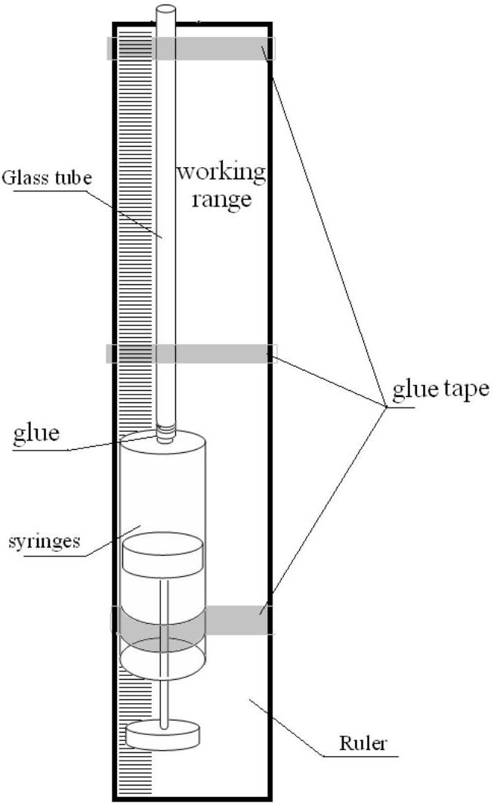

## EXPERIMENTAL COMPETITION

14 January, 2010

## Please read the instructions first:

1. The Experimental part consists of one problem. This part of the competition lasts 3 hours.
2. Please only use the pen that will be given to you.
3. You can use your own non-programmable calculator for numerical calculations. If you don't have one, please ask for it from Olympiad organizers.
4. You are provided with Writing sheet and additional papers. You can use the additional paper for drafts of your solutions but these papers will not be checked. Your final solutions which will be evaluated should be on the Writing sheets. Please use as little text as possible. You should mostly use equations, numbers, figures and plots.
5. Use only the front side of Writing sheets. Write only inside the bordered area.
6. Begin each question on a separate sheet.
7. Write on the blank writing sheets whatever you consider is required for the solution of the question.
8. Fill the boxes at the top of each sheet of paper with your country (Country), your student code (Student Code), the question number (Question Number), the progressive number of each sheet (Page Number), and the total number of Writing sheets (Total Number of Pages). If you use some blank Writing sheets for notes that you do not wish to be evaluated, put a large X across the entire sheet and do not include it in your numbering.
9. At the end of the exam, arrange all sheets for each problem in the following order:
    - Used Writing sheets in order;
    - The sheets you do not wish to be evaluated
    - Unused sheets and the printed question.

Place the papers inside the envelope and leave everything on your desk. You are not allowed to take any paper or equipment out of the room

## Slow motion

The aim of this work is to study the motion of bodies in a viscous medium.

## Equipment List:

1. Tripod
2. Ruler of 30 cm
3. Stopwatch
4. Disposable syringes 10 ml
5. Liquid Gel (liquid soap) - 20 ml
6. Glass tube with the inner diameter $-\mathbf{D}=\mathbf{4 . 6 ~ m m}$
7. Wooden sticks (diameter 3 mm )
8. A set of metal rods, length 4 cm, diameters d= 2.5; 3.0; 3.5; 4.0 mm
9. Disposable glass
10. Napkins to wipe the table and hands

## Apparatus

In this experiment use the following installation. The glass tube is glued to the tip of the syringe. Tube with a syringe is attached to the ruler with an adhesive tape. Using the syringe you can fill up the tube with the gel. This setup can be fixed to the tripod vertically, either with the tube pointing upward or downward. Inside the tube you can place metal or wooden rods, the motion of which you will explore.

For successful completion of the experiment, strictly follow the instructions below:

1. Make sure that the tube is completely filled with the gel and there are no air bubbles inside it;
2. Change the gel in the syringe and the tube only when necessary;
3. Once you put a metal rod (or wooden stick) in the receiver, wait until it starts to move steadily, for this it must travel a distance of about 4-5 cm;
4. The results of measurements of the characteristics of motion have significant

dispersion, so all measurements should be conducted several times;
5. Be careful of the sharp edge of the tube!

## Part 1. Metal

Place the tube vertically with the open end pointing upward, so that you could put the metal rods into the tube. If necessary, conduct a second experiment, simply overturning the tube: when the rod sinks down, turn the tube upside down and you can repeat the measurement.

1. Prove experimentally that the motion of the rod inside the tube is uniform. Use only metal rod of diameter of 4.0 mm in this case.
Determine the velocity of the rod sinking in the gel as accurately as possible. Calculate the error of the velocity measured.
2. Measure the dependence of the velocity of the rods (with the same length) on their diameters. Plot a graph of the obtained dependence.
3. Theoretically, we can show that the velocity $V$ of the rod depends on the thickness $h$ of the gap between the tube walls and the lateral surface of the rod (if the gap is small compared to the radius of the tube) according to the law

$$
V=C h^{\gamma},
$$

where $C$ is a constant.
Using your experimental data, check whether this dependence holds.
4. Determine the power index $\gamma$ in formula (1) which most accurately fits the experimental data. Make error estimation of the obtained value of this power index $\gamma$.
5. Give a brief theoretical justification for the result obtained in Question 4.

## Part 2. Wood

Overturn the syringe with the tube pointing downward. Insert a wooden rod into the tube (from below) then it will slowly emerge. You have to study the motion of the wooden rod. The wooden rod should be completely immersed in the fluid when it moves.

1. Prove experimentally that the motion of the rod inside the tube is uniform.
Measure the velocity of the rod in the gel as accurately as possible. Make error estimation of the obtained value of the velocity.
To conduct this experiment, use stick of maximal length.
2. Investigate a dependence of rod velocity on its length. Plot a graph of the obtained dependence. Make error estimation of the obtained values.
3. Give a brief theoretical explanation of the result obtained in Question 2.
