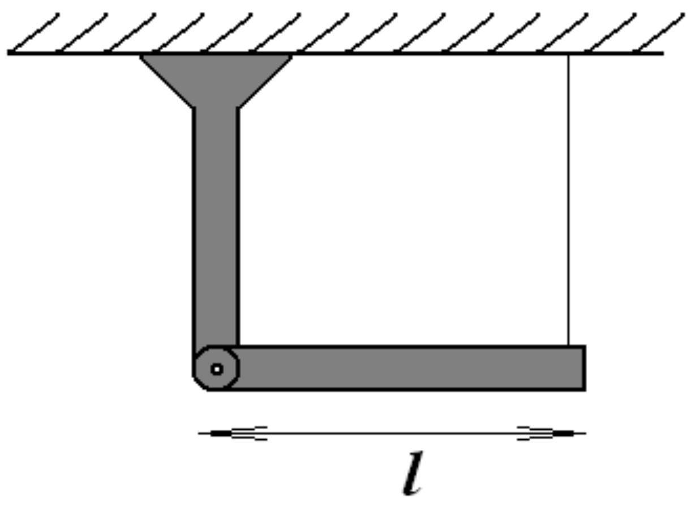
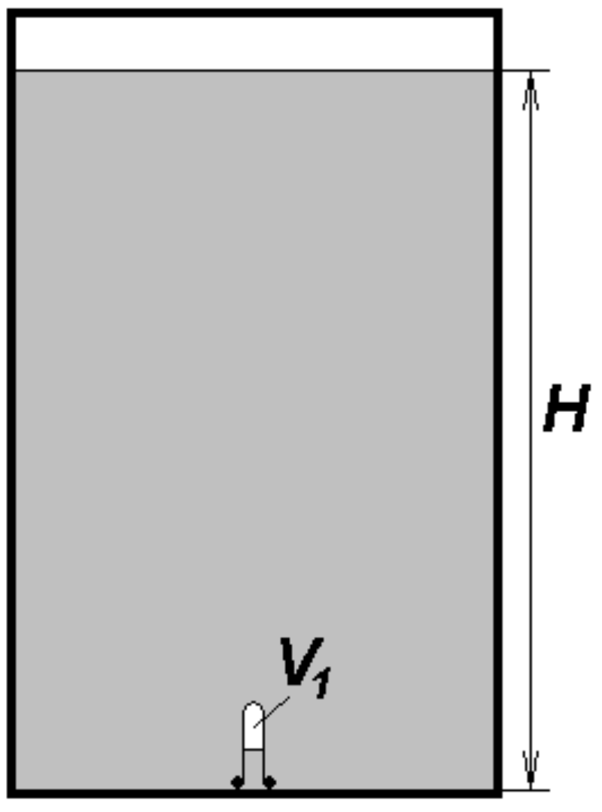
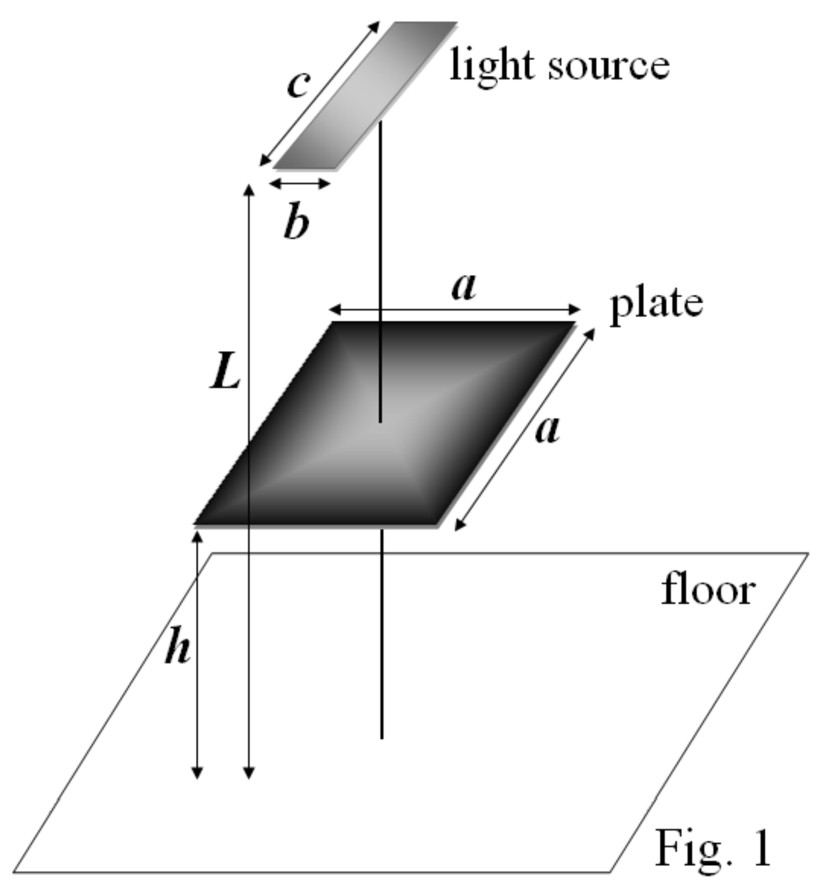
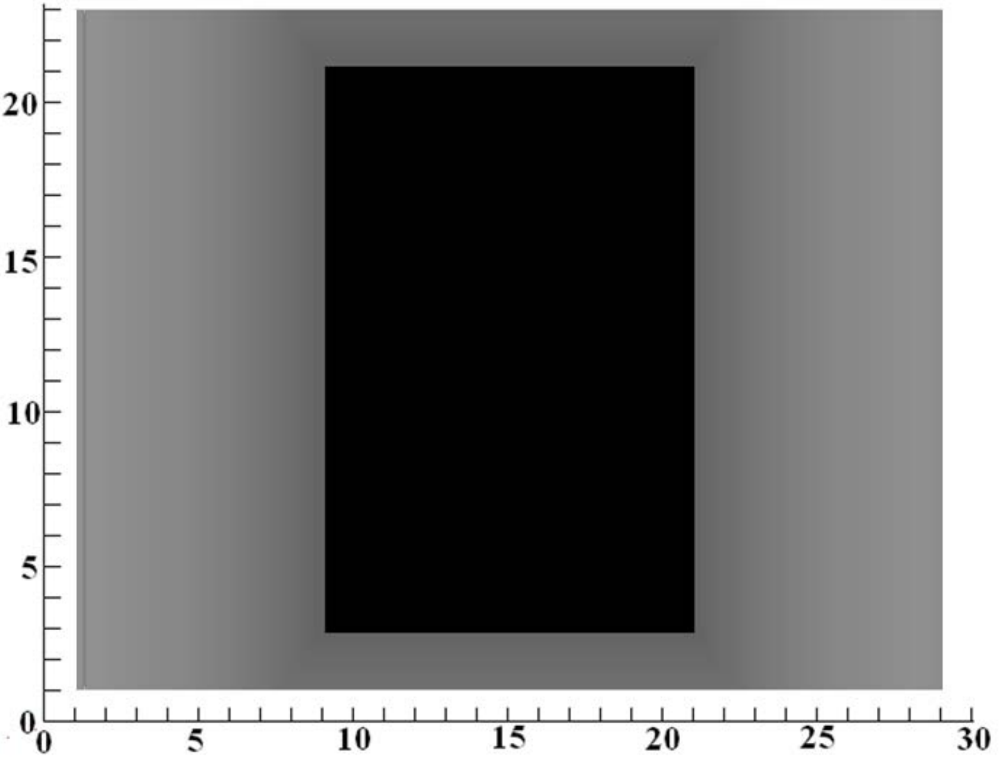

**Problem 1 (10 points)**
This problem consists of three unrelated parts.

**1A (3 points)**

One end of a homogeneous rigid rod with mass $m$ and length $l$ is suspended on the vertical support by an ideal joint, and the other end hangs on a thread such that the rod is in horizontal position. At a certain time point the thread is cut. Find the dependence of reaction force of the joint on the angle $\alpha$ of the rod deviation from the horizontal position.

**1B (4 points)**

Liquid is poured in a closed cylindrical vessel with thick walls. The height of the liquid level is H. The mass density of the liquid decreases linearly with the height from $\rho_{\text{max}}$ to small value which can be assumed to be equal to zero. Thin layer of vapor is saturated over the liquid surface but its pressure can be neglected with respect to the hydrostatic pressure of the liquid. Inverted test-tube of the volume $V_0$ is placed at the bottom of the vessel. The mass $M$ of the test-tube is concentrated at its neck, and its length is small compared to $H$. The gas of volume $V_1$ with negligible mass is placed inside the test-tube. The temperature of the system is kept constant. Can the test-tube stay motionless in the liquid at a certain height from the bottom? If it is possible,

what conditions are to be satisfied? What is the height of the test-tube position over the bottom in this case? Is this state stable? The volume of walls of the test-tube is small compared to $V_1$.

**1C (3 points)**

Rectangular light source of size $c \times b$ is fixed on the ceiling of the room of height $L = 3.0\ m$.

Opaque square plate with side $a = 10\ cm$ is placed horizontally under the lamp at a height $h$ above the floor (Fig. 1). Fig. 2 schematically shows the shape of the shadow casted by the plate on the room floor. The shadow consists of a dark rectangle surrounded by a lighter rectangle, and when approaching the edges of the outer rectangle the shade turns lighter. The value of the scale division in Fig. 2 is $1.0\ cm$. Find the sizes of the light source $b$ and $c$, and the height $h$ of the plate position. Specify the exact orientation of the light source with respect to the plate shadow.

