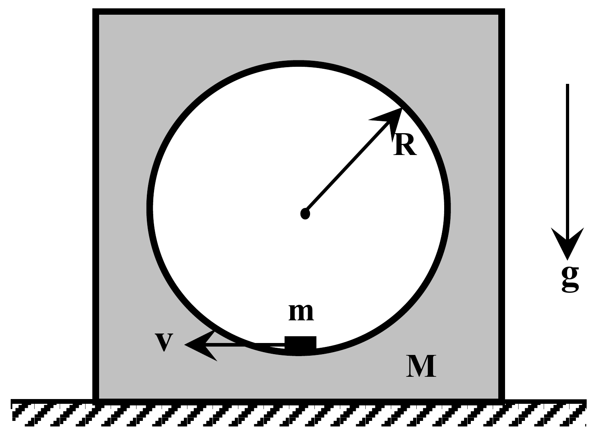
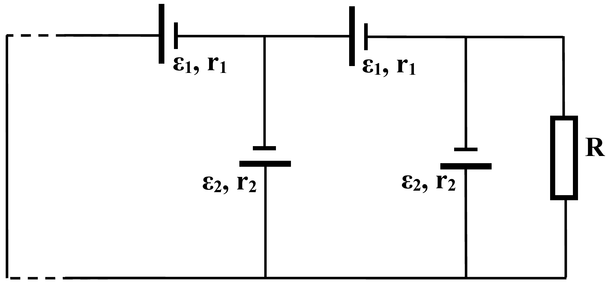
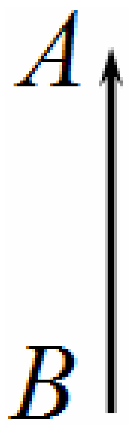
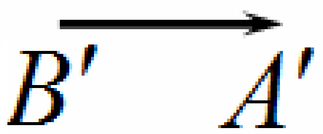

**Problem 1 (10 points)**
This problem consists of three independent parts.

**1A (3.5 points)**

The body is a cube in the center of which a spherical cavity of radius $R$ is carved out. Inside the spherical cavity at its bottom there is a motionless puck whose geometric sizes are negligible. Find the minimal horizontal velocity (at all possible cube-to-puck mass ratios) which has to be imposed on the puck so as the cubic body should jump up from the table surface in the motion process followed. Friction in the system is completely absent. At which value of the cube-to-puck mass ratio $M/m$ that minimal velocity is achieved?

**1B (4 points)**

The resistance $R = 2.0\ \Omega$ is connected to an infinite number of current sources obtained by repetition as shown in the figure on the right. Find the electric current flowing through the resistance $R$. The emfs' and internal resistances of the sources are known to be $\varepsilon_1 = 2.0\ \mathrm{V}$, $r_1 = 1.0\ \Omega$, and $\varepsilon_2 = 1.0\ \mathrm{V}$, $r_2 = 2.0\ \Omega$.

**1C (2.5 points)**

In Figure on the right b, you can see the object AB and its image A'B' in a thin lens. By drawing method, please find:
a) the optical center of the lens (0.5 points);
б) the lens plane (1 point);
в) the main focuses of the lens (0.5 points).

Is the lens concave (diverging) or convex (collecting)?
Please write down the answer. (0.5 points).

