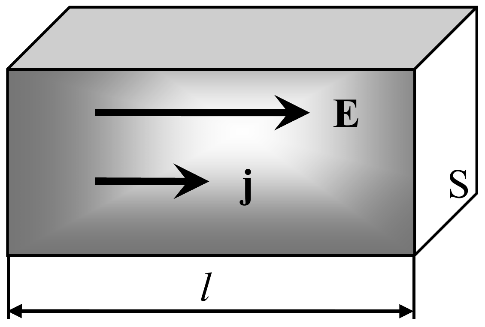
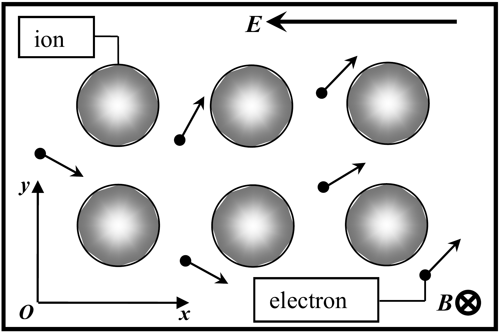

**Problem 2 (10 points)**
Electrical conductivity of metals (10 points)

## Ohm's law

Conductors are materials, usually metals, in which an ordered motion of free charges called an electric current is possible in the presence of an external electric field. The law relating the electric current strength $I$ flowing through the conductor with a voltage $U$ applied to its ends was experimentally discovered by Georg Ohm (1787-1854) and has the following form:

$$
I = \frac{U}{R}, \tag{1}
$$

where $R$ is called the resistance of the conductor.

Consider a small element of the metallic material with the length $l$ and the cross section $S$, whose ends are subject to the voltage $U$. Let $\sigma$ be the specific electrical conductivity of the substance which is the quantity inverse to the specific electrical resistivity $\rho$. The resistance of the conductor and the electric current strength flowing through it are written as

$$
R = \rho\frac{l}{S} = \frac{1}{\sigma}\frac{l}{S}, \quad I = jS, \tag{2}
$$

where the current density $j$ is introduced, representing the amount of the electric charge that passes through the unit of the cross section in the unit of time. The current density depends on the electron number density and electron **average ordered velocity**.

Taking into account that $E = U/l$ stands for the electric field strength, the local (differential) form of Ohm's law is obtained from Eqs. (1) and (2) as

$$
j = \sigma E. \tag{3}
$$

Accounting for the same direction of the electric field strength and the current density vectors, relation (3) can be rewritten in vector form

$$
\mathbf{j} = \sigma\mathbf{E}. \tag{4}
$$

1. [1 point] Starting from the Joule-Lenz law, discovered first by James Joule and later by Heinrich Lenz, determine the volume density of the thermal power $P_V$ released in the conductor, i.e. the amount of heat generated by the electric current in the unit volume $1\ \mathrm{m}^3$ in the unit of time $1\ \mathrm{s}$. Express your answer in terms of $E$ and $\sigma$.

## The Drude model

After the discovery of the electron in 1900 by Joseph John Thompson, German physicist Paul Drude proposed the so-called classical theory of electrical conductivity of metals. According to this theory, the electrons with the number density $n$, the mass $m$ and the electric charge $-e$ can move freely in the ionic crystal lattice of metal, occasionally colliding with ions located at the sites and thereby transferring their kinetic energy to ions.

Real motion of an electron is very complicated because of the chaotic thermal motion. Under the influence of the external field, all electrons acquire the same acceleration and thus gain some extra velocity. This results in an ordered motion of electrons causing an electrical current to appear. We are only interested in that ordered motion of electrons which is superimposed on their random thermal walks.

Since the real picture of the electrical conductivity is very complicated, we adopt the following simplified model. Assume that an electron with an initial zero velocity accelerates over time interval $\tau$ and then collides with an ion at the site, thereby transferring all the acquired kinetic energy. Then it again starts to accelerate and over time interval $\tau$ collides with another ion and so on. Keeping this in mind find answers to the following: *In those processes the electrons do not interact with each other.*

2. [1 point] Determine the vector of average ordered velocity of electrons $\mathbf{u}$. Express your answer in terms of $e$, $\mathbf{E}$, $m$, and $\tau$.
3. [1 point] The current density in the sample is determined by the average velocity component parallel to the external electric field strength $E$. Show that Ohm's law holds in this simplified model and determine the specific conductivity $\sigma$ of the metal. Express your answer in terms of $e$, $n$, $m$, and $\tau$.
4. [1 point] Determine the amount of the kinetic energy $Q_V$ transferred by electrons to the crystal lattice in the unit volume $1\ \mathrm{m}^3$ and in the unit of time $1\ \mathrm{s}$. Express your answer in terms of $e$, $\mathbf{E}$, $n$, $m$, and $\tau$.

## Magnetoresistance

One of the important galvanomagnetic phenomenon is the change in the conductivity of a conductor that is subject to an external transverse magnetic field. This phenomenon is called a magnetoresistance effect. Due to experiments, the relative deviation of the specific conductivity $\Delta\sigma/\sigma$ at not very strong magnetic field with the induction $B$ is given by the formula

$$
\frac{\Delta\sigma}{\sigma} = \frac{\sigma(B) - \sigma(B=0)}{\sigma(B=0)} = \mu B^{\nu}, \tag{5}
$$

where $\mu$ and $\nu$ are some constants.

*Making use of the Drude model described above, solve the following problems. Carefully examine figure 2 presented above, since it represents the system of coordinates in use and displays directions of all vectors.*

5. [1 point] Find the dependences on time $t$ of the projections $u_x(t)$ and $u_y(t)$ of the electron velocity between two consecutive collisions. Express your answer in terms of $e$, $E$, $B$, $m$, and $t$.
6. [2 points] The current density in the sample is determined by the average velocity component parallel to the external electric field strength $E$. Assuming that the magnetic field induction $B$ is small enough, find the constants $\mu$ and $\nu$ in formula (5). Express your answer in terms of $e$, $m$, and $\tau$.

## The Hall effect

In 1879, Edwin Hall discovered the phenomenon of appearance of the transverse potential difference, later called the Hall voltage, by placing the current-carrying conductor in a constant transverse magnetic field.

In the simplest consideration, the Hall effect is described as follows. Suppose that an electric current flows through a metal bar due to the applied external electric field of the strength $E$ and is placed in a weak transverse magnetic field of induction $B$. The magnetic field deflects electrons from their straight-line motion to one of the bar faces. Thus, the Lorentz force, in contrast to the magnetoresistance effect, causes the accumulation of the negative charge near one of the bar faces and the positive charge near the opposite face. The accumulation of charge persists until the transverse electric field $E_H$, generated by the accumulated charges themselves (directed along the axis $Oy$ as shown in the figure above), **does totally compensate** for the transverse displacement of electrons over the time interval $\tau$.

*Making use of the Drude model, described above, solve the following problems. Carefully examine figure 2 presented above, since it represents the system of coordinates in use and displays directions of all vectors.*

7. [0.5 points] Look carefully at the second figure above. Near which of the faces, the top or the bottom, is the negative charge accumulated?
8. [1.5 points] Find the dependences on time $t$ of the projections $u_x(t)$ and $u_y(t)$ of the electron velocity between two consecutive collisions. Express your answer in terms of $e$, $E$, $E_H$, $B$, $m$, and $t$.
9. [1 point] Find the Hall electric field strength $E_H$. Express your answer in terms of $e$, $E$, $B$, $m$, and $\tau$, and then in terms of $e$, $j$, $B$, and $n$.

*In solving these problems you can use the following approximate formulae valid for small values of $x$:*

$$
\begin{aligned}
& \sin x \approx x - \frac{x^3}{6} \\
& \cos x \approx 1 - \frac{x^2}{2} + \frac{x^4}{24}
\end{aligned}
$$
