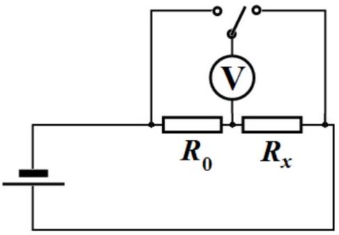
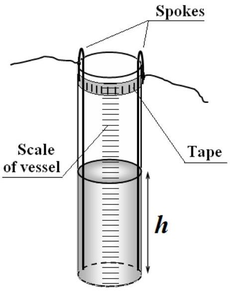
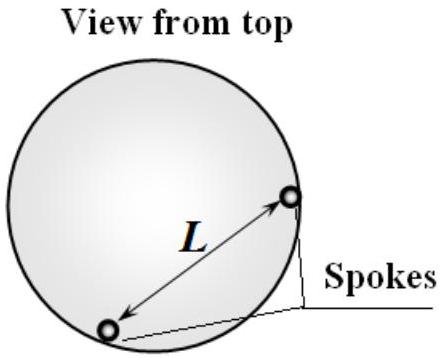
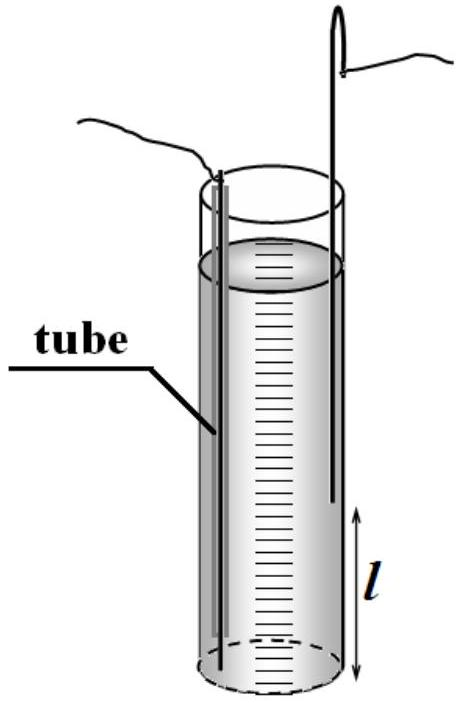

## EXPERIMENTAL COMPETITION

18 January, 2012
Please read the instructions first:

The Experimental competition consists of one problem. This part of the competition lasts 3 hours.

Please only use the pen that is provided to you.

You can use your own non-programmable calculator for numerical calculations. If you don't have one, please ask for it from Olympiad organizers.

You are provided with Writing sheet and additional papers. You can use the additional paper for drafts of your solutions but these papers will not be checked. Your final solutions which will be evaluated should be on the Writing sheets. Please use as little text as possible.

You should mostly use equations, numbers, figures and plots.
Use only the front side of Writing sheets. Write only inside the bordered area.
Fill the boxes at the top of each sheet of paper with your country (Country), your student code (Student Code), the question number (Question Number), the progressive number of each sheet (Page Number), and the total number of Writing sheets (Total Number of Pages). If you use some blank Writing sheets for notes that you do not wish to be evaluated, put a large X across the entire sheet and do not include it in your numbering.

At the end of the exam, arrange all sheets for each problem in the following order:

Used Writing sheets in order;

- The sheets you do not wish to be evaluated
- Unused sheets and the printed question.
- Place the papers inside the envelope and leave everything on your desk. You are not allowed to take any paper or equipment out of the room

## Electric currents in volume [15 points]

Instruments and equipment: Vessel 250 ml, two steel spokes, multimeter, power supply (4.5 V battery), resistor with a resistance of several k $\boldsymbol{\Omega}$, two-pole switch, plastic tube for a cocktail, connecting wires, clean water, plastic cup, rubber, ruler, and adhesive tape.

You should be familiar with the formula for calculating the resistance of a thin cylindrical conductor,

$$
R=\rho \frac{l}{S},
$$

where $\rho$ is the specific resistance of the conducting material, $l$ is its length, $S$ is its crosssectional area.

However, when an electric current flows in a bulk system, trajectories of charged particles may be different, so the resistance of the medium depends on the nature of the distribution of electric currents. You have to measure the electric resistance of the water layer when the current flows between the spokes submerged in water.

From time to time clean the spokes with rubber.
After each series of experiments, change water in the vessel.
Do not apply strong current through the water because this leads to appearance of a large number of ions in that can "spoil" the results of your experiments.

Straighten the spokes. In all the experiments try to maintain the spokes in parallel to each other.

Part 1. [0.5 points]
1.1 Measure the resistance of the given resistor $R_{0}$ by using the multimeter. Record the result of your measurement.

To measure the resistance of the water between the spokes, use an electric circuit shown in the figure on the right. Here, $R_{0}$ is the given resistor, $R_{x}$ is the resistance of the water between the spokes to be measured.
1.2 For this circuit write down the formula which will be used by you to calculate the water resistance $R_{x}$ between

the spokes.

In the following, please use only the circuit above to obtain the resistance $R_{\boldsymbol{x}}$ ! In any case do not measure water resistance directly by the multimeter. Use multimeter only as a voltmeter.

Direct measurement of the resistance with a multimeter leads to a rapid discharge of its battery, and in addition, the voltage of the battery is rather high ( 9 V) to change the electrical properties of water.

Error analysis is not required in this Competition.

Part 2. [5 points]
Put the two spokes provided along the vessel walls keeping them in parallel at a maximum distance from each other. Bend the upper ends of the spokes over the edges of the vessel. Additionally fix them with strips of adhesive tape.
To measure the height of the water level use the scale engraved on the vessel. Determine in millimeters the grating period of the scale engraved on the vessel wall.
2.1 Measure dependence of the water resistance between the spokes as a function of the height of water poured into the vessel. Plot the obtained dependence in a graph.

2.2 Draw schematic streamlines of electric current in this case (make two draws: one in the plane of the spokes and the other in the plane perpendicular to the spokes).

Streamlines of electric current are trajectories of charged particles.
2.3 On the basis of physical considerations about the nature of this current flow, make an assumption about the form of the obtained experimental dependence $R(h)$, and write it as a formula.
2.4 Using the linearization method, check the validity of the made assumption by plotting a graph in such coordinates that it becomes a straight line $y=a x+b$. Determine the numerical values of the parameters of the linearized dependence, as well as the unknown values of parameters entering the function $R(h)$.

Part 3. [3.5 points]

Fix one spoke close to the wall inside the vessel. Pour 200 ml of water into the vessel. Move the second spoke along the wall, changing the distance between the spokes. The depth of immersion of the second spoke should be maximal. Spokes should be positioned vertically and in parallel to each other.

3.1 Measure the water resistance between the spokes as a
function of the distance $L$ between them. Plot the obtained dependence.
3.2 On the basis of physical considerations about the nature of this current flow, make an assumption about the form of the obtained experimental dependence $R(L)$, and write it as a formula.
3.3 Using the linearization method, check the validity of the made assumption by plotting a graph in such coordinates that it becomes a straight line $y=a x+b$. Determine the numerical values of the parameters of the linearized dependence, as well as unknown values of parameters entering the function $R(L)$.

## Part 4. [4 points]

Put one spoke into the given plastic tube so that its lower end of a length of about 1 cm remains uncovered by the tube. Fill the vessel with water about to top end. The upper edge of the tube should be placed above the water level, and fixed to the spoke by the tape. Put the second uncovered spoke into the water keeping its lower end at different heights. Keep the spokes in parallel at a maximum distance from each other.
4.1 Measure the water resistance between the spokes as a function of the height $l$ of the end of the second spoke. Plot the obtained dependence in a graph.
4.2 Draw a schematic streamlines of electric current in this case (in the plane of the spokes).

4.3 On the basis of physical considerations on the nature of current flow, make an assumption about the form of the obtained experimental dependence $R(l)$, and write it as a formula.
4.4 In the plot, specify the range of values of $l$ in which the assumed formula for $R(l)$ is confirmed experimentally.
4.5 Determine the numerical values of the parameters entering the assumed formula for $R(l)$.

## Part 5. [2 points]

5.1 On the basis of the above obtained experimental data (please choose which one to use) estimate the specific resistance of the water $\rho$.
