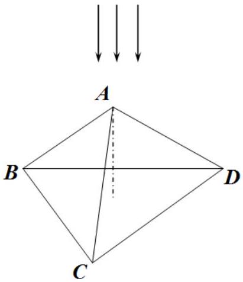
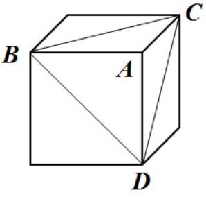

## Problem 1 (10 points)   This problem consists of three independent parts.

## Problem 1.A Pulley (5,0 points)

The rope of length $L$ and mass $m$ is put on the pulley of radius $R$. The rope begins to slide off the pulley without friction. Consider the time moment when the difference in height between the hanging ends of the rope is equal half of the rope length. For this time moment find the following:

1. acceleration of the rope;
2. the tension of the rope at the top of the pulley;
3. the point of the rope at which the tension is maximum (it is enough to find the angle between the radius to that point and the vertical).

## Problem 1.B Assistant Vapor (2.0 points)

In the physical laboratory the thermometer reading was 20 °C, and the barometer reading was 1 atm. The laboratory assistant Vapor pulled out a sturdy vessel of the closet, poured some water into it and sealed it with the lid. Then assistant Vapor slowly heated the vessel to the temperature 200 °C. At this temperature, the pressure in the vessel turned out to be 2,88 atm. Find the temperature at which all the water evaporated. Justify your answer.

## Problem 1.C Pyramid (3.0 points)

A regular triangular pyramid $A B C D$ is made of a transparent material with the refraction index $n=1,6$. All angles at the top of the pyramid are right. The base of the pyramid forms a right triangle whose sides' lengths are equal $a=2,0 m m$. The pyramid can be thought of as "a corner cut off from the cube." The pyramid is homogeneously illuminated such that the light falls along its height, perpendicular to the base plane.

1. Draw an area at the base of the pyramid illuminated by the light refracted in the plane $A B C$.
2. A screen is placed in parallel to the pyramid base at a distance of $L=10 s m$ from it. Draw areas illuminated by the light refracted by the pyramid. Specify the position and sizes of these areas.
