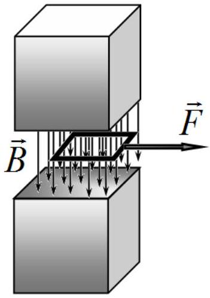

## Problem 2 (10 points)   Square frame (10 points)

A square frame of side $a=10.0 s m$ is placed in a uniform magnetic field of $B=1.00 \times 10^{-1} T$ generated by a permanent magnet. Completely neglect edge effects, assuming that the magnetic field between the poles of the magnet is uniform and is equal to zero outside of it. In all parts of the problem assume that at the initial time moment the frame of mass $m=5.00 g$ is at rest at the edge of the poles of the magnet, see figure.

1. [0.2 points] Redraw schematically the figure on the right to identify which of the poles of the magnet is the north $N$ and which is the south $S$.

## Part A

Let the frame be made of a conductive material with the resistance $R=1.00 \times 10^{-2}$ ohm and a negligible inductance. At the time momnet $t=0$ the frame is subject to the constant force $F=1.00 \times 10^{-4} N$, which pulles the frame out of the magnetic field.
2. [1.2 points] Find an analytical dependence of the frame velocity $\mathrm{v}(t)$ on time $t$ assuming that the frame remains at all times between the poles of the magnet. Express your answer in tems of $B, a, m, R$ and $t$.
3. [0.8 points] Write down an exact equation to determine the time interval $t_{0}$ at which the frame moves between the poles of the magnet. Express your answer in terms of $B, a, m, R$ and $t_{0}$. Estimate $t_{0}$.
4. [1.2 points] Draw a graph of the frame velocity $\mathrm{v}(t)$ on time $t$ in the interval from 0 to $12 s$.
5. [1.2 points] Draw a graph of the frame current $I(t)$ on time $t$ in the interval from 0 to $12 s$.

## Part B

Let the frame be made of a superconducting material with the inductance of $L=1.00 \times 10^{-1} H$, the same mass and sizes. At the time momnet $t=0 \mathrm{~s}$ the frame is subject to a constant force which pulles the frame out of the magnetic field.
6. [1.8 points] Find the minimum force $F_{\text {min }}$ with which the frame can be pulled out of the magnet. Express your answer in terms of $B, a, L$ and calculate its numerical value.
7. [0.6 points] At the assumptions of section 6 find the minimum time interval $t_{0}$ of the maximum departure of the frame out of the magnet. Express your answer in terms of $m, B, a, L$ and calculate its numerical value.
8. [1.0 points] Draw a graph of the frame current $I(t)$ on time $t$ in the interval from 0 to $4 t_{0}$.

## Part C

A square frame with sides $a$ is made of a conductive material with the inductance $L$,the resistance $R$ and the mass $m$. At the time moment $t=0$ the frame is given an initial velocity $\mathrm{v}_{0}$ directed exactly as the force in the figure above. It is known that at the time moment when the frame almost leaves the magnet its velocity turns zero.
9. [2.0 points] Find an analytical expression for the frame current $I_{0}$ at the time moment when the frame velocity turns zero. Express your answer in terms of $B, a, m, L, R$ and $\mathrm{v}_{0}$.
