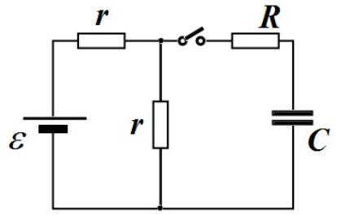

## Problem 1 (10 points)   This problem consists of three independent parts.

## Problem 1A (3.0 points)

Steam engine consists of a vertical cylindrical vessel, in which a piston can move without friction. There is some water in the vessel with an electrical heater located inside. Steam engine cycle consists of four stages, as shown in the figure on the right:

1. A load is placed on the piston, the heater is switched on making the water boiling and the vapor lifts up the piston with the load.
2. Once the piston has risen to some height, the load is quickly removed and the heater is immediately switched off.
3. The vapor under the piston cools down and condenses, the piston moves down slowly .
4. Once the piston has come down to some other height, the load is again put on the piston. Draw a $(P, V)$ diagram schematically showing the cycle of the steam engine and find its efficiency.
The atmospheric pressure is $P_{0}=1.0 \cdot 10^{5} P a$, the piston mass is $M=2.0 k g$, the piston area is $S=10 c m^{2}$, the load mass is $m=1.0 k g$, and the free fall acceleration is $g=9.8 m / s^{2}$. Assume that there is nothing under the piston except for the water vapor, and the dependence of the pressure of the saturated water vapor in the temperature range under consideration is approximated by the formula $P=a t-b$, where $a=4,85 k P a / K, b=384 k P a, t$ is the temperature in degrees Celsius.

## Problem 1B (5.0 points)

In the circuit shown in the figure on the right, all the electrical components are ideal and their parameters are assumed to be given. Before switching on the key, the capacitor has been discharged. Find an amount of heat releasing in the resistor $R$ after the key has been switched on.

## Problem 1C (2.0 points)

Thin lens gives an image of the object, located perpendicular to its optical axis. The image size is $1 c m$. If the distance from the object to the lens is increased by $5 c m$, the image size remains 1 $c m$. Find the image size if the distance from the object to the lens is increased by another $5 c m$.
