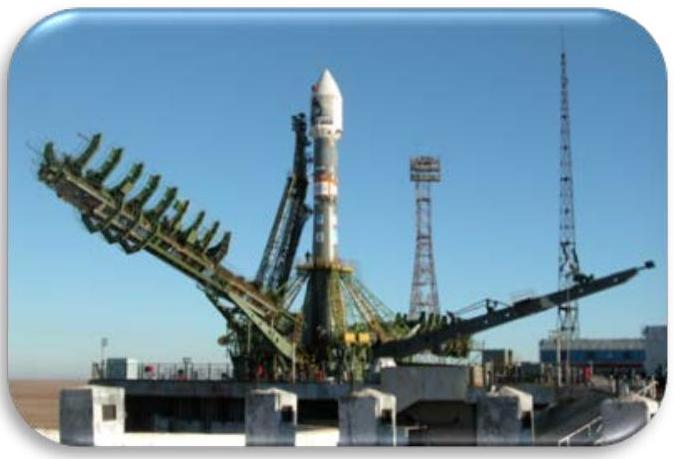

## Problem 2 Jet propulsion (10 points)

In a rocket engine thrust is created by the release of products of fuel combustion in the direction opposite to its motion. It is, of course, natural that the mass of the rocket decreases in the acceleration process. This idea was first proposed by the great Russian scientist K. Tsiolkovsky to implement the motion of objects in a vacuum, for example, in outer space. Nowadays space flights have become habitual. It is widely known that the space launching site, Baikonur, is situated on the territory of Kazakhstan. The first satellite and the first cosmonaut, Yu. Gagarin, were sent into space from Baikonur which is now a

complex of high-tech facilities intended to launch manned spacecraft into space, in particular, to the International Space Station.

## Classical rocket

Let a rocket have an initial mass $m_{0}$ and let a fuel velocity relative to the rocket be constant and equal $u$. Assume that at the initial time moment the rocket is at rest in the laboratory frame of reference and no external force is present.

1. [0.5 points] Find the rocket velocity v as a function of its mass $m$. This formula is called after K. Tsiolkovsky. Express your answer in terms of $m, m_{0}, u$.
2. [0.5 points] An object of mass $m=1000 k g$ is required to be accelerated to the orbital velocity. Evaluate the initial rocket mass $m_{0}$, if the free fall acceleration is $g=9.80 m / c^{2}$ and the radius of the Earth is $R=6400 k m$ and $u=5,00 k m / s$.

Let a rocket move in the gravitational field of the Earth. The free fall acceleration $g$ is assumed to be constant, whereas the fuel consumption $\mu(t)=-d m(t) / d t$ may depend on time.
3. [0.75 points] Write down the equation of motion of a rocket in Earth's gravitational field. This equation is called after I. Meshcherskij. Express your answer in terms of $m, \mathrm{v}, u, g, \mu$.

Assume in the following that the fuel exhaust velocity $u$ is directed parallel to the free fall acceleration $g$, and the initial velocity of the rocket is zero.
4. [0.75 points] Find how the fuel consumption $\mu_{s t}(t)$ should depend on time $t$ in order for the rocket to hung motionless at some height. Express your answer in terms of $m_{0}, u, g, t$.

Assume now that the fuel consumption $\mu$ is also constant over time such that $\mu>\mu_{s t}(t)$.
5. [2.0 points] In this case the rocket velocity dependence on time $t$ can be represented as

$$
v(t)=A_{1} t+A_{2} \ln \left(1+A_{3} t\right),
$$

where $A_{1}, A_{2}, A_{3}$ are some constants.
Find $A_{1}, A_{2}, A_{3}$ and express them in terms of $m_{0}, u, g, \mu$.
6. [1.0 points] Suppose that the initial mass of the rocket is equal $m_{0}$, and the final mass is to be $m$. Find the maximum height $H_{\text {max }}$ that the rocket can reach and determine the corresponding optimum fuel consumption $\mu_{\text {opt }}$. Express your answer in terms of $m_{0}, m, u, g$.

## Relativistic rocket

In the previous part of the problem it has been assumed that the rocket moves with a nonrelativistic velocity. To implement interstellar travels it is necessary to accelerate the rocket to the speed close to that of light and, then, relativity effects cannot be ignored at the calculations.

To establish the characteristic features of the rocket motion in a relativistic case, we introduce the concept of the proper frame of reference. The proper frame of reference is an inertial frame of reference which moves with the speed of the rocket itself relative to the laboratory reference frame, i.e. it is the reference frame in which the rocket is at rest at any given time.
7. [2.5 points] Find the relation between the rocket acceleration in the proper reference frame $a_{p}$ and its acceleration in the laboratory frame of reference $a_{r}$ when the velocity of the rocket is v, and $c$ stands for the speed of light. Express your answer in terms of $a_{p}, a_{r}, \mathrm{v}, c$.
8. [1.5 points] Let the rocket be at rest at the initial time moment. Then, using the results of the previous question it can be shown that at any time moment the rocket mass in the proper reference frame is related to its speed in the laboratory reference frame as

$$
m=m_{0}\left(\frac{1-\mathrm{v} / c}{1+\mathrm{v} / c}\right)^{\alpha} .
$$

Find $\alpha$ and express it in terms of $u, c$.
9. [0.25 points] An object of mass $m=1000 k g$ is required to be accelerated to half the speed of light $\mathrm{v}=0.5 \mathrm{c}$ where the speed of light is $c=3.00 \cdot 10^{8} \mathrm{~m} / \mathrm{s}$. Evaluate the initial rocket mass together with the fuel $m_{0}$ and write it down as a power of 10, if the fuel exhaust velocity is $u=5,00 k m / s$.
10. [0.25 points] It can be shown that from the practical point of view the best rocket is the one that exploits photons rather than hot gases produced at the fuel combustion. An object of mass $m=1000 k g$ is required to be accelerated to half the speed of light $\mathrm{v}=0.5 \mathrm{c}$. Evaluate the initial rocket mass together with the fuel $m_{0}$.
