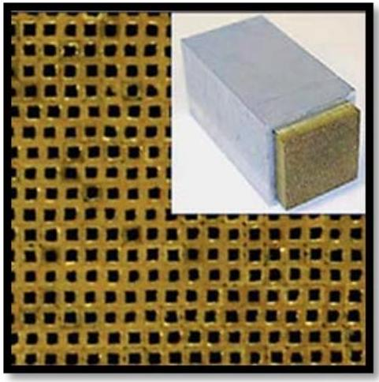

## Problem 3 Metamaterials (10 points)

Metamaterials are composite materials whose properties are due not so much to the properties of its constituent elements but due to artificially tailored periodic structures. Metamaterials are synthesized in modern nanolaboratories by implantation different periodic structures with a variety of geometric shapes into the original natural material, which substantially modifies its physical properties. In a very rough approximation, those implants can be treated as artificially made atoms of extremely large size immersed into the original material. While synthesizing the metamaterial Ddveloper has the opportunity of varying various free parameters (structure sizes and constant or varying period between them, etc.).

In one nanolaboratory the metamaterial has been manufactured in the form of a wire of the length $L=5.00 c m$ and radius $R=1.00 m m$, whose conductivity depends on the distance from its axis according to the law $\sigma_{0}=\beta r$. Physical properties of the wire have been experimentally measured and are presented in the following table:

| PHYSICAL PROPERTY | NUMERICAL VALUE |
| :--- | :--- |
| Conductivity $\sigma_{0}=\beta r$ | $\beta=1.00 \times 10^{9} \mathrm{~S} / \mathrm{m}^{2}$ |
| Heat transfer coefficient | $\alpha=20 \mathrm{~W} /\left(m^{2} \cdot K\right)$ |
| Thermal conductivity coefficient | $\kappa=0,01 W /(m \cdot K)$ |
| Young's modulus | $E=1.00 \times 10^{7} \mathrm{~Pa}$ |
| Linear expansion coefficient | $\gamma=1.00 \times 10^{-6} \mathrm{~K}^{-1}$ |

1. [1.0 points] Find an analytic formula for the total resistance $R_{0}$ of the wire, and calculate its numerical value.

An electric current $I=1 A$ is made to pass through the wire. It is known that the heat exchange with the environment obeys the Newton-Richman law,

$$
P_{e x t}=\alpha\left(T_{s}-T_{0}\right),
$$

where $P_{\text {ext }}$ stands for the power loss per unit surface of the wire with the surface temperature $T_{s}$, $T_{0}=293 K$ denotes the ambient temperature and $\alpha$ is a constant, called the heat transfer coefficient.
2. [1.0 points] Find an analytic formula for the surface temperature $T_{s}$ of the wire and calculate its numerical value.

The wire temperature varies with the depth due to the phenomenon known as thermal conductivity, which is described by the Fourier law

$$
P=-\kappa S \frac{\Delta T}{\Delta x},
$$

where $P$ designates the power of the heat flow between the opposite faces of the parallelepiped with the square $S, \Delta T$ is the temperature difference between the faces of the parallelepiped situated at a distance $\Delta x$ from each other, and $\kappa$ is called the heat transfer coefficient.
3. [2.5 points] Find an analytic formula for the temperature $T_{\text {max }}$ in the center of the wire, and calculate its numerical value.
4. [0.5 points] Find an analytic formula for the change $\delta R_{T}$ of the wire radius due to its thermal expansion and calculate its numerical value.

Attention! In all further calculations assume that the wire is infinitely long.
5. [0.5 points] Find an analytic formula for the magnetic induction inside the wire as a function of the distance $r$ from its axis.
6. [1.0 points] Find an analytic formula for the energy of the magnetic field inside the wire, and calculate its numerical value.
7. [1.0 points] The electric current causes an appearance of mechanical stress in the wire. Find an analytic formula for the pressure $p(r)$ inside the wire as a function of the distance $r$ from its axis.
8. [1.0 points] Find an analytic formula for the mechanical stress energy $W_{\sigma}$ of the wire, and calculate its numerical value.
9. [1.0 points] Find an analytic formula for the change $\delta R_{\sigma}$ of the wire radius due to its mechanical stress, and calculate its numerical value.
10. [0.5 points] Find the value of the thermal expansion coefficient $\gamma$ such that the total change of the wire radius would be zero when an electric current was passing through it.

Help! The value of the magnetic constant is $\mu_{0}=4 \pi \cdot 10^{-7} \Gamma H / M$.
