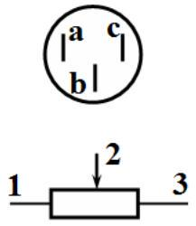

## EXPERIMENTAL COMPETITION

14 January, 2015

## Please read the instructions first:

1. The Experimental competition consists of one problem. This part of the competition lasts 3 hours.
2. Please only use the pen that is provided to you.
3. You can use your own non-programmable calculator for numerical calculations. If you don't have one, please ask for it from Olympiad organizers.
4. You are provided with Writing sheet and additional papers. You can use the additional paper for drafts of your solutions but these papers will not be checked. Your final solutions which will be evaluated should be on the Writing sheets. Please use as little text as possible. You should mostly use equations, numbers, figures and plots.
5. Use only the front side of Writing sheets. Write only inside the bordered area.
6. Fill the boxes at the top of each sheet of paper with your country (Country), your student code (Student Code), the question number (Question Number), the progressive number of each sheet (Page Number), and the total number of Writing sheets (Total Number of Pages). If you use some blank Writing sheets for notes that you do not wish to be evaluated, put a large X across the entire sheet and do not include it in your numbering.
7. At the end of the exam, arrange all sheets for each problem in the following order:
    - Used Writing sheets in order;
    - The sheets you do not wish to be evaluated
    - Unused sheets and the printed question.

Place the papers inside the envelope and leave everything on your desk. You are not allowed to take any paper or equipment out of the room

## Resistance of graphite (15 points)

Instruments and equipment: graphite rod, multimeter, power source (battery 4.5 V), fixed resistors 1.0 Ohm and 10 Ohm, variable resistor (use the sharp edge of the plastic ruler for its adjustment), connecting wires, stopwatch, vessel with snow.

Warning! Be careful, since the graphite rod is very fragile and may be easily broken. Connect it to a circuit with the clips called the "crocodile".

Graphite electrical resistance $R_{g}$ depends on its temperature. One can approximate that this dependence is linear

$$
R_{g}=R_{0}(1+\alpha \Delta T),
$$

wherein $\Delta T$ denotes the temperature difference between the room and the rod, $R_{0}$ is the resistance of the graphite rod at room temperature, $\alpha$ stands for the temperature coefficient of graphite resistance.

The room temperature will be announced during the experimental competition.
It can also be assumed that the power of the heat dissipated into the ambient air is proportional to the temperature difference between the rod and the air

$$
P=\beta \Delta T,
$$

where $\beta$ is the heat transfer coefficient.
Part 1. The current-voltage characteristic of a graphite rod
1.1 Use the multimeter (in this paragraph, use it in the mode of resistance measurements) to determine which of its pins corresponds to the sliding lead (indicated in the figure by 2).

1.2 Measure the dependence of the current through the graphite rod, which is placed in the air, on the voltage aceoss it.

For the measurements, use the multimeter in the mode of voltmeter since it works very unstable in the mode of ammeter. To measure current, use the resistor of 1.0 ohms. To change the current in a circuit use the variable resistor. Bear in mind that when the current flows through the rod it takes some time for the temperature to change. After changing the value of the variable resistor by turning its knob, you should wait at least 30-40 seconds before taking the readings.
1.2.1 Draw schematically an electrical circuit that you used for taking measurements.
1.2.2 Plot the graph of the dependence obtained. Derive a theoretical formula that describes this dependence.
1.2.3 Calculate the electric resistivity of graphite at room temperature. Estimate its experimental error. The relative error of each resistor is 5\%. The rod diameter is $d=1.0 \pm 0.05 m m$. To measure the length the graph paper may be used.
1.2.4 Show theoretically that in the steady state the electrical resistance of the graphite rod depends linearly on the power $P$ released in it due to the current flow

$$
R_{g}=R_{0}(1+\gamma P) .
$$

1.2.5 Using the obtained experimental data, calculate the dependence of the resistance of the graphite rod on the power $R_{g}(P)$. Plot the corresponding graph.
1.2.6 Using the corresponding graph write down a range of powers for which formula (1) holds. Evaluate the value of $\gamma$ for this particular range. Error estimation is not required.
1.3 Measure the dependence of the current through the graphite rod on the voltage across it $I(U)$, when the rod is immersed into the melting snow.
1.3.1 Plot the graph of the obtained dependence.
1.3.2 Evaluate the temperature coefficient of graphite resistance and estimate its experimental error $\Delta \alpha$.

Part 2. Cooling of the graphite rod
To measure small changes in resistance it is preferable to use a bridge circuit (see. Fig.). One of the wires connected to the battery can be placed in two positions:
1 - measurement mode;
2 - heating mode.
By turning the knob of the variable resistor, it can be ensured that the voltage across the voltmeter is equal to zero (or close to it). In this case the bridge is called balanced. Take resistor of 10 ohms as a resistor $R_{1}$.

If you change the resistance $R_{g}$ of the graphite rod, the voltage across the voltmeter turns non zero. In this case it can be shown independently (you do not need to do that), that the voltage across the voltmeter is proportional to the change in the resistance of the graphite rod.
2.1 Without heating the rod, place the battery wire in the measurement mode (position 1). Use the knob of the variable resistor to make the multimeter readings close to zero (as close as possible).

Quickly switch the same battery wire in position 2, heat the rod by waiting for at least 1 minute. Then quickly switch the battery wire back in position 1 and measure the dependence of voltage on time.
2.2 Plot the dependence obtained.
2.3 If the rod is connected to a DC voltage source, but its temperature differs from the stationary one $\bar{T}$,, then the change of temperature $T$ over time $t$ is approximately governed by the equation

$$
\frac{d T}{d t}=-\frac{1}{\tau}(T-\bar{T}) .
$$

Using the experimental data verify the validity of this equation. Calculate the value of the characteristic time $\tau$ of thermal equilibration. Error estimation is not required.
