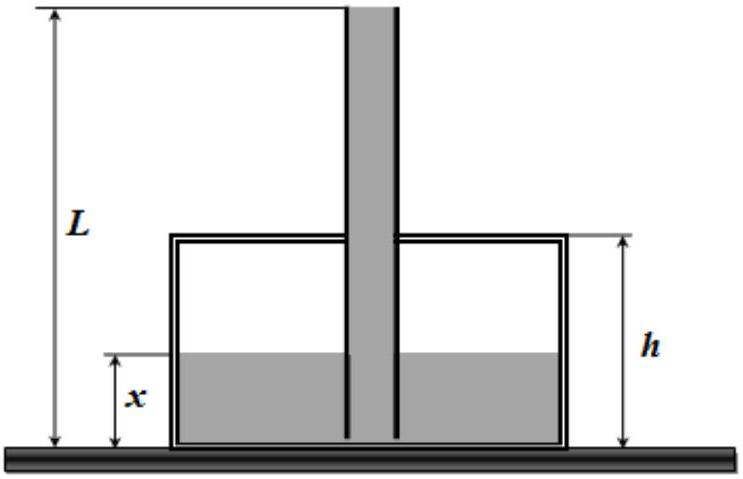

## Problem 2. Vessel with water (7 points)

In the cylindrical vessel with the cross section area $S=0.500 m^{2}$ and height $h=0.500 m$ a tube of length $L=2.00 m$ with opened ends is inserted vertically through the hermetically sealed lid. The lower end of the tube is a bit above the bottom of the vessel. Water with the density $\rho=$ $1000 k g / m^{3}$ is poured into the vessel as shown in the figure on the right. The cross section area of the tube is much smaller than the cross section area of the vessel and the vessel wall material conducts heat very well. Assume that the atmospheric pressure is $p_{0}=1.01 \cdot 10^{5} P a$, the ambient temperature is $T_{0}=$ $293 K$ and the acceleration of gravity is $g=$

$9.80 m / s^{2}$.

1. [2.0 points] Find the height of the water level in the vessel $x=x_{0}$ at the time moment when the tube is completely filled with water. Express your answer in terms of $p_{0}, \rho, g, h, L$, and find its numerical value.

Now, assume that the walls of the vessel and the tube are coated with a material which does not conduct heat at all. The air inside the vessel is then heated fast enough such that the water does not have enough time to warm up.
2. [0.5 points] Find air pressure inside the vessel $p(x)$ as a function of $x$. Express your answer in terms of $p_{0}, \rho, g, L, x$.
3. [1.0 points] Find air temperature inside the vessel $T(x)$ as a function of $x$. Express your answer in terms of $p_{0}, p, g, L, x$.
4. [1.0 points] Find the temperature $T_{m}$ to which the air in the vessel must be heated in order to displace all the water from the vessel. Express your answer in terms of $p_{0}, \rho, g, L, T_{0}$ and find its numerical value.
5. [2.5 points] Find the amount of heat $Q$, which must be given to the air in the vessel in order to displace all the water from the vessel. Express your answer in terms of $p_{0}, \rho, g, h, L, S$, and find its numerical value.
