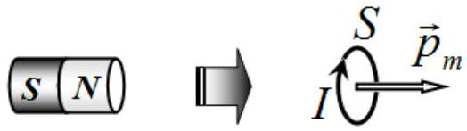
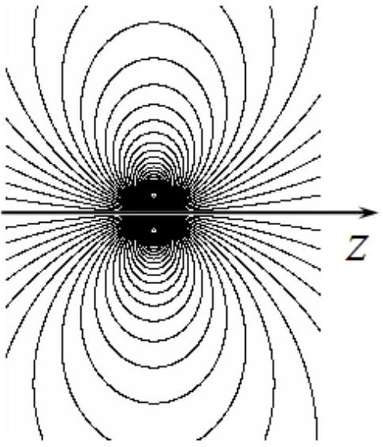
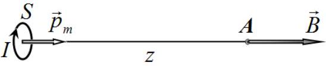
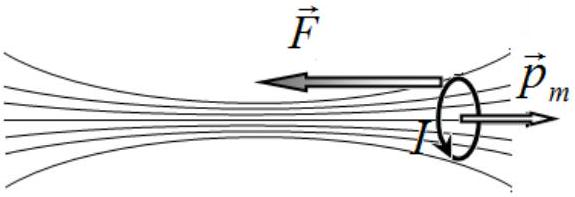
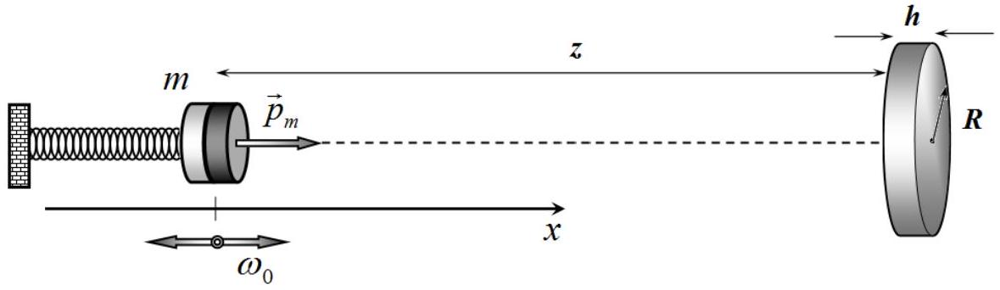
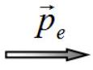
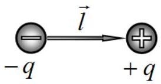
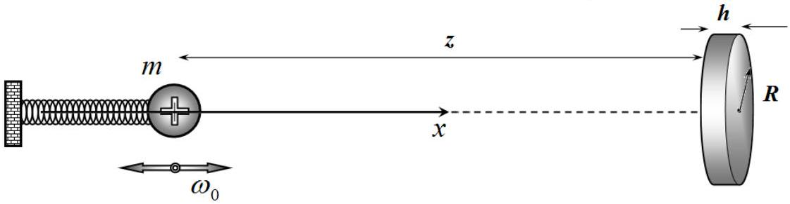

## Problem 3. Delay and attenuation (16 points)

In this problem, do not take into account the finiteness of the propagation speed of the electromagnetic interaction.

## Part 1: Magnet   1.1 Theoretical introduction

The magnetic field generated by a uniformly magnetized ferromagnetic cylinder (permanent magnet) is equivalent, at very large distances, to the field produced by a circular coil with a constant electric current.

The cylindrical magnet, as well as the coil with the current, are characterized by magnetic moment $p_{m}$, which is defined for the current loop as the product of the current and the area of the loop,

$$
p_{m}=I S .
$$

Such a source of magnetic field is also referred to as a magnetic dipole. The figure shows the magnetic field lines of such a dipole.
1.1.1. [0.75 points] Show that the magnetic field, $B_{z}$, on the axis of the dipole is determined at large distances by the formula

$$
B_{z}=b \frac{p_{m}}{z^{\beta}},
$$

where $z$ is the coordinate measured along the axis of the dipole from its center. Find the values of the parameters $b$ and $\beta$ in the above formula.
1.1.2. [1 point] Let the coil with a current (i.e., magnetic

dipole) with the magnetic moment $p_{m}$ is influenced by an inhomogeneous axially symmetric field, the induction of which along the z-axis depends on $z$ as function $B_{z}(z)$. Dipole axis coincides with the axis of symmetry of the field. Show that the force acting on the dipole from the magnetic field is given by

$$
F_{z}=-p_{m} \frac{d B_{z}}{d z} .
$$

### 1.2 Oscillations of the magnet

Cylindrical magnet of mass $m$ and magnetic moment $p_{m}$, is attached to the spring of stiffness $k$ such that it can oscillate along the horizontal axis which is directed along the magnetic moment.
1.2.1. [0.25 points] Find the frequency $\omega_{0}$ of free oscillations of the magnet in the absence of external fields.

At some distance $z$ from the equilibrium position of the magnet a small metal disc is placed such that its axis coincides with the axis of the magnet. The disk has radius $R$ and thickness $h(h \ll R \ll z)$, the electrical resistivity of the disk material is $\rho$, and the magnetic permeability is put equal to $\mu=1$. The magnet is moved from the equilibrium position and starts performing small oscillations described by function $x(t)$, where $x \ll z$.
1.2.2. [2 points] Find the force $F(x, v)$ exerted by the disc on the magnet as a function of its coordinate $x$ and velocity $v$. Write down the equation of motion of the magnet.

1.2.3. [0.75 points] Find the relative change $\Delta \omega / \omega_{0}$ in the oscillation frequency of the magnet caused by the influence of the disc.
1.2.4. [0.25 points] Assuming that the attenuation is rather weak, obtain the characteristic attenuation time of the oscillations of the ball.
1.2.5. [1.5 points] Show that the loss of the mechanical energy of the magnet is equal to the amount of heat released in the disk for the same time period.

## Mathematical tip

The equation of attenuating oscillations

$$
d^{2} x / d t^{2}+2 \beta d x / d t+\omega_{0}^{2} x=0
$$

has the solution

$$
x(t)=A \exp \left(-\frac{t}{\tau}\right) \cos (\omega t+\varphi),
$$

where $\omega=\sqrt{\omega_{0}^{2}-\beta^{2}}$ is the frequency of attenuating oscillations, $\tau=1 / \beta$ is the characteristic attenuation time, and the parameters $A, \varphi$ are determined by the initial conditions.
It is known that if $x \ll 1$ the following approximate inequality holds $(1+x)^{\alpha} \approx 1+\alpha x$.

## Part 2: Electric

### 2.1 Theoretical introduction

The system of two identical in magnitude and opposite in sign charges $(-q,+q)$, located at some fixed distance $l$ from each other is called an electric dipole and is characterized by

the dipole moment

$$
p_{e}=q l .
$$

2.1.1. [0.75 points] The electric field generated by the dipole on its axis at the distance $z \gg l$, is defined by the formula

$$
E=a \frac{p_{e}}{z^{\alpha}} .
$$

Obtain the parameters $a, \alpha$ in this formula.

### 2.2 Fluctuations of charged ball

A small ball of mass $m$ carrying the electric charge $q$ is attached to a non-conductive spring of stiffness $k$ and can oscillate along the horizontal axis $x$. At some distance $z$ from the position of the equilibrium of the ball, a small metal perfectly conducting disk is fixed such that its axis coincides with the $x$ axis. The disc has radius $R$ and thickness $h(h \ll R \ll z)$.

2.2.1. [0.75 points] Find the shift of the equilibrium position of the ball caused by the influence of the disc.
2.2.2. [0.75 points] Find the relative change in the oscillation frequency of the ball, $\Delta \omega / \omega_{0}$, caused by the influence of the disc.

Assume now that the electrical resistivity of the material of the disk is $\rho$ (not zero).
2.2.3. [1.5 points] Obtain an equation describing the time variation of the induced dipole moment of the disc (i.e., the equation relating the dipole moment of the disk $p$ and its rate of change over time $d p / d t$ ).
2.2.4. [0.25 points] Assuming that the disk is a capacitor whose plates are connected to each other by a resistor, obtain the characteristic time of the equivalent $R C$-circuit. Express your answer in terms of resistivity $\rho$ of the material of the disk.

Assume in the following that the characteristic time obtained in 2.2.4 is much smaller than the oscillation period of the ball.
2.2.5. [0.25 points] Write down the relation between $\omega$ and $\rho$ expressing the above stated assumption.

In the case of ideal conductivity of the disk the oscillations of the ball do not attenuate. At low resistivity of the material of the disc the attenuation of oscillations should also be small, and such oscillation can be approximately regarded as harmonic ones.
2.2.6. [2 points] Using this approximation and the equation derived in 2.2.3, obtain the expression of the dipole moment $p$ of the disk via coordinate $x$ and the speed $v$ of the ball.
2.2.7. [1.5 points] Find expression for the force exerted on the ball by the disk. Write down the equation of motion of the ball.
2.2.8. [0.25 points] Find the characteristic attenuation time of the oscillations of the ball.
2.2.9. [1.5 points] Show that the loss of mechanical energy of the ball is equal to the heat generated in the disk for the same time period.
