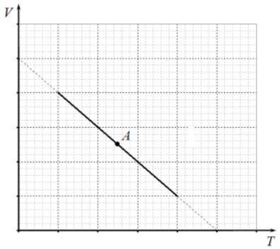
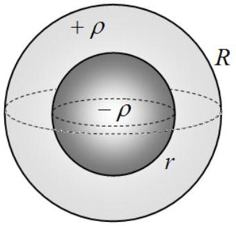

## Problem 1 (10.0 points)

This problem consists of three independent parts.

## Problem 1A (4.0 points)

A homogeneous planet of radius $R$ has no atmosphere and does not rotate. A stone is thrown from the surface of the planet at an angle $\alpha$ to the horizontal with the speed $v_{0}$, which is equal to the orbital velocity for the surface of the planet. Find the maximum height of ascent of the stone above the surface of the planet. At what range from its initial point, measured along the surface of the planet, the stone will hit the surface?

## Problem 1B (3.0 points)

One mole of an ideal monatomic gas performs a process whose chart in $V T$ coordinates completely lies on a straight line. Find the heat capacity of the gas at the point $A$, equidistant from the points of intersection of the process line with the coordinate axes.

## Problem 1C (3.0 points)

Two spheres with the radii $r$ and $R(r<R)$ lwith the common center divide the space into three domains. The interior of the small sphere is uniformly charged with the volume charge density $-\rho$, the domain in between the spheres is uniformly charged with the volume charge density $+\rho$, and there is no charge outside the larger sphere. Find the ratio of the radii $R / r$, at which the potential in the center of the symmetry of the system is equal to the potential at infinity.
