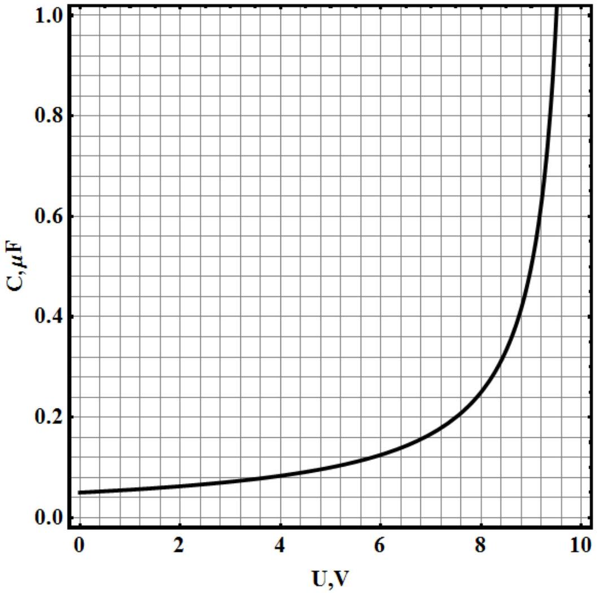

## Problem 3. Nonlinear capacitor ( $\mathbf{1 0 . 0}$ points)

The electrical circuit contains the voltage source $U_{0} \backslash$ connected in series with the resistor $R=1,00 k \Omega$ and the nonlinear capacitor, whose capacitance depends on the voltage across it and is graphically shown in the figure below.

Note: to solve this problem you may need to use some piece of squared paper provided under the graph,

1. [0.75 points] Assume that $U_{0}=5,0 V$. Find the charge of the capacitor, which appears on its plates after a sufficiently long period of time.

Suppose that at the initial time moment the charge of the capacitor is zero, and the voltage source provides $U_{0}=10 \mathrm{~V}$. It is seen from the graph that the capacitance of the capacitor at this voltage goes to infinity, i.e. $C(10 V)=\infty$.
2. [0.25 points] How long does it take for a capacitor to be charged to the voltage $U_{0}=10 \mathrm{~V}$ ?
3. [3.0 points] Find the time moment $t$, when the charge of the capacitor is equal to $q=4,0 \mu C l$.
4. [0.5 points] Find the time interval $\Delta t$ at which the charge of the capacitor grows from $q_{0}=$ $4,0 \mu C l$ to $q=8,0 \mu C l$.
5. [0.5 points] Find the charge of the capacitor at the time moment $t_{0}=3,0 m s$.

Let a source provide a constant voltage with a small portion of alternating voltage such that $U_{0}=U+\delta U \sin \omega t=[5,000+0,100 \sin \omega t] \mathrm{V}$, where $\omega=2500 \mathrm{rad} / \mathrm{s}$. After a sufficiently long period of time electrical oscillations of voltage and current are set up in the circuit.
6. [ $\mathbf{0 . 5}$ points] What is the phase difference $\varphi$ between the voltage oscillations across the capacitor and the resistor?
7. [4.0 points] Find the dependence of the electric current in the circuit $I(t)$ as a function of time.
8. [0.5 points] Find the voltage across the capacitor $U_{C}(t)$ as a function of time.

