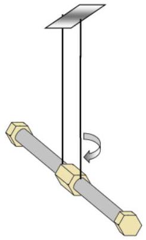
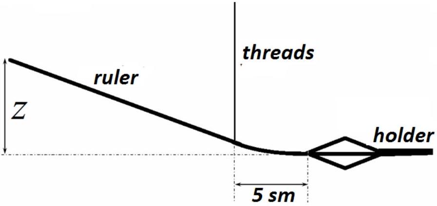

## EXPERIMENTAL COMPETITION

15 January, 2017

## Please read the instructions first:

1. The Experimental competition consists of one problem. This part of the competition lasts 3 hours.
2. Please only use the pen that is provided to you.
3. You can use your own non-programmable calculator for numerical calculations. If you don't have one, please ask for it from Olympiad organizers.
4. You are provided with Writing sheet and additional papers. You can use the additional paper for drafts of your solutions but these papers will not be checked. Your final solutions which will be evaluated should be on the Writing sheets. Please use as little text as possible. You should mostly use equations, numbers, figures and plots.
5. Use only the front side of Writing sheets. Write only inside the bordered area.
6. Fill the boxes at the top of each sheet of paper with your country (Country), your student code (Student Code), the question number (Question Number), the progressive number of each sheet (Page Number), and the total number of Writing sheets (Total Number of Pages). If you use some blank Writing sheets for notes that you do not wish to be evaluated, put a large X across the entire sheet and do not include it in your numbering.
7. At the end of the exam, arrange all sheets for each problem in the following order:
    - Used Writing sheets in order;
    - The sheets you do not wish to be evaluated
    - Unused sheets and the printed question.

Place the papers inside the envelope and leave everything on your desk. You are not allowed to take any paper or equipment out of the room

## Torsion pendulum (15.0 points)

Instruments and equipment: two bolts and coupling nut, tripod with two holders or ring holders, thread, 2 wooden ruler of the length of 40 cm each, stopwatch, weight of 100 g, clay.

The torsion pendulum is two bolts rigidly joined by the nut and suspended on two threads,. Make sure that the pendulum makes only torsional oscillations in a horizontal plane. The free fall acceleration due to gravity is $g=9.81 \mathrm{~m} / \mathrm{s}^{2}$.

## Part 1. Free small oscillations (5.0 points)

1.1 Measure dependence of the period of small torsional oscillations of the pendulum on the length of threads in the range from 10 to 50 cm.
1.2 Derive the theoretical formula for the period of small torsional oscillations.
1.3 Prove graphically that the derived formula correctly describes the experimental data.
1.4 Calculate the radius of gyration of the pendulum and evaluate the experimental error.

Hint: The moment of inertia of a rigid body about a certain axis may be represented in the form $I=m R^{2}$, where $m$ is the body mass and $R$ stands for the radius of gyration.

## In all following parts error analysis is not required!

## Part 2. Small oscillations with additional tension ( $\mathbf{5 . 0}$ points)

Tie another two threads from below the bolts. They must also be parallel and located at the same distance as the two upper threads. At the bottom tie them to a wooden ruler of length 40 cm. To do this, fix the ruler tight in the tripod holder. You can also place the ruler under the tripod platform. The threads must be tied to the ruler at a distance of 4-5 cm from the holder. The lengths of the threads at the top and bottom of the bolts must be the same and equal to about 20 cm. By raising or lowering the upper tripod holder, you can change the tension of the threads. Tension of threads is measured by the magnitude z of the ruler bending, as shown in the figure below.
2.1 Measure the dependence of the period of small torsional oscillations on the threads tension, i.e. on the ruler bending z .
2.2 Derive the theoretical dependence of the oscillation period on the threads tension.
2.3 Present the experimental data on the graph in such a way that it confirms the derived theoretical dependence.

## Part 3. Twisting at large angles ( $\mathbf{5 . 0}$ points)

In this part the pendulum should be twisted at large angles, which are measured by the number of half-turns $N<20$. The measurements should be carried out with a chosen moderate thread tension that you should exactly state.
3.1 Study the dependence of the time of the pendulum untwisting on the initial twisting angle $N_{0}$. Plot the graph of the resulting dependence.
3.2 It can be approximately assumed that the potential energy of elastic deformation depends on the twisting angle as

$$
U=C N^{\gamma},
$$

where $C$ is a constant. Based on the experimental data, decide which range the exponent $\gamma$ falls in: a) $\gamma<2$; b) $\gamma=2$; c) $\gamma>2$.

If the pendulum is initially twisted to a certain angle $N_{0}$, the pendulum unwinds such that the threads turn in parallel again, and then due to inertia the pendulum is re-twisted to some smaller angle $N_{1}$.
3.3 Study the dependence of the re-twisting angle $N_{1}$ on the initial twisting angle $N_{0}$. The measurements must be taken at two different magnitudes of the threads tension (but you should state them). Plot the graphs of the obtained dependencies. Propose a simple formula to describe the resulting dependence. Evaluate the numerical values of the parameters in your dependence.

Adjusting the threads tension during torsional oscillations of the pendulum can provide some intake of energy. Place the tripod with the pendulum at the edge of the table. At the bottom the thread should cover the ruler, fixed in the holder or under the tripod platform. Suspend the weight of 100 g to the thread below the ruler.
3.4 Study the dependence of the re-twisting angle $N_{1}$ on the initial twisting angle $N_{0}$ in this case. Plot the graph of the obtained dependence. Propose a simple formula to describe the resulting dependence. Evaluate the numerical values of the parameters in your dependence.
3.5 Repeat the experiment described in section 3.4, but lift the suspended weight up at the stage of re-twisting and do not touch the weight at the stage of untwisting. Study the dependence of the retwisting angle $N_{1}$ on the initial twisting angle $N_{0}$ in this case. Plot the graph of the obtained dependence in the same graph as in section 3.4. Propose a simple formula to describe the resulting dependence. Evaluate the numerical values of the parameters in your dependence.
