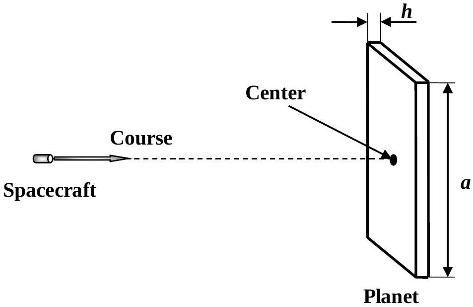
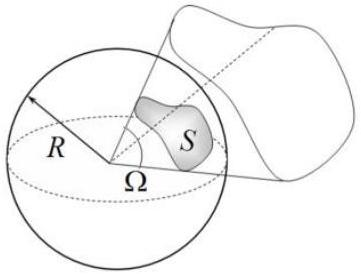
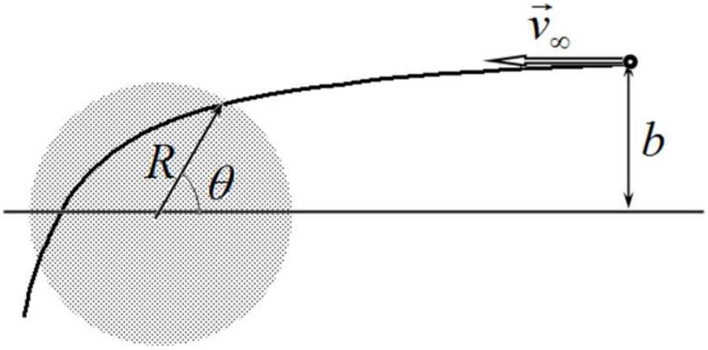

## Problem 2 (10.0 points)   Fantastic trip through the Universe

A reconnaissance spacecraft of the well developed civilization plows the universe. In this problem, you are asked to consider a few situations of that interstellar travel from the physical point of view. For all numerical calculations consider the gravitational constant known and equal to $G=6.672 \times 10^{-11} \mathrm{~m}^{3} /\left(\mathrm{kg} \cdot \mathrm{s}^{2}\right)$.

## 1. Planets with strange shapes (3.9 points)

At some distance from the spacecraft the crew captain discovers the first planet that has a strange shape of a parallelepiped with a square base of side $a$ and a very small thickness $h \ll a$. The captain gives the order to pursue a course to planet's center as shown in the figure below.

It has been revealed after turning off the engine that the spacecraft acceleration of the free fall $g$, that the planet provides at distances much greater $h$, remains proportional to the solid angle $\Omega$, at which the planet is seen from the spacecraft, that is:

$$
g=\alpha \Omega .
$$

The solid angle $\Omega$ is a part of the space, which unites all the rays emanating from a given point (the vertex) and intersecting a surface (which is called a surface subtending the solid angle). The boundary of the solid angle is a certain conical surface.

The solid angle is measured by the ratio of the area $S$ of the sphere centered at the vertex, which is cut by this solid angle, to the square of the sphere radius:

$$
\Omega=\frac{S}{R^{2}} .
$$

Solid angles are measured by abstract dimensionless quantities. The unit of the solid angle is a steradian, which, in SI units, is equal to the solid angle cutting out the surface area of $R^{2}$ from the sphere of radius $R$. The whole sphere corresponds to the solid angle of $4 \pi$ steradian (full solid angle) from any vertex, situated inside the sphere, in particular, for the center of the sphere.

After landing on the planet surface and taking the soil samples, the scientists reported to the captain that the planet is composed of homogeneous material of the density $\rho_{1}=$ $3000 \mathrm{~kg} / \mathrm{m}^{3}$ and the free fall acceleration near the geometric surface center of the planet remains almost constant and is equal to $g_{1}=9,81 \times 10^{-2} \mathrm{~m} / \mathrm{s}^{2}$.
1.1 [0.7 points] Find and calculate the thickness of the planet $h$.
1.2 [0.5 points] Find and calculate the coefficient $\alpha$.

After leaving the first planet, the captain and his crew meet another exotic planet that shapes a regular pyramid with a square base of the side $a=10000 k m$ and of the height $\frac{a}{2}$.
1.3 [0.7 points] Find and calculate the free fall acceleration $g_{2}$ measured at the top of the uniform pyramidal planet, if its density is equal to $\rho_{2}=4500 \mathrm{~kg} / \mathrm{m}^{3}$.

The spacecraft has left the pyramidal planet from its top, starting with the characteristic parabolic velocity $v_{1}=3,45 k m / s$. The next planet the spacecraft has met on its way is the one shaped like a perfect uniform cube with the side $a$. After accurate measurements, the captain and his crew have found that the density of the cubic planet is $\rho_{3}=5000 \mathrm{~kg} / \mathrm{m}^{3}$.
1.4 [2.0 points] Find and calculate the parabolic velocity $v_{2}$ for the spacecraft to start from one of the vertices of the cubic planet.

## 2. Dusty cloud (6.1 points)

The spacecraft encounters a very large massive dust cloud of radius $R=1,50 \times 10^{7} \mathrm{~km}$ and of homogeneous density $\rho_{4}=50,0 \mathrm{~kg} / \mathrm{m}^{3}$. The speed of the spacecraft at a large distance from the cloud reaches the value of $v_{\infty}=100 k m / s$, and the impact parameter measured from the cloud center is equal to $b=1,50 \times 10^{8} k m$. The engine remains switched off.

2.1 [2.5 points] Find and calculate the coordinate of the spacecraft entry into the dust cloud, characterized by the angle $\theta$.
2.2 [2.0 points] Find and calculate the minimum distance $r_{\text {min }}$, the spacecraft flies by from the cloud center. Resistance to the motion of the spacecraft caused by the cloud particles can be neglected.

Making sure that it is impossible to avoid a collision with the cloud, the captain of the spacecraft takes the decision to turn on the engine, thereby increasing the speed $v_{\infty}$.
2.3 [1.0 points] Find and calculate the minimum speed $v_{\infty, \text { min }}$, at which the spacecraft passes safely by the dust cloud.

Successfully passing the obstacle, the captain and his crew have discovered that the particles of the dust clouds contain valuable elements.
2.4 [0.6 points] Find the minimum work $A$, which must be performed in order to gradually bring all the dust particles onto a very remote processing plant.
