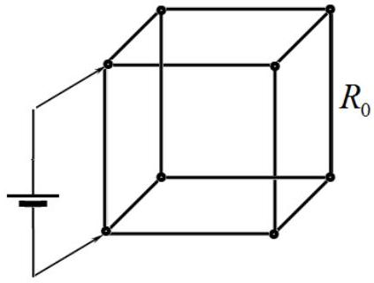
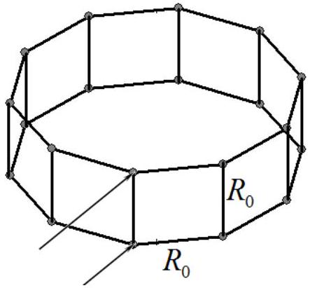
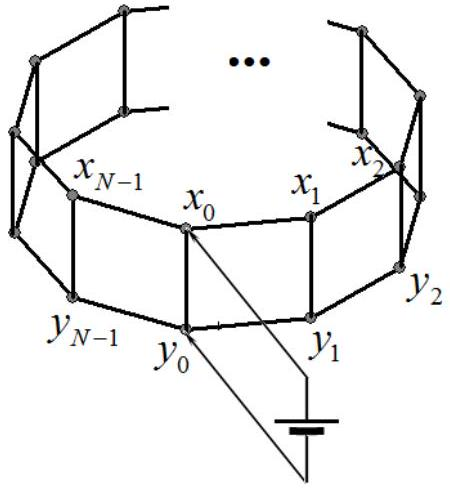
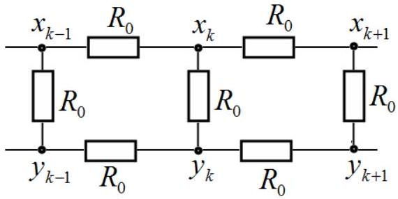

## Problem 3 (10.0 points)   Resistance of a prism   1. Mathematical introduction (3,0 points)

By definition, it is believed that terms of the numerical sequence obey the recurrence relation if each successive term is expressed through the previous ones. For example, for a well known geometric progression we have

$$
x_{k}=\lambda x_{k-1},
$$

where $k=1,2,3, \ldots, \lambda$ stands for a fixed number and zeroth term of the numerical sequence has some value of $A$, i.e. $x_{0}=A$.
1.1 [0.2 points] Obtain an explicit formula for an arbitrary term of the sequence $x_{k}$, i.e. express it through the successive number $k$, the initial value $A$ and $\lambda$.

Let us consider the number $\lambda=2+\sqrt{3}$. Taking its natural power of $k$, the result can be presented in the following form

$$
\lambda^{k}=p_{k}+q_{k} \sqrt{3},
$$

where $p_{k}, q_{k}$ denote some integer numbers.
1.2 [0.4 points] Find the recurrence relations, expressing the values of $p_{k}, q_{k}$ through the previous values $p_{k-1}, q_{k-1}$. Find also the inverse relations, expressing $p_{k-1}, q_{k-1}$ through $p_{k}, q_{k}$.
1.3 [0.7 points] Calculate the numerical values of the coefficients $p_{k}, q_{k}$ for $k=1,2,3,4,5$.
1.4 [0.2 points] Express the number $\lambda^{-k}=(2+\sqrt{3})^{-k}$ in terms of $p_{k}, q_{k}$.

Let the terms of a certain numerical sequence obey the recurrence relation

$$
x_{k+1}=4 x_{k}-x_{k-1}, \quad k=1, \ldots, N-1,
$$

where it is known that $N$ is some integer number, $x_{0}=A$ and $x_{N}=B, A, B$ designate some values.
1.5 [1.0 points] Obtain an explicit formula for an arbitrary term $x_{k}$ of the sequence (3), i.e. express it in terms of the number $k$ and values $A, B, N$.
1.6 [0.5 points] Obtain an explicit formula for an arbitrary term $x_{k}$ of the sequence (3) through $p_{k}, q_{k}$, found in.1.2-1.3.

Hint. The solution to the recurrence relation (3) must be sought in the form $x_{k}=C \lambda^{k}$, where $C$ is a constant. Determine at what values of $\lambda$ it is possible and construct an exact solution that satisfies all above stated conditions.

## 2. Wire frame in the shape of a prism (7.0 points)

Problems are widely known in which you are asked to find the electrical resistance of a simple wire frame. An example of such a frame shaped in the form of a cube is shown below. Let the electric resistance of each edge be equal to $R_{0}$.
2.1 [0.8 points] Find the total resistance of the cube when the source is connected to the two adjacent cube vertices as shown on the right.

Let us now consider a more general case of the wire frame in the form of the regular prism with an arbitrary number $N$ of side faces and determine its electrical resistance when the source is

connected to the adjacent vertices of the side edge, as shown in the figure below. The resistance of each frame edge is equal to $R_{0}$.

For convenience, the vertices of the prism and their electric potentials on the upper and the bottom sides are consequently numbered and denoted, as shown in the figure below. DC voltage source is applied to zeroth vertices such that the source sets the potentials of the vertices equal to $x_{0}=+\varphi_{0}$ and $y_{0}=-\varphi_{0}$, respectively.

Wire frame in the shape of a prism

Numbering and denoting vertices' potentials

2.2 [0.2 points] Find the relation between the potentials $x_{k}$ and $y_{k}$. Find the relation between the potentials $x_{k}$ and $x_{N-k}$

Consider an arbitrary lateral edge, except zeroth ( $k=0$ ) and the last ( $k=N-1$ ) ones. The corresponding circuit diagram is shown below.

2.3 [1.0 points] Find an recurrence relation for the potential $x_{k}$ as expressed in terms of the neighboring vertices potentials for $k=1,2 \ldots N-2$.
2.4 [0.2 points] Find boundary conditions at $k=0$ and $k=N-1$ necessary for unambiguous determination of the potential $x_{k}$.
2.5 [0.2 points] Find explicit expressions for the potentials $x_{k}$ and $y_{k}$ for all possible numbers $k=0,1,2 \ldots N-1$.
2.6 [0.4 points] Express the source current in terms of $\varphi_{0}, R_{0}, N$. Use the appropriate numbers $p_{k}, q_{k}$.obtained in the Mathematical introduction to this problem.
2.7 [0.2 points] Derive an explicit formula for the resistance $R_{N}$ of the wire frame, expressed in terms of $R_{0}, p_{N}, q_{N}$.
2.8 [1.0 points] Find and tabulate the exact values of the frame resistances for $N=1,2,3,4,5$.
2.9 [0.5 points] Draw the equivalent circuits for the exotic prisms with $N=1$ and $N=2$.
2.10 [1.0 points] Find the resistance $R_{\infty}$ of the wire frame at $N \rightarrow \infty$.
2.11 [1.5 points] Find the minimum value of $N$ at which the prism resistance deviation from $R_{\infty}$ does not exceed $2 \%$.
