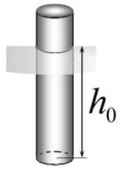
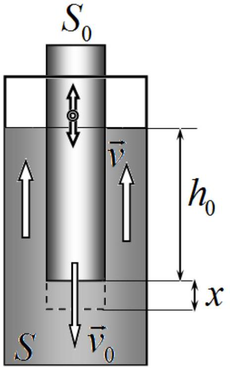
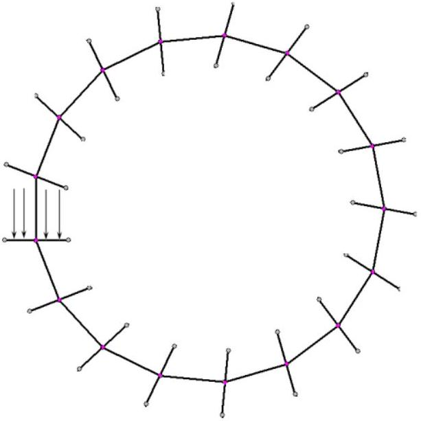

## Problem 1 (10.0 points)

This problem consists of three independent parts.

## Problem 1A (3.0 points)

A1 A narrow cylindrical test-tube with a displaced center of mass floats vertically in water in a very wide vessel. In equilibrium state, the test-tube is immersed into water to a depth $h_{0}$. The cross-sectional area of the tube is $S_{0}$. Determine the period of small vertical oscillations of the test-tube.

A2 The same test-tube is placed in a narrow cylindrical vessel with a cross-sectional area $S$ filled with water. The test-tube makes small oscillations along the axis of the vessel.
A2.1 The test-tube sinks by some small value $x$. Express the change in the potential energy of the system through $x$, the initial depth of immersion $h_{0}$, cross-sectional areas $S_{0}, S$, the water density $\rho$ and the acceleration of gravity $g$.
A2.2 Let the speed of the test-tube be $v_{0}$ near its equilibrium position. Express the kinetic energy of the system through the speed of the test tube $v_{0}$, the depth of immersion $h_{0}$, the crosssectional areas $S_{0}, S$, and the water density $\rho$. Consider that in the gap between the test-tube and the walls of the vessel all liquid moves with the same speed $v$.
A2.3 Find the period of small oscillations of the test-tube in the narrow vessel.

## Problem 1B (4.0 points)

The circuit, shown in the figure on the left, consists of a capacitor with the capacitance $C=100 \mu \mathrm{~F}$, an ideal diode, a constant voltage source $U=10.0 \mathrm{~V}$, three identical resistors with the resistance $R=10.0 \mathrm{k} \Omega$ and a switch. At the initial moment, the capacitor is not charged and the switch is open. When the switch is shorted, the current through the diode goes for the time interval $\tau=462 \mathrm{~ms}$, and then stops.

1. Find the current through the diode immediately after shorting the switch.
2. Find the total charge that has flowed through the diode.

## Problem 1C (3.0 points)

At the vertices of the regular 17-gon, there are 17 identical lenses. The optical centers of the lenses are located exactly at the vertices of the polygon, the planes of all lenses are perpendicular to one of the sides adjacent to the lens. The focal lengths of the lenses are all equal to $F=10 \mathrm{sm}$ and coinciude with the length of the side of the 17-gon. One of the lenses is illuminated by a parallel light flux directed along its optical axis. It turns out that one of the rays has a closed trajectory. Determine the radius of the circle inscribed in this trajectory. Consider two cases: all of the lenses are collecting; all of the lenses are diverging. Consider all angles small such that $\sin \alpha \approx \tan \alpha \approx \alpha$.

