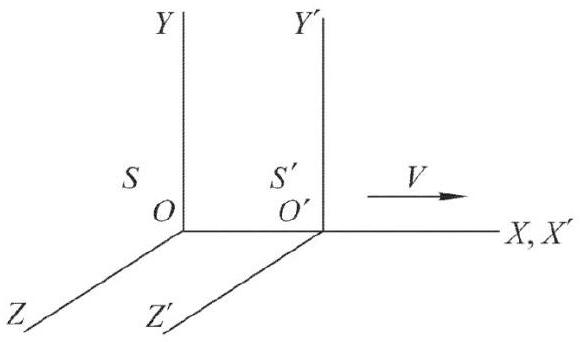
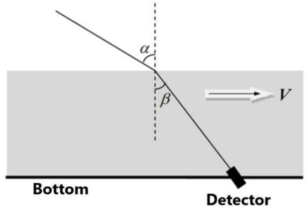
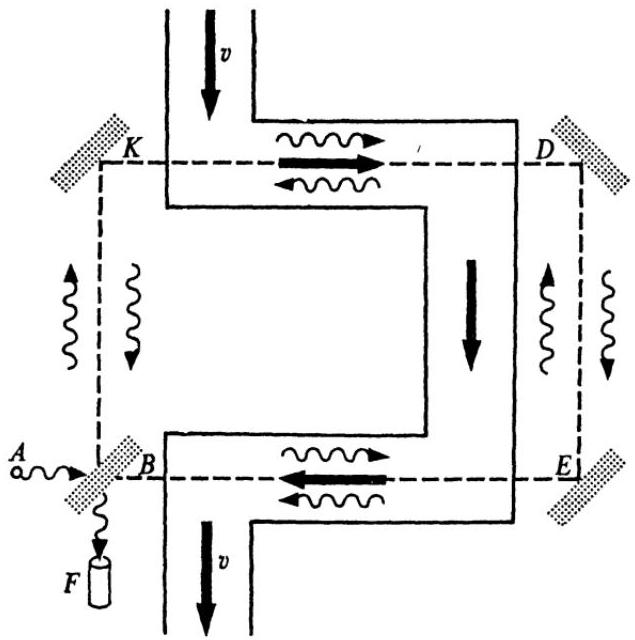

## Problem 3 (10.0 points) Optics of moving media

## Part 1. 4-dimensional vectors

Consider two inertial reference frames $S$ and $S^{\prime}$ of which the second one moves at a speed $V$ relative to the first one as shown in the figure on the right. It is assumed that the origins $O$ and $O^{\prime}$ coincide at the initial time moment $t=$ $t^{\prime}=0$ by the clocks of both reference frames. It is known that the Lorentz transformation of space-time coordinates $\left(x^{\prime}, y^{\prime}, z^{\prime}, c t^{\prime}\right)$ of any event in the frame $S^{\prime}$ into the spacetime coordinates ( $x, y, z, c t$ ) of the same event in the frame

$S$ have the following form

$$
x=\frac{x^{\prime}+(V / c) c t^{\prime}}{\sqrt{1-V^{2} / c^{2}}}, \quad y=y^{\prime}, \quad z=z^{\prime},
$$

where $c=2.9979 \mathrm{~m} / \mathrm{s}$ is the speed of light.
In the formulas of the Lorentz transformation the spatial coordinates and the time are intentionally brought to the same dimension as they together form components of the so-called 4 -vector. It is known that all the components of 4 -vectors are transformed in the same way at the transition from one inertial frame to the other. In particular, the momentum and the energy constitute the components of the 4-vector.

Suppose that an object moves in the reference frame $S$ such that it has the total energy $E$ and the momentum projections $p_{x}, p_{y}, p_{z}$ on the coordinate axes $O X, O Y$ and $O Z$, respectively.
1.1 Write down the transformation of energy and momentum of the object from the reference frame $S$ to the reference frame $S^{\prime}$.

Suppose an object of the rest mass $m$ moves in the reference frame $S$ such that it has the total energy $E$ and the momentum $p$. When converting its energy and momentum from one reference frame to another the value $E^{2}-p^{2} c^{2}=i n v$ remains invariant.
1.2 Express inv in terms of $m$ and $c$.

## Part 2. Doppler effect and light aberration

Let a plane electromagnetic wave (EMW) propagate in $X Y$-plane of the reference frame $S$ so that it has the frequency $\omega$ and makes the angle $\varphi$ with the axis $O X$.
2.1 Find the frequency $\omega^{\prime}$ of EMW registered by an observer in the reference frame $S^{\prime}$.
2.2 Find the angle $\varphi^{\prime}$ that EMW makes with the axis $O^{\prime} X^{\prime}$ in the reference frame $S^{\prime}$.

Astronomical observations have shown that the position of a newly discovered massive star $X$ on the celestial sphere (i.e. relative to very distant objects) does not remain constant throughout the year. It moves along an ellipse with axial ratio 0.900 . Ecliptic latitude of a star is the angle between the direction to the star and the ecliptic plane, which can be assumed coincident with the plane of the Earth orbit around the Sun.
2.3 Find the ecliptic latitude $\delta$ of the star $X$ and evaluate it in arc degrees.

Observation of the emission spectrum of the star $X$ has shown that all frequency in its spectrum are shifted to the red. The relative frequency deviation is $(\Delta \omega / \omega)_{0}=9.9945 \cdot 10^{-3}$. It has independently been established that the recession velocity of the star $X$ from the Sun is equal to $v_{x}=\frac{1}{100} c$.
2.4 Find and evaluate the escape velocity $v_{I I}$ at the surface of the star $X$.

## Part 3. Light in a moving medium

Consider the same two reference frames as in Part 1. Let an object move in the plane $X^{\prime} Y^{\prime}$ of the reference frame $S^{\prime}$ such that the projections of its velocity on the axis $O^{\prime} X^{\prime}$ and $O^{\prime} Y^{\prime}$ are equal $u_{x}{ }^{\prime}$ and $u_{y}{ }^{\prime}$, respectively.
3.1 Find the projections of the object velocity $u_{x}$ on the axis $O X$ and $u_{y}$ on the axis $O Y$ in the reference frame $S$.

Consider a water flow moving at the speed of $V$ relative to the bottom of the vessel. A plane EMW falls onto the water surface to make the angle $\alpha$ to the normal in the laboratory reference frame. A detector is fixed at the bottom of the vessel. The refractive index of water is known to be $n$.

If the water velocity $V \ll c$, the expression for the sine of the angle $\beta$ at which the detector registers the direction of EMW propagation, takes the form:

$$
\sin \beta=A_{1}+B_{1} V .
$$

3.2 Find $A_{1}, B_{1}$ and express them in terms of $\alpha$ and $n$.

If the water velocity $V \ll c$, the expression for velocity $v_{m}$ of the light propagation in the laboratory reference frame is found as

$$
v_{m}=A_{2}+B_{2} V .
$$

3.3 Find $A_{2}, B_{2}$ and express them in terms of $\beta, n, c$.

In 1860 A. Fizeau set up the following experiment. A monochromatic beam with the

wavelength $\lambda$ comes out of the source $A$ and falls onto the semitransparent plate $B$ at which it is divided into two coherent beams. The first beam, being reflected from the plate $B$, goes along the way $B K D E B(K, D$ and $E$ are the mirrors), whereas the second beam, passing through the plate $B$, goes along the way $B E D K B$. The first beam, when returning to the plate $B$, is partially reflected from it and reaches the interferometer $F$. The second beam, when returning to the plate $B$, partially passes through it and reaches the interferometer $F$. Both interfering beams travels the same distance in the laboratory reference frame, including section $B E$ and $K D$ in which the water flows with the velocity $v$. The total distance covered by each beam in water in the laboratory reference frame is equal to $2 L$.
3.4 Find the number of bands $\Delta N$ the interference pattern is shifted by when the liquid velocity changes from 0 to $v$ and express it in terms of $L, n, v, c$, and $\lambda$.

In his own experiment A. Fizeau obtained $\Delta N=0.230$ at $L=1.49 \mathrm{~m}, v=7.06 \mathrm{~m} / \mathrm{s}$ and $\lambda=536 \mathrm{~nm}$.
3.5 Evaluate refractive index of water $n$ in Fizeau's experiment.

## Mathematical hint

You may need to know the following approximate equality: $(1+x)^{\alpha} \approx 1+\alpha x$, at $x \ll 1$.
