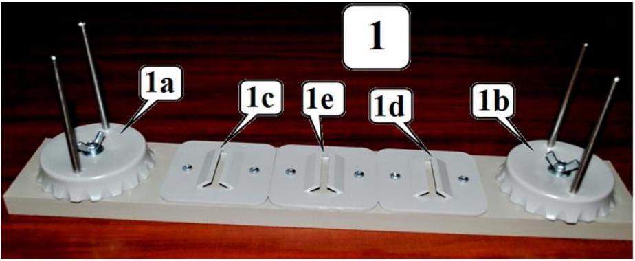
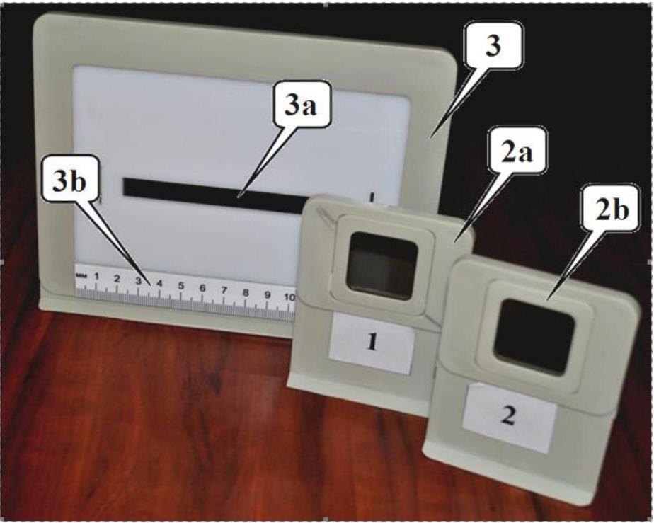
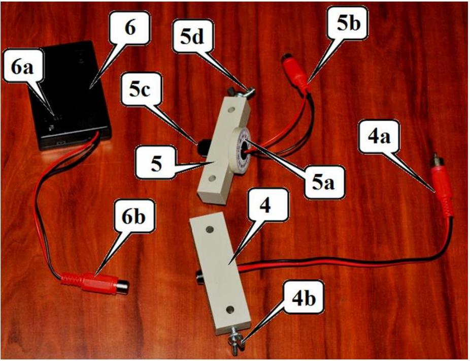
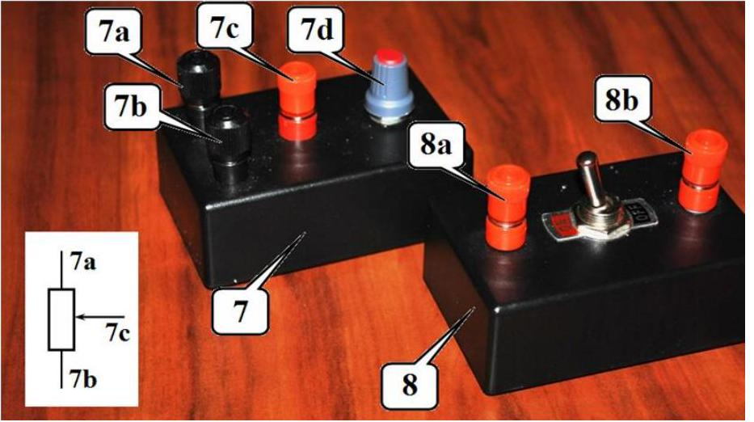
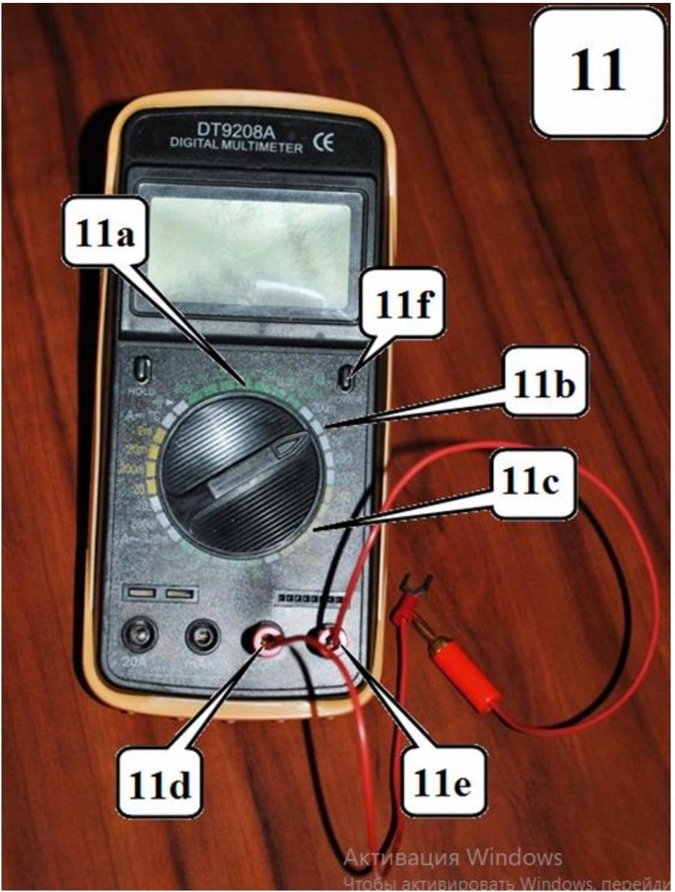
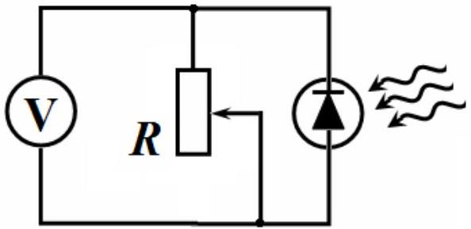

## EXPERIMENTAL COMPETITION

12 January, 2019

## Please read the instructions first:

1. The Experimental competition consists of one problem. This part of the competition lasts 3 hours.
2. Please only use the pen that is provided to you.
3. You can use your own non-programmable calculator for numerical calculations. If you don't have one, please ask for it from Olympiad organizers.
4. You are provided with Writing sheet and additional papers. You can use the additional paper for drafts of your solutions but these papers will not be checked. Your final solutions which will be evaluated should be on the Writing sheets. Please use as little text as possible. You should mostly use equations, numbers, figures and plots.
5. Use only the front side of Writing sheets. Write only inside the bordered area.
6. Fill the boxes at the top of each sheet of paper with your country (Country), your student code (Student Code), the question number (Question Number), the progressive number of each sheet (Page Number), and the total number of Writing sheets (Total Number of Pages). If you use some blank Writing sheets for notes that you do not wish to be evaluated, put a large X across the entire sheet and do not include it in your numbering.
7. At the end of the exam, arrange all sheets for each problem in the following order:
    - Used Writing sheets in order.
    - The sheets you do not wish to be evaluated.
    - Unused sheets.
    - The printed problems.

Place the papers inside the envelope and leave everything on your desk. You are not allowed to take any paper or equipment out of the room

## Absorption of light (15.0 points)

## Experimental equipment

1. Optical bench with holders:
1a - support for a light source with the screw;
1b - support for a photodetector with the screw;
1c, 1d, 1e - holders;

2a - neutral filter on the stand;
2b, 3, 3a, 3b - not used in this experiment;

Light sources:
4 - light emitting diode (LED):
4a - leads to a power supply;
4b - fixing screw;
5 - laser:
5a - ring for turning the laser with the scale;
5b - leads to a power supply;
5c -screw for the beam width adjustment on the front side;
5d - fixing screw;
6 - power supply for light sources:
6a - switch;
6b - leads to a light source.
Keep the source operating only while making measurements!

Do not point the laser beam in your or anyone's eyes, it is very dangerous!

7 - variable resistor 100 k $\Omega$ :
7a, 7b, 7c - terminals for connection to a circuit; 7d - knob for changing the resistance;

8 - switch:
8a, 8b - terminals for connection to a circuit;

11 - multimeter;
11a - register to measure resistance (100 k $\Omega$ );
11b - register to measure DC voltage (2V);
11d, 11e - connectors for test leads;
11f -power on/off.
If the display multimeter is in a "sleep" mode - double-press power on/off!

When measuring the resistance with the multimeter, it must be disconnected with a power supply!

A set of film filters: 5 grey filters, 5 blue filters, 5 yellow filters.
Clothes-peg.

## Part 1. Studying a photodetector

To measure the light intensity the photodiode is used hereinafter. The emf, produced when the light falls on the photodiode, depends in a complex way on the intensity of the incident light. Therefore, the circuit, shown in the figure on the right, is used to measure the light intensity. The voltage measured by a multimeter depends on both the intensity of the incident light and the resistance of the variable resistor.

Install the photodetector and the laser on the optical bench. Direct the light beam exactly at the photodetector. Install a neutral filter in one of the holders. Rotating the laser ring, make sure that the voltage across the resistor (at its maximum resistance) is at least 350 mV.
1.1 Modify the circuit shown above by adding the switch, so that you can measure the resistance of the resistor and the voltage across it with the single multimeter provided. Draw schematically the electric circuit that you propose.
1.2 Using your electric circuit from 1.1, measure the dependence of the voltage across the resistor on its resistance.
1.3 Using the data from 1.2, draw a graph of the voltage across the resistor as a function of its current.
1.4 Draw a graph of the heat power generated in the resistor as a function of its resistance.
1.5 Determine the resistance of the resistor at which the heat power turns maximal. Make additional measurements, if necessary.

## Part 2. Absorption of laser radiation

In this part of the experiment, make all measurements with the resistance of the variable resistor approximately equal to 3 k $\Omega$. Write down the value of the resistance at which you have taken your measurements. Install the neutral filter on the optical bench between the laser and the photodetector. Turning the laser ring, make sure that the maximum voltage across the resistor is approximately 180-190 $m V$. Measure in the range of the multimeter $200 m V$. In this mode, the voltage on the multimeter is directly proportional to the intensity of the incident light. Hold the light filters with the clothes-peg and hold them directly near the photodetector.

The intensity of the light $I$ transmitted through the filter is proportional to the intensity of the incident light $I_{0}$ :

$$
I=k I_{0}
$$

The transmittance $k$ does not depend on the intensity of the incident light but may depend on its wavelength.
2.1 Using formula (1), obtain the dependence of the intensity of transmitted light through $n$ identical light filters on the number $n$ of light filters.
2.2 Measure the dependence of the light intensity $I_{n}$ on the number of filters $n$ for all the filters provided (gray, yellow and blue). Draw graphs of the dependencies obtained in scales that allow you to verify the formula obtained in Section 2.1.
2.3 Calculate the transmittance of all filters. Estimate the experimental errors of their values.
2.4 Measure the transmittance for pairs of different filters: gray + blue, gray + yellow; blue + yellow. Theoretically calculate the transmittance of each pair of filters.

## Part 3. Absorption of white light

Replace the laser with the LED which is a source of white light. Remove the neutral filter. Direct the radiation of the LED straight at the photodetector. Set the resistance of the resistor to approximately $10 \mathrm{k} \Omega$. Write down the value of the resistance at which you have taken your measurements.
3.1 Measure the dependence of the light intensity on the number of filters for all types of filters provided (gray, yellow and blue). Draw graphs of these dependencies in the same scale as in Part 2.
3.2 Verify whether the formula obtained in paragraph 2.1 is fulfilled for the white light source. Specify a main cause leading to possible violations of that relation.
3.3 Measure the transmittance for pairs of different filters: gray + blue, gray + yellow; blue + yellow. Using the data obtained in the whole experiment, verify whether the transmittance of a pair of filters is equal to the product of the transmittances of each filter.
