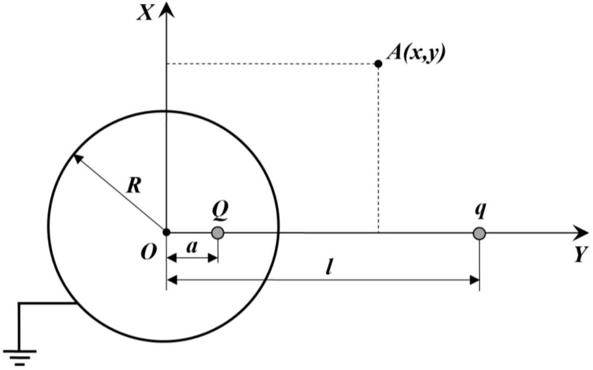
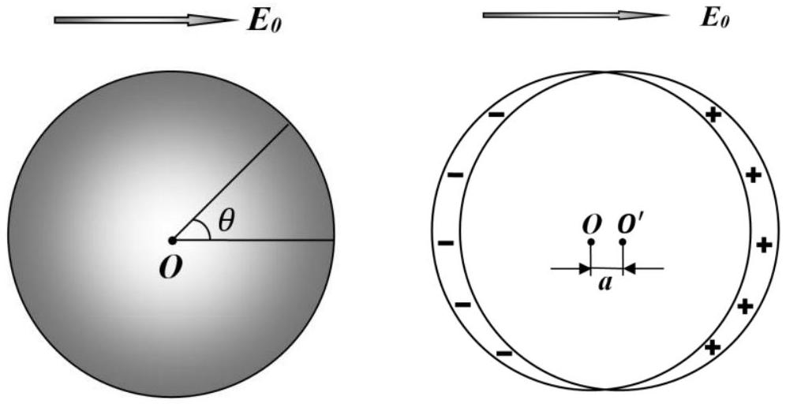
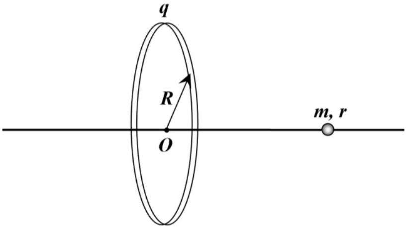

## Problem 2. Conductors in an electric field (10.0 points)

When a conductor is placed in a constant external electric field, electric charges appear on its surface. This phenomenon is called an electrostatic induction, and the charges themselves are then called induced. This phenomenon is explained by a large number of free charge carriers in the conductor, usually electrons, which can move freely inside.

The distribution of the induced charges for a conductor of an arbitrary shape can be quite complex, but the following statements hold:

1) The electric field strength inside the conductor is exactly zero;
2) The electric field strength near the surface of the conductor is directed along the surface normal;
3) The induced charges are only located on the conductor surface;
4) All of the conductor points have the same electric potential.

In this problem, we consider several methods for calculating electric fields in the presence of conductors and apply them to a specific physical situation. Consider the vacuum permittivity $\varepsilon_{0}$ known.

## Conductive ball and point charge

A conducting ball of radius $R$ is grounded and a point-like charge $q$ is placed at a distance $l$ from it. In this case, in accordance with the foregoing, induced charges appear on the ball surface, which distort the electric field of the point-like charge $q$. The image method is applicable to this situation, whose essence is described as follows. The electric field outside the ball can be represented as a superposition of the field of the point-like charge $q$ and the field of some fictitious point-like charge $Q$ located somewhere inside the ball at a distance $a$ from its center and on the line connecting the point-like charge $q$ to the ball center. To evaluate the total electric field, we make use of the Cartesian coordinate system on the plane shown in the figure below. This is quite enough, since the system has axial symmetry.

2.1 Calculate the electric field potential at an arbitrary point $A$ with coordinates ( $x, y$ ) lying outside the ball. Express your answer in terms of $q, Q, l, a, x, y, \varepsilon_{0}$.
2.2 Using the above expression, evaluate the electric field potential on the ball surface. Express your answer in terms of $q, Q, l, a, x, R, \varepsilon_{0}$.
2.3 Using your answer from 2.2, find the charge $Q$ and the distance $a$, expressing them in terms of $q, l, R$.
2.4 Calculate the work $A$ that needs to be done on the point-like charge $q$ in order to very slowly move it to infinity. Express your answer in terms of $q, l, R, \varepsilon_{0}$.
2.5 Find the interaction energy $W$ of the induced charges with one another and express it in terms of $q, l, R, \varepsilon_{0}$.

## Conductive ball in a uniform electric field

A conducting ball of radius $R$ is placed in an external uniform electric field of strength $E_{0}$. In this case, the field of induced electric charges can be represented as a superposition of the field of two fictitious uniformly charged balls of the same radius $R$ located at a very small distance $a \ll R$ from each other. The net charge of these two balls is , of course, zero due to the charge conservation law, so one of them can be assumed to be charged with the bulk charge density $\rho$, whereas the other is to be charged with the bulk charge density $-\rho$.

2.6 Calculate the electric field strength $E_{\rho}$ inside a uniformly charged ball with the bulk charge density $\rho$ at a distance $r$ from its center. Express your answer in terms of $\rho, r, \varepsilon_{0}$.
2.7 Calculate the electric field strength at the intersection of two fictitious balls mentioned above. Express your answer in terms of $\rho, a, \varepsilon_{0}$.
2.8 Find the surface density of the induced charges $\sigma$ as a function of the angle $\theta$ shown in the figure above. Express your answer in terms of $E_{0}, \theta, \varepsilon_{0}$.
2.9 Find the electric field $E$ outside the ball and just near its surface point, characterized by the angle $\theta$. Express your answer in terms of $E_{0}, \theta$.

## Conductive ball and charged ring

A thin ring of radius $R$ is charged uniformly along its length by a charge $q$. An uncharged small conducting ball of radius $r$ and mass $m$ can slide without friction along the long non-conducting needle, coinciding with the axis of the ring.

2.10 Calculate the frequency $\omega$ of small oscillations of the ball near its equilibrium position on the needle. Express your answer in terms of $q, R, r, m, \varepsilon_{0}$.
2.11 The ball is initially located at the ring center and is at rest. Find the work $A$, which must be done to very slowly push the ball along the needle to infinity. Express your answer in terms of $q, R, r, \varepsilon_{0}$.
