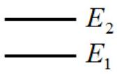
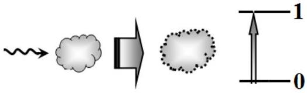
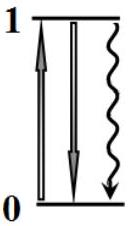
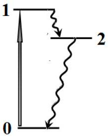
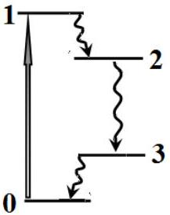
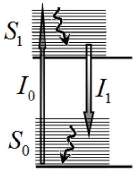
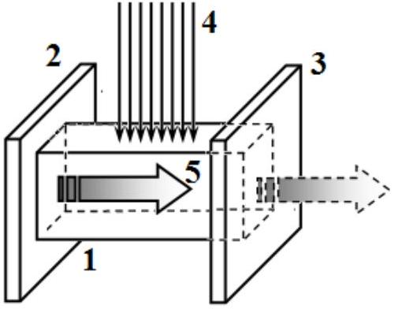
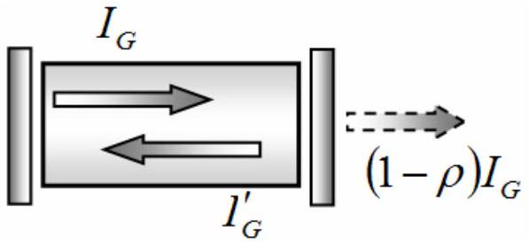

## Problem 3. Laser (10.0 points)

According to quantum theory, a molecule can only be found in certain states … characterized by discrete energy values $E_{0}, E_{1}, E_{2}, \ldots$. These states are represented by horizontal segments on the vertical energy scale and are numbered in order of increasing

energy, starting from 0. In the absence of external influence, the molecule is found in the state with the number 0 and the lowest possible energy $E_{0}$. This state is then called a ground state, $-E_{0}$ and the rest are then called excited states. The molecule can be driven from one energy state to another by absorbing or emitting light quanta, i.e. photons. The intensity of the light flux is characterized everywhere below by the density of the photon flux $I$, i.e. the number of photons passing perpendicularly through the unit area per unit of time, the dimension of this quantity is obviously equal to $[I]=\mathrm{m}^{-2} \cdot \mathrm{~s}^{-1}$.

For further consideration, it is necessary to take into account the following processes that take place when the light flux passes through a medium.

Absorption. If a molecule is found in the ground state 0 , then it can absorb a photon and be raised to the excited state 1. Such a transition is possible if the photon energy is equal to the difference between the energies of the excited and ground states, $h v_{01}=E_{1}-E_{0}$, where $v_{01}$ is the

photon frequency and $h=6.63 \cdot 10^{-34} \mathrm{~J} \cdot \mathrm{~s}$ stands for the Planck constant. If $N_{0}$ molecules are found in the ground state 0, then the number of molecules $d N$ that have absorbed photons and have been elevated to the excited state in a very short time interval $d t$ is equal to

$$
d N=I \sigma_{01} N_{0} d t
$$

where the quantity $\sigma_{01}$ is called the absorption cross section and is determined by the properties of the molecules.

Stimulated emission. If a molecule is found in the excited state 1 , then under the influence of a photon with the frequency $v_{01}$, it can be forced to move to the ground state 0 with the emission of another photon that is completely identical to the first one and propagates in the same direction, has the same energy and polarization. The number of such transitions $d N$ for a very small time interval $d t$ is described by the formula similar to formula (1) as

$$
d N=I \sigma_{10} N_{1} d t
$$

where $N_{1}$ denotes the number of molecules in the excited state 1 with energy $E_{1}$, and $\sigma_{10}$ signifies the cross section of the stimulated emission.

Spontaneous emission. A molecule in the excited state can spontaneously drop to its ground state with the emission of a photon. In contrast to the stimulated emission, the direction of emission and the polarization of the photon are both random, and the energy can slightly vary, i.e. the spontaneous emission cannot contribute to an increase in the light flux. The number of spontaneous transitions $d N$ from the excited state 1 to the ground state 0 for a very small time interval $d t$ is written as

$$
d N=A N_{1} d t=\frac{1}{\tau} N_{1} d t,
$$

where $N_{1}$ still designates the number of molecules in the excited state 1 with energy $E_{1}, A$ is the transition probability or the Einstein coefficient, and its inverse value $\tau=A^{-1}$ is referred to as the lifetime of the excited state.

To describe each state $k$ of the molecule, it is convenient to use not the total number $N_{k}$ of molecules in the state, but its reduced value divided by the total number of molecules $N$ in the medium

$$
n_{k}=\frac{N_{k}}{N},
$$

This value is called the population of the state. For populations, the normalizing condition is satisfied: the sum of the populations of all the states of the molecules is equal to unity, i.e.

$$
n_{0}+n_{1}+n_{2}+\ldots=1 .
$$

If the number of molecules in a certain excited state exceeds the number of molecules in the ground state, then this state of the medium is called the population inversion, and the emitted radiation may prevail over absorption, which results in an increase in the intensity of the light flux propagating in such a medium. This phenomenon is used in optical quantum light generators, called lasers. The population inversion is conventionally created using an external energy source, called pumping. In this problem, we consider the operation of an optically pumped laser, when the population inversion is generated by an external light flux. Unlike this pumping light flux, the laser light flux is monochromatic, coherent, polarized and narrowly directed.

## Population inversion: two-level system

Consider a medium that is subject to monochromatic pumping light flux $I_{0}$. The incident light flux leads to transitions of molecules only between two states, i.e. the ground state 0 and the excited state 1. The absorption $\sigma_{01}$ and stimulated emission $\sigma_{10}$ cross sections are equal, i.e. $\sigma_{10}=\sigma_{01}=\sigma$ and the lifetime in the excited state is found to be $\tau$.

3.1 Write down an equation describing the change in the population of the excited state 1 over time, i.e. express the derivative $d n_{1} / d t$ in terms of $n_{1}, I_{0}, \sigma$ and $\tau$.
3.2 Find the population of the excited state and the difference of the populations between the excited and ground states under steady conditions as functions of the pumping light flux $I_{0}$. Express your answer in terms of the parameter $I_{0} \sigma \tau$.
3.3 Is it possible to achieve an amplification of the laser light flux in this case?

## Population inversion: three-level system

Let three states of the molecule be involved in possible transitions: the ground state 0 and the two excited states 1, 2. Under the action of the pumping light flux $I_{0}$, the molecule can be raised from the ground state 0 to the first excited state 1. The absorption cross section of this transition is equal to $\sigma$. As a result of intramolecular relaxation, the molecule that has resided in state 1 almost instantly drops to the lower energy state 2, whose lifetime is $\tau$. In this case, assume that the stimulated emission is completely absent.

3.4 Write down an equation describing the change in the population $n_{2}$ of the excited state 2 over time.
3.5 Find the population $\bar{n}_{2}$ of the excited state 2 and the population difference $\left(\bar{n}_{2}-\bar{n}_{0}\right)$ of the excited and the ground states under steady conditions as functions of the pumping light flux $I_{0}$. Express your answer in terms of the parameter $I_{0} \sigma \tau$.
3.6 At what minimum value of the parameter $I_{0} \sigma \tau$ is it possible to amplify the laser light flux with the frequency equal to the frequency of the transition $2 \rightarrow 0$ ?

## Population inversion: four-level system

Let four states of the molecule be involved in possible transitions. Under the action of the pumping light flux $I_{0}$, the molecule can be raised from the ground state 0 to the first excited state 1. The absorption cross section of this transition is equal to $\sigma$. As a result of intramolecular relaxation, the molecule that has resided in state 1 almost instantly drops to the lower energy state 2 , whose lifetime is $\tau$. From this state, the molecule undergoes a transition to the intermediate state 3, which results in the emission of a photon. In this case,

assume that the stimulated emission is completely absent. As a result of intramolecular relaxation, the molecule that has fallen into state 3 almost instantly drops to the ground energy state 0.
3.7 At what minimum value of the parameter $I_{0} \sigma \tau$ is it possible to amplify the laser light flux with the frequency equal to the frequency of the transition $2 \rightarrow 3$ ?

## Resonator

The four-level system is usually implemented in dye solutions. Dyes consist of complex molecules with multiple energy states. Therefore, the possible energy states are grouped into bands: the ground state band $S_{0}$ contains an almost continuous spectrum of sub-levels, and the same is true for the first excited state band $S_{1}$. Thus, there are two bands of possible states. The absorption of the pumping light flux $I_{0}$ leads to transitions from the sublevels of the ground state band $S_{0}$ to different sublevels of the excited state band $S_{1}$. Transitions between the sub-levels of state 1 occur almost instantaneously, so

the stimulated emission of the laser light flux $I_{1}$ occurs at lower frequencies, and the stimulated emission due to the pumping light flux $I_{0}$ can be neglected. In the approximation described, it is sufficient to know the population of the ground and excited state bands. Rhodamine 6G is used as a dye, for which: the absorption cross section in the transition $S_{0} \rightarrow S_{1}$ is $\sigma_{A}=3,90 \cdot 10^{-16} c m^{2}$; the stimulated emission cross section $S_{1} \rightarrow S_{0}$ is $\sigma_{E}=2,20 \cdot 10^{-16} c m^{2}$; the lifetime of the molecule in the state $S_{1}$ is $\tau=4,20 \cdot 10^{-9} s$.

To generate light, cuvette 1 with the solution of rhodamine 6G is placed between two parallel mirrors 2 and 3, thus forming a resonator. The solution is excited by a uniform pumping light flux 4 of intensity $I_{0}$, whose frequency strictly corresponds to the maximum absorption of the solution. The pumping light flux 4 is directed perpendicular to the axis of the resonator and fully illuminates the entire cell. The intensity of this flux, of course, decreases as it passes through the solution; however, for carrying out our estimations, consider $I_{0}$ constant in the entire bulk of the resonator,

assuming it to be averaged over the solution volume. The laser light flux 5 generated in the resonator propagates along the resonator axis, and its amplification occurs due to multiple reflections from the resonator mirrors. Consider mirror 2 fully reflective, and the second mirror 3 translucent with the reflectance $\rho$. The absorption of light in the mirrors, the solvent-body, as well as the scattering of light and other losses can be completely ignored. The resonator has the following parameters: the cuvette length is $l=3,00 c m$; the rhodamine 6G concentration is $\gamma=1.30 \cdot 10^{16} c m^{-3}$; the reflection coefficient of the translucent mirror is $\rho=0,90$; the refractive index of the solution of rhodamine 6G is $r=1,50$. The speed of light is denoted as $c=3,00 \cdot 10^{10} c m / s$.

For a simplified description of the laser light flux propagating along the resonator axis, one can consider the intensity of the light fluxes averaged over the length of the resonator. We denote the average intensity of the laser light flux propagating to the translucent mirror as $I_{G}$, and the intensity of the laser light flux propagating in the opposite direction as $I_{G}^{\prime}$. Since the transmittance of mirror 3 is

small, then we can assume that the average intensities of these fluxes be approximately equal $I_{G} \approx I_{G}^{\prime}$.
3.8 Let a laser light flux $I_{G}$ be created in the resonator. Show that in the absence of absorption and stimulated emission, the change in the intensity of the laser flux over time is described by the equation

$$
\frac{d I_{G}}{d t}=-\frac{1}{T} I_{G},
$$

where $T$ stands for the so-called photon lifetime in the resonator. Express the parameter $T$ in terms of the parameters of the resonator. Calculate its numerical value.
3.9 Show that in the absence of the photon losses through mirror 3, the laser light flux variation over time obeys the following equation

$$
\frac{d I_{G}}{d t}=K n I_{G}
$$

where $n$ designates the population of the excited state of rhodamine 6G, and $K$ is the resonator gain. Express the resonator gain $K$ in terms of the parameters of the resonator and the stimulated emission cross section $\sigma_{E}$ of rhodamine 6G. Calculate its numerical value.

## Stationary generation mode

In this part, we assume that the pumping light flux is constant and does not depend on time. In the stationary mode, all quantities remain constant: the population of the excited state and the laser light flux. Assume that the population of the excited state is low, i.e. $n \ll 1$.
3.10 Write down a set of equations describing the change in the population $\frac{d n}{d t}$ of the excited state and the laser light flux $\frac{d I_{G}}{d t}$ in the resonator.
3.11 Obtain the formula and calculate a minimum (threshold) value $n_{t h}$ of the population of the excited state at which the amplification (generation) of laser light in the resonator occurs. Express it in terms of the parameters of the resonator $K, T$.
3.12 Derive the formula and calculate a minimum (threshold) value of the pumping light flux $I_{0, t h}$ at which the laser light amplification in the resonator starts. Let the wavelength of the pumping light flux be $\lambda=520 n m$. Calculate the pumping flux in energetic units of $W / c m^{2}$.
3.13 Find the laser flux at the output of the resonator as a function of the pumping light flux $I_{0}$, and express it in terms of the ratio $\eta=I_{0} / I_{0, t h}$, which is called the threshold overrun, and the characteristics of molecules. Draw a graph of the laser flux at the output of the resonator as a function $\eta$.
3.14 Find the quantum output $f=N_{E} / N_{A}$, i.e. the ratio of the number of photons $N_{E}$ leaving the resonator per unit of time to the number of photons $N_{A}$ absorbed in the resonator per the same unit of time as a function of the parameter $\eta$.

## Mathematical hint for the theoretical competition

You may need to know the following integrals:

$$
\begin{gathered}
\int \frac{d x}{a x+b}=\frac{1}{a} \ln |a x+b| \\
\int x^{n} d x=\frac{x^{n+1}}{n+1}, \text { where } n \text { is an integer number }
\end{gathered}
$$
