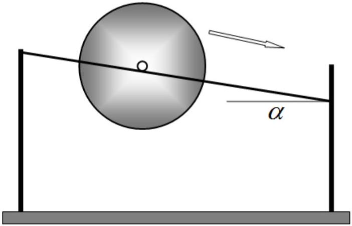
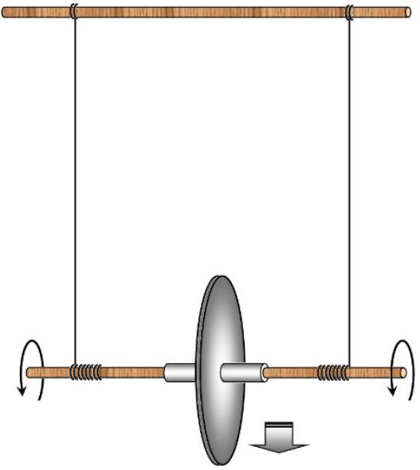
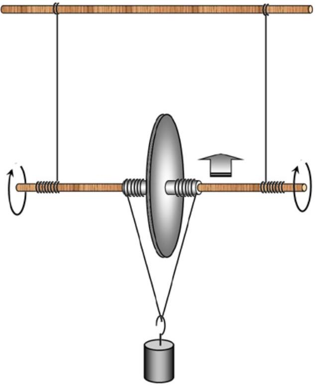

## EXPERIMENTAL COMPETITION

11 January, 2020

## Please read the instructions first:

1. The Experimental competition consists of one problem. This part of the competition lasts 3 hours.
2. Please only use the pen that is provided to you.
3. You can use your own non-programmable calculator for numerical calculations. If you don't have one, please ask for it from Olympiad organizers.
4. You are provided with Writing sheet and additional papers. You can use the additional paper for drafts of your solutions but these papers will not be checked. Your final solutions which will be evaluated should be on the Writing sheets. Please use as little text as possible. You should mostly use equations, numbers, figures and plots.
5. Use only the front side of Writing sheets. Write only inside the bordered area.
6. Fill the boxes at the top of each sheet of paper with your country (Country), your student code (Student Code), the question number (Question Number), the progressive number of each sheet (Page Number), and the total number of Writing sheets (Total Number of Pages). If you use some blank Writing sheets for notes that you do not wish to be evaluated, put a large X across the entire sheet and do not include it in your numbering.
7. At the end of the exam, arrange all sheets for each problem in the following order:
    - Used Writing sheets in order.
    - The sheets you do not wish to be evaluated.
    - Unused sheets.
    - The printed problems.

Place the papers inside the envelope and leave everything on your desk. You are not allowed to take any paper or equipment out of the room

## Maxwell's Disc (15,0 points)

In this experiment, you are asked to design all the experimental setups by yourself, connect threads and mark them up if necessary. You can further fasten the discs with pieces of plasticine.

Instruments and equipment: Maxwell's disk (two disks mounted on a wooden stick), two tripods, threads, a wooden stick, stopwatch, ruler, 2 loads of 100 g each, a piece of plasticine, adhesive tape.

Do not calculate experimental errors if you are not asked to do so.
Part 1. Rolling down
Pull two threads between the two tripods, so that they are parallel to each other and make up some angle $\alpha$ to the horizontal. Maxwell's disc should slide without slipping on these threads, resting on the wooden parts of the stick.
1.1 Derive the formula for the acceleration with which the axis of the disk rolls, depending on the angle of inclination $\alpha$. Assume the disc is homogeneous and neglect the mass of the wooden stick.
1.2 Investigate experimentally the law of motion, i.e. the

dependence of the coordinate of the axis of the disk $x(t)$ along the thread on time $t$, when it rolls along the threads. Draw a graph of the resulting dependence. Prove that the motion of the disc axis is approximately uniformly accelerated. Calculate the disk axis acceleration. Indicate at what angle you have taken your measurements.
1.3 Measure the dependence of the acceleration of the disk axis on the angle of inclination of the threads $\alpha$. Draw a graph of the resulting dependence.
1.4 On the same graph plot the theoretical dependence of the acceleration on the angle of inclination $\alpha$ of the threads. Indicate the results of additional measurements that you have used to calculate the accelerations.

Part 2. Moving down
Hang the disc on two threads as shown. Fix the threads on the stick with the adhesive tape to prevent them from slipping. Wind the threads onto the sticks and release the disc.
2.1 Investigate the law of motion of the disk axis when it moves down. Draw a graph of the resulting dependence.
2.2 According to the measurement data, calculate the acceleration at which the axis of the disc moves down. Estimate the experimental error of the obtained acceleration.
2.3 Derive the theoretical formula for the acceleration of the disc axis. Calculate the theoretical value of the acceleration with which the axis of the disc moves down.

## Part 3. Moving up

If two additional threads are wound on the stick and a load is suspended on them, then with proper winding of the threads, the disk starts to move up.
3.1 Design the experimental setup such that the disk moves up spinning around. Show schematically in the figure how the threads should be wound on the stick.
3.2 Measure the dependence of the acceleration of the disk axis for different masses of suspended loads.

