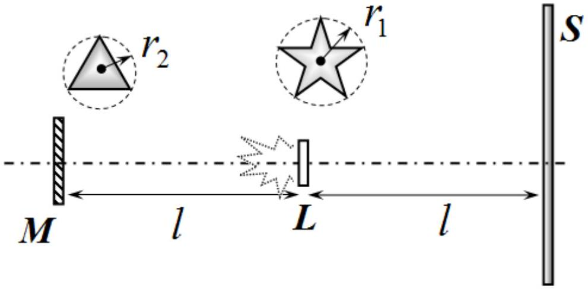

## Problem 1 (10.0 points)

This problem consists of three independent parts.

## Problem 1.1 (4.0 points)

A mathematical pendulum is located on the equator of the Earth. Denote the period of its oscillations at midday $T_{1}$, and at midnight $T_{2}$. Find the relative difference of these periods $\varepsilon=\frac{T_{2}-T_{1}}{T_{1}}$. Use the following approximations and numerical values: Earth is an ideal ball of radius $r_{1}=6,4 \cdot 10^{3} k m$; the Earth's orbit is a circle of radius $r_{2}=1,5 \cdot 10^{8} \mathrm{~km}$ with the center located in the center of the Sun; the axis of rotation of the Earth is perpendicular to the plane of the Earth's orbit; the influence of the Moon and other planets is neglected; acceleration of gravity at the Earth's pole is $g_{0}=9,8 m / s$; the period of revolution of the Earth around its axis is 1 day; the period of revolution of the Earth around the Sun is 1 year.

## Problem 1.2 (3.0 points)

The space between two concentric well conductive spheres of radii $a$ and $b>a$ is filled with a substance whose specific resistance depends only on the distance to the spheres' common center. An electric current of strength $I$ flows in between the spheres, such that the bulk density of Joule heat losses in the substance is the same at all points and is equal to $w$. Determine the average density of the space charge $\rho_{Q}$ accumulated in the volume of the substance over a sufficiently long time of the electric current flow.

## Problem 1.3 (3.0 points)

At equal distances $l=50 s m$ in between the screen $S$ and the flat mirror $M$, a flat matte source $L$ emitting white light only towards the mirror is placed. The planes of the screen, mirror and source are all parallel to one other. The source has the shape of a five-pointed star inscribed in a circle of radius $r_{1}$, whereas the mirror has a regular triangle shape inscribed in a circle of radius $r_{2}$. The source and mirror centers lie on the same axis perpendicular to the screen plane. Draw a schematic image of the source on the screen, keeping its orientation in accordance with the figure below. Estimate the sizes of all elements of the image.

Consider only two specific cases:
1.3.1 $r_{1}=1,0 m m$ and $r_{2}=10 m m$;
1.3.2 $r_{1}=10 \mathrm{~mm}$ and $r_{2}=0,1 \mathrm{~mm}$.
