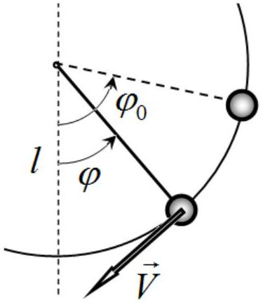
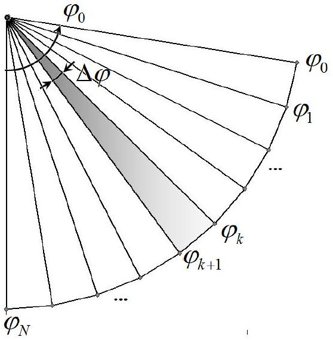

## January 9, 2021   COMPUTER EXPERIMENT:   A mathematical pendulum or what angle can be considered rather small...

At its core, physics is an experimental science and this is definitely its strength. However, without comprehending a large number of experimental facts, physics would degenerate into a description of a huge amount of phenomena and processes. This is how the physical laws and the corresponding models came to life in the remote past by ignoring insignificant features of the subject under consideration. In recent decades, rapid progress has been witnessed in such a field as computer modeling or, as it has become common to say, a computer experiment. The point is that the developed physical models can be directly implemented on a computer in the form of a computational process and the regularities of interest can be thoroughly investigated in their pure forms. In this competition, you are asked to carry out such a computer experiment for a well-known system of a mathematical pendulum.

A formula is well known for the period of oscillation of a mathematical pendulum of length $l$ subject to a uniform gravity field of the Earth, characterized by the acceleration of gravity $g$. However, this formula is only applicable for rather small deflection angles. The main question that you have to answer when doing this computational experiment is: "What angular deflection can be considered small?"

In the educational literature on laboratory experiments, you can find an indication that the maximum deflection angle should not exceed $1^{\circ}, 2^{\circ}, 5^{\circ}$, etc. You must answer the above question on the basis of this computer experiment! Namely, you are asked to study the dependence of the oscillation period of a mathematical pendulum on its amplitude, which is the maximum angular deflection from the vertical.

The order of conducting and processing the results of a computer experiment does not differ much from the order of a real, full-scale experiment. Therefore, the parts of this problem directly correspond to the main stages of a real physical experiment.

## 1. Constructing a theoretical model.

Consider a mathematical pendulum, which is a small massive ball suspended on an inextensible thread of length $l$. The pendulum is subject to the gravity field with the free fall acceleration $g$. In the following neglect the air resistance completely.
1.1 Write down a formula for the period $T$ of small oscillations of a mathematical pendulum.

Assume that at the initial moment of time $t_{0}=0$ the angle of the thread deflection from the vertical is $\varphi_{0}$, and the initial velocity of the ball is equal to zero.

The ball moves along an arc of a circle, therefore, its position is determined by the angle of the thread deflection from the vertical $\varphi$, and the rate of change of this angle in time is determined by the angular velocity $\omega=\frac{d \varphi}{d t}$.
1.2 Obtain an exact formula for the dependence of the angular velocity of the pendulum on the deflection angle $\omega(\varphi)$ for a given angular amplitude $\varphi_{0}$ and known values of $l, g$.

The motion of the pendulum is symmetrical with respect to the vertical, therefore, to calculate the period of oscillation, it is sufficient to evaluate the time $t_{1}$ of its motion from the maximum to zero deflection.
1.3 Write down an exact expression for calculating the time $t_{1}$ from the known dependence of the angular velocity on the deflection angle $\omega(\varphi)$.
1.4 Express a period of oscillations $T$ in terms of time $t_{1}$.

In a computer experiment, when performing calculations, real dimensional quantities are rarely used, since they can have very different orders of magnitude and are extremely inconvenient. Usually, all quantities are made dimensionless or reduced with the aid of some values characteristic for a given problem. For example, in our study, the characteristic time is the period of oscillations, so it is convenient to introduce the dimensionless time $\tau$, which is determined by the following formula:

$$
\tau=t \sqrt{\frac{g}{l}} .
$$

1.5 Write down a formula relating the angular velocity in dimensionless units $\widetilde{\omega}=\frac{d \varphi}{d \tau}$ to the previously defined angular velocity $\omega$.
1.6 Determine a period $\widetilde{T}$ of small oscillations of the mathematical pendulum in the dimensionless units of time.
1.7 Determine a dependence of the angular velocity $\widetilde{\omega}$ on the deflection angle $\varphi: \widetilde{\omega}(\varphi)$.
ATTENTION! In what follows, the introduced dimensionless quantities are used everywhere: time $\tau$, period $\widetilde{T}$ and angular velocity $\widetilde{\omega}$, which are respectively denoted as $t, T$ and $\omega$.
2. Designing an experimental setup, planning an experiment.

In a computer experiment, this stage corresponds to the development of a calculation algorithm. In this case, the main idea of numerical (computer) calculations is to divide the trajectory of motion into small sections, in which the motion is described approximately.

We divide the interval of motion from $\varphi=\varphi_{0}$ to $\varphi=0$ into $N$ equal intervals of width $\Delta \varphi$. Let us denote the splitting points as $\varphi_{k}$, $k=0,1, \ldots N$ and the angular velocities at these points as $\omega_{k}$. The main approximation used in further calculations is that at each interval from $\varphi_{k}$ to $\varphi_{k+1}$ the motion of the pendulum is considered uniformly accelerated. It is natural to expect that with an increase in the number of partition intervals $N$, the calculation accuracy should grow.

Within the framework of the approximation made, it is straightforward to find the time of the pendulum motion in the interval from $\varphi_{0}$ to 0 . For a given amplitude $\varphi_{0}$ and the number of partition intervals $N$, the calculation algorithm is revealed in the sequence of answers to the following questions.
2.1 Determine the partition interval $\Delta \varphi$.
2.2 Determine the coordinates of the splitting points $\varphi_{k}$.
2.3 Express the angular velocity $\omega_{k}$ at the point $\varphi_{k}$ at an arbitrary initial angle of deflection $\varphi_{0}$. Write down this formula for a particular case of $\varphi_{0}=\frac{\pi}{2}$.
2.4 Determine the travel time $\Delta t_{k}$ for the $k$-th interval from $\varphi_{k-1}$ to $\varphi_{k}$.
2.5 Find an expression for the time $t_{k}$ it takes the ball to reach the angle $\varphi_{k}$. To simplify matters, express it in terms of the travel time $t_{k-1}$ to the previous value of the angle $\varphi_{k-1}$.
2.6 Put down a formula for the oscillation period $T_{N}$ for a given split into intervals.
3. Trial experiment, estimation of errors.

At this stage, it is necessary to make sure that the installation is operational, which in this case means the possibility of performing calculations according to the algorithm developed above, and to assess whether the required accuracy of results is achieved.

As noted earlier, calculation errors depend on the number of partition intervals $N$. In this task, you have to carry out calculations not on a computer, but "manually" using your calculator. A growth of $N$ reduces the error of calculations, but increases the time of their execution. Therefore, it is important to choose its optimal value, i.e. the minimum value at which the required accuracy is achieved. At this stage, carry out all calculations at $\varphi_{0}=\frac{\pi}{2}$.

ATTENTION! Hereinafter, calculations should be carried out with an accuracy of 4 decimal digits. To save time, carefully think over the entire sequence of calculations: use previously calculated values, define necessary constants that are present in the formulas (so as not to recalculate them several times), write down results of intermediate calculations in the most convenient form.
3.1 Calculate the travel times $t_{k}$ for the points with angles $\varphi_{k}$ for $N=1,2,4,8,16,32$. Find the approximate values of the periods of oscillation $T_{N}$, calculated for a given $N$. The results should be complied in Table 1.
3.2 Plot Graph 1 of the law of motion $\varphi(t)$ of the pendulum for a quarter of the period based on the results of calculations at $N=16$.
3.3 On the same Graph 1, plot the law of motion $\varphi(t)$, assuming that the oscillations are small. The results of calculations of the law of motion should be presented in Table 2.

As an estimate of the relative error in calculating the oscillation period when dividing into $N$ intervals, we use the following value

$$
\varepsilon_{N}=\frac{T_{N}-T_{32}}{T_{32}},
$$

where $T_{32}$ stands for the period calculated at $N=32$, which is closest to the true value.
The dependence of the relative calculation error $\varepsilon_{N}$ on the number of partition intervals $N$ is described by the approximate formula

$$
\varepsilon_{N}=\frac{C}{N^{\gamma}},
$$

where $C$ and $\gamma$ are some constants.
3.4 Calculate the relative errors $\varepsilon_{N}$ in determining the periods. The results must be presented in Table 3.
3.5 Prove in Graph 2 the applicability of the above formula for the relative error and find the values of the parameters $C$ and $\gamma$.
3.6 Determine the minimum value $N_{\text {min }}$ at which the relative error in calculating the period does not exceed 0.2\%.

In further calculations, use only the found value $N_{\text {min }}$ for the number of partition intervals.
4. Experiment: the dependence of the period on the amplitude.

At this stage of the computer experiment, we determine the dependence of the oscillation period of the mathematical pendulum on the amplitude, $T\left(\varphi_{0}\right)$, which is described by the formula

$$
T\left(\varphi_{0}\right)=T_{0}\left(a+\frac{\varphi_{0}^{2}}{b}\right),
$$

where $T_{0}$ designates the period of small oscillations of the pendulum, $a, b$ are constant values.
4.1 Calculate the periods of oscillation of the mathematical pendulum for the following set of amplitudes $\varphi_{0}: 15^{\circ}, 30^{\circ}, 45^{\circ}, 60^{\circ}, 75^{\circ}$ and 90°, which you have already determined.
4.2 Prove in Graph 3 the applicability of the above formula for the dependence of the oscillation period of the pendulum on its amplitude.
4.3 Determine the values of parameters $a, b$.

Let the error in measuring the oscillation period of the pendulum in a real experiment be approximately equal to 5\%.
4.4 Determine at what angles $\varphi_{0}$, expressed in degrees, the oscillations of the mathematical pendulum can be considered small.
