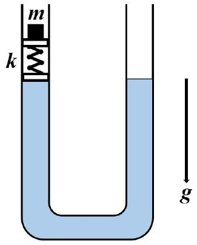
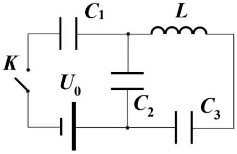

Problem 1 (10.0 points)
This problem consists of three independent parts.
Problem 1.1 (4.0 points)
Water of mass density $\rho=1.00 g / s m^{3}$ is poured into a vertical $U$-shaped tube of small constant cross-section $s=8.00 s m^{2}$, such that the total length of water in both legs is $l=50.0 s m$. Two pistons are placed into one leg of the tube with the spring of stiffness $k=1.00 \mathrm{~N} / \mathrm{m}$ in between. The pistons are watertight and can slide along the tube without friction. At the initial moment, a weight of mass $m=10.0 g$ is placed on the upper piston. Determine the possible frequencies of small harmonic vibrations of the system near a new equilibrium position. The mass of the pistons and the spring can be neglected, the acceleration of gravity is equal to $g=9.80 m / s^{2}$.

Consider water as an ideal incompressible liquid.

## Problem 1.2 (3.0 points)

Some insects, such as water striders, are capable of moving freely on the water surface, because their legs are densely covered with non-wetting hairs. To understand why this turns possible, consider the following model problem. A square plate with the side $a=10.0 s m$ and thickness $h=2.00 m m$ is carefully laid on the water surface. The density of the plate material is equal to $\rho=1.10 g / s m^{3}$, the density of water is $\rho_{0}=1.00 \mathrm{~g} / \mathrm{sm}^{3}$, and its surface tension constitutes $\sigma=7.30 \cdot 10^{-2} \mathrm{~N} / \mathrm{m}$. Find the maximum mass $m$ of a weight that can be put on the plate so that it still does not sink. Assume that the weight does not deform the plate, the acceleration of free fall is $g=9.80 m / s^{2}$.

Problem 1.3 (3.0 points)
The electrical circuit shown schematically in the figure consists of three capacitors with capacities $C_{1}, C_{2}$ and $C_{3}$, a coil of inductance $L$ and a source of constant voltage $U_{0}$. At the initial moment of time, the capacitors are not charged, and the current in the coil is zero. The switch $K$ is shorted. Find the maximum current $I_{\text {max }}$ through the coil and determine the minimum voltage $U_{\text {min }}$ across the capacitor $C_{2}$. Assume that the resistance of the connecting wires is rather small.

